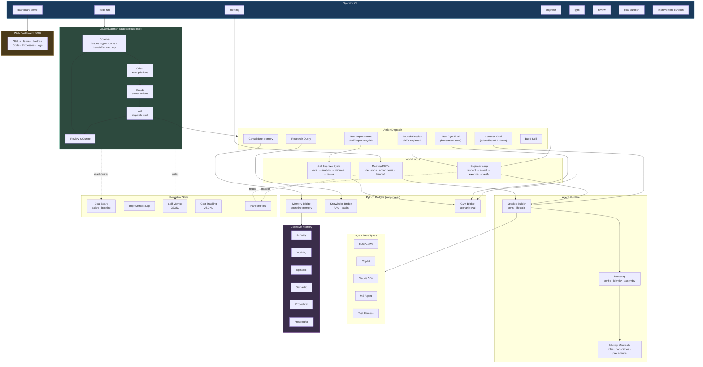

# Simard

An autonomous engineer who drives and curates agentic coding systems.

Named after [Suzanne Simard](https://en.wikipedia.org/wiki/Suzanne_Simard), the scientist who discovered how trees communicate through underground fungal networks.

## What is Simard?

Simard is a terminal-native engineering agent built in Rust. She operates like a disciplined software engineer: she understands codebases, works through tasks in explicit sessions, preserves useful memory, evaluates herself against benchmarks, and improves through structured review loops.

Simard is the Rust-native **successor to [amplihack](https://github.com/rysweet/amplihack)**. The trajectory is replacement: migrate every amplihack capability onto native Rust where it makes sense, and keep amplihack only where a native replacement does not yet exist.

## Status: Successor-in-progress, not a drop-in replacement today

Simard **today** natively provides:

- **Cognitive memory (Rust surface)** — the `cognitive_memory` module is backed directly by the `amplihack-memory` Rust crate. This covers the core memory operations; `amplihack-memory-lib`'s Python surface is not mirrored and is not required by Simard.
- **Workflow execution** — the OODA daemon plus the engineer loop cover the ground held by `amplihack-recipe-runner` + `smart-orchestrator`, though the YAML recipe DSL is not yet ported.
- **Meeting backend / facilitator / REPL** — a new capability with no amplihack analog.
- **Goal curation, improvement curation, review pipelines, dashboard.**

Simard **still depends on amplihack at runtime** for:

- **`copilot-sdk` base type** — `base_type_copilot.rs` and friends spawn `amplihack copilot` over PTY. Removing this would break the copilot adapter.
- **Gym evaluation** — `python/simard_gym_bridge.py` imports `amplihack.eval.progressive_test_suite` and `amplihack.eval.long_horizon_memory`. No native Rust gym eval yet.
- **Optional install shim** — `simard ensure-deps` / `cmd_ensure_deps.rs` can auto-install `amplihack` when the copilot adapter needs it.

These will be tracked in GitHub issues labeled `parity` (label and issues to be filed with the first PR landing these docs). See [docs/amplihack-comparison.md](docs/amplihack-comparison.md) for the full feature-by-feature matrix and migration path for each gap.

## Recommended migration from amplihack

```bash
# Install Simard (amplihack remains usable; Simard opts in per feature)
npx github:rysweet/Simard install
```

You can keep amplihack installed alongside Simard. The `copilot-sdk` base type and the gym bridge will continue to call through to amplihack until their parity issues ship.

## Install

### With npx (easiest)

Requires [GitHub CLI](https://cli.github.com/) authenticated with repo access.

```bash
# Run Simard directly
npx github:rysweet/Simard meeting repl

# Install the binary locally (~/.simard/bin)
npx github:rysweet/Simard install
```

### From GitHub Releases

```bash
# Download the latest release binary
curl -L https://github.com/rysweet/Simard/releases/latest/download/simard-linux-x86_64.tar.gz | tar xz
chmod +x simard
sudo mv simard /usr/local/bin/
```

### From Source

```bash
git clone https://github.com/rysweet/Simard.git
cd Simard
cargo build --release
# Binary at target/release/simard
```

### With Cargo

```bash
cargo install --git https://github.com/rysweet/Simard.git
```

## Quick Start

```bash
# Run an engineering session
simard engineer run single-process /path/to/repo "improve test coverage"

# Have a meeting with Simard
simard meeting repl "weekly sync"

# List gym benchmarks
simard gym list

# Run a benchmark
simard gym run repo-exploration-local
```

## CLI Commands

### Engineer Mode
```bash
simard engineer run <topology> <workspace-root> <objective>
simard engineer terminal <topology> <objective>        # interactive PTY
simard engineer copilot-submit <topology>              # submit to copilot
simard engineer read <topology>                        # read last session
```

### Meeting Mode
```bash
simard meeting run <base-type> <topology> <objective>
simard meeting repl <topic>                            # interactive REPL
simard meeting read <base-type> <topology>             # read last meeting
```

### Goal Curation
```bash
simard goal-curation run <base-type> <topology> <objective>
simard goal-curation read <base-type> <topology>
```

### Gym Benchmarks
```bash
simard gym list                        # list all scenarios
simard gym run <scenario-id>           # run a scenario
simard gym compare <scenario-id>       # compare results
simard gym run-suite <suite-id>        # run a suite
```

### Self-Management
```bash
simard update                          # self-update to the latest release
simard install                         # install binary to ~/.simard/bin
```

### Other Commands
```bash
simard improvement-curation run <base-type> <topology> <objective>
simard review run <base-type> <topology> <objective>
simard bootstrap run <identity> <base-type> <topology> <objective>
```

## Base Types

Simard delegates work to agent runtimes through base types:

| Base Type | Description | Status |
|-----------|-------------|--------|
| `rusty-clawd` | RustyClawd SDK — LLM + tool calling pipeline | Real (needs `ANTHROPIC_API_KEY`) |
| `copilot-sdk` | amplihack copilot via PTY terminal — runtime dep on amplihack, see [comparison](docs/amplihack-comparison.md) | Real (needs `amplihack copilot`) |
| `claude-agent-sdk` | Claude Code CLI as subprocess agent | Real (needs `claude` binary) |
| `ms-agent-framework` | Microsoft Agent Framework | Real (needs `ms-agent-framework` or `python -m microsoft_agent_framework`) |
| `local-harness` | Test adapter for development | Always available |
| `terminal-shell` | Local PTY shell execution | Always available |

## Architecture




## Configuration

| Environment Variable | Purpose |
|---------------------|---------|
| `ANTHROPIC_API_KEY` | API key for RustyClawd base type |
| `CLAUDE_CODE_BIN` | Path to claude binary (default: `claude`) |
| `MS_AGENT_FRAMEWORK_BIN` | Path to MS Agent Framework binary |
| `SIMARD_COPILOT_GH_ACCOUNT` | GitHub account for copilot auth (e.g., `rysweet_microsoft`) |
| `SIMARD_COMMIT_GH_ACCOUNT` | GitHub account for git commits (e.g., `rysweet`) |

## Development

```bash
# Run tests
cargo test

# Run clippy
cargo clippy --all-targets

# Format
cargo fmt --all

# Run a gym benchmark
cargo run -- gym run repo-exploration-local
```

## Documentation

Full docs live under [`docs/`](docs/) and are published to [rysweet.github.io/Simard](https://rysweet.github.io/Simard/):

- [Installation](docs/installation.md) · [Quickstart](docs/quickstart.md)
- [Philosophy](docs/philosophy.md) · [Patterns](docs/patterns.md) · [Workflows](docs/workflows.md)
- [Agents](docs/agents.md) · [Skills](docs/skills.md) · [Recipes](docs/recipes.md)
- [CLI reference](docs/reference/simard-cli.md) · [Troubleshooting](docs/troubleshooting.md)
- **[Comparison with amplihack](docs/amplihack-comparison.md)** — feature-by-feature matrix, what replaces what, what still depends on amplihack.

## License

Private repository. See [rysweet/Simard](https://github.com/rysweet/Simard).
