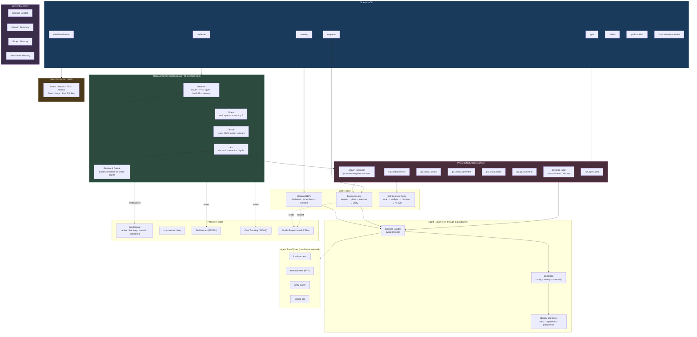

# Simard

A terminal-native engineering identity, written in Rust.

Named after [Suzanne Simard](https://en.wikipedia.org/wiki/Suzanne_Simard), the scientist who discovered how trees communicate through underground fungal networks.

## What Simard is

Simard is a terminal-native engineering system that operates like a disciplined software engineer instead of a generic chat assistant. Its job is to understand a codebase, work through tasks in explicit sessions, preserve useful memory, evaluate itself against benchmark tasks, and improve through structured review loops.

Simard is **not** a drop-in replacement for any existing tool. It is one **agent identity** in an emerging family of identities (Simard, Cumulona, Victoria) that share a common Rust runtime substrate. Identities are defined by prompt assets, capabilities, and operating modes; the runtime decides how that identity is instantiated and on which **base type** it executes.

The full product specification lives in [`Specs/ProductArchitecture.md`](Specs/ProductArchitecture.md). This README is the operator-facing entry point; the spec is the contract.

## The autonomous PM-architect OODA loop

The central product story is the OODA daemon: an always-on background loop that watches the repository's GitHub state (issues, PRs, gym scores, handoff records, durable memory) and drives the backlog to completion using a small set of explicit, auditable actions.

```text
┌──────────┐    ┌─────────┐    ┌────────┐    ┌─────┐
│ Observe  │ ─▶ │ Orient  │ ─▶ │ Decide │ ─▶ │ Act │ ─┐
└──────────┘    └─────────┘    └────────┘    └─────┘  │
      ▲                                                │
      └────────────── Review & Curate ◀────────────────┘
```

Each cycle:

- **Observe** — read open issues, open PRs, recent gym runs, durable goal records, the cognitive-memory snapshot, and the latest mode-scoped handoff artifacts.
- **Orient** — rank priorities against the durable active top 5 goals.
- **Decide** — choose at most one structured action per cycle. Decisions come from a typed JSON contract; non-JSON output fails loud rather than being silently scraped for progress markers.
- **Act** — dispatch the decided action through the **PM-Architect Action Surface** (see Architecture section below). Every action returns a typed outcome.
- **Review & Curate** — record the outcome, update durable memory, and curate the goal board (active top 5, backlog, paused, completed) based on real evidence — never on prose claims.

The daemon runs locally as `simard ooda run`. It exposes a web dashboard at `http://localhost:8080` for live status, costs, traces, and live agent thinking.

## Operating modes

Simard has five user-visible modes from the PRD. The current shipped surface honestly distinguishes implemented behavior from planned behavior:

| Mode                       | Purpose                                                                                | Status        |
| -------------------------- | -------------------------------------------------------------------------------------- | ------------- |
| **Engineer**               | Inspect, plan, execute, and verify bounded repository tasks via terminal actions.      | Implemented   |
| **Goal-curation**          | Maintain the durable backlog and the active top 5 goals.                               | Implemented   |
| **Improvement-curation**   | Promote operator-approved review findings into durable priorities.                     | Implemented   |
| **Meeting**                | Facilitate alignment / decision-capture without silently mutating code.                | Implemented (REPL surface) |
| **Gym**                    | Run benchmark scenarios to measure capability and detect regressions.                  | Implemented (initial scenarios) |

Modes are not cosmetic personas. Each has its own success criteria, allowed actions, and memory-write rules — see Pillar 3 below.

## Architecture pillars

The 11 pillars from `Specs/ProductArchitecture.md` are non-negotiable architectural constraints, not aspirations:

1. **Terminal first, not chat first.** Engineering work happens through file inspection, commands, patches, tests, and artifacts.
2. **Explicit state over hidden magic.** Every meaningful run has session metadata, a live objective, working memory, and a durable trail.
3. **Roles must be separated.** Planner, engineer, reviewer, facilitator, and goal-curator stay distinct even when colocated in one binary.
4. **Benchmarks drive product truth.** Capability claims must be tied to repeatable benchmark evidence.
5. **Memory must be layered.** Session scratch, session summary, project memory, and benchmark memory have different lifetimes and write rules.
6. **Improvement requires reviewable loops.** Self-improvement produces hypotheses and proposals — not autonomous mutation.
7. **Prompt assets stay separate from code.** Prompts live as explicit files in `prompt_assets/` so they can be versioned, swapped, and benchmarked.
8. **Identity and runtime are different things.** The Simard identity is portable across local, multi-process, and (eventually) distributed runtimes.
9. **Composition must outlive topology.** The identity does not change shape because its parts moved between processes.
10. **Dependency injection is structural, not optional.** Prompt loading, base-type selection, memory access, evidence capture, and reflection are all injected through explicit contracts.
11. **Honest degradation beats hidden silence.** When a capability, prompt asset, base type, or topology is unavailable, the runtime fails visibly. **No silent fallbacks. Ever.**

Pillar 11 is enforced by code review: any new "fallback" pattern is a regression and gets rejected.

## Architecture



## CLI commands

### Autonomous loop (the central product story)

```bash
simard ooda run                     # start the autonomous PM-architect daemon
simard ooda run --cycles=1          # run a single cycle (smoke / debug)
simard dashboard serve              # serve the web dashboard at :8080
```

### Engineer mode

```bash
simard engineer run <topology> <workspace-root> <objective>
simard engineer terminal <topology> <objective>            # interactive PTY
simard engineer terminal-file <topology> <objective-file>  # bounded structured edit
simard engineer terminal-recipe <topology> <recipe-id>     # named built-in flow
simard engineer terminal-read <topology>                   # read-only audit
simard engineer copilot-submit <topology>                  # bounded Copilot CLI launch
simard engineer read <topology>                            # read last engineer session
```

### Meeting mode

```bash
simard meeting run <base-type> <topology> <objective>
simard meeting repl <topic>                                # interactive REPL
simard meeting read <base-type> <topology>
```

### Goal & improvement curation

```bash
simard goal-curation run <base-type> <topology> <objective>
simard goal-curation read <base-type> <topology>
simard improvement-curation run <base-type> <topology> <objective>
```

### Gym (benchmarks)

```bash
simard gym list                          # list scenarios
simard gym run <scenario-id>             # run a scenario
simard gym compare <scenario-id>         # compare against history
simard gym run-suite <suite-id>          # run a suite
```

### Review & bootstrap

```bash
simard review run <base-type> <topology> <objective>
simard bootstrap run <identity> <base-type> <topology> <objective>
```

### Self-Management

```bash
simard install                           # install binary to ~/.simard/bin
simard update                            # self-update to latest release
```

## Base types

A **base type** is the underlying execution substrate an identity can build on. It is not the identity itself. The current Simard scaffold publishes four manifest-advertised builtin base types for the engineer identity:

| Base type        | Description                                                                  | Status                                               |
| ---------------- | ---------------------------------------------------------------------------- | ---------------------------------------------------- |
| `local-harness`  | In-process local single-process harness                                      | Always available                                     |
| `terminal-shell` | Local PTY-backed shell with checkpointed transcript audit                    | Always available                                     |
| `rusty-clawd`    | Distinct session backend (Anthropic-compatible LLM + tool calls)             | Real (requires `ANTHROPIC_API_KEY`)                  |
| `copilot-sdk`    | Explicit alias of `local-harness` for the engineer identity (transitional)   | Real (requires `amplihack copilot` available on PATH)|

Other backends (Claude Code SDK, Microsoft Agent Framework, etc.) are listed as candidate base types in the PRD but are **not** v1 manifest-advertised builtins. Unsupported or unregistered base-type / topology pairs **fail visibly** — they do not collapse into a hidden local default (Pillar 11).

amplihack is one of several candidate backends — Simard is **not** an amplihack parity target. The product is the identity, not the substrate.

## Installation

### With npx (easiest)

Requires [GitHub CLI](https://cli.github.com/) authenticated with repo access.

```bash
# Run Simard directly
npx github:rysweet/Simard meeting repl

# Install the binary locally (~/.simard/bin)
npx github:rysweet/Simard install
```

### From GitHub Releases

```bash
curl -L https://github.com/rysweet/Simard/releases/latest/download/simard-linux-x86_64.tar.gz | tar xz
chmod +x simard
sudo mv simard /usr/local/bin/
```

### From Source

```bash
git clone https://github.com/rysweet/Simard.git
cd Simard
cargo build --release
# Binary at target/release/simard
```

### With Cargo

```bash
cargo install --git https://github.com/rysweet/Simard.git
```

## Quickstart

```bash
# Start the autonomous loop with the dashboard
simard ooda run
# In another terminal: open http://localhost:8080

# Or run one bounded engineer session
simard engineer run single-process /path/to/repo "improve test coverage"

# Or hold a meeting
simard meeting repl "weekly architecture sync"

# Or run a benchmark
simard gym list
simard gym run repo-exploration-local
```

## Configuration

| Environment variable          | Purpose                                                            |
| ----------------------------- | ------------------------------------------------------------------ |
| `ANTHROPIC_API_KEY`           | API key for the `rusty-clawd` base type                            |
| `CLAUDE_CODE_BIN`             | Path to a `claude` binary if used as an external base type         |
| `MS_AGENT_FRAMEWORK_BIN`      | Path to MS Agent Framework binary if used                          |
| `SIMARD_COPILOT_GH_ACCOUNT`   | GitHub account used for `amplihack copilot` auth                   |
| `SIMARD_COMMIT_GH_ACCOUNT`    | GitHub account used for git commits                                |
| `SIMARD_LLM_PROVIDER`         | Provider selector for the dashboard chat backend                   |

Operator state lives under `~/.simard/` (binary, login key for the dashboard, daemon log, goal records, agent transcripts).

## Status & limitations

Honest disclosure (Pillar 11):

- **OODA daemon, dashboard, goal board, gh-action surface — implemented.** This is the central product story and is exercised end-to-end against `rysweet/Simard` itself.
- **Engineer / meeting / goal-curation / improvement-curation modes — implemented.** Bounded surfaces with mode-scoped handoff records.
- **Gym — initial scenarios.** Benchmark coverage is intentionally narrow and will grow only when the harness stays trustworthy.
- **Distributed multi-host execution — architectural seam preserved, not shipped.** v1 ships local single-process plus a loopback `multi-process` path for compatible base types.
- **Sibling identities (`Cumulona`, `Victoria`) — not in v1.** The runtime substrate is designed to support them; only Simard ships today.
- **Legacy Python bridges in `python/` — being retired.** The PRD constrains Simard to be Rust-native. Any remaining Python under `python/` is legacy scaffolding tracked for removal — see [issue #1153](https://github.com/rysweet/Simard/issues/1153). New code must not introduce Python runtime dependencies.
- **Remaining PRD operating modes (richer meeting/improvement-curation/gym capabilities) — tracked in [issue #1154](https://github.com/rysweet/Simard/issues/1154).**

If a documented behavior does not match what the binary does, that is a **bug**. File an issue.

## Development

```bash
# Build (use a /tmp target dir if /home is tight)
cargo build --release

# Library tests
cargo test --lib

# Lint
cargo clippy --all-targets

# Format
cargo fmt --all

# Run a gym benchmark from source
cargo run -- gym run repo-exploration-local

# Smoke the autonomous loop locally
cargo run --release -- ooda run --cycles=1
```

## License

Private repository. See [rysweet/Simard](https://github.com/rysweet/Simard).
