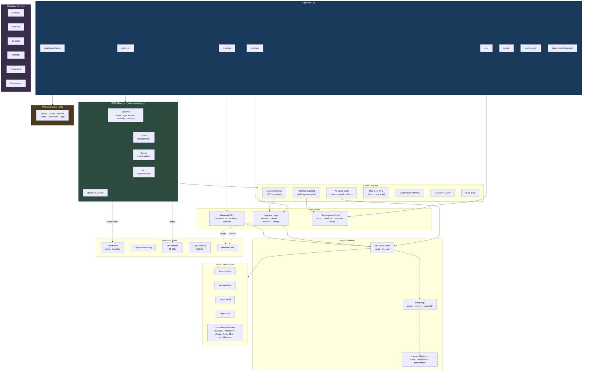

# Simard

A terminal-native engineering agent who drives and curates agentic coding systems.

Named after [Suzanne Simard](https://en.wikipedia.org/wiki/Suzanne_Simard), the scientist who discovered how trees communicate through underground fungal networks.

## What is Simard?

Simard is a focused engineering runtime, written in Rust, that operates like a disciplined software engineer. She inspects local repositories, forms bounded plans with explicit verification, executes through terminal actions, records evidence, and improves through reviewable loops.

Simard is **not** a wrapper around any single agent framework. She is a terminal-native identity with her own runtime, prompt assets, memory layers, and benchmark gym, and she composes work over a pluggable set of agent **base types** — backend execution substrates that include local harnesses, the GitHub Copilot SDK, Claude Code SDK, Microsoft Agent Framework, and the amplihack / amplihack-rs goal-seeking agent. Each substrate is one option among several; none of them define what Simard is.

For the full design contract, see [Specs/ProductArchitecture.md](Specs/ProductArchitecture.md).

## Operating Modes

Simard exposes five user-visible operating modes, each with its own success criteria, memory writes, and allowed actions. All five have shipped a v1 slice; honest scope notes are listed below.

| Mode | Purpose | v1 status |
|------|---------|-----------|
| **Engineer** | Accept a concrete task, inspect the repo, form a bounded plan, execute through terminal actions, and report outcomes with evidence. | v1 shipped — read-only repo inspection plus one narrow structured edit on a clean repo; bounded `engineer terminal*` session surfaces and the separate repo-grounded `engineer run` / `engineer read` audit companion are operator-visible. |
| **Meeting** | Help humans think, decide, and record architecture or planning outcomes without silently drifting into implementation. | v1 shipped — CLI REPL and durable meeting record readback; explicit handoff into engineer mode through a shared `state-root`. |
| **Goal-curation** | Curate a durable backlog and an explicit active top-5 goal list without pretending implementation work happened. | v1 shipped — durable goal register with active/backlog separation and read-only inspection. |
| **Improvement-curation** | Consume persisted review findings, require explicit operator approval or deferral, and promote accepted improvements into durable priorities without mutating code. | v1 shipped — approve / defer / promote workflow with read-only state inspection. |
| **Gym** | Run controlled benchmark tasks to measure capability, regressions, and improvement over time. | v1 shipped — benchmark scenarios, suite runs, and result comparison; benchmark catalog continues to grow. |

These are different operating modes, not cosmetic personas. Each mode owns its own command tree under the `simard` binary.

## Agent Base Types

An agent base type is the underlying execution substrate an identity can build on. It is **not** the identity itself. Simard composes work over a pluggable set of base types and refuses to instantiate identities on substrates that cannot satisfy required capabilities.

### Builtin base types (v1)

| Identifier | Description | Availability |
|------------|-------------|--------------|
| `local-harness` | In-process test harness for development and the truthful default for v1 aliases. | Always available |
| `terminal-shell` | Local PTY-backed shell execution path. | Always available |
| `rusty-clawd` | RustyClawd LLM + tool-calling session backend. | Requires `ANTHROPIC_API_KEY` |
| `copilot-sdk` | Explicit alias of the local single-process harness implementation while the Copilot SDK adapter matures. | Always available |

Unsupported or unregistered base-type / topology pairs fail visibly at bootstrap. v1 aliases continue to report the honest `local-harness` implementation identity behind them.

### Candidate substrates

The architecture is designed for additional candidate substrates, each treated as one option among several rather than the definition of Simard:

- Microsoft Agent Framework
- GitHub Copilot SDK (full adapter, beyond the v1 alias)
- Claude Code SDK
- amplihack / amplihack-rs goal-seeking agent and its OODA loop

Each candidate base type is added through a Rust adapter that declares an explicit capability contract (prompt override, tool / skill invocation, streaming, memory hooks, reflection, subagent spawning, normalized error classes). Identities declare required capabilities; the runtime refuses to instantiate identities on adapters that cannot satisfy them.

## Architecture

The autonomous OODA daemon observes signals (issues, gym scores, meeting handoffs, memory), ranks priorities, decides on actions, and dispatches work through the same base-type adapters that operator-driven sessions use.



The runtime ships as a single Rust binary. There is no Python runtime requirement and no `pip install` step.

## Install

### With npx (easiest)

Requires [GitHub CLI](https://cli.github.com/) authenticated with repo access.

```bash
# Run Simard directly
npx github:rysweet/Simard meeting repl

# Install the binary locally (~/.simard/bin)
npx github:rysweet/Simard install
```

### From GitHub Releases

```bash
# Download the latest release binary
curl -L https://github.com/rysweet/Simard/releases/latest/download/simard-linux-x86_64.tar.gz | tar xz
chmod +x simard
sudo mv simard /usr/local/bin/
```

### From Source

```bash
git clone https://github.com/rysweet/Simard.git
cd Simard
cargo build --release
# Binary at target/release/simard
```

### With Cargo

```bash
cargo install --git https://github.com/rysweet/Simard.git
```

## Quick Start

```bash
# Run an engineering session
simard engineer run single-process /path/to/repo "improve test coverage"

# Have a meeting with Simard
simard meeting repl "weekly sync"

# List gym benchmarks
simard gym list

# Run a benchmark
simard gym run repo-exploration-local
```

## CLI Commands

### Engineer mode
```bash
simard engineer run <topology> <workspace-root> <objective>
simard engineer terminal <topology> <objective>        # interactive PTY
simard engineer copilot-submit <topology>              # bounded local Copilot slice
simard engineer read <topology>                        # read last session
```

### Meeting mode
```bash
simard meeting run <base-type> <topology> <objective>
simard meeting repl <topic>                            # interactive REPL
simard meeting read <base-type> <topology>             # read last meeting
```

### Goal-curation mode
```bash
simard goal-curation run <base-type> <topology> <objective>
simard goal-curation read <base-type> <topology>
```

### Improvement-curation mode
```bash
simard improvement-curation run <base-type> <topology> <objective>
```

### Gym mode
```bash
simard gym list                        # list all scenarios
simard gym run <scenario-id>           # run a scenario
simard gym compare <scenario-id>       # compare results
simard gym run-suite <suite-id>        # run a suite
```

### Self-management
```bash
simard update                          # self-update to the latest release
simard install                         # install binary to ~/.simard/bin
```

### Other commands
```bash
simard review run <base-type> <topology> <objective>
simard bootstrap run <identity> <base-type> <topology> <objective>
```

## Configuration

| Environment Variable | Purpose |
|---------------------|---------|
| `ANTHROPIC_API_KEY` | API key for the `rusty-clawd` base type |
| `SIMARD_LLM_PROVIDER` | Override the LLM provider selected from `~/.simard/config.toml` |
| `SIMARD_COPILOT_GH_ACCOUNT` | GitHub account for Copilot auth (e.g., `rysweet_microsoft`) |
| `SIMARD_COMMIT_GH_ACCOUNT` | GitHub account for git commits (e.g., `rysweet`) |

Runtime configuration lives at `~/.simard/config.toml`. The runtime fails loudly when required configuration is missing — there are no silent defaults.

## Repository Layout

- `src/` — Rust runtime, CLI, modes, base-type adapters, memory layers, gym
- `prompt_assets/` — versioned prompt files kept separate from runtime code
- `Specs/ProductArchitecture.md` — the product architecture and design contract
- `docs/` — operator and contributor documentation (mkdocs)
- `tests/` — integration tests
- `scripts/` — developer tooling (low-space builds, disk reclamation, etc.)

## Development

```bash
# Run tests
cargo test

# Run clippy
cargo clippy --all-targets

# Format
cargo fmt --all

# Run a gym benchmark
cargo run -- gym run repo-exploration-local
```

Pre-commit and pre-push hooks enforce `cargo fmt --all -- --check`, `cargo clippy --all-targets --all-features --locked -- -D warnings`, and `cargo test --all-features --locked`.

## Documentation

- [Product architecture (PRD)](Specs/ProductArchitecture.md)
- [Documentation index](docs/index.md)
- [Architecture overview](docs/architecture/overview.md)
- [Simard CLI reference](docs/reference/simard-cli.md)
- [Runtime contracts reference](docs/reference/runtime-contracts.md)
- [Base type adapters reference](docs/reference/base-type-adapters.md)
- [Agent composition](docs/architecture/agent-composition.md)
- [Truthful runtime metadata](docs/concepts/truthful-runtime-metadata.md)

## License

Private repository. See [rysweet/Simard](https://github.com/rysweet/Simard).
