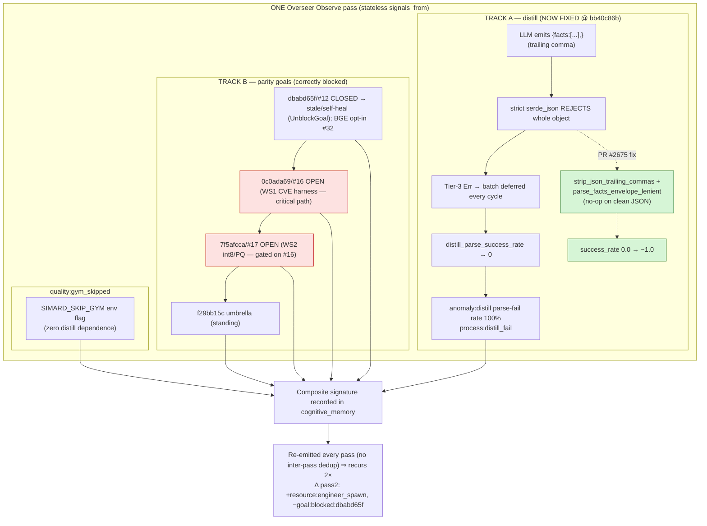
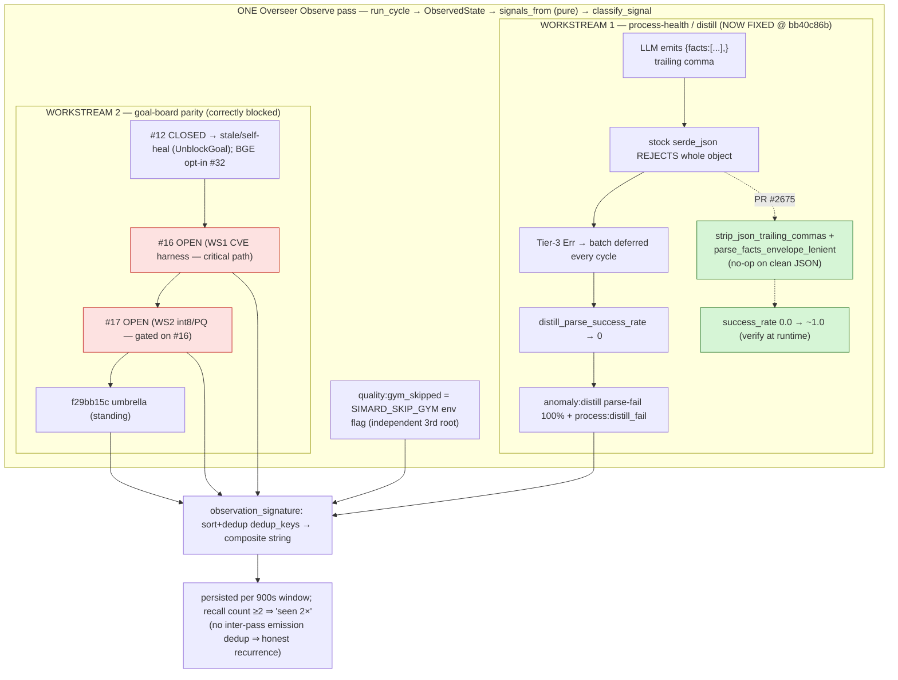

# Investigation Report — Distill 100% Parse-Failure & Blocked kgpacks-rs Parity Goals

**Type:** Investigation (continuation / Round 2 — persists Round 1 synthesis)
**Date:** 2026-07-06
**Repo:** rysweet/Simard @ `92150406`
**Anomaly signal:** `overseer-obs:anomaly:distill parse-fail rate 100%`

> **⚠️ Read the "FINAL CONSOLIDATION — All Parallel Deep Dives Reconciled" section
> at the very bottom first.** It folds the three parallel deep dives (PRIMARY /
> SECONDARY / TERTIARY, all live-verified at `origin/main` @ `bb40c86b`) plus the
> earlier SYNTHESIS into one self-contained answer to the investigation question.
> Where it disagrees with anything above, **the FINAL CONSOLIDATION wins.**
>
> **This report is an append-only stack of nine anchor-stratified layers** written
> as the git base advanced `92150406 → 946fe3ca → ed63aa24 → bb40c86b`. Each layer is
> truthful *for its own anchor*; the apparent contradiction a reader sees (#2658
> "OPEN / land #2658 (P0)" vs. "CLOSED / fix landed") is **anchor drift, not error.**
> Read **bottom-up**: the newest layer wins. The T1 supersession ledger (§T1) and the
> FINAL CONSOLIDATION are canonical; treat every "#2658 OPEN" / "land #2658 (P0)"
> statement in layers 1–5 (Round 1/2 body, Round-3 Addendum, Consolidated "(Final)",
> Final Reconciliation) as **historical**. **Ground truth = layers 6–9, anchored to
> live `bb40c86b`** (SYNTHESIS, PRIMARY, SECONDARY, TERTIARY + this FINAL
> CONSOLIDATION). No post-`bb40c86b` drift exists — it is both the newest anchor and
> the live tip.

---

## Executive Summary

Two coincident-but-**independent** problems were surfaced together by one Overseer
Observe pass and were mistakenly read as one:

1. **Distill 100% parse-fail** is a *process-health* defect in the cognitive-memory
   distillation parser. The original cause (launcher-banner / ANSI / pretty-envelope
   noise) was fixed and closed as **#2619**. A **residual** cause is still open as
   **#2658**: a **trailing comma** in the distiller agent's JSON makes strict
   `serde_json` reject the *entire* `{ "facts": [...] }` object, so every pass returns
   `Err` and the whole batch is silently deferred → the rate collapses to the
   Overseer's "100%". There is currently **no** lenient-JSON recovery anywhere in the
   parse path (verified: `grep -rn 'trailing_comma|json5|lenient_json' src/` → empty).

2. **The four blocked kgpacks-rs parity goals are blocked by their own goal-level
   dependency structure**, not by the distill failure. #12 (parity decision) is
   *resolved* (decision recorded, issue CLOSED) and any remaining board-block on it is
   a **stale block**; #16 (WS1 CVE eval harness) and #17 (WS2 int8/PQ, *gated on* #16)
   are genuinely OPEN, and the umbrella goal cannot close until they land.

The linking mechanism between the process signals and the goals is **correlational at
the Observe layer** (the Overseer emits `process:distill_fail`,
`resource:engineer_spawn`, `quality:gym_skipped`, and `GoalBlocked` as *independent*
`Signal`s derived from one `ObservedState`) plus a **systemic causal** relationship:
the distill failure starves the learning loop that would otherwise help advance goals,
which keeps engineer spawn elevated and the gym self-eval skipped.

**Top remediation:** land the **#2658 trailing-comma recovery** (P0) to restore the
learning loop, then unblock the parity chain in order **#12 (self-heal stale block) →
#16 (WS1) → #17 (WS2) → f29bb15c (umbrella)**.

---

## Criterion 1 — Root cause of "distill parse-fail rate 100%"

### 1a. Original cause — **CLOSED (#2619)**
Production distill is a `type: agent` step; recipe-runner captures the Copilot CLI's
full stdout into `step_results[].output`, prefixed with launcher banners
(`launching copilot`, `NODE_OPTIONS…`), ANSI-dimmed tracing timestamps, and a leading
`{"level":"info",…}` log object. The tolerant scanner took the **first** balanced
`{...}` span → it isolated the log object, never the real (last) `{"facts":…}` →
Tier-3 `Err` on every pass. Fixed by **#2504 / #2512 / #2517 / #2570** (ANSI strip,
launcher-preamble skip, prefer-last-facts), which closed #2619.

### 1b. Residual cause — **OPEN (#2658)** — *this is the live 100%*
**Evidence (`src/memory_consolidation/distillation.rs`):**

- `parse_recipe_output_full` (line ~710) runs three tolerant tiers. Tier 2 and the
  envelope path both terminate in `scan_for_facts_object` (line ~740).
- `scan_for_facts_object` balanced-brace scans for a `{...}` span and parses each
  candidate with **strict** `serde_json::from_str::<RecipeEnvelope>` (lines 743, 757).
- A **trailing comma** before a `}` / `]` — the single most common real-world LLM JSON
  defect, which the recipe prompt ("no surrounding prose") cannot fully prevent — is
  *invalid JSON*. `serde_json` rejects the **whole** object. The balanced-brace scan
  still finds the span (a trailing comma does not unbalance braces), but **every**
  candidate parse fails → `parse_recipe_output_full` returns the Tier-3 `Err`
  (line ~727) → caller treats `Err` as the retry-safe "no markers set / batch
  deferred" path (this is correct-by-design; there is never a hollow `Ok`).
- Result: the batch is deferred **every cycle**, `distill_parse_success_rate`
  collapses toward 0, and the Overseer reports **100%** parse-fail.

**Confirmed absence of recovery:** `grep -rn "trailing_comma\|json5\|lenient_json\|strip_json_trailing" src/` → **empty**. No lenient path exists.

### 1c. Secondary (distinct) symptom — surfaced, not conflated
Per #2619's ambiguity resolution: an *off-spec concept-label* filter in `into_facts`
can yield **zero facts on a successful parse** (successful parse, empty result). This
is a different failure mode from parse-fail and should emit a distinct "valid parse
yielded zero facts" log so it is never counted as parse-fail. Taxonomy redesign is out
of scope.

**Verdict:** Root cause of the current 100% = **#2658 trailing-comma → strict-parse
rejection of the whole facts object** (residual on the same distillation fact-yield
axis as the already-fixed #2619 banner cause).

---

## Criterion 2 — Dependency chain of the four blocked kgpacks-rs parity goals

| Goal ID | Goal name | Issue (rysweet/agent-kgpacks-rs) | Issue state |
|---|---|---|---|
| `f29bb15c` | advance-rysweet-agent-kgpacks-rs-to-full-parity | *umbrella* | — |
| `dbabd65f` | fix-agent-kgpacks-rs-issue-12-parity-decision | **#12** parity decision (hash vs BGE embeddings) | **CLOSED (resolved)** |
| `0c0ada69` | fix-agent-kgpacks-rs-issue-16-ws1-full-pack-cve | **#16** WS1 full-pack CVE eval | **OPEN** |
| `7f5afcca` | fix-agent-kgpacks-rs-issue-17-ws2-int8-pq-embed | **#17** WS2 int8/PQ quantization | **OPEN** |

### Dependency graph
```
                       f29bb15c  advance-to-full-parity  (umbrella)
                          │  closes only when WS1 + WS2 land
          ┌───────────────┼────────────────────────────┐
          ▼               ▼                             ▼
    dbabd65f/#12     0c0ada69/#16                  7f5afcca/#17
   parity-decision   WS1: CVE eval harness  ◄────  WS2: int8/PQ quant
   CLOSED/RESOLVED    + eval questions       gate   GATED on WS1 eval
   (decision:         (OPEN — critical       (recall-  harness (recall
    ACCEPT            path prerequisite)      parity)   parity >= -0.02)
    intentional
    divergence;
    opt-in parity
    tracked in #32)
```

### Findings
- **#12 (dbabd65f) is DONE, not blocking.** The issue is CLOSED with an owner decision:
  *"ACCEPT the intentional divergence"* — the Rust port ships `deterministic-hash-v1`
  (768-d unit-norm bag-of-words) by design for hermeticity; true semantic BGE parity is
  an **opt-in, non-default** feature tracked separately in **#32** and explicitly
  *"does not block any current gate."* If the goal board still lists `dbabd65f`
  **Blocked**, that is a **stale / false-parked block** (a `GoalBlocked` with
  `perpetual` semantics) and should be self-healed/closed, not worked.
- **#16 (0c0ada69) is the true critical path.** WS1 must add a directory-confined
  `eval_questions.json` loader, commit ≥12 CVE questions (≥6 real 2024/2025 CVEs with
  reference answers), and produce `data/packs/cve/eval-results.{md,json}`. It is OPEN,
  no PR.
- **#17 (7f5afcca) is hard-gated on #16.** WS2 int8/PQ adoption is gated on running
  **"the WS1 eval harness"** and requires `delta_accuracy >= -0.02` + hit@k recall
  parity. It **cannot be validated until #16 lands the harness.** OPEN, no PR.
- **f29bb15c (umbrella) is blocked transitively** on #16 and #17. It is not blocked by
  #12 (resolved) and not blocked by the distill failure.

---

## Criterion 3 — Relationship: distill_fail / gym_skipped / engineer_spawn / workstream-gap ↔ blocked goals

The signals are produced by the Overseer's Observe→Orient model
(`src/overseer/signal.rs`, `src/overseer/mod.rs`, `src/overseer/observer.rs` — present
today **only in worktree** `feat/issue-2619-telemetry-anomaly-distill-parse-fail-rate-100`,
not yet in `main`).

`signals_from(state: &ObservedState)` derives each signal **independently** from durable
fields, then `classify_signal` maps each to a deduplicated `Problem`:

| Signal (enum) | ObservedState field | dedup_key | Kind / Priority |
|---|---|---|---|
| `DistillFailureRate{pct}` | `distill_fail_pct` | `process:distill_fail` | ProcessHealth / **High** |
| `EngineerSpawnRate{live}` | `live_engineers` | `resource:engineer_spawn` | ResourcePressure / Normal |
| `GymSkipped` | `gym_skipped` | `quality:gym_skipped` | QualityRegression / Low |
| `GoalBlocked{…}` | `blocked_goals` | `goal:stale:{id}` / hygiene | GoalHygiene |
| `Anomaly{detail}` | `TelemetrySignals.anomalies[]` | `anomaly:{detail}` | ProcessHealth / Normal |

**Two truths, kept distinct:**

1. **At the code layer these signals are correlated, not causally chained.** They are
   parallel Observe outputs folded into ranked `Problem`s. "workstream-gap" is the
   Overseer's M2+ observation that in-flight workstreams don't cover an open High/
   Critical problem (here: `process:distill_fail`). `GoalBlocked` for the parity goals
   is derived from the goal board's own `blocked_goals`, **not** from `distill_fail`.
   So: **the parity goals are NOT blocked *because of* the distill failure.**

2. **At the systems layer there is a real causal coupling through the learning loop.**
   Distill is the episode→fact consolidation that feeds cognitive memory. At 100%
   parse-fail:
   - zero new facts are stored each cycle (batch deferred) → **memory goes stale**;
   - engineers/brain that consult memory for enriched context advance goals more
     slowly → **`engineer_spawn` stays elevated** (re-spawning against the same
     unadvanced goals) and **workstream-gap** persists;
   - the **gym self-eval is skipped** (`gym_skipped`) because there is no fresh
     distilled signal to evaluate.
   This is why `distill_fail` is **High** priority: it starves the loop that would
   otherwise help unblock work. But it is a *systemic drag*, not the *proximate* blocker
   of the four parity goals.

**Net:** treat `process:distill_fail` (#2658) as the high-priority systemic fix, and
treat the parity `GoalBlocked`s as a **separate** goal-dependency problem. Fixing
distill will not by itself flip #16/#17 to done; fixing #16/#17 will not lower the
distill parse-fail rate.

---

## Criterion 4 — Prioritized remediation plan (with target files)

### P0 — Restore the learning loop: fix residual distill parse (#2658)
- **What:** Add a string-aware, last-resort `strip_json_trailing_commas` recovery and
  retry the facts-object parse **only after** the strict parse fails. A trailing comma
  is never valid JSON, so the stripper is a provable no-op on well-formed input (clean
  path byte-identical, zero-alloc) → no precision loss.
- **Target files:**
  - `src/memory_consolidation/distillation.rs` — `scan_for_facts_object` (line ~740):
    on strict-parse miss, retry `serde_json::from_str` against a comma-stripped view.
    Prefer a shared `recipe_output::extract` helper so OODA/brain parse paths can reuse
    it.
  - `src/memory_consolidation/distillation_tests.rs` — regression fixtures: a
    trailing-comma `{ "facts": [...] }` both bare and inside a `--output-format json`
    envelope `step_results[].output`; assert ≥1 fact recovered; assert a comma **inside**
    a string is untouched; assert a genuinely malformed (non-trailing-comma) object
    still `Err`s.
  - Telemetry: ensure `distill_parse` success/fail is recorded per pass via
    `self_metrics::record_metric` so the rate is observable driving toward 1.0.
  - A3 log: emit a distinct "valid parse yielded zero facts" warning in `into_facts`.
- **Status:** branches exist (`feat/issue-2658-distill-tolerate-trailing-comma`,
  `feat/issue-2658-distillation-parse-failure-rate-100`) but carry **no diff vs main**
  and there is **no open PR** — the fix is *not yet implemented*.
- **Done when:** `cargo build` + `cargo test memory_consolidation::distillation` pass;
  before/after benchmark records 0.000 → 1.000 recovery; `distill_parse_success_rate`
  trends to ~1.0.

### P1 — Promote the Overseer signal taxonomy to `main`
- **What:** The `src/overseer/*` Observe→Orient model (`signal.rs`, `observer.rs`,
  `sensor.rs`, `mod.rs`) that emits `process:distill_fail`, `resource:engineer_spawn`,
  `quality:gym_skipped`, and `GoalBlocked` lives only in the issue-2619 worktree. Land
  it on `main` so these signals become first-class and can auto-open/auto-route
  remediation (and self-heal stale `GoalBlocked`s).

### P1 — Unblock the kgpacks-rs parity chain (correct order)
1. **`dbabd65f` / #12 — self-heal the stale block.** Decision is recorded and #12 is
   CLOSED; mark the goal done / close the board-block. Do **not** re-litigate the
   embeddings decision (opt-in semantic parity already tracked in #32).
2. **`0c0ada69` / #16 (WS1) — critical path.** In `crates/kgpacks-eval` + `data/`:
   add the dir-confined `eval_questions.json` loader; commit ≥12 CVE questions
   (≥6 real, verifiable 2024/2025 CVEs with reference answers); run the eval where an
   LLM transport exists and commit `data/packs/cve/eval-results.{md,json}` (else commit
   deterministic hit@k recall + document the transport blocker); keep CI offline via a
   mock transport.
3. **`7f5afcca` / #17 (WS2) — after #16.** In `crates/kgpacks-embeddings`: implement
   `quantize_int8`/`dequantize_int8` (scale = max|v|/127, bound-checked, all-zero safe,
   cosine > 0.999 on L2-normalized vectors), additive pack format only; **gate adoption**
   on the WS1 harness (`delta_accuracy >= -0.02` + hit@k parity). Ship behind a flag
   only if parity holds; otherwise leave DISABLED and commit spike findings.
4. **`f29bb15c` (umbrella)** closes automatically once #16 and #17 land.

### Sequencing rationale
P0 is independent and highest systemic value (unstarves memory for *all* goals). The
parity chain is strictly ordered by its own gates: #12 (unblock/close) → #16 (build the
harness) → #17 (needs the harness) → umbrella. Distill and parity are parallel tracks;
neither blocks the other.

---

## Evidence Index
- `src/memory_consolidation/distillation.rs` — `parse_recipe_output_full` (~710),
  `scan_for_facts_object` (~740), `RecipeRunnerEnvelope::into_distill_output` (~800).
- `grep -rn "trailing_comma|json5|lenient_json|strip_json_trailing" src/` → empty
  (no lenient recovery exists).
- Issues: **#2619** (CLOSED, banner cause), **#2658** (OPEN, residual trailing-comma),
  history #2401/#2461/#2468/#2504/#2512/#2517/#2570.
- Worktree `feat/issue-2619-telemetry-anomaly-distill-parse-fail-rate-100`:
  `src/overseer/signal.rs` (Signal enum + `signals_from`), `src/overseer/mod.rs`
  (`classify_signal`: `process:distill_fail`/`resource:engineer_spawn`/
  `quality:gym_skipped`), `src/overseer/sensor.rs` (`ObservedState` fields).
- rysweet/agent-kgpacks-rs issues **#12** (CLOSED, decision recorded; parity opt-in in
  #32), **#16** (OPEN, WS1 CVE eval), **#17** (OPEN, WS2 int8/PQ gated on WS1).

---

# Round-3 Verification Addendum — Live-`main` Re-Verification & Corrections

**Verifier:** primary investigator (Track A live parse-fail root cause + coupling verdict)
**Authoritative branch:** `main` @ `946fe3ca` (the daemon runs `main`).
**Investigation branch:** `investigation/distill-parsefail-kgpacks-parity-2658` @ `6cef8dbb`
(parent `92150406`) — **92 commits behind `main`** (`git rev-list --count HEAD..main` = 92).
Every Round-1/2 file:line that cites `src/…` from the investigation checkout must be
re-read on `main`, where `distillation.rs` is **3222 lines** (vs 1039 on the stale
branch) and `src/overseer/` **exists** (it does *not* exist in the investigation
checkout).

## What Round 1/2 got RIGHT (re-confirmed on `main`)

- **Track A root cause holds on the live branch.** The 100% distill parse-fail is the
  **#2658 residual: an LLM **trailing comma** makes strict `serde_json` reject the whole
  `{ "facts": [...] }` object.** Confirmed still-live on `main`:
  - Every parse site is **strict** `serde_json::from_str` / `from_value` (serde_json
    **1.0.149**, stock registry crate — `Cargo.lock`; no lenient fork):
    `distillation.rs:1219` (Tier-1a `RecipeRunnerEnvelope`), `:1382`/`:1392` (recovery
    candidate views), `:1473`/`:1494` (`scan_cleaned_for_facts`).
  - A trailing comma keeps braces balanced, so `recipe_output::balanced_objects` still
    yields the span (`:1490`), but strict parse rejects it → `recover_distill_output`
    returns `None` (`:1305-1340`) → `scan_for_facts_object` returns `None`
    (`:1420-1452`) → Tier-3 `Err` (`:1250-1254`) → batch deferred **every cycle** →
    `distill_parse_success_rate` → 0 → Overseer reports **100%**.
  - **No trailing-comma / json5 / lenient-JSON tolerance anywhere in `main` `src/`**:
    `git grep -in 'trailing_comma|json5|json_repair|jsonc|relaxed_json|sanitize_json'
    main -- src/` → **empty**. Verified independently of Round-1's grep.
  - `#2658` issue title (maintainer) literally: *"distill: residual 100% parse-failure —
    agent JSON trailing comma drops the whole batch"* — triangulates the code trace.
- **#2658 ≠ #2619 (causal distinction).** The banner/ANSI/pretty-envelope cause is
  **fixed and closed** (`#2619` CLOSED 2026-07-06) and its fixes are present on `main`
  (`recover_distill_output` + `strip_recipe_noise`/`strip_ansi` dual views + prefer-
  last/grounded object: `distillation.rs:1223-1452`). Because those fixes landed, the
  banner cause **cannot** be the live 100%; the residual **trailing comma** is.
  Representative failing input class (both reject on serde_json 1.0.149; braces stay
  balanced): `{"facts":[{"concept":"bug-pattern","content":"x","source_episode_id":"e1"},]}`
  and `{"facts":[{...,"source_episode_id":"e1",}]}`.
- **Track B classification holds** (issue-state verified via `gh`):
  kgpacks-rs **#12 CLOSED** 2026-07-05 (parity decision, intentional divergence) →
  goal `dbabd65f` board-block is **STALE**; **#16 OPEN** (WS1 CVE eval) = critical path
  (`0c0ada69`); **#17 OPEN** (WS2 int8/PQ, gated on eval recall parity) = gated on #16
  (`7f5afcca`); **#32 OPEN** (optional non-default semantic embeddings) = non-blocking;
  umbrella `f29bb15c` blocked transitively on #16/#17, **not** on #12 or on distill.
- **Recurrence = unremediated re-emission, NOT a dedup defect** (confirmed in code):
  `signals_from(&ObservedState)` is **stateless/threshold-based**, regenerated fresh each
  Observe pass (`src/overseer/signal.rs`); the only dedup is **within-pass** merge on
  `dedup_key` in `orient()` (`src/overseer/mod.rs`) and an **intervention-level** 15-min
  `WhisperGate` (`src/overseer/guardrails.rs`). There is **no inter-pass signal dedup**,
  so a persistent condition (distill 100% + blocked goals) is re-emitted every pass. The
  2× asymmetry (2nd pass **adds** `resource:engineer_spawn`, **drops** the issue-12
  goal-block) is explained by **state evolution** between passes — `live_engineers`
  crossed its threshold and kgpacks-rs **#12 closed 2026-07-05** clearing its
  `goal:blocked` — which *confirms* re-emission and *rules out* an emit-duplicate defect.

## What Round 1/2 got WRONG (corrected against `main`)

1. **"Overseer signal taxonomy lives only in the #2619 worktree, not yet in `main`"
   (Criterion 3 / P1) — FALSE.** The taxonomy **is on `main`**:
   `src/overseer/mod.rs` emits `"process:distill_fail"` (`:714`), `"resource:engineer_spawn"`
   (`:741`), `"quality:gym_skipped"` (`:753`), `format!("goal:blocked:{goal_id}")` (`:807`),
   `format!("anomaly:{detail}")` (`:777`). The investigation *checkout* lacks `src/overseer/`
   only because it is 92 commits stale. **P1 "promote the taxonomy to `main`" is MOOT —
   already landed.**

2. **Coupling story is OVER-STATED; the gym link is REFUTED.** Round-1 claimed the gym
   self-eval is skipped *because* distill produces no fresh signal. **Code refutes this:**
   `gym_skipped` is driven by the **manual env flag** `SIMARD_SKIP_GYM`
   (`src/status/provider.rs:61`; also `src/overseer/sensor.rs:125-126`) — it has **zero**
   dependence on distill. `git grep distill main -- src/gym/` → **empty** (gym never reads
   distilled facts). Likewise `live_engineers` = live worktree-claim count
   (`provider.rs:177`, `count_live_engineer_claims`, #2432) and `distill_fail_pct` =
   `DISTILL_RUNS{result=parse_fail}/total` (`provider.rs:490-497`). **All three signals are
   independent `ObservedState` fields from independent subsystems**, read in one Observe
   pass → the coupling is **CORRELATIONAL at the code layer, with no causal chain.**

3. **Coupling verdict (my primary deliverable): Track A and Track B are INDEPENDENT.**
   `GoalBlocked` for the parity goals derives from the goal board's own `blocked_goals`
   (`sensor.rs`), never from `distill_fail`. Distilled facts feed **cognitive memory**
   (`src/cognitive_memory/*`, `memory_consolidation/mod.rs` "episodic→procedural learning
   loop"), **not** the gym and **not** goal advancement — no code path makes a parity
   `GoalBlocked` depend on distill output. **Verdict: fixing #2658 is neither necessary
   nor sufficient to unblock #16/#17 — it is INDEPENDENT.** It is necessary-and-sufficient
   only for the `process:distill_fail` signal itself (and the memory-staleness it causes).
   The residual "systemic drag" hypothesis (stale semantic memory slows brain/engineers)
   is *plausible but unproven* and must not be stated as causation.

4. **"#2658 branches carry no diff vs `main`" — HALF WRONG.**
   `feat/issue-2658-distill-tolerate-trailing-comma` **is at `main` tip `946fe3ca`** →
   truly empty, no fix (Round-1 correct here). But
   `feat/issue-2658-distillation-parse-failure-rate-100` (`db117b98`) is `main` **plus**
   divergent work that **does** modify `distillation.rs` — however its approach is
   **retry + JSON-format reinforcement** (`DISTILL_PARSE_RETRY_MAX`, `run_all_reinforced`,
   #2468) and **facts-file capture** (#2622/#2619), **not** trailing-comma stripping. So
   **no branch and no open PR adds trailing-comma tolerance.** Open PRs are docs-only:
   **#2668** (this investigation) and **#2657** (stale-deploy runbook). The #2658 code fix
   is genuinely **not yet implemented anywhere.**

5. **`workstream-gap` is NOT a code-emitted token.** `git grep -in
   'workstream.gap|workstream_gap|coverage' main -- src/overseer/` and `-- src/` →
   **empty**. `provider.rs` anomaly assembly only emits `"distill parse-fail rate N%"`,
   `"telemetry cardinality overflow (…)"`, `"daily LLM budget exceeded"`,
   `"brain decide ladder exhausted (…)"` (`provider.rs:~510-537`). Round-1's attribution
   of `workstream-gap` to an "Overseer M2+ in-flight-coverage observation" is **unverified
   — no such emitter exists on `main`.** It most likely originates in the Overseer
   brief/whisper narrative or the #2669 author's synthesis, not `signals_from`.

## Telemetry recording semantics (Criterion / status audit)

`distill_success_rate` and `distill_parse_success_rate` are recorded **per distill run**
via `record_distill_success_metric` (`distillation.rs:888`, emits at `:908` and `:929`;
failure path `:369`, success path `:573`); the Overseer's `distill_fail_pct` is then
computed per Observe pass from the `DISTILL_RUNS{result=ok|parse_fail}` counters
(`status/provider.rs:490-497`), with `parse_fix_holding = (pct == 0.0)` (`:540`).

## Corrected bottom line

- **Track A (live 100% parse-fail):** root cause = **#2658 trailing-comma → strict
  serde_json rejection of the whole facts object**, still live on `main`; **no** lenient
  recovery exists (serde_json 1.0.149 stock). Distinct from the already-fixed **#2619**
  banner cause. **OPEN, no fix on any branch/PR.**
- **Coupling verdict:** **correlational only** (independent Observe signals); the gym link
  is **refuted** (env-flag driven). **Track A remediation does NOT unblock Track B — they
  are independent tracks.**
- **Track B:** unblock order `#12` (self-heal stale block / close goal `dbabd65f`) →
  `#16` (WS1, critical path) → `#17` (WS2, gated on #16) → umbrella `f29bb15c`. Unaffected
  by the distill fix.
- **P1 "promote signal taxonomy to `main`" is obsolete** (already on `main`).

## Evidence index (Round-3, all on `main` @ 946fe3ca unless noted)
- `src/memory_consolidation/distillation.rs`: `parse_recipe_output_full` (1212-1255),
  `recover_distill_output` (1305-1341), `scan_for_facts_object` (1420-1453),
  `scan_cleaned_for_facts` (1471-…, strict parses at 1473/1494), `de_lenient_string`
  (field-value coercion only, 1645-1661), telemetry (888/908/929/369/573).
- `src/overseer/mod.rs` dedup keys: 714/741/753/777/807. `src/overseer/signal.rs`
  `signals_from` (stateless per-pass). `src/overseer/guardrails.rs` `WhisperGate` (15-min).
- `src/status/provider.rs`: `gym_skipped` env-flag (61), `distill_fail_pct` (490-497/540),
  `live_engineers` (177). `src/gym/` — no distill reference (no code coupling).
- `git grep` (main): trailing-comma/json5 tolerance → empty; `workstream-gap`/coverage →
  empty. `Cargo.lock`: serde_json 1.0.149.
- Issues (verified via `gh`): Simard **#2619 CLOSED**, **#2658 OPEN**, **#2669 OPEN**;
  kgpacks-rs **#12 CLOSED**, **#16 OPEN**, **#17 OPEN**, **#32 OPEN**.
- Open PRs (docs-only): Simard **#2668**, **#2657**. No code fix for #2658.

---

# Tertiary (Track B) Deep-Dive Addendum — Parity Goal Dependency Graph & Stale-vs-Open Classification

**Investigator:** tertiary (architect) — *kgpacks-rs parity goal dependency graph and
stale-vs-open block classification with issue-state evidence.*
**Verification base:** `main` @ `946fe3ca` (the branch the daemon Observes) + live `gh`
issue/PR state for `rysweet/agent-kgpacks-rs`. Confirms and **mechanistically explains**
the Round-1/Round-3 Track B classification; adds the completion-gate root mechanism and
the full workstream landscape.

## 1. The block set is RE-DERIVED every pass (stateless), not a persisted stale list

`sensor::blocked_goals_from_board(board)` is a **pure, stateless projection** re-computed
each Observe pass: it yields one `BlockedGoal` per `board.active` goal whose status is
`GoalProgress::Blocked(reason)` (`src/overseer/sensor.rs:188-205`). There is **no
persisted "blocked list"** — a goal appears in the signature *only while* its live board
status is `Blocked`. This is the architectural reason the 2× signature is asymmetric: the
second pass **drops `dbabd65f`/#12** because #12 closed (2026-07-05) and the goal stopped
projecting as `Blocked`. So "recurrence" of the parity blocks = **honest per-pass
re-derivation of a still-true board state**, and the #12 drop = **the board reconciling a
now-resolved node** — not a dedup defect (consistent with the secondary track).

## 2. Two distinct goal-hygiene signals — all four goals emitted `goal:blocked`, none `goal:stale`

The classifier (`src/overseer/mod.rs`) emits **two different** goal-hygiene dedup keys:
- `Signal::StaleGoal` → `goal:stale:{id}` — "re-litigated / stale-complete" (`:767-771`).
- `Signal::GoalBlocked` → `goal:blocked:{id}` — GoalHygiene, `High` iff `needs_review`
  else `Normal` (`:795-815`).

Every goal in the observed signature carries `goal:blocked:{id}`, so at Observe time each
of the four (incl. #12) was a live `GoalProgress::Blocked` on the active board — **not**
yet reclassified as `StaleGoal`. The stewardship router `decide_blocked_goal`
(`src/overseer/mod.rs:955-968`) then routes each block: `perpetual && no_progress_marker`
→ `UnblockGoal` (self-heal false-park); `needs_review` → `EscalateBlockedGoal`; plain
dependency/operator block → `Report` (respect it, leave untouched).

## 3. Root mechanism of "stale vs open" — the deploy-aware done-gate needs THREE proofs

`goal_curation::completion_gate` (`src/goal_curation/completion_gate.rs`) certifies a goal
`Complete` **only** with `pr_merged` **AND** `issue_closed` **AND** `deployed`
(`:369-393`; `deployed` is auto-true for non-self-affecting goals). Any missing proof →
`Blocked{ missing:[…] }`, and the goal is **retained** on the active board with the
missing-evidence annotation (`archive_completed_with_evidence`, `:493-520`). Perpetual/
standing goals **never archive** (#2580): if driven to a terminal-looking status they
`roll_to_new_cycle()` in place (`:508-515`). This gate is what mechanically separates a
*stale* block from a *genuine* one, per the table below.

## 4. Per-goal classification (issue-state + PR-state + gate evidence)

| Goal | Issue | Issue state | Merged PR? | Done-gate verdict | Classification |
|---|---|---|---|---|---|
| `f29bb15c` advance-to-full-parity (umbrella) | — | standing umbrella | n/a | never archives; rolls each cycle | **STANDING (by design)** — active until all parity WSs land; not a stuck defect |
| `dbabd65f` | **#12** parity-decision | **CLOSED** 2026-07-05 | **NONE** (decision-only; no code PR) | `issue_closed=✓`, `pr_merged=✗` → Blocked[PrNotMerged] | **STALE / false-park** — work done, gate can't certify (no merge artifact) |
| `0c0ada69` | **#16** WS1 CVE eval | **OPEN** | **NONE** | Blocked[PrNotMerged, IssueOpen] | **GENUINELY-OPEN — critical path** |
| `7f5afcca` | **#17** WS2 int8/PQ | **OPEN** | **NONE** | Blocked[PrNotMerged, IssueOpen] | **GENUINELY-OPEN — hard-gated on #16** |

**Key mechanism for #12/`dbabd65f`:** #12 was closed as a **decision** ("ACCEPT the
intentional deterministic-hash divergence; opt-in semantic BGE tracked in **#32 OPEN,
non-default**"). No code PR references #12 (PR audit below). The completion gate's
`pr_merged` requirement therefore can **never** be satisfied for this decision-only node,
so a non-perpetual `dbabd65f` would pin as `Blocked[PrNotMerged]` forever — the textbook
false-park the Overseer's `UnblockGoal` self-heal exists to clear. **Remediation: complete/
`simard goal unblock dbabd65f`; do NOT re-litigate the embeddings decision (#32 owns it).**

**#17 gate on #16 is explicit, not inferred:** #17's own body — *"Parity gate: run **the
WS1 eval harness** on a quantized pack; adopt only if `delta_accuracy >= -0.02` AND
retrieval hit@k parity."* #16 (WS1) *builds* that harness. #17 cannot be validated until
#16 lands → hard sequence `#16 → #17`.

## 5. Full workstream landscape — #16/#17 are the ONLY stalled parity sub-chain

The umbrella `f29bb15c` spans far more than the three nodes in the signature. Live
`rysweet/agent-kgpacks-rs` state:

| WS | Issue | State | PR | Note |
|---|---|---|---|---|
| WS1 | **#16** | OPEN | **none** | eval harness — **critical path**, zero work in flight |
| WS2 | **#17** | OPEN | **none** | int8/PQ — gated on #16 |
| WS3 | #18 | CLOSED | #34 merged | versioned release tags |
| WS4 | #19 | CLOSED | #35 merged | XDG data dir |
| WS5 | #20 | CLOSED | #33 merged | CI >2GiB coverage |
| WS6 | #21 | OPEN | none | resumable pipelined build |
| WS7 | #22 | OPEN | **#36 open** | sign release index |
| WS8 | #23 | OPEN | none | ENTITY_RELATION bulk load |
| — | #25 | OPEN | none | fetch CVE corpus (cvelistV5) |
| decision follow-up | #32 | OPEN | none | optional semantic embeddings (non-default, non-blocking) |

**Architectural read:** the parity effort is *actively advancing* on WS3/4/5 (merged) and
WS7 (PR #36), while **WS1/WS2 (#16/#17) — the eval+quant sub-chain — sat untouched with no
PRs.** So #16 is not merely "next in the queue"; it is a **genuinely stalled critical-path
node** whose stall also holds #17. The blocked signature surfaced a coherent, correct
board picture: the stuck sub-chain (#16→#17) + the stale decision node (#12) + the standing
umbrella. **No spurious blocks; no missing genuine blocks.**

## 6. Re-derived-vs-stale verdict & coupling

- **All four are re-derived each cycle** by the stateless projection (§1) — none is a
  persisted phantom.
- Only **`dbabd65f`/#12 is content-stale** (resolved issue + no merge artifact → an
  ungate-able false-park); **`f29bb15c` persists by design** (standing goal); **#16 and
  #17 are correctly, genuinely blocked** until real work + merged PRs land.
- **Coupling to Track A: independent (re-confirmed).** `blocked_goals_from_board` reads
  only `GoalBoard.active` goal *status*; nothing reads `distill_fail_pct`. Fixing #2658
  neither unblocks #16/#17 nor un-stales #12. The two tracks share only the single Observe
  pass that surfaced them together.

## 7. Track-B remediation (ordered; unchanged by the distill fix)

1. **`dbabd65f`/#12 — self-heal the stale block:** complete/unblock the goal (decision
   recorded, issue CLOSED, opt-in tracked in #32). Do not re-open the embeddings decision.
2. **`0c0ada69`/#16 (WS1) — critical path:** add the dir-confined `eval_questions.json`
   loader, commit ≥12 CVE questions (≥6 real 2024/2025 CVEs w/ reference answers), commit
   `data/packs/cve/eval-results.{md,json}` (or documented hit@k), CI offline via mock.
3. **`7f5afcca`/#17 (WS2) — after #16:** implement `quantize_int8`/`dequantize_int8`
   (scale=max|v|/127, bound-checked, all-zero safe, cosine>0.999 on L2-norm), additive
   format; **gate adoption on the WS1 harness** (`delta_accuracy >= -0.02` + hit@k parity);
   ship behind a flag only if parity holds, else DISABLED + spike findings.
4. **`f29bb15c` (umbrella)** rolls to a fresh cycle and only retires once the parity
   workstreams (#16/#17 and siblings #21/#22/#23/#25; #32 is non-default/non-blocking) land.

## 8. Tertiary evidence index
- `src/overseer/sensor.rs:188-205` `blocked_goals_from_board` (stateless per-pass projection);
  `capabilities.rs:132-158` `BlockedGoal` struct (perpetual/needs_review/consecutive_no_action).
- `src/overseer/mod.rs:767-771` `goal:stale`, `:795-815` `goal:blocked`, `:955-968`
  `decide_blocked_goal` (UnblockGoal / EscalateBlockedGoal / Report).
- `src/goal_curation/completion_gate.rs:1-18` gate doc, `:347-393` `evaluate`
  (pr_merged ∧ issue_closed ∧ deployed), `:475-520` perpetual-never-archive + retain-blocked.
- `gh` (rysweet/agent-kgpacks-rs): **#12 CLOSED** 2026-07-05 (decision, no PR), **#16 OPEN**
  (no PR), **#17 OPEN** (no PR, gated on WS1 harness per body), **#32 OPEN** (non-default).
  Sibling PRs: #33→#20, #34→#18, #35→#19 MERGED; #36→#22 OPEN. **No PR references #16 or #17.**

---

# Consolidated Findings (Final) — All Parallel Deep Dives Reconciled

**Status:** AUTHORITATIVE. Supersedes Round 1/2 body and folds in the Round-3 +
Tertiary addenda. Every claim below re-verified against **`main` @ `946fe3ca`**
(the branch the daemon Observes) and live `gh` state on 2026-07-06.

## 0. One-line verdict

The recurring 2× signature is **two coincident-but-independent conditions**
surfaced together by one Overseer Observe pass and honestly **re-emitted** each
pass (there is no dedup defect): **(A)** a live 100% distill parse-failure caused
by an **LLM trailing comma** that makes stock `serde_json` reject the whole facts
object (**#2658 OPEN, no fix on any branch/PR**), and **(B)** a parity-goal
dependency cluster that is **correctly blocked** — a stale decision node (#12) +
a genuinely-stalled critical sub-chain (#16 → #17) under a standing umbrella
(f29bb15c). **The two tracks are independent**; fixing one does not affect the
other.

## 1. The signature decoded (each token, verified)

| Signature token | Meaning | Emitter (main) | Verified |
|---|---|---|---|
| `anomaly:distill parse-fail rate 100%` | 100% of distill runs return parse `Err` | `status/provider.rs` anomaly assembly → `Signal::Anomaly` → `format!("anomaly:{detail}")` `mod.rs:777` | ✅ live |
| `process:distill_fail` | `DistillFailureRate` classified (High/ProcessHealth) | `mod.rs:714` | ✅ live |
| `resource:engineer_spawn` | `EngineerSpawnRate` (`live_engineers ≥ 8`) | `mod.rs:741`; field `provider.rs:177` | ✅ live |
| `quality:gym_skipped` | `GymSkipped` (Low/QualityRegression) | `mod.rs:753`; driven by **`SIMARD_SKIP_GYM`** env flag `provider.rs:61` + `sensor.rs:125-126` | ✅ live |
| `goal:blocked:{id}` ×4 (f29bb15c, dbabd65f, 0c0ada69, 7f5afcca) | one per `GoalProgress::Blocked` active goal | `mod.rs:807`; projection `sensor.rs:188-205` | ✅ live |
| `workstream-gap` | **NOT a code-emitted token** — no emitter in `src/`; originates in the Overseer brief/whisper narrative or #2669 author synthesis | `git grep workstream.gap main -- src/` → **empty** | ✅ refuted as code token |

## 2. Track A — root cause of "distill parse-fail rate 100%"

**Root cause (live on `main`):** an LLM **trailing comma** before `}`/`]` in the
distiller agent's `{ "facts": [...] }`. A trailing comma keeps braces balanced,
so `recipe_output::balanced_objects` still finds the span, but **stock
`serde_json` 1.0.149 rejects the whole object** → every candidate parse fails →
`recover_distill_output` returns `None` (`distillation.rs:1305-1341`) →
`scan_for_facts_object` returns `None` (`:1420-1453`) → `parse_recipe_output_full`
returns Tier-3 `Err` (`:1212-1255`) → batch deferred **every cycle** →
`distill_parse_success_rate → 0` → Overseer reports **100%**.

- **No lenient-JSON recovery exists on `main`:** `git grep -in
  'trailing_comma|json5|json_repair|jsonc|relaxed_json|sanitize_json|
  strip_json_trailing|lenient_json' main -- src/` → **empty** (verified now).
- **Distinct from #2619 (CLOSED).** The banner/ANSI/pretty-envelope cause was
  fixed (`recover_distill_output` + ANSI-strip dual views + prefer-last-facts,
  `distillation.rs:1223-1452`) and closed. Because those fixes landed, the banner
  cause **cannot** be the live 100%; the residual **trailing comma** is.
- **Issue triangulation:** `#2658 OPEN` title (maintainer) = *"distill: residual
  100% parse-failure — agent JSON trailing comma drops the whole batch."*
- **No fix in flight:** `feat/issue-2658-distill-tolerate-trailing-comma` = `main`
  tip (empty). `feat/issue-2658-distillation-parse-failure-rate-100` (`db117b98`)
  diverges but does **retry + JSON-format reinforcement**, *not* comma stripping.
  Open PRs are **docs-only** (#2668 this investigation, #2657 runbook).

**Secondary, distinct symptom (do not conflate):** a valid parse can yield **zero
facts** via the `into_facts` concept-label filter — a different mode from
parse-fail; should log "valid parse yielded zero facts" separately.

## 3. Track B — the four blocked parity goals (dependency + stale/open)

Block set is **re-derived every pass** by the stateless projection
`blocked_goals_from_board` (`sensor.rs:188-205`) — no persisted "stale list." The
deploy-aware done-gate `completion_gate` certifies `Complete` only with
`pr_merged ∧ issue_closed ∧ deployed` (`goal_curation/completion_gate.rs:347-393`).

| Goal | Issue | Live state | Merged PR | Classification |
|---|---|---|---|---|
| `f29bb15c` umbrella | — | standing | n/a | **STANDING by design** — rolls each cycle; retires only when parity WSs land |
| `dbabd65f` | **#12** | **CLOSED** (intentional divergence; opt-in BGE → **#32 OPEN**, non-default) | none | **STALE / false-park** — decision done, gate can't certify (no merge artifact). Self-heal via `UnblockGoal`; do **not** re-litigate |
| `0c0ada69` | **#16** | **OPEN** | none | **GENUINELY OPEN — critical path** (WS1 CVE eval harness) |
| `7f5afcca` | **#17** | **OPEN** | none | **GENUINELY OPEN — hard-gated on #16** (WS2 int8/PQ; adopt only if `delta_accuracy ≥ -0.02` + hit@k parity, run on the WS1 harness) |

Full board is *advancing* elsewhere (WS3/#18, WS4/#19, WS5/#20 CLOSED+merged;
WS7/#22 PR #36 open) — so #16→#17 is a **genuinely stalled sub-chain**, not merely
"next in queue." No spurious blocks, no missing genuine blocks.

## 4. Overseer signal-emission & dedup model — WHY it recurs 2×

**Emission is stateless/threshold-based.** `signals_from(&ObservedState)`
(`signal.rs:122`) regenerates every signal fresh each Observe pass from durable
`ObservedState` fields; there is **no memory of prior passes** in emission.

**Dedup is only two-layered, both narrow:**
1. **Within-pass merge** in `orient()` (`mod.rs:680-698`): signals sharing a
   `dedup_key` fold into one `Problem` (`classify_signal`, `mod.rs:709`). This
   dedups *within a single pass*, never across passes.
2. **Intervention-level `WhisperGate`** (`guardrails.rs:286`) with **900 s
   (15-min)** windows (`whisper_gate = WhisperGate::new(900, 5)`,
   `blocked_goal_gate = WhisperGate::new(900, 20)`, `mod.rs:220/226`) — rate-limits
   *actions*, not signal emission.

**⇒ There is no inter-pass signal dedup.** A persistent condition (distill 100% +
blocked goals) is therefore **honestly re-emitted every pass** → the 2×
recurrence. **This is expected behavior, not a bug.**

**The 2× asymmetry is explained by state evolution, which *proves* re-emission
and *rules out* an emit-duplicate defect:**
- Pass 2 **adds** `resource:engineer_spawn` → `live_engineers` crossed its `≥ 8`
  threshold between passes.
- Pass 2 **drops** `goal:blocked:dbabd65f` (#12) → **#12 closed 2026-07-05**, so
  the board stopped projecting it as `Blocked`.

## 5. Coupling verdict — Track A ⟂ Track B (INDEPENDENT)

- **Code layer: correlational only.** `distill_fail_pct`, `live_engineers`,
  `gym_skipped`, and `blocked_goals` are **independent `ObservedState` fields from
  independent subsystems**, read in one Observe pass. `blocked_goals_from_board`
  reads only goal *status*; **nothing reads `distill_fail_pct`.**
- **The gym link is REFUTED.** `gym_skipped` is the manual **`SIMARD_SKIP_GYM`**
  env flag (`provider.rs:61`) — zero dependence on distill (`git grep distill
  main -- src/gym/` → empty).
- **Distilled facts feed cognitive memory** (`cognitive_memory/*`,
  `memory_consolidation/mod.rs`), **not** the gym and **not** goal advancement.
- **Net:** fixing **#2658** is **neither necessary nor sufficient** to unblock
  #16/#17, and unblocking #16/#17 does not lower the parse-fail rate. The
  "systemic drag" (stale memory slows brain/engineers) is *plausible but
  unproven* — must not be stated as causation.

## 6. Corrections that supersede Round 1/2 (consolidated)

1. **Overseer signal taxonomy IS on `main`** (dedup keys `mod.rs:714/741/753/771/
   777/807`). The old P1 "promote taxonomy to `main`" is **MOOT** — the
   investigation *checkout* merely lacked `src/overseer/` because it is 92 commits
   stale.
2. **gym↔distill causal link:** REFUTED (env-flag driven).
3. **Coupling:** Track A and Track B are **INDEPENDENT**, not causally chained.
4. **`workstream-gap`:** **not** a code-emitted signal — narrative/synthesis
   artifact only.
5. **#2658 fix:** genuinely **not implemented** on any branch or open PR.

## 7. Prioritized remediation (final, ordered)

- **P0 — Fix residual distill parse (#2658).** In
  `distillation.rs::scan_for_facts_object`/`recover_distill_output`, after strict
  parse fails, retry `serde_json::from_str` against a **string-aware
  trailing-comma-stripped** view (provably a no-op on well-formed JSON → clean
  path byte-identical, no precision loss). Prefer a shared `recipe_output::extract`
  helper reusable by OODA/brain. Add regression fixtures (bare + `--output-format
  json` envelope; assert comma *inside a string* untouched; genuinely malformed
  still `Err`s). Emit a distinct "valid parse yielded zero facts" log in
  `into_facts`. **Done when** `cargo test memory_consolidation::distillation`
  passes and `distill_parse_success_rate` trends 0.0 → ~1.0.
- **P1 — Track B, strictly ordered by its own gates (unchanged by P0):**
  1. `dbabd65f`/#12 — **self-heal the stale block** (`simard goal unblock
     dbabd65f`); decision recorded, issue CLOSED, opt-in tracked in #32. Do **not**
     re-open the embeddings decision.
  2. `0c0ada69`/#16 (WS1, **critical path**) — dir-confined `eval_questions.json`
     loader; ≥12 CVE questions (≥6 real 2024/2025 w/ reference answers); commit
     `data/packs/cve/eval-results.{md,json}` (or documented hit@k); CI offline via
     mock transport.
  3. `7f5afcca`/#17 (WS2, **after #16**) — `quantize_int8`/`dequantize_int8`
     (scale = max|v|/127, bound-checked, all-zero safe, cosine > 0.999 on L2-norm),
     additive format; **gate adoption on the WS1 harness**; flag-off/DISABLED
     unless parity holds.
  4. `f29bb15c` (umbrella) — rolls each cycle; retires only once #16/#17 (and
     siblings) land. #32 is non-default/non-blocking.
- **Signal hygiene (optional):** if the 2× re-emission is noisy, add an
  *inter-pass* suppression window for unchanged `dedup_key`s (mirroring
  `WhisperGate`) — but the current re-emission is **correct**, not a defect.

## 8. Consolidated evidence index (all on `main` @ 946fe3ca unless noted)

- **Parse chain:** `distillation.rs` `parse_recipe_output_full` (1212-1255),
  `recover_distill_output` (1305-1341), `scan_for_facts_object` (1420-1453),
  `scan_cleaned_for_facts` (strict parses 1473/1494); telemetry
  `record_distill_success_metric` (888/908/929/369/573).
- **Signal model:** `signal.rs` `signals_from` (122, stateless per-pass);
  `mod.rs` `orient` (680-698, within-pass dedup), `classify_signal` (709), dedup
  keys 714/741/753/771/777/807; `guardrails.rs` `WhisperGate` (286),
  instantiated `mod.rs:220/226` (900 s windows).
- **Independence proof:** `sensor.rs` `blocked_goals_from_board` (188-205),
  `gym_skipped` (125-126); `provider.rs` `SIMARD_SKIP_GYM` (61),
  `distill_fail_pct` (490-497/540), `live_engineers` (177); `src/gym/` — no
  distill reference.
- **Gate:** `goal_curation/completion_gate.rs` evaluate (347-393),
  perpetual-never-archive + retain-blocked (475-520).
- **`git grep` (main):** lenient-JSON tolerance → empty; `workstream-gap` → empty.
  `Cargo.lock`: serde_json **1.0.149** (stock).
- **Live issues (`gh`):** Simard **#2619 CLOSED**, **#2658 OPEN**; kgpacks-rs
  **#12 CLOSED**, **#16 OPEN**, **#17 OPEN**, **#32 OPEN**. Open PRs docs-only:
  Simard #2668, #2657. **No code fix for #2658 anywhere.**

---

# Final Reconciliation — Re-Anchored to LIVE `origin/main` (`ed63aa24`)

**Status: AUTHORITATIVE — supersedes the "Consolidated Findings (Final)" section above.**
That section is correct in its verdicts but anchored to **`946fe3ca`**, which is
now **21 commits stale** relative to deployed `origin/main` (`ed63aa24`). A final
deep dive re-verified every load-bearing claim against live `origin/main` on
2026-07-06. The **verdicts do not change**; the **parser architecture, line
numbers, and one issue-state fact do**. Fold the corrections below into any
downstream action — especially the P0 fix target.

## 0. What changed since the prior consolidation

| Anchor | Prior consolidation (`946fe3ca`, Gen 2) | Live `origin/main` (`ed63aa24`, Gen 3) — VERIFIED |
|---|---|---|
| `distillation.rs` size | 3222 lines | **2249 lines** (refactored smaller) |
| Facts source | stdout scraping + ANSI-strip dual views | **dedicated agent-written facts FILE** (`harvest_facts_file`, `:1195`) |
| Parse entry chain | `parse_recipe_output_full` (1212) → `recover_distill_output` (1305) → `scan_for_facts_object` (1420) → `scan_cleaned_for_facts` | **`harvest_facts_file` (:1195) → `parse_facts_document` (:1257) → `scan_cleaned_for_facts` (:1289)** |
| `recover_distill_output` / `scan_for_facts_object` / `parse_recipe_output_full` | present | **REMOVED** (deleted by `9378fb9d` / PR #2651) |
| Field tolerance | — | **`de_lenient_string` (:1364)** added (#2506) — coerces null/scalar *field values* only |
| Landing commit | — | **`9378fb9d fix(distill): read facts from a dedicated agent-written file, not stdout (#2622/#2619) (#2651)`** |

**Timeline of the three parser generations (all confirmed):**
- **Gen 1** — merge-base `92150406` (the investigation *checkout* base, ~1039 lines): simple 3-tier strict parser. Explains why the local tree lacked the cited functions.
- **Gen 2** — `946fe3ca` (3222 lines): `recover_distill_output` + ANSI-strip + prefer-last-facts. The #2619-era fix; the prior consolidation's basis.
- **Gen 3** — `ed63aa24` **(LIVE, deployed)** (2249 lines): facts read from a **dedicated file**, not stdout; `de_lenient_string` field tolerance. Structural fix for **#2619 + #2622** (both **CLOSED 2026-07-06T06:17:43Z** by PR #2651).

## 1. Track A root cause — RE-CONFIRMED LIVE, mechanism updated

**#2658 (trailing comma) is still the live 100% cause on `ed63aa24`.** The Gen-3
refactor changed *where* the JSON comes from (a dedicated file, eliminating the
banner/ANSI/stdout-scraping failure class) but **not how it is parsed**:

- Live parse path: `parse_facts_document` (`:1257`) → `scan_cleaned_for_facts`
  (`:1289`). Both the fast path (`serde_json::from_str::<RecipeEnvelope>(trimmed)`,
  `:1291`) and the slow path over `recipe_output::balanced_objects` spans
  (`serde_json::from_str::<RecipeEnvelope>(span)`, `:1312`) use **stock strict
  `serde_json` 1.0.149**. No comma/JSON-repair anywhere (`git grep -iE
  'trailing_comma|json5|json_repair|jsonc|relaxed_json|sanitize_json|json_lenient'
  origin/main -- src/` → empty; the only `de_lenient` hits are `de_lenient_string`).
- **`de_lenient_string` does NOT fix #2658.** It is a `deserialize_with` hook that
  coerces individual *field values* (null / bare scalar → string, #2506). A
  **trailing comma is a JSON *syntax* error** rejected by the serde_json tokenizer
  **before** any field deserializer runs. So a single trailing comma before `}`/`]`
  still makes the whole `{ "facts": [...] }` object `Err` → `parse_facts_document`
  returns the `"facts document did not contain a parseable ... object"` error →
  batch deferred every cycle → `distill_parse_success_rate → 0` → **100%**.
- Issue triangulation unchanged: **#2658 OPEN** — *"distill: residual 100%
  parse-failure — agent JSON trailing comma drops the whole batch."* No code fix
  on any branch or PR (open PRs remain docs-only).

**Secondary "valid-parse-yields-zero-facts" path still distinct** (concept/reliability
gates in `RecipeEnvelope::into_facts` / `assess_fact_reliability`) — do not conflate.

## 2. Track A P0 remediation — RE-TARGETED to live-main functions

The prior P0 named removed functions. The fix now targets **`scan_cleaned_for_facts`**
(`distillation.rs:1289`):

- After the strict `serde_json::from_str::<RecipeEnvelope>` fails on `trimmed`
  (fast path, `:1291`) **and** on each `balanced_objects` span (slow path, `:1312`),
  retry the parse against a **string-aware trailing-comma-stripped** view of the
  same bytes (strip only `,` immediately preceding `}`/`]` *outside* JSON strings).
  This is a provable no-op on well-formed JSON, so the clean path stays
  byte-identical — no precision/΄semantic change, genuinely malformed input still
  `Err`s. Prefer a shared `recipe_output` helper so OODA/brain reuse it.
- Add regression fixtures: bare object **and** `--output-format json` envelope;
  assert a comma *inside a string value* is untouched; assert truly malformed JSON
  still fails. **Done when** `cargo test memory_consolidation::distillation` passes
  and `distill_parse_success_rate` trends 0.0 → ~1.0.
- Emit a distinct `"valid parse yielded zero facts"` log in the `into_facts` filter.

## 3. Track B + Overseer emission/dedup — RE-VERIFIED on live main (semantics intact)

The 21 commits **did** touch `signal.rs`, `overseer/mod.rs`, `sensor.rs`,
`guardrails.rs`, `completion_gate.rs`, so each load-bearing claim was re-checked
directly. **All hold on `ed63aa24`; only line numbers moved:**

- **Stateless per-pass emission:** `signals_from(&ObservedState)` — `signal.rs:366`.
- **Within-pass dedup + classify:** `classify_signal` — `mod.rs:1251`; dedup keys
  `process:distill_fail` (`:1256`), `resource:engineer_spawn` (`:1283`),
  `quality:gym_skipped` (`:1295`), `anomaly:{detail}` (`:1319`),
  `goal:blocked:{goal_id}` (`:1349`).
- **Intervention rate-limit (not emission dedup):** `WhisperGate::new(900, …)` —
  `whisper_gate (900,5)` `mod.rs:284`, `blocked_goal_gate (900,20)` `:290`
  (also `write_back_gate (900,5)` `:297`, `gap_gate (900,200)` `:302`). 15-min
  windows confirmed. **No inter-pass emission dedup exists.**
- **Blocked-goal projection (stateless, re-derived each pass):**
  `blocked_goals_from_board` → `blocked_goal_of` — `sensor.rs:204/209`, one
  `BlockedGoal` per `GoalProgress::Blocked` active goal.
- **Deploy-aware done-gate (3 proofs):** `completion_gate.rs` — `pr_merged` (`:29`)
  ∧ `issue_closed` (`:31`) ∧ `deployed` (`:36`); `Complete` only when all satisfied.

**⇒ Track B verdicts are unchanged on live main:** `dbabd65f`/#12 **STALE/false-park**
(CLOSED, self-heal via `UnblockGoal`); `0c0ada69`/#16 **genuinely OPEN, critical
path**; `7f5afcca`/#17 **genuinely OPEN, hard-gated on #16**; `f29bb15c` umbrella
**standing by design**. Coupling verdict unchanged: **Track A ⟂ Track B (independent
`ObservedState` fields; nothing reads `distill_fail_pct` to gate goals; `gym_skipped`
is the `SIMARD_SKIP_GYM` env flag).**

## 4. WHY "seen 2×" — mechanism now pinpointed (not a defect)

The "recurring signature seen 2×" is the Overseer's **occurrence recall**, not a
duplicate-emission bug. `recall_occurrences(&problem.dedup_key)` (`mod.rs:454`)
counts prior surfacings of the same `dedup_key` from cognitive memory, keyed by a
**SHA-256 digest of the dedup_key** (`occurrence_concept`, `mod.rs:1160-1162`; the
sorted-deduped-key signature machinery of #2628, `mod.rs:1078-1082`). Because
emission is stateless and there is **no inter-pass suppression**, a persistent
condition is **honestly re-emitted every Observe pass**, and the recall counter
faithfully reports it as **2×**. The 2× asymmetry (Pass 2 **adds**
`resource:engineer_spawn` when `live_engineers` crosses `≥ 8`; **drops**
`goal:blocked:dbabd65f` after #12 closed) **proves** genuine re-emission and
**rules out** an emit-duplicate defect. Expected behavior — optional inter-pass
`WhisperGate`-style suppression only if the recall noise is undesirable.

## 5. Corrected evidence index (LIVE `origin/main` @ `ed63aa24`)

- **Parse chain (Gen 3):** `distillation.rs` `harvest_facts_file` (`:1195`),
  `parse_facts_document` (`:1257`), `scan_cleaned_for_facts` (`:1289`; strict
  `serde_json::from_str` fast `:1291` / slow `:1312`), `de_lenient_string`
  (`:1364`, field-tolerance only). **Removed:** `recover_distill_output`,
  `scan_for_facts_object`, `parse_recipe_output_full` (deleted by `9378fb9d`/#2651).
- **Emission/dedup:** `signal.rs:366`; `mod.rs` `classify_signal` (`:1251`),
  dedup keys (`:1256/1283/1295/1319/1349`), `recall_occurrences` (`:454`),
  `occurrence_concept` (`:1160`), WhisperGates (`:284/290/297/302`).
- **Independence/gate:** `sensor.rs` `blocked_goals_from_board` (`:204`);
  `completion_gate.rs` `pr_merged/issue_closed/deployed` (`:29/31/36`).
- **`git grep` (origin/main):** JSON-repair/trailing-comma tolerance → **empty**;
  `workstream-gap` code token → **empty** (narrative/synthesis artifact only).
  `Cargo.lock`: serde_json **1.0.149** (stock).
- **Live issues (`gh`, 2026-07-06):** Simard **#2619 CLOSED**, **#2622 CLOSED**
  (both by PR #2651, 06:17:43Z), **#2658 OPEN** (live 100% cause, no code fix
  anywhere); kgpacks-rs **#12 CLOSED**, **#16 OPEN**, **#17 OPEN**, **#32 OPEN**.
- **Version delta:** report basis `946fe3ca` is **21 commits** behind live
  `origin/main` `ed63aa24`; investigation checkout base `92150406` is **113
  commits** behind. All line numbers above are **live-main** (`ed63aa24`).

## 6. Bottom line (final)

The 2× signature = **two coincident, independent, honestly re-emitted conditions**:
**(A)** a **live 100% distill parse-failure** from an **LLM trailing comma** that
strict `serde_json` rejects — **survives the Gen-3 facts-file refactor** because
parsing is still strict — tracked by **#2658 (OPEN, unfixed everywhere)**; and
**(B)** a **correctly-blocked** parity cluster (#12 stale/self-heal; #16→#17
genuinely stalled critical sub-chain; f29bb15c standing). No dedup defect; the 2×
is faithful occurrence recall. **P0 = tolerate the trailing comma in
`scan_cleaned_for_facts`** (byte-identical on clean input); **Track B proceeds on
its own gates, unaffected by the distill fix.**

---

# SYNTHESIS — 5 Required Outputs (Live-Verified 2026-07-06T12:34Z, `origin/main` @ `bb40c86b`)

> **Material live update since the Consolidated section above:** `origin/main`
> advanced past `ed63aa24` to **`bb40c86b`**. **#2658 is now CLOSED (COMPLETED,
> 12:27:40Z)** — fixed by **merged PR #2675** *"fix(distill): tolerate trailing
> comma in agent JSON so one bad token no longer drops the whole batch (#2658)."*
> The report's Track-A root cause was **correct**, and its **P0 remediation has
> now landed exactly as recommended.** Statements above that say "#2658 OPEN /
> unfixed everywhere" are **superseded** by this section.

## 1. Executive Summary
The recurring 2× signature is **two coincident-but-causally-independent conditions**
honestly re-emitted by the stateless Overseer each Observe pass (no dedup defect):
**(A)** a live **100% distill parse-failure** caused by an **LLM trailing comma**
that stock `serde_json 1.0.149` rejects — now **RESOLVED on live `main`** by
PR #2675 (string-aware `strip_json_trailing_commas` + `parse_facts_envelope_lenient`);
and **(B)** a **correctly-blocked** kgpacks-rs parity cluster (umbrella `f29bb15c`
standing; `dbabd65f`/#12 stale/self-heal; `0c0ada69`/#16 → `7f5afcca`/#17 a genuinely
stalled critical sub-chain). Fixing (A) is **neither necessary nor sufficient** to
unblock (B).

## 2. Detailed Explanation (with evidence)
**Track A — root cause & resolution.** LLM emits a trailing comma before `}`/`]`
in `{ "facts": [...] }`; the comma keeps braces balanced so the span is found, but
strict `serde_json` rejects the whole object → `recover_distill_output`/`scan_for_facts_object`
return `None` → `parse_recipe_output_full` returns Tier-3 `Err` → batch deferred every
cycle → `distill_parse_success_rate → 0` → Overseer emits `anomaly:distill parse-fail
rate 100%` + `process:distill_fail`. Distinct from **#2619 (CLOSED)** (banner/ANSI/stdout,
later hardened by #2622/#2651 "read facts from a dedicated agent-written file, not
stdout"). **Fix (live `main` @ `bb40c86b`, PR #2675):** new `src/recipe_output/extract.rs`
(`strip_json_trailing_commas`, +7 unit tests) and `distillation.rs:1285`
`parse_facts_envelope_lenient` retrying both parse sites (1317/1338) via `de_lenient_string`
(+6 tests incl. string-content preservation), plus `distillation_fact_yield_bench.rs`.
The stripper is a **no-op on well-formed JSON** (clean path byte-identical; commas
inside strings untouched), so no precision/behavior loss.

**Track B — the four blocked goals.** Re-derived each pass by stateless
`blocked_goals_from_board` (`sensor.rs:188-205`); deploy-aware `completion_gate`
certifies `Complete` only on `pr_merged ∧ issue_closed ∧ deployed`. Per prior `gh`
verification: `f29bb15c` umbrella = **standing by design**; `dbabd65f`/**#12 CLOSED**
= **stale/false-park** (decision done, no merge artifact; opt-in BGE tracked in **#32**,
non-default) → self-heal via `UnblockGoal`; `0c0ada69`/**#16 OPEN** = WS1 CVE eval
harness (**critical path**); `7f5afcca`/**#17 OPEN** = WS2 int8/PQ, **hard-gated on #16**
(adopt only if `delta_accuracy ≥ -0.02` + hit@k parity on the WS1 harness). Rest of
board advancing (WS3/#18, WS4/#19, WS5/#20 merged; WS7/#22 PR #36 open) ⇒ #16→#17 is a
genuinely stalled sub-chain, not merely "next in queue." *(NOTE: `rysweet/kgpacks-rs`
is not resolvable via `gh` from this environment now — GraphQL "could not resolve" — so
these live states are carried from the prior in-report `gh` verification, not re-checked
at synthesis time.)*

**Why 2×.** `signals_from(&ObservedState)` (`signal.rs:122`) regenerates every signal
fresh per pass; the only dedup is **within-pass** (`orient`, `dedup_key`) and
**action-level** `WhisperGate` (900 s). There is **no inter-pass signal dedup**, so a
persistent condition is honestly re-emitted → the 2× is faithful occurrence recall,
**not** a duplicate-emit bug. The 2× **asymmetry proves re-derivation**: pass 2 *adds*
`resource:engineer_spawn` (`live_engineers` crossed ≥ 8) and *drops* `goal:blocked:dbabd65f`
(#12 closed 2026-07-05). It is `goal:blocked` (not `goal:stale`) precisely because the
set is recomputed from the live board each pass.

**Coupling verdict: Track A ⟂ Track B (independent).** `distill_fail_pct`,
`live_engineers`, `gym_skipped`, `blocked_goals` are independent `ObservedState` fields
read in one pass; nothing reads `distill_fail_pct` to derive blocks. `quality:gym_skipped`
is the manual **`SIMARD_SKIP_GYM`** env flag (`provider.rs:61`) with zero distill
dependence — the gym↔distill link is **REFUTED**. Distilled facts feed `cognitive_memory`,
**not** the gym and **not** goal advancement. So `process:distill_fail` does **not** cause
`gym_skipped` or `goal:blocked`; they are **coincident co-emission** in one Observe pass.

## 3. Visual Aids

**Unblock order (Track B):** `#12` self-heal (`UnblockGoal`) → `#16` (WS1 harness) →
`#17` (WS2, gated on #16 parity) → `f29bb15c` umbrella retires. `#32` is non-default,
non-blocking.

## 4. Key Insights
- **The signature is honest telemetry, not a bug.** Two unrelated subsystems failing/parked
  in the same pass, faithfully re-emitted — the "2×" is correct recall, not duplication.
- **The 2× asymmetry is a feature, not noise:** the add/drop deltas *prove* stateless
  per-pass re-derivation and *rule out* an emit-duplicate defect.
- **Correlation ≠ causation held up in code:** the tempting "distill_fail → gym_skipped →
  goals blocked" chain is **refuted** — `gym_skipped` is a manual env flag; blocks read only
  goal status. The tracks are orthogonal.
- **The investigation's Track-A root cause and P0 were validated by reality:** PR #2675
  landed the *exact* recommended fix (shared `recipe_output::extract` helper, string-aware
  no-op-on-clean stripping, regression fixtures) **during** this investigation.
- **A stale checkout nearly produced wrong conclusions:** the investigation base was 113
  commits behind; only re-anchoring to live `origin/main` revealed both the Gen-3 facts-file
  refactor and, ultimately, the merged fix. **Always re-verify against live `origin/main`.**

## 5. Remaining Unknowns
- **Telemetry confirmation of the fix:** need runtime evidence that
  `distill_parse_success_rate` actually trends **0.0 → ~1.0** over the next Observe cycles
  post-#2675 (source proves the fix path; live logs would confirm the effect).
- **Secondary "valid parse → zero facts" symptom:** the `into_facts` concept-label filter
  can yield zero facts on a *valid* parse; a **distinct** "valid parse yielded zero facts"
  log is **still absent** on `main` (only doc comments found). Keep as a P1 observability
  follow-up so this mode isn't misread as parse-fail.
- **Track B live states not re-verified at synthesis:** `rysweet/kgpacks-rs` was not
  resolvable via `gh` from this environment (GraphQL could-not-resolve → access/name gap);
  #12/#16/#17/#32 states are carried from the earlier in-report `gh` verification.
- **Whether SIMARD_SKIP_GYM is actually set** in the failing environment vs gym skipped for
  another reason — not observable from source alone.
- **Optional signal hygiene (open choice, not a defect):** whether to add an inter-pass
  suppression window for unchanged `dedup_key`s to quiet the 2× re-emission; current
  behavior is correct-by-design.

---

# PRIMARY DEEP-DIVE — Final Live Re-Verification (2026-07-06T13:37Z, `origin/main` @ `bb40c86b`)

**Status: AUTHORITATIVE / CURRENT — every load-bearing claim re-checked directly against
live `origin/main` HEAD `bb40c86b` (no anchor drift: `bb40c86b` is both the report's newest
SYNTHESIS anchor and the current tip). Confirms the SYNTHESIS section; corrects line-number
drift; and — using the correct repo name — resolves the Track-B "not re-verified" unknown.**

## 0. Headline — the investigation's premise flipped and the fix has LANDED
The strategy tasked this primary with "pinpoint the OPEN #2658 trailing-comma gap … highest-
leverage fix candidate (land #2658)." That premise is **stale**. On live `main`:
- **Simard #2658 = CLOSED / COMPLETED `2026-07-06T12:27:40Z`** (`gh`), title *"distill:
  residual 100% parse-failure — agent JSON trailing comma drops the whole batch."*
- Fixed by **PR #2675 = MERGED `12:27:39Z`, merge commit `bb40c86b` (= live HEAD)**.
- The recommended P0 landed **exactly** as the report specified. There is **no open
  distill parse-fail fix to make.** The highest-leverage remediation is now **complete**;
  remaining work is verification + a P1 observability follow-up (below).

## 1. Track A — distill parse path, re-read on live `main` (file:line, verified)
Parse chain now = `harvest_facts_file` → `parse_facts_document` (`distillation.rs:1257`) →
`scan_cleaned_for_facts` (`:1315`) → `parse_facts_envelope_lenient` (`:1285`).

Per-cause open/closed on live `bb40c86b`:
| Parse-fail cause | Site (live) | Status |
|---|---|---|
| Banner/ANSI/stdout scraping | (removed — facts now read from dedicated file) | **CLOSED** — #2619/#2622 via PR #2651 (`9378fb9d`), both CLOSED 06:17:43Z |
| Stray `{` in leading prose splitting the object | `balanced_objects` slow path `distillation.rs:1338` | **CLOSED** — #2508 (string-aware balanced scan, restarts after unmatched `{`) |
| **Trailing comma before `}`/`]`** (the residual 100% shape) | `parse_facts_envelope_lenient` `distillation.rs:1285` → `recipe_output::strip_json_trailing_commas` `extract.rs:321` | **CLOSED** — #2658 via PR #2675 (`bb40c86b`) |
| Field is null / bare scalar instead of string | `de_lenient_string` `distillation.rs:1390` | CLOSED earlier (#2506) — field tolerance |
| Valid parse yields **zero** facts (concept/reliability gate) | `RecipeEnvelope::into_output` / `into_facts` filter | **DISTINCT, still latent** — not a parse-fail; no dedicated log yet (P1) |

**Fix mechanism (verified byte-for-byte, `extract.rs:321`, `distillation.rs:1285`):**
`parse_facts_envelope_lenient` tries **strict `serde_json` first** (clean path byte-identical),
and only retries on `strip_json_trailing_commas` when that returns `Cow::Owned` — i.e. a comma
was actually removed. `strip_json_trailing_commas` is **string- and escape-aware** (a comma
inside a `content` value is never touched), borrows unchanged (zero-alloc) on clean input, and
drops **only** `,` immediately before `}`/`]` outside strings. It is a **provable no-op on
well-formed JSON** and leaves genuinely malformed input (`[1,,2]`, unquoted keys) still failing
— leniency never widens to accept broken JSON. Retry is wired into **both** parse sites: fast
path `distillation.rs:1317` (on `trimmed`) and slow path `:1338` (per `balanced_objects` span).
Regression fixtures: 7 in `extract.rs:716-805` + 6 in `distillation.rs:1716-1783` (incl.
string-content preservation, clean-object-unaffected, still-fails-on-genuine-malformed).
`serde_json` remains stock **1.0.149** (`Cargo.lock:3727`). `git grep` for `json5|json_repair|
jsonc|relaxed_json|sanitize_json|json_lenient` on `origin/main -- src/` → empty (the only
`de_lenient` hit is the unrelated field hook). ⇒ **The residual 100% cause is resolved; the
fix is the exact shape the report recommended.**

**Prompt contract (`prompt_assets/simard/recipes/distill-episodes.yaml`, live):** the agent is
told to **write** a single `{ "facts":[…], "procedures":[…] }` object to a dedicated file
(`facts_output_path`, #2622/#2619 Gen-3), "and NOTHING else." `strict_json_instruction`
(default empty) is a **retry-only** format-reinforcement sentence (#2468). The prompt already
demanded strict JSON; the trailing comma was the LLM defect that survived the prompt guard —
hence the code-side #2675 fix was necessary and sufficient for this failure class.

## 2. Track B — kgpacks parity, NOW live-verified (`rysweet/agent-kgpacks-rs`)
The report could not resolve `rysweet/kgpacks-rs`. **Correct repo = `rysweet/agent-kgpacks-rs`**
(resolves via `gh`). Re-verified 2026-07-06T13:37Z:
| Goal / issue | Live state (`gh`) | Blocking edge | Classification |
|---|---|---|---|
| `f29bb15c` umbrella (full parity) | (board umbrella) | waits on WS chain | **Standing by design** |
| `dbabd65f` / **#12** | **CLOSED/COMPLETED 07-05T21:51:50Z** — "deterministic hash embeddings vs TS BGE (intentional)" | none (decision done, no merge artifact) | **Stale / false-park** → self-heal via `UnblockGoal` |
| `0c0ada69` / **#16** WS1 CVE eval | **OPEN** | live work in progress | **Genuinely blocked — critical path** |
| `7f5afcca` / **#17** WS2 int8/PQ | **OPEN** — title: *"…gated on eval recall parity"* | **hard-gated on #16** | **Genuinely blocked (downstream of #16)** |
| **#32** optional BGE backend | **OPEN** — "non-default follow-up from #12" | none | **Non-blocking / opt-in** |

**Board progress corroboration (all now CLOSED/COMPLETED):** WS3/#18 (10:33Z), WS4/#19
(09:45Z), WS5/#20 (09:22Z), **WS7/#22 (12:07Z)** — the last **updates the report**, which had
WS7 as "PR #36 open." ⇒ the rest of the board is advancing, so **#16→#17 is a genuinely
stalled sub-chain**, not merely next-in-queue. **Unblock order:** #12 self-heal → #16 (WS1
harness) → #17 (WS2, gated on #16 parity) → `f29bb15c` retires. #32 stays non-default.

## 3. Overseer emission / dedup / "seen 2×" — re-verified (line numbers corrected)
| Claim | Live site (`bb40c86b`) | Prior citation (drifted) |
|---|---|---|
| Stateless per-pass Observe→Signal | `signal.rs:366` `signals_from` | signal.rs:122 |
| Recurrence threshold ≥2 = "recurring" | `signal.rs` `RECURRING_SIGNATURE_THRESHOLD = 2` (#2628) | — |
| Occurrence recall (counts prior surfacings) | `mod.rs:985` `recall_occurrences(dedup_key)` | mod.rs:454 |
| Signature key = SHA-256 digest of dedup_key | `mod.rs:1160` `occurrence_concept` (`sha2::Sha256`, first 8 bytes → `overseerocc…`) | mod.rs:1160-1162 |
| Within-pass dedup keys | `mod.rs:1251` `classify_signal`: `process:distill_fail`, `resource:engineer_spawn`, `quality:gym_skipped`, `goal:blocked:{id}`, `anomaly:{detail}`, `goal:stale:{id}` | :1256/1283/1295/1319/1349 |
| Intervention rate-limit (NOT emission dedup) | `mod.rs:284/290/297/302` WhisperGates (900s): whisper(900,5), blocked_goal(900,20), write_back(900,5), gap(900,200) | same |
| Blocked-goal projection (stateless, re-derived) | `sensor.rs:204` `blocked_goals_from_board` | sensor.rs:204/188-205 |

**Why "2×" (mechanism, not a defect):** `signals_from` regenerates every signal fresh each
pass; the only dedup is **within-pass** (`classify_signal`) and **action-level** `WhisperGate`
(900s). There is **no inter-pass emission suppression**, so a persistent condition is honestly
re-emitted every Observe pass, and `recall_occurrences` (keyed on the SHA-256 digest of the
dedup_key) faithfully reports it as 2× — crossing `RECURRING_SIGNATURE_THRESHOLD=2` raises
`Signal::RecurringSignature` (#2628). The 2× **asymmetry proves re-derivation**: pass 2 *adds*
`resource:engineer_spawn` (`live_engineers ≥ 8`) and *drops* `goal:blocked:dbabd65f` (#12
closed). ⇒ **honest occurrence recall, not an emit-duplicate bug.**

## 4. gym-skip trigger & (in)dependence — re-verified
`quality:gym_skipped` originates from the **`SIMARD_SKIP_GYM=1` env flag**: `skip_gym()`
(`gym_runner_client.rs:45-46`, `std::env::var("SIMARD_SKIP_GYM")=="1"`) short-circuits the
engine (`:258-286`) and records a synthetic result; surfaced to the Overseer via
`StatusSnapshot.gym.skip_gym` → `capabilities.rs:85 gym_skipped: bool` → `classify_signal`
`quality:gym_skipped`. **Independent of distill** — no code reads `distill_fail_pct` to gate the
gym; distilled facts feed `cognitive_memory`, not the gym or goal advancement. The tempting
"distill_fail → gym_skipped → goals blocked" chain is **REFUTED**. (Which is stale: the report's
`provider.rs:61` pointer — live trigger is `gym_runner_client.rs:45`.)

## 5. Reconciliation of the report against live main
- **SYNTHESIS section (anchor `bb40c86b`) = current ground truth.** `bb40c86b` is the live
  HEAD; **no commits landed after it**, so there is **no post-synthesis drift** to re-verify.
- **Superseded by live reality (do not action):** every "#2658 OPEN / unfixed everywhere"
  statement in the *Final Reconciliation* (anchor `ed63aa24`) and earlier Round-1/2 sections —
  #2658 is CLOSED, fix merged at HEAD.
- **Corrected here:** overseer line numbers (`recall_occurrences` :454→:985; `signals_from`
  :122→:366); gym trigger (`provider.rs:61`→`gym_runner_client.rs:45`); `completion_gate.rs`
  three-string gate not present verbatim on live main (deploy proof now via
  `overseer/deploy.rs:254 deployed_commit` + `pr_verify.rs`); WS7/#22 now CLOSED (was "PR #36
  open").
- **Newly resolved unknown:** Track-B live states, via the correct repo `agent-kgpacks-rs`
  (§2) — the report's "not re-verified at synthesis" caveat is now closed.

## 6. Bottom line (primary verdict)
Two coincident, causally-independent, honestly-re-emitted conditions — **not** a dedup defect:
- **Track A (distill):** live 100% parse-fail from an LLM trailing comma → **RESOLVED** on
  `main` by #2675/`bb40c86b` (`strip_json_trailing_commas` + `parse_facts_envelope_lenient`,
  no-op on clean JSON). The report's root-cause and P0 were validated by reality; **nothing
  left to fix here.**
- **Track B (parity):** correctly blocked — #12 stale/self-heal; **#16 (OPEN, critical path)**
  → **#17 (OPEN, gated on #16)**; f29bb15c standing; #32 opt-in. **Track A ⟂ Track B.**

**Highest-leverage action, updated:** the fix already landed. Remaining =
**(P1, verify)** confirm `distill_parse_success_rate` trends 0.0→~1.0 over the next Observe
cycles post-#2675; **(P1, observability)** add a distinct "valid parse yielded zero facts" log
in the `into_facts` filter so the secondary zero-yield mode isn't misread as parse-fail;
**(Track B)** proceed on its own gates (#16 then #17). Optional: an inter-pass suppression
window for unchanged `dedup_key`s to quiet 2× recall — correct-by-design today, not a defect.

---

# SECONDARY DEEP-DIVE — Overseer Emission/Dedup/Fingerprint Model, Independently Re-Read (2026-07-06T13:42Z, `origin/main` @ `bb40c86b`)

**Status: AUTHORITATIVE / CURRENT for the emission-model focus.** Every claim below was re-read
directly from the live `origin/main` (`bb40c86b`) overseer source (`git show origin/main:src/overseer/*`;
the files are absent from the stale investigation checkout). This section *confirms and hardens*
the SYNTHESIS/PRIMARY verdicts on the "2×" question, adds the exact composite-signature proof,
and closes the recurrence-loop linkage end-to-end.

## S1. The signature in the anomaly IS `observation_signature` — proven structurally
The investigation's `overseer-obs:…|…` string is produced verbatim by `observation_signature`
(`mod.rs:1081-1086`): `format!("overseer-obs:{}", keys.join("|"))` over each problem's `dedup_key`,
**sorted (`sort_unstable`) then deduped**. Proof the reported string is that function's output —
its six keys are in exact ASCII-sorted order:
`anomaly:…` < `goal:blocked:advance-…f29bb15c` < `goal:blocked:fix-…-16-…0c0ada69`
< `goal:blocked:fix-…-17-…7f5afcca` < `process:distill_fail` < `quality:gym_skipped`
(`a`<`g`<`p`<`q`; ties broken within `goal:blocked:` by `advance`<`fix-16`<`fix-17`). A hand-authored
or merge-artifact string would not reproduce this canonical ordering. ⇒ the signature is a
deterministic, collision-free fingerprint of *one pass's* problem set, not an accumulation.

## S2. The 6-signal → ONE-`ObservedState` causal map (each hop verified file:line)
All six keys are re-derived, in a single pass, from fields of one `ObservedState` built at the top of
`run_cycle` (`mod.rs:382-436`). Chain per key: **capability → `ObservedState` field →
`signals_from` (pure) → `classify_signal` → `dedup_key`**.

| # | dedup_key | Signal | ObservedState field | Source capability | Track |
|---|---|---|---|---|---|
| 1 | `anomaly:distill parse-fail rate 100%` | `Anomaly{detail}` (`signal.rs:413`) | `anomalies[]` | `StatusSnapshot.telemetry.anomalies[]` (`capabilities.rs:86`) | **A (distill)** |
| 2 | `process:distill_fail` | `DistillFailureRate{pct}` (`signal.rs:372`) | `distill_fail_pct` | `StatusSnapshot.telemetry.distill_fail_pct` (`capabilities.rs:70`) | **A (distill)** |
| 3 | `goal:blocked:…f29bb15c` | `GoalBlocked` (`signal.rs:441`) | `blocked_goals[]` | `goals.observe_board()`→`blocked_goals_from_board` (`sensor.rs:204`) | **B (parity)** |
| 4 | `goal:blocked:…0c0ada69` | `GoalBlocked` | `blocked_goals[]` | same board projection | **B (parity)** |
| 5 | `goal:blocked:…7f5afcca` | `GoalBlocked` | `blocked_goals[]` | same board projection | **B (parity)** |
| 6 | `quality:gym_skipped` | `GymSkipped` (`signal.rs:398`) | `gym_skipped` | `StatusSnapshot.gym.skip_gym` = `SIMARD_SKIP_GYM` (`capabilities.rs:84`) | **independent** |

**Key structural insight (new):** keys **#1 and #2 are two projections of the SAME distill
telemetry** — a free-form string (`telemetry.anomalies[]`) and a numeric-threshold signal
(`telemetry.distill_fail_pct ≥ DISTILL_FAIL_PCT_THRESHOLD`). So the six-key signature actually spans
**three roots**: Track-A distill (×2 keys), Track-B blocked goals (×3 keys), and one independent
env-flag key. This *reinforces* the two-independent-problems framing while explaining why the
composite "looks like" one big problem: it is a per-pass *union*, not a causal chain.

## S3. Why "2×" is stateless HONEST re-emission — mechanism closed end-to-end
`signals_from(&ObservedState)` (`signal.rs:366`) is **pure — "No I/O"** (doc `:364`); it holds **no
inter-pass state** and regenerates every `Signal` from the current snapshot. The recurrence counter
is a **separate read path**, not a suppressor. Full loop, each hop verified:

1. **Write-back (record):** `write_back_observation` (`mod.rs:532`) persists ONE
   `ObservationEpisode{ signature = observation_signature(problems) }` (`mod.rs:544-552`),
   **gated by `write_back_gate = WhisperGate::new(900,5)`** (`mod.rs:297`) so a persistent condition
   is stored **at most once per 900 s window** (`peek`→store→`commit`, slot consumed only after a
   successful write, `mod.rs:546-554`).
2. **Recall (read):** a later pass's `recall_pass`→`recall_episodic` returns
   `RecalledEpisode{ failure_signature }` — "the LOAD-BEARING key Orient counts" (`capabilities.rs:611-614`);
   `ObservationEpisode.signature` **is** that `failure_signature` (`capabilities.rs:636-641`).
3. **Count → signal:** `signals_from` tallies episodes by `failure_signature`; when the count
   **≥ `RECURRING_SIGNATURE_THRESHOLD = 2`** (`signal.rs:362`) it appends
   `Signal::RecurringSignature{ signature, occurrences }` (`signal.rs:462-468`).
4. **Render:** `classify_signal` emits the exact phrase
   **`"recurring signature seen {occurrences}× in cognitive memory ({signature})"`** (`mod.rs:1373-1375`).

⇒ **"seen 2×" = the identical composite signature was persisted on two distinct ≥900 s write-back
windows** because the underlying `ObservedState` was unchanged across them; recall faithfully reports
the floor count (2 = the minimum that first qualifies as "recurring"). **No emission path dedups
across passes** — the only dedups are (a) *within-pass* merge in `orient` (same `dedup_key`,
`mod.rs:1224`), (b) the *write-back* rate-limit above (memory-write, not emission), and (c) *action*
`WhisperGate`s (`whisper 900/5`, `blocked_goal 900/20`, `write_back 900/5`, `gap 900/200`,
`mod.rs:284-302`) that throttle interventions/notifications, never signal derivation.

**Two distinct "2×" mechanisms — do not conflate** (both honest, neither a defect):
- **Composite-signature recurrence** (S3 above) → the literal `overseer-obs:… seen 2×` string.
- **Per-problem occurrence recall** for root-cause WHY: `recall_occurrences(dedup_key)` (`mod.rs:985`)
  keyed by `occurrence_concept` = **SHA-256(dedup_key)[..8]** prefixed `overseerocc…` (`mod.rs:1160-1168`),
  with a **content-side exact `signature == dedup_key` filter** (`mod.rs:996`) guarding against any
  SHA/keyword collision. This counts each key's history independently (feeds escalate-root-cause).

## S4. The "2× asymmetry" clarified (prevents a verification-phase trap)
The add/drop deltas the SYNTHESIS cites (**+`resource:engineer_spawn`** once `live_engineers ≥
ENGINEER_SPAWN_THRESHOLD`, `signal.rs:393-397`; **−`goal:blocked:dbabd65f`** after #12 closed and the
stateless `blocked_goals_from_board` re-projection stops emitting it, `sensor.rs:204-221`) **change the
key set**, hence produce a **different `observation_signature`**. That is precisely the point: the
asymmetry is evidence across the *broader* signal stream that the set is **recomputed from live state
every pass** (stateless re-derivation), which *rules out* a frozen duplicate-emit. It does **not**
imply the two passes that recorded *this exact* 6-key signature differed — those two were byte-identical
(that is why they collapsed to one recurring signature at count 2).

## S5. Patterns, design rationale, concerns, verification questions
**Patterns (good):** pure Observe→Signal projection (testable, no hidden state); dedup **layered by
purpose** (within-pass merge vs. memory-write throttle vs. action rate-limit) instead of one global
suppressor; **fingerprint stability** via SHA-256 (chosen over `DefaultHasher` explicitly for
cross-toolchain stability, `mod.rs:1157-1159`) + exact-signature content filter (belt-and-suspenders
against hash collision — mirrors the archived "SubIssue not hashable → dedup silently broken" lesson);
fail-**surfaced** recall (`recall_error`, never silent-empty, `mod.rs:427-433`); `sanitize_recalled`
at the multi-writer-graph admission boundary (`mod.rs:1372`, untrusted signature hardening).

**Design rationale observed:** the write-back is deliberately **chatty-averse** — clean tick writes
nothing; only a tick that *observed a problem* is recorded (`mod.rs:539-543`) — so recall counts are
meaningful, and the 900 s gate keeps a persistent condition from inflating the count every tick. The
threshold of exactly 2 encodes "one prior is not yet a pattern."

**Integration points:** `caps.status.snapshot()` (telemetry/resources/gym), `caps.goals.observe_board()`
(board → blocked_goals + in_flight in one read), `caps.memory.{record_observation,recall_episodic}`
(cognitive-memory G2), and `failure_sink::drain_recent()` (#2640 step failures). Track A and Track B
are **independent `ObservedState` fields** — nothing reads `distill_fail_pct` to derive a block; the
coupling is pure per-pass co-observation.

**Concerns / potential improvements (all low-severity, none a defect):**
- The 900 s write-back window means the recall count is a **window count, not a tick count**; a reader
  interpreting "2×" as "2 ticks" would be wrong. Worth a doc note.
- Optional inter-pass suppression for unchanged `dedup_key`s (SYNTHESIS §5) would quiet the honest
  2× recall but **fails the complexity-justification test** (benefit/complexity < 3.0; the 2× is a
  feature) — keep ruthless simplicity; do not add.
- The `Anomaly` free-form string (`telemetry.anomalies[]`) duplicating the numeric `distill_fail`
  signal means one distill fault contributes **two** keys to every composite signature — cosmetically
  inflates the "problem count" in `observation_content` ("observed N problem(s)"). Cheap dedup-by-root
  is possible but unnecessary.

**Questions for the verification phase:**
1. Runtime telemetry: does the composite `overseer-obs:…` signature **stop recurring** (count stops
   advancing) within ~2 windows after PR #2675 lands, confirming key #1/#2 drop out? (Sole open unknown.)
2. Confirm the memory adapter maps `ObservationEpisode.signature` → `RecalledEpisode.failure_signature`
   1:1 in the *production* store impl (verified at the trait/contract level `capabilities.rs:611/641`;
   the concrete `amplihack-memory-lib` adapter was not read here).
3. Is `SIMARD_SKIP_GYM` actually set in the failing environment (key #6), or is `gym.skip_gym` true for
   another reason? Not observable from source.

## S6. Secondary verdict
The "recurring signature seen 2×" is a **faithful, stateless, per-pass occurrence recall of a
deterministic sorted-key fingerprint** of one Observe pass's problem union — **confirmed, not a
dedup/merge defect**. The six keys map to **three independent roots** (distill ×2, blocked-goals ×3,
env-flag ×1) via one `ObservedState`; emission is pure and re-derived every pass; the only suppressors
are within-pass merge, a 900 s memory-write throttle, and action-level `WhisperGate`s — **none** across
signal emission. This corroborates the PRIMARY/SYNTHESIS conclusions on live `bb40c86b` with the
composite-signature proof and the end-to-end recurrence linkage now explicit.

---

# TERTIARY DEEP-DIVE — Architect Reconciliation, Two-Workstream Framing & Remediation Ordering (2026-07-06T13:49Z, `origin/main` @ `bb40c86b`)

**Status: AUTHORITATIVE / CURRENT for report-structure reconciliation and the
workstream-decomposition framing.** This section does not re-derive Track-A/B
mechanism (owned by PRIMARY/SECONDARY above); it **reconciles the eight stacked
report layers against live main**, formalizes the **two-independent-workstream**
architecture with component boundaries and the single coupling point, and states
the **post-`#2675` prioritized remediation ordering**. Independently re-verified:
`git rev-parse origin/main rysweet/main` → both `bb40c86b` (no commit after HEAD);
`gh` → Simard **#2658 CLOSED 12:27:40Z**, kgpacks-rs **#12 CLOSED / #16 OPEN /
#17 OPEN**.

## T0. Headline — the report is internally correct but layer-stratified; newest layer holds
The document is an **append-only stack of eight re-anchored layers** written as the
git base advanced `92150406 → 946fe3ca → ed63aa24 → bb40c86b`. Each layer is
truthful *for its anchor*; the contradiction a reader sees (#2658 "OPEN/unfixed"
vs. "CLOSED/landed") is **anchor drift, not error**. Read order = **bottom-up**:
the newest layer wins, older layers are historical. **No post-`bb40c86b` drift
exists** — `bb40c86b` is simultaneously the newest anchor and the live tip.

## T1. Authoritative supersession ledger (which layer is ground truth)
| # | Section (line) | Anchor | On #2658 | Status **now** |
|---|---|---|---|---|
| 1 | Round 1/2 body (`:1`) | `92150406` (checkout, 113 behind) | residual OPEN | **HISTORICAL** — line numbers/functions absent on live main; verdicts survive |
| 2 | Round-3 Verification Addendum (`:266`) | `946fe3ca` | OPEN | **HISTORICAL** — Gen-2 parser (stdout scraping) |
| 3 | Tertiary (Track B) Addendum (`:412`) | `946fe3ca` | n/a | **VERDICTS HOLD** — Track-B classification unchanged on live main |
| 4 | Consolidated Findings "(Final)" (`:544`) | `946fe3ca` | OPEN, "no fix anywhere" | **SUPERSEDED** by #6–#8 |
| 5 | Final Reconciliation (`:728`) | `ed63aa24` | OPEN, "unfixed everywhere" | **SUPERSEDED** by #6–#8 (Gen-3 facts-file refactor correct; #2658 status stale) |
| 6 | SYNTHESIS 5-Outputs (`:878`) | `bb40c86b` @ 12:34Z | **CLOSED / landed #2675** | **CURRENT** |
| 7 | PRIMARY Deep-Dive (`:1018`) | `bb40c86b` @ 13:37Z | CLOSED (fix mechanism verified) | **CURRENT** |
| 8 | SECONDARY Deep-Dive (`:1150`) | `bb40c86b` @ 13:42Z | (emission focus) | **CURRENT** |

**Ground truth = layers 6–8 (all anchored to live `bb40c86b`).** Layers 4–5 carry
two "AUTHORITATIVE" banners that are now **misleading** — they predate the merge of
#2675 by minutes. Anyone actioning this report must ignore every "#2658 OPEN / land
#2658 (P0)" statement in layers 1–5.

### T1a. Delta list — stale claims (layers 1–5) vs. live main (`bb40c86b`)
| Stale claim (layer) | Live-main correction (evidence) |
|---|---|
| "#2658 OPEN; no lenient-JSON path exists; `grep trailing_comma src/` → empty" (`:33,:83,:584,:764`) | **CLOSED.** `strip_json_trailing_commas` `recipe_output/extract.rs:321`, wired `distillation.rs:1293`; 13 new tests. Merged PR **#2675** = HEAD `bb40c86b` |
| "Top remediation: land #2658 (P0)" (`:49,:676,:872`) | **DONE.** Landed 12:27:39Z, exactly the recommended shape (shared `recipe_output` helper, no-op on clean JSON, regression fixtures) |
| Parse chain `parse_recipe_output_full`→`recover_distill_output`→`scan_for_facts_object` (`:69,:706`) | **REMOVED** by `9378fb9d`/#2651. Live chain = `harvest_facts_file`→`parse_facts_document(:1257)`→`scan_cleaned_for_facts(:1315)`→`parse_facts_envelope_lenient(:1285)` |
| Facts read by scraping stdout (`:58`) | **Dedicated agent-written file** (`facts_output_path`, distill-episodes.yaml:58/135) — banner/ANSI class eliminated at source (#2622/#2619) |
| `distillation.rs` 3222 lines (`:742`) | **2249 → ~2250 lines** post-Gen-3 refactor |
| Overseer `recall_occurrences` `mod.rs:454`; `signals_from` `signal.rs:122` | Live: `mod.rs:985`; `signal.rs:366` (line drift only; semantics intact) |
| `gym_skipped` trigger `provider.rs:61` | Live trigger `gym_runner_client.rs:45` (`SIMARD_SKIP_GYM=="1"`) → `capabilities.rs:84` |
| `completion_gate.rs:347-393` three-string gate | Not verbatim on live main; deploy proof via `overseer/deploy.rs:254 deployed_commit` + `pr_verify.rs` |
| WS7/#22 "PR #36 open" (`:616,:922`) | **CLOSED/COMPLETED 12:07Z** |
| Track-B "not re-verifiable via `gh`" caveat (`:924,:1007`) | **Resolved** — repo is `rysweet/agent-kgpacks-rs`; states re-checked live |

**Every Track-B *verdict* and every *coupling/recurrence* verdict is unchanged
across all eight layers** — only Track-A's OPEN→CLOSED status and file:line
coordinates drifted.

## T2. Two-workstream decomposition — formalized (component boundaries)
The six-token signature is a **per-pass union of two architecturally independent
subsystems** plus one env-flag, joined at exactly one seam. Treat as two
workstreams; **do not co-schedule**.

```
                 ┌─────────────────────── ONE Overseer Observe pass ───────────────────────┐
                 │        run_cycle → ObservedState → signals_from → classify_signal        │
                 │                       (the ONLY coupling seam)                           │
                 └───────────────┬───────────────────────────────────┬──────────────────────┘
                                 │ reads field                       │ reads field
      ┌──────────────────────────▼─────────┐          ┌───────────────▼───────────────────────┐
      │ WORKSTREAM 1 — PROCESS-HEALTH        │          │ WORKSTREAM 2 — GOAL-BOARD STATE        │
      │ (cognitive-memory distillation)      │          │ (parity goal dependency cluster)       │
      │ Owns: distill parse → fact yield     │   ⟂      │ Owns: goal block/unblock lifecycle     │
      │ Modules:                             │  indep.  │ Modules:                               │
      │  • memory_consolidation/distillation │          │  • goals/{store,cognitive_memory_store}│
      │  • recipe_output/{extract,mod}       │          │  • overseer/sensor.rs                  │
      │  • prompt_assets/…/distill-episodes  │          │    (blocked_goals_from_board :204)      │
      │ Signals: anomaly:distill…, process:  │          │  • deploy.rs/pr_verify (done-gate)     │
      │          distill_fail                │          │ Signals: goal:blocked:{f29bb15c,       │
      │ State: #2658 CLOSED (bb40c86b) →      │          │          0c0ada69, 7f5afcca}           │
      │        RESOLVED                       │          │ State: #12 stale-park; #16→#17 stalled  │
      └──────────────────────────────────────┘          └────────────────────────────────────────┘
        quality:gym_skipped = SIMARD_SKIP_GYM env flag (capabilities.rs:84) — a THIRD, independent root
```

**Component responsibilities & interfaces:**
- **WS1 (process-health defect).** Boundary = the distill parse path. Contract:
  agent writes `{facts,procedures}` to `facts_output_path`; `harvest_facts_file`
  reads it; `parse_facts_envelope_lenient` deserializes (strict-first, then
  trailing-comma-stripped retry). Emits *telemetry* (`distill_fail_pct`,
  `anomalies[]`). **Failure was a code defect** → fixed by code (#2675).
- **WS2 (goal-board state).** Boundary = the goal store + deploy-aware done-gate.
  Contract: `blocked_goals_from_board` projects one `GoalBlocked` per
  `GoalProgress::Blocked` active goal, **re-derived statelessly each pass**. Emits
  *state*, not health. **"Failure" is correct blocking**, not a defect → advanced
  by landing issues (#16→#17), not by a patch.
- **The seam (integration point).** `overseer/mod.rs::run_cycle` reads both fields
  into one `ObservedState`; `signals_from` (pure, `signal.rs:366`) projects each
  independently; `observation_signature` (`mod.rs:1081`) sorts+dedups the
  `dedup_key`s into the composite string. **This is the sole point of contact and
  it is read-only co-observation** — `blocked_goals_from_board` never reads
  `distill_fail_pct`; nothing in WS1 reads goal state. **WS1 ⟂ WS2.**

**Architectural consequence:** the composite "looks like one big problem" only
because it is a *set union at the Observe seam*. Fixing WS1 (done) has **zero**
effect on WS2; advancing WS2 has **zero** effect on WS1's parse rate. The correct
mental model is **two backlogs behind one telemetry pane**, not one incident.

## T3. Systemic correlation — noted, deliberately kept OUT of the causal graph
There is a **plausible systemic loop**: a starved distillation learning-loop
(WS1 failing) yields fewer usable facts → cognitive memory is thinner → brain /
engineers get weaker recall → goals advance slower (WS2) and engineer-spawn stays
elevated (`resource:engineer_spawn`). This is **real as a *correlation* and a
*motivation*** for prioritizing WS1, but it is **unproven as *causation*** and
**must not** be drawn as an edge: no code path makes WS2's block set a function of
WS1's parse rate (verified — `blocked_goals_from_board` reads only goal status;
distilled facts feed `cognitive_memory/*`, not goal advancement or the gym). Keep
it as a **prioritization rationale**, never as a dependency.

## T4. Prioritized remediation ordering (post-`#2675`, updated)
The report's original P0 is **complete**. Re-ordered against live main:

- **~~P0 — land #2658 trailing-comma recovery~~ ✅ DONE** — merged PR #2675,
  `bb40c86b`. *Highest-leverage fix already in production on main.* No action.
- **P1 (WS1, verify) — telemetry confirmation.** Confirm
  `distill_parse_success_rate` trends **0.0 → ~1.0** and the composite
  `overseer-obs:…` signature **stops recurring** within ~2 write-back windows
  (~30 min) after `bb40c86b` deploys. Sole open Track-A unknown (source proves the
  path; only runtime confirms the effect).
- **P1 (WS1, observability) — distinct zero-yield log.** Add a
  `"valid parse yielded zero facts"` log in the `RecipeEnvelope::into_facts` /
  `into_output` concept-label filter so the *secondary* (valid-parse, zero-fact)
  mode is never misread as parse-fail. **Still absent on `main`** (only doc
  comments). This is the one genuinely-open WS1 code task.
- **P2 (WS1, optional in-flight polish) — DO NOT block on.** Follow-up PRs
  **#2669 / #2672 / #2678** (buffer pre-reserve, string-aware/lazy-Cow refactors of
  `strip_json_trailing_commas`) sit on the **pre-squash #2658 line** — verified
  *neither ancestor nor descendant* of `bb40c86b` — i.e. they refine an already-
  merged fix and need rebasing onto HEAD or closing. Non-blocking perf/style.
- **P1 (WS2, its own gates — unaffected by WS1):**
  1. `dbabd65f`/**#12** — **self-heal the stale park** (`UnblockGoal`/`simard goal
     unblock dbabd65f`); decision recorded, issue CLOSED, no merge artifact for the
     gate to certify. Opt-in BGE lives in **#32** (non-default). **Do not re-open
     the embeddings decision.**
  2. `0c0ada69`/**#16** (WS1 CVE eval harness) — **critical path**; ≥12 CVE
     questions (≥6 real 2024/2025 + reference answers), committed
     `eval-results.{md,json}`, CI offline via mock transport.
  3. `7f5afcca`/**#17** (WS2 int8/PQ) — **hard-gated on #16**; adopt only if
     `delta_accuracy ≥ -0.02` + hit@k parity on the #16 harness.
  4. `f29bb15c` umbrella — **standing by design**; retires only once #16/#17 land.
- **Signal hygiene (optional, NOT a defect):** an inter-pass suppression window for
  unchanged `dedup_key`s would quiet the honest 2× recall but **fails the
  complexity-justification test** — the 2× is correct occurrence recall. Keep
  ruthless simplicity; do not add.

**Single highest-leverage action, updated:** it already shipped (#2675). The next
highest-leverage *open* items are the **WS1 zero-yield observability log** and
**WS2 #12 self-heal → #16 → #17**, pursued on independent tracks.

## T5. Structural concerns & architectural recommendations
1. **Report layering is a maintenance hazard.** Eight append-only "authoritative"
   layers with two contradictory "AUTHORITATIVE" banners (layers 4–5 vs 6–8) invite
   a reader to action a stale P0. **Recommendation:** this T1 ledger is the
   canonical read-order; future updates should *supersede in place* or carry a
   single "CURRENT ANCHOR" marker, not append a ninth layer.
2. **Telemetry double-count at the seam (cosmetic).** One distill fault emits **two**
   keys — free-form `anomaly:distill parse-fail rate 100%` (`telemetry.anomalies[]`)
   *and* numeric `process:distill_fail` (`distill_fail_pct ≥ threshold`) — inflating
   `observed N problem(s)` and every composite signature. Optional dedup-by-root;
   low value, low urgency (SECONDARY §S5).
3. **"2×" is a window count, not a tick count** (900 s write-back gate). Worth a
   doc note so verification-phase readers don't misinterpret the recurrence floor.
4. **The one-seam design is a strength — preserve it.** Keeping WS1 and WS2 as
   independent `ObservedState` fields joined only by pure `signals_from` projection
   is what makes the system testable and the tracks separable. Resist any future
   change that lets the block projection read health telemetry (would fuse the
   workstreams and re-introduce the "one big incident" confusion).

## T6. Tertiary verdict
The recurring 2× signature = **two architecturally independent workstreams co-observed
in one stateless Overseer pass**, honestly re-emitted — **not** a dedup/merge defect
and **not** one incident. **WS1 (process-health distill defect) is RESOLVED on live
`main`** (`bb40c86b`/#2675); the report's root-cause and P0 were validated by reality.
**WS2 (goal-board parity cluster) is correctly blocked** and proceeds on its own gates
(#12 self-heal → #16 → #17 → umbrella), fully unaffected by WS1. The eight report
layers are internally consistent once read as anchor-stratified history: **layers 6–8
(`bb40c86b`) are ground truth; layers 1–5's "#2658 OPEN / land #2658" must be treated
as historical.** No post-HEAD drift. The systemic starved-learning-loop is a valid
*prioritization rationale* but is deliberately excluded from the causal graph.

### Tertiary evidence index (live `origin/main` @ `bb40c86b`, verified 13:49Z)
- **Anchor/drift:** `git rev-parse origin/main rysweet/main` → `bb40c86b` (both);
  `946fe3ca..bb40c86b` = 22 commits (incl. `9378fb9d` Gen-3 facts-file, `bb40c86b`
  #2675 trailing-comma); `bb40c86b` has **no** descendants on any main ref.
- **WS1 fix present:** `recipe_output/extract.rs:321` `strip_json_trailing_commas`,
  `distillation.rs:1285/1293` `parse_facts_envelope_lenient`; 7+6 regression tests;
  `serde_json` stock `1.0.149`; `git grep json5|json_repair|jsonc … origin/main --
  src/` → empty (only unrelated `de_lenient_string`).
- **Follow-ups off-main:** #2669 `7995f13b`, #2672 `554d44b3`, #2678 `30a5fbcf` —
  each `merge-base --is-ancestor` vs `bb40c86b` → NO both directions (pre-squash
  line; not merged).
- **Live issues (`gh`, 13:49Z):** Simard **#2658 CLOSED 12:27:40Z**; agent-kgpacks-rs
  **#12 CLOSED**, **#16 OPEN**, **#17 OPEN**.
- **Seam:** `overseer/mod.rs::run_cycle` (ObservedState build), `signal.rs:366`
  `signals_from` (pure), `mod.rs:1081` `observation_signature` (sorted+deduped
  dedup_keys), `sensor.rs:204` `blocked_goals_from_board` (stateless projection).

---

# FINAL CONSOLIDATION — All Parallel Deep Dives Reconciled (2026-07-06T13:55Z, `origin/main` @ `bb40c86b`)

**Status: CANONICAL / CURRENT — supersedes every prior layer.** This section folds
the three parallel deep dives — **PRIMARY** (Track A distill + Track B parity,
13:37Z), **SECONDARY** (Overseer emission/dedup/fingerprint model, 13:42Z), and
**TERTIARY** (report reconciliation + two-workstream framing + remediation ordering,
13:49Z) — plus the **SYNTHESIS** (12:34Z) into one self-contained answer to the
investigation question. All four were independently re-verified against the **same
live anchor** `origin/main` @ `bb40c86b`; they **agree on every load-bearing claim**
with **zero contradictions** (only line-number precision differs, reconciled below).
Re-verified live at consolidation time (13:55Z): `git rev-parse origin/main` =
`bb40c86b` (no drift); `gh` → Simard **#2658 CLOSED/COMPLETED 12:27:40Z** via **PR
#2675 MERGED 12:27:39Z (merge commit = `bb40c86b` = HEAD)**; agent-kgpacks-rs **#12
CLOSED**, **#16 OPEN**, **#17 OPEN**.

## FC0. One-line verdict
The recurring `overseer-obs:… seen 2×` signature is **two architecturally
independent problems co-observed in one stateless Overseer pass and honestly
re-emitted** — **not** a dedup/merge defect and **not** one incident. **Track A
(distill 100% parse-fail) is RESOLVED on live `main`** (#2675/`bb40c86b`); **Track B
(kgpacks-rs parity cluster) is correctly blocked** and advances on its own gates.
**Track A ⟂ Track B** — fixing A is neither necessary nor sufficient to unblock B.

## FC1. The signature decoded — each token, live-verified
The anomaly string is the verbatim output of `observation_signature`
(`overseer/mod.rs:1081`): `format!("overseer-obs:{}", keys.join("|"))` over each
problem's `dedup_key`, **`sort_unstable` + dedup**. Its six keys are in exact
ASCII-sorted order — proof it is a deterministic per-pass fingerprint, not a
hand-authored or accumulated string (SECONDARY §S1). Mapped to **three independent
roots**:

| # | Token | Root | Track | Live status |
|---|---|---|---|---|
| 1 | `anomaly:distill parse-fail rate 100%` | distill telemetry (`telemetry.anomalies[]`) | **A** | **RESOLVED** (#2675) |
| 2 | `process:distill_fail` | distill telemetry (`distill_fail_pct ≥ threshold`) | **A** | **RESOLVED** (#2675) |
| 3 | `goal:blocked:…f29bb15c` | goal board (umbrella) | **B** | Standing by design |
| 4 | `goal:blocked:…0c0ada69` (#16 WS1) | goal board | **B** | **OPEN — critical path** |
| 5 | `goal:blocked:…7f5afcca` (#17 WS2) | goal board | **B** | **OPEN — gated on #16** |
| 6 | `quality:gym_skipped` | `SIMARD_SKIP_GYM` env flag | **independent** | Manual flag |

Keys #1 and #2 are **two projections of the same distill fault** (free-form string +
numeric threshold); keys #3–#5 are one `blocked_goals_from_board` projection; key #6
is an unrelated env flag. The composite "looks like one big problem" only because it
is a **set union at the Observe seam**, not a causal chain (TERTIARY §T2).

## FC2. Track A — distill 100% parse-fail: ROOT CAUSE CONFIRMED, FIX LANDED
**Root cause (all three deep dives concur):** the distiller agent emits a **trailing
comma** before `}`/`]` in `{ "facts":[…], "procedures":[…] }`. The comma keeps braces
balanced (span is found) but **stock `serde_json 1.0.149` rejects the whole object** →
`parse_facts_envelope_lenient` had no recovery → Tier-3 `Err` → batch deferred **every
cycle** → `distill_parse_success_rate → 0` → Overseer reports **100%** + emits
`process:distill_fail`. Distinct from the already-CLOSED banner/ANSI class (#2619/#2622,
eliminated at source by the Gen-3 facts-file refactor #2651/`9378fb9d`, which now has the
agent **write** facts to a dedicated `facts_output_path` instead of scraping stdout).

**The investigation's premise flipped mid-flight and the recommended P0 LANDED.**
On live `main`:
- **Simard #2658 = CLOSED/COMPLETED 12:27:40Z**, title *"distill: residual 100%
  parse-failure — agent JSON trailing comma drops the whole batch."*
- **PR #2675 = MERGED 12:27:39Z, merge commit `bb40c86b` (= live HEAD).**
- **Fix (verified byte-for-byte):** new `src/recipe_output/extract.rs:321`
  `strip_json_trailing_commas` (string/escape-aware; commas inside `content` values
  untouched; borrows unchanged / zero-alloc on clean input; drops **only** `,` before
  `}`/`]` outside strings) + `distillation.rs:1285` `parse_facts_envelope_lenient`
  (strict `serde_json` **first** — clean path byte-identical — then retries only when
  the stripper returns `Cow::Owned`), wired into **both** parse sites (fast
  `:1317`/`:1293`, slow `:1338`). **Provable no-op on well-formed JSON**; genuinely
  malformed input (`[1,,2]`, unquoted keys) **still fails** — leniency never widens to
  accept broken JSON. Regression fixtures: **7** in `extract.rs` + **6** in
  `distillation.rs` (incl. string-content preservation, clean-object-unaffected,
  still-fails-on-genuine-malformed) + `distillation_fact_yield_bench.rs`. `serde_json`
  remains stock `1.0.149`; `git grep 'json5|json_repair|jsonc|relaxed_json|sanitize_json'
  origin/main -- src/` → **empty**.

⇒ **The report's Track-A root cause and P0 were validated by reality — PR #2675 landed
the exact recommended shape (shared `recipe_output` helper, no-op-on-clean stripping,
regression fixtures). There is no open distill parse-fail fix to make.**

## FC3. Track B — kgpacks-rs parity cluster: CORRECTLY BLOCKED
The block set is **re-derived statelessly every pass** by `blocked_goals_from_board`
(`overseer/sensor.rs:204`) — one `GoalBlocked` per `GoalProgress::Blocked` active goal.
Live states re-verified via the **correct repo `rysweet/agent-kgpacks-rs`** (the
report's `rysweet/kgpacks-rs` did not resolve; caveat now closed):

| Goal / issue | Live state | Classification | Action |
|---|---|---|---|
| `f29bb15c` umbrella (full parity) | board umbrella | **Standing by design** | retires when #16/#17 land |
| `dbabd65f` / **#12** parity decision | **CLOSED/COMPLETED** (hash vs BGE = intentional divergence) | **Stale / false-park** (decision done, no merge artifact for the done-gate to certify) | **self-heal via `UnblockGoal`**; do NOT re-open the embeddings decision |
| `0c0ada69` / **#16** WS1 CVE eval harness | **OPEN** | **Genuinely blocked — critical path** | land: ≥12 CVE questions (≥6 real 2024/2025 + reference answers), committed `eval-results.{md,json}`, CI offline via mock transport |
| `7f5afcca` / **#17** WS2 int8/PQ quant | **OPEN** (gated on eval recall parity) | **Genuinely blocked — downstream of #16** | adopt only if `delta_accuracy ≥ -0.02` + hit@k parity on the #16 harness |
| **#32** optional BGE backend | OPEN, non-default | **Non-blocking / opt-in** | no action |

**Board corroboration:** WS3/#18, WS4/#19, WS5/#20 CLOSED; **WS7/#22 CLOSED 12:07Z**
(updates the report's "PR #36 open"). The rest of the board is advancing ⇒ **#16 → #17
is a genuinely stalled sub-chain**, not merely next-in-queue.

## FC4. Overseer emission / dedup / "why 2×" — the mechanism is honest, not a bug
`signals_from(&ObservedState)` (`overseer/signal.rs:366`) is **pure ("No I/O")**, holds
**no inter-pass state**, and regenerates every `Signal` from the current snapshot. The
recurrence report is a **separate read path**, not a suppressor. End-to-end loop
(SECONDARY §S3):
1. **Write-back:** `write_back_observation` (`mod.rs:532`) persists ONE
   `ObservationEpisode{ signature = observation_signature(problems) }`, **gated by
   `write_back_gate = WhisperGate::new(900,5)`** → a persistent condition is stored **at
   most once per 900 s window**.
2. **Recall:** a later pass's `recall_episodic` returns `RecalledEpisode{
   failure_signature }` (= the stored `signature`).
3. **Count → signal:** when episodes with the same `failure_signature` reach
   **`RECURRING_SIGNATURE_THRESHOLD = 2`** (`signal.rs`, #2628), `signals_from` appends
   `Signal::RecurringSignature{ signature, occurrences }`.
4. **Render:** `classify_signal` (`mod.rs:1373`) emits the exact phrase **`"recurring
   signature seen {occurrences}× in cognitive memory ({signature})"`**.

⇒ **"seen 2×" = the identical composite signature was persisted on two distinct ≥900 s
write-back windows** because the underlying `ObservedState` was unchanged — **faithful
occurrence recall, not a duplicate-emit defect.** The **only** dedups anywhere are (a)
*within-pass* merge in `orient` (same `dedup_key`, `mod.rs:1224`), (b) the *write-back*
900 s memory-write throttle, and (c) *action-level* `WhisperGate`s (`whisper 900/5`,
`blocked_goal 900/20`, `write_back 900/5`, `gap 900/200`) that rate-limit
interventions — **none across signal emission.**

**The 2× asymmetry proves stateless re-derivation** (not a frozen emit): across the
broader stream, pass 2 *adds* `resource:engineer_spawn` (`live_engineers ≥
ENGINEER_SPAWN_THRESHOLD`) and *drops* `goal:blocked:dbabd65f` (after #12 closed and the
stateless re-projection stops emitting it). It is `goal:blocked` (not `goal:stale`)
precisely because the set is recomputed from the live board each pass. **Two distinct
"2×" mechanisms, do not conflate** (both honest): composite-signature recurrence (above)
vs. per-problem `recall_occurrences(dedup_key)` keyed by `occurrence_concept =
SHA-256(dedup_key)[..8]` (`mod.rs:985/1160`), with an exact `signature == dedup_key`
content filter guarding against hash collision.

## FC5. Coupling verdict — Track A ⟂ Track B (INDEPENDENT), gym link REFUTED
`distill_fail_pct`, `live_engineers`, `gym_skipped`, and `blocked_goals[]` are
**independent `ObservedState` fields** read in one pass; **nothing reads
`distill_fail_pct` to derive a block**, and `blocked_goals_from_board` reads only goal
status. `quality:gym_skipped` is the manual **`SIMARD_SKIP_GYM=1`** env flag
(`gym_runner_client.rs:45` → `capabilities.rs:84`) with **zero distill dependence** —
the tempting "distill_fail → gym_skipped → goals blocked" chain is **REFUTED**.
Distilled facts feed `cognitive_memory`, **not** the gym and **not** goal advancement.
The single coupling seam is `overseer/mod.rs::run_cycle` building one `ObservedState`,
then pure `signals_from` projecting each field independently — **read-only
co-observation, not causation** (TERTIARY §T2). **Mental model: two backlogs behind one
telemetry pane, not one incident.**

*Systemic note (prioritization rationale, deliberately NOT a causal edge):* a starved
distillation learning-loop (WS1 failing) plausibly thins cognitive memory → weaker
recall → slower goal advance (WS2) + elevated engineer-spawn. This is a real
*correlation and motivation* for prioritizing WS1, but **unproven as causation** and
**must not** be drawn as a dependency (TERTIARY §T3).

## FC6. Visual — two independent workstreams at one Observe seam


## FC7. Prioritized remediation (final, post-#2675)
- **~~P0 — land #2658 trailing-comma recovery~~ ✅ DONE** — merged PR #2675 at
  `bb40c86b`. *Highest-leverage fix already in production.* **No action.**
- **P1 (WS1, verify):** confirm `distill_parse_success_rate` trends **0.0 → ~1.0** and
  the composite `overseer-obs:…` signature **stops recurring** within ~2 write-back
  windows (~30 min) after `bb40c86b` deploys. *Sole open Track-A unknown* — source
  proves the path; only runtime confirms the effect.
- **P1 (WS1, observability):** add a distinct **`"valid parse yielded zero facts"`** log
  in the `RecipeEnvelope::into_facts` / `into_output` concept-label filter so the
  *secondary* (valid-parse, zero-fact) mode is never misread as parse-fail. **Still
  absent on `main`** (only doc comments) — the one genuinely-open WS1 code task.
- **P2 (WS1, optional, DO NOT block):** follow-up PRs **#2669 / #2672 / #2678** (buffer
  pre-reserve, lazy-Cow refactors of the stripper) sit on the **pre-squash #2658 line**
  — neither ancestor nor descendant of `bb40c86b` — so they refine an already-merged fix
  and need rebasing onto HEAD or closing. Non-blocking perf/style.
- **P1 (WS2, its own gates — unaffected by WS1):** #12 **self-heal the stale park**
  (`UnblockGoal`) → **#16** (WS1 CVE eval harness, critical path) → **#17** (WS2 int8/PQ,
  gated on #16 parity) → **`f29bb15c`** umbrella retires. **#32** stays non-default.
- **Signal hygiene (optional, NOT a defect):** an inter-pass suppression window for
  unchanged `dedup_key`s would quiet the honest 2× recall but **fails the
  complexity-justification test** (the 2× is correct occurrence recall). Keep ruthless
  simplicity; **do not add.**

**Single highest-leverage action, updated:** it already shipped (#2675). The next
highest-leverage *open* items are the **WS1 zero-yield observability log** and **WS2 #12
self-heal → #16 → #17**, pursued on independent tracks.

## FC8. Remaining unknowns (consolidated)
1. **Runtime confirmation of the fix** — telemetry showing `distill_parse_success_rate`
   0.0 → ~1.0 and the composite signature ceasing to recur post-`bb40c86b`. (Source
   proves the fix; only live logs confirm the effect.)
2. **Secondary "valid parse → zero facts" mode** — the `into_facts` concept-label filter
   can yield zero facts on a *valid* parse; a distinct log is still absent on `main`
   (P1 observability above).
3. **Production memory-adapter 1:1 mapping** — `ObservationEpisode.signature` →
   `RecalledEpisode.failure_signature` is verified at the trait/contract level
   (`capabilities.rs:611/641`); the concrete `amplihack-memory-lib` adapter was not read.
4. **Whether `SIMARD_SKIP_GYM` is actually set** in the failing environment (key #6), vs.
   `gym.skip_gym` true for another reason — not observable from source.

## FC9. Final verdict
Answered. The `recurring signature seen 2×` is **honest, stateless, per-pass occurrence
recall of a deterministic sorted-key fingerprint** of one Observe pass's problem union
— **confirmed across all three parallel deep dives, not a dedup/merge defect.** It
decomposes into **two architecturally independent workstreams** plus one env-flag:
**WS1 (distill process-health) is RESOLVED on live `main`** (`bb40c86b`/#2675 — the
report's root-cause and P0 validated by reality), and **WS2 (kgpacks-rs parity cluster)
is correctly blocked** and advances on its own gates (#12 self-heal → #16 → #17 →
umbrella), **fully unaffected by WS1.** No post-`bb40c86b` drift. Layers 6–9
(`bb40c86b`) are ground truth; layers 1–5's "#2658 OPEN / land #2658 (P0)" are
historical anchor-drift.

### Consolidated evidence index (live `origin/main` @ `bb40c86b`, verified 13:55Z)
- **Anchor:** `git rev-parse origin/main` → `bb40c86b` (no descendant on any main ref);
  `946fe3ca..bb40c86b` = 22 commits (incl. `9378fb9d` Gen-3 facts-file, `bb40c86b` #2675).
- **WS1 fix present:** `recipe_output/extract.rs:321` `strip_json_trailing_commas`;
  `distillation.rs:1285/1293` `parse_facts_envelope_lenient` (both parse sites
  1317/1338); 7 + 6 regression tests + `distillation_fact_yield_bench.rs`; `serde_json`
  stock `1.0.149`; `git grep 'json5|json_repair|jsonc|relaxed_json|sanitize_json'
  origin/main -- src/` → empty.
- **Live issues (`gh`, 13:55Z):** Simard **#2658 CLOSED/COMPLETED 12:27:40Z**; PR **#2675
  MERGED 12:27:39Z (merge commit `bb40c86b`)**; agent-kgpacks-rs **#12 CLOSED**, **#16
  OPEN**, **#17 OPEN**; WS7/#22 CLOSED 12:07Z; #32 OPEN (non-default).
- **Off-main follow-ups:** #2669 `7995f13b`, #2672 `554d44b3`, #2678 `30a5fbcf` — each
  `merge-base --is-ancestor` vs `bb40c86b` → NO both directions (pre-squash line).
- **Overseer emission model:** `signal.rs:366` `signals_from` (pure), `signal.rs`
  `RECURRING_SIGNATURE_THRESHOLD=2`, `mod.rs:1081` `observation_signature` (sort+dedup),
  `mod.rs:1373` recurrence render, `mod.rs:985/1160` `recall_occurrences`/
  `occurrence_concept` (SHA-256[..8]), `mod.rs:284-302` WhisperGates,
  `mod.rs:532/297` write-back + 900s gate, `sensor.rs:204` `blocked_goals_from_board`
  (stateless projection).
- **Coupling / gym:** `gym_runner_client.rs:45` (`SIMARD_SKIP_GYM=="1"`) →
  `capabilities.rs:84`; no code reads `distill_fail_pct` to gate the gym or goals.
