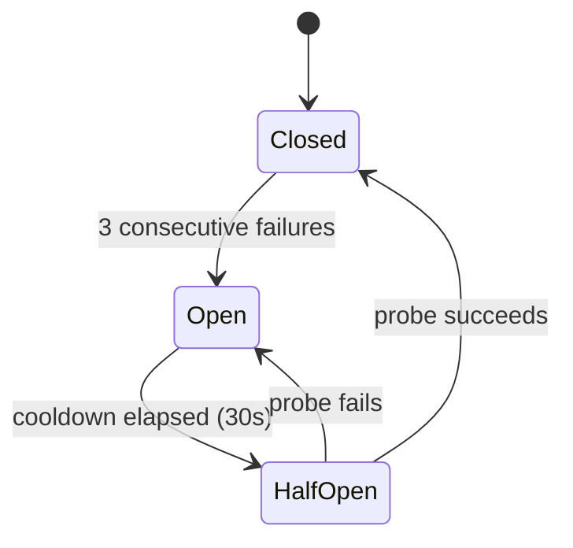

# Adapter Pattern

Simard uses an **adapter/client abstraction** — typed `ServerTransport`
implementations that speak a JSON-line protocol — to isolate client code from
transport details. Peer services are reached through thin **`*Client`** types
(`KnowledgeClient`, `GymClient`); the Brain's cognitive memory is reached
through the in-process **`CognitiveMemoryAdapter`**.

!!! note "Naming"
    Nothing in Simard's transport substrate is named "Bridge": memory is a
    `CognitiveMemoryAdapter`, peer services are `*Client`, and the JSON-line
    transport is a `ServerTransport`. On-wire values (method names, error codes)
    are **frozen** — see the
    [frozen-value allow-list](../reference/brain-terminology-migration.md#frozen-value-allow-list).
    For the historical old→new map see
    [Terminology migration](../reference/brain-terminology-migration.md).

## Transport Types

| Transport | Use Case | Notes |
|-----------|----------|-------|
| **NativeServerTransport** | Production (knowledge, gym) | In-process Rust handlers, zero overhead |
| **SubprocessServerTransport** | Testing infrastructure | Spawns a Python subprocess; used only in integration tests |
| **InMemoryServerTransport** | Unit testing | In-memory mock; no I/O |

> **History**: Prior to #2181, knowledge and gym clients used Python subprocess
> transports with a native Rust fallback. The native Rust transports are now the
> only production path. Cognitive memory is provided by the library-backed
> `LibraryCognitiveMemory` (over `amplihack-memory-lib`) as the sole on-disk
> backend after the de-fork (Phase 2b) — see
> [Cognitive Memory Architecture](cognitive-memory.md) and
> [Library-backed Cognitive Memory](cognitive-memory-library-adapter.md).

## Wire Protocol

Each server speaks newline-delimited JSON. One request per line on stdin, one
response per line on stdout. **The wire format is frozen** — the terminology
cleanup did not touch a single byte of the protocol.

### Request Format

```json
{"id": "01970b2f-...", "method": "memory.store_fact", "params": {"concept": "cargo test", "content": "runs all workspace tests", "confidence": 0.9}}
```

| Field | Type | Required | Description |
|-------|------|----------|-------------|
| `id` | string | yes | UUIDv7 for request-response matching |
| `method` | string | yes | Dotted method name (e.g., `memory.store_fact`) |
| `params` | object | yes | Method-specific parameters |

### Response Format (success)

```json
{"id": "01970b2f-...", "result": {"fact_id": "sem_01abc..."}}
```

### Response Format (error)

```json
{"id": "01970b2f-...", "error": {"code": -32601, "message": "method 'nonexistent' is not registered"}}
```

| Error Code | Meaning |
|-----------|---------|
| `-32601` | Method not found |
| `-32603` | Internal server error |
| `-32000` | Timeout |
| `-32001` | Transport error |

These numeric codes are frozen. In Rust they are referenced through
`SERVER_ERROR_*` consts; the **values are unchanged**.

## Rust-Side Architecture

### ServerTransport Trait

```rust
pub trait ServerTransport: Send + Sync {
    fn call(&self, request: ServerRequest) -> SimardResult<ServerResponse>;
    fn descriptor(&self) -> BackendDescriptor;
    fn health(&self) -> SimardResult<ServerHealth>;  // default implementation
}
```

### Implementations

| Type | Purpose |
|------|---------|
| `SubprocessServerTransport` | Spawns Python, manages stdin/stdout, kills on drop |
| `InMemoryServerTransport` | Handler function for unit tests, no Python needed |
| `CircuitBreakerTransport<T>` | Wraps any transport with fault tolerance |

### Circuit Breaker



- **Closed**: Normal operation, calls pass through
- **Open**: Calls rejected immediately with `ServerCircuitOpen`
- **Half-Open**: One probe call allowed; success closes, failure reopens

Only transport-level errors (code `-32001`) trip the circuit. Application errors
(method not found, internal) do not.

### The `HEALTH_METHOD` constant (frozen wire value)

Every server registers a built-in health method. Its on-wire name is the frozen
literal **`"bridge.health"`**, referenced in Rust through a single documented
const so the wire spelling lives in exactly one allow-listed place:

```rust
/// Frozen JSON-RPC method literal for the built-in server health check.
/// The *value* is a wire contract and must not change; this const is the
/// canonical identifier callers use.
pub const HEALTH_METHOD: &str = "bridge.health";
```

The method returns `{"server_name": "...", "healthy": true}`.

## Python-Side Architecture

### Server Base Class

```python
class ServerBase:
    def __init__(self, server_name: str) -> None
    def register(self, method: str, handler: Callable) -> None
    def run(self) -> None  # stdin/stdout loop
```

Each server extends `ServerBase` and registers method handlers:

```python
class SimardMemoryServer(ServerBase):
    def __init__(self, agent_name, db_path):
        super().__init__("simard-memory")
        self.adapter = CognitiveAdapter(agent_name, db_path)
        self.register("memory.store_fact", self.handle_store_fact)
        # ... register all memory methods

    def handle_store_fact(self, params):
        fact_id = self.adapter.store_fact(
            context=params["concept"],
            fact=params["content"],
            confidence=params.get("confidence", 0.9),
        )
        return {"fact_id": fact_id}
```

The built-in `HEALTH_METHOD` (`"bridge.health"`) is always registered and
returns `{"server_name": "...", "healthy": true}`.

## Error Handling

### Simard-Side Errors

The `SimardError` server-transport variants (`Server*`) surface spawn,
transport, protocol, call, and circuit-open failures. The mapping is
behavior-preserving.

| Error Type | When | Recovery |
|-----------|------|----------|
| `ServerSpawnFailed` | Python binary not found | Check PATH, install python3 |
| `ServerTransportError` | Stdin/stdout broken, process exited | Circuit breaker opens, auto-respawn on next call |
| `ServerProtocolError` | Malformed JSON, type mismatch | Log and surface to operator |
| `ServerCallFailed` | Method returned error payload | Surface to caller with method context |
| `ServerCircuitOpen` | Too many recent failures | Wait for cooldown, check server health |

### Data Loss Prevention

Cognitive-memory writes no longer flow through a `ServerTransport`. Since the
de-fork (Phase 2b, issue #2307) they go directly through the in-process
[`CognitiveMemoryAdapter`](cognitive-memory-library-adapter.md) over
`amplihack-memory-lib`:

- Writes are idempotent — each fact, episode, or procedure is keyed by its
  LadybugDB `node_id`, so a replayed write reinforces the existing node rather
  than duplicating it (the *upsert-that-reinforces* contract; see
  [Procedural Idempotency](../reference/cognitive-memory-procedural-idempotency.md)).
- Concurrent writers are serialized through a single-writer IPC guard
  (`memory_ipc::launcher::launch_writer`), so parallel Simard processes cannot
  interleave writes to the same store.
- Durability and recovery are provided by verified backups in the
  `memory_backup` module (`backup_memory_verified`, `verify_backup`,
  `restore_from_backup`) rather than by transport-level transaction replay —
  see [Verified Backups](../operations/verified-backups.md) and
  [Cognitive-Memory Durability](../operations/cognitive-memory-durability.md).

## Testing

### Unit Tests (no Python needed)

```rust
let transport = InMemoryServerTransport::echo("test");
let response = transport.call(health_request()).unwrap();
assert!(response.result.is_some());
```

### Integration Tests (subprocess transport)

```rust
let transport = SubprocessServerTransport::new(
    "echo-test",
    "tests/fixtures/echo_server.py",
    vec![],
    Duration::from_secs(5),
);
let health = transport.health().expect("server should be healthy");
assert_eq!(health.server_name, "echo");
```

### Feral Tests

- Kill server mid-request → `ServerTransportError`
- Send malformed JSON → `ServerProtocolError`
- Server script doesn't exist → `ServerSpawnFailed` or `ServerTransportError`
- Server exits immediately → EOF detection
- 3 consecutive transport failures → circuit opens

## Related

- [The Brain](./brain-model.md) — the cognition this substrate serves; memory
  is reached via `CognitiveMemoryAdapter`, peers via `*Client`.
- [Terminology migration](../reference/brain-terminology-migration.md) — the
  exhaustive old→new map and frozen-value allow-list.
- [Cognitive Memory](./cognitive-memory.md) — the Brain's memory model.
