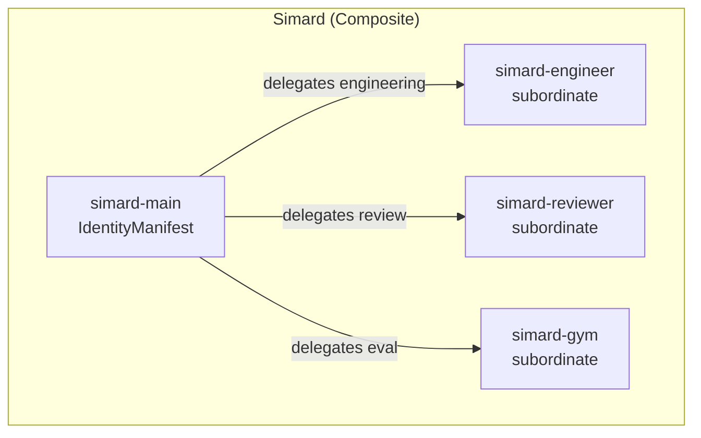
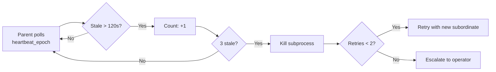
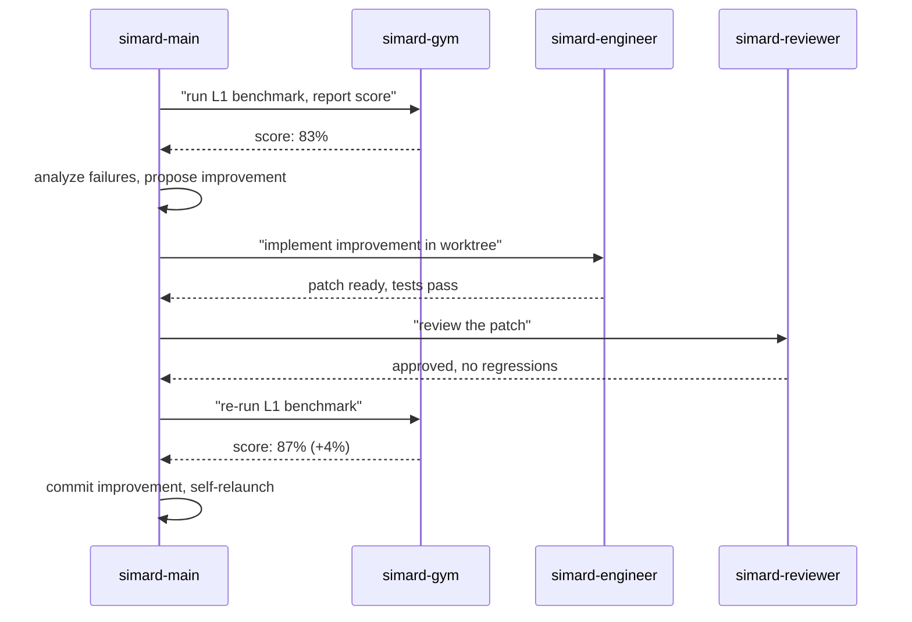
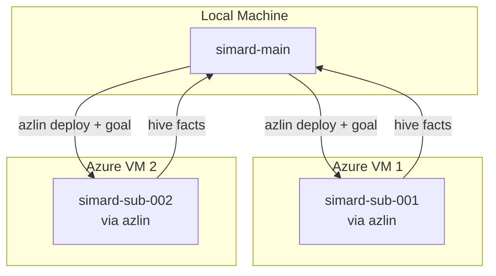

# Agent Composition

Simard is not a single monolithic agent. She is a **composite identity** that can spawn subordinate agents, delegate goals, and coordinate work through shared memory.

## Design Principles

1. **Identity and runtime are different things** — what an agent is (identity) vs. how it runs (topology)
2. **Composition outlives topology** — the same composite identity works local or distributed
3. **Communication through memory** — agents share knowledge via the hive, not raw IPC
4. **Explicit supervision** — parent monitors subordinates with heartbeats and crash recovery

## Identity Composition

An `IdentityManifest` defines a single agent's capabilities. A `CompositeIdentity` nests multiple manifests with role delegation:



Each subordinate receives:
- Its own `agent_name` for memory isolation
- A specific `OperatingMode` (Engineer, Meeting, Gym)
- A bounded goal
- A dedicated git worktree (no shared working directories)

## Supervisor Protocol

### Goal Assignment

Parent assigns goals through semantic memory in the shared hive:

```json
{
  "concept": "subordinate_goal:simard-sub-001",
  "content": "fix the null check in auth.rs and verify with tests",
  "confidence": 1.0
}
```

Subordinate reads its goal on startup via `search_facts("subordinate_goal:{my_id}")`.

### Progress Reporting

Subordinates report progress as semantic facts:

```json
{
  "concept": "subordinate_progress:simard-sub-001",
  "content": {
    "sub_id": "simard-sub-001",
    "phase": "execution",
    "steps_completed": 3,
    "steps_total": 7,
    "last_action": "edited src/auth.rs",
    "heartbeat_epoch": 1743400000,
    "outcome": null
  },
  "confidence": 1.0
}
```

### Liveness Detection



- Parent checks `heartbeat_epoch` every 30 seconds
- 3 consecutive stale heartbeats (>120s each) → kill and mark `abandoned`
- At most 2 retries per goal, then escalate
- Subordinate's partial work persists in its memory for forensic inspection

### Crash Recovery

When a subordinate crashes:

1. Parent detects via `waitpid` / SIGCHLD
2. Marks goal as `crashed` with exit code
3. Inspects subordinate's episodic memory to understand what happened
4. Decides: retry, reassign, or escalate

### Recursion Limit

- `SIMARD_MAX_SUBORDINATE_DEPTH=3`
- Each subordinate inherits `depth + 1`
- At depth limit, subordinate cannot spawn further subordinates

## File Isolation

Each subordinate works in its own git worktree:

```
/home/azureuser/src/Simard/
├── worktrees/
│   ├── simard-sub-001/    ← subordinate 1's workspace
│   ├── simard-sub-002/    ← subordinate 2's workspace
│   └── ...
```

No two subordinates share a worktree. This prevents merge conflicts and allows concurrent file editing.

## The Self-Building Loop

When Simard reaches Phase 6, composition enables the self-improvement cycle:



## Future: Distributed Composition

The same composition model works across machines via azlin VMs:



Communication still happens through the hive mind — the parent just deploys the subordinate binary to a remote VM instead of a local process. Memory replication ensures the subordinate can access relevant context.
