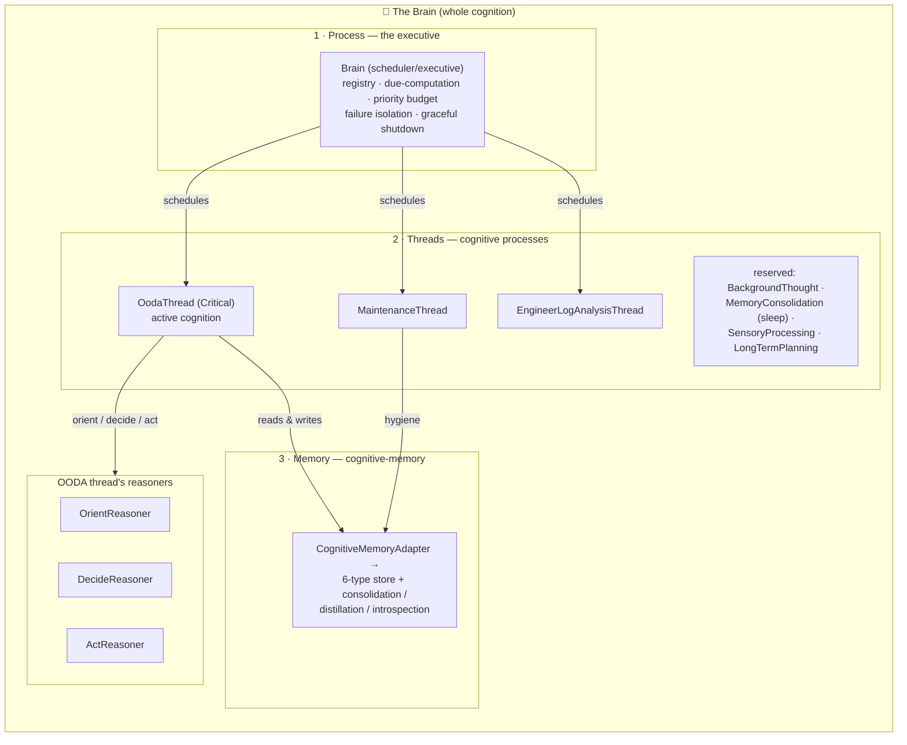

# The Brain — Simard's unified cognition model

Simard has exactly **one** cognition, and its name is **the Brain**. Everything
Simard thinks with is a part of the Brain. This page is the canonical definition
of that model and of the terminology law that keeps the codebase and docs
coherent. If a name anywhere in Simard implies a *different* cognitive whole —
"the mind", "the bridge", a per-phase "brain" — it is wrong and is being
retired. See [Terminology migration](../reference/brain-terminology-migration.md)
for the exhaustive old→new map.

## The one-sentence model

> **The Brain** is the whole cognitive system. It is made of three parts:
> a **process** (the cognitive-thread scheduler/executive), its **threads**
> (the schedulable cognitive processes), and **memory** (the cognitive-memory
> store). Inside the OODA thread, the per-phase LLM components are **reasoners**.



## The three parts of the Brain

### 1 · Process — the scheduler/executive (`Brain`)

The executive is the type **`Brain`** (`src/cognitive_threads/`). It is a
synchronous scheduler that owns a registry of cognitive threads, computes which
are due on each daemon tick, and runs them under a priority budget that
**never starves OODA**. Failure isolation (panic-catching, capped exponential
backoff), telemetry, and graceful shutdown all live here.

The `Brain` *is* the whole cognition in code as well as concept: it owns the
thread scheduler, the reasoners used by the OODA thread, and the
cognitive-memory handle. This is a pure, behavior-preserving cleanup — the
scheduler's budget, backoff, and ordering are unchanged.

See [Brain executive API](../reference/brain-executive-api.md) for the full
surface (`Brain::new`, `register`, `due_threads`, `run_due`, `health`).

### 2 · Threads — the schedulable cognitive processes

A **cognitive thread** is a single scheduled mental process owned by the Brain.
The `CognitiveThread` trait and the `ThreadKind` enum are **kept** — they are
the Brain's threads/processes, and the model frames them exactly that way.

| Thread (`ThreadKind`) | Status | Role in the Brain |
| --- | --- | --- |
| `Ooda` | implemented (primary) | Active cognition — the OODA loop. `Priority::Critical`; runs first, every tick, budget-exempt, never backed off. |
| `Maintenance` | implemented (exemplar) | Background housekeeping. |
| `EngineerLogAnalysis` | implemented (exemplar) | Mines engineer logs for recurring patterns. |
| `BackgroundThought` | reserved | Future background cognition. |
| `MemoryConsolidation` | reserved | Future "sleep/dream" episodic→semantic consolidation. |
| `SensoryProcessing` | reserved | Future sensory-input processing. |
| `LongTermPlanning` | reserved | Future long-horizon planning. |

Threads are *processes of the one Brain*, not independent minds. See
[Cognitive-thread scheduling](../reference/cognitive-thread-scheduling.md).

### 3 · Memory — the cognitive-memory store

The Brain's memory is the cognitive-memory model: a 6-type store with
consolidation, distillation, and introspection. The Brain reaches it through
the **`CognitiveMemoryAdapter`** — an
in-process handle over `amplihack-memory-lib`. Memory access is an
*adapter/client* concern, never a "bridge"; see
[Adapter pattern](./adapter-pattern.md) and
[Cognitive memory](./cognitive-memory.md).

## Inside the OODA thread: the reasoners

The OODA thread performs active cognition. Each phase that consults an LLM is a
**reasoner** — never a "brain":

| Phase | Reasoner trait | Production impl | Deterministic floor |
| --- | --- | --- | --- |
| Orient | `OrientReasoner` | `RustyClawdOrientReasoner` / `RecipeReasoner` | `DeterministicFallbackOrientReasoner` |
| Decide | `DecideReasoner` | `RecipeReasoner` | `DeterministicFallbackDecideReasoner` |
| Act (engineer-lifecycle) | `ActReasoner` | `RustyClawdActReasoner` / `RecipeReasoner` | `DeterministicFallbackActReasoner` |

The three reasoners stay **separate** — this is a rename, not a merge. They are
bundled with the memory adapter and peer clients in the OODA thread's context,
**`OodaContext`**, whose reasoner fields are
`orient_reasoner`, `decide_reasoner`, and `act_reasoner`. Builders are
`build_orient_reasoner` / `build_decide_reasoner` / `build_act_reasoner`.

Full API: [OODA reasoners API](../reference/ooda-brain-api.md).

### Health output

When every reasoner is LLM-backed the daemon logs:

```
[simard] OODA daemon: brain online — orient/decide/act reasoners LLM-backed (no fallback)
```

Per-reasoner lines name the reasoner and its implementation, e.g.:

```
[simard] OODA daemon: decide_reasoner = RustyClawdDecideReasoner (prompt-driven)
```

When a reasoner cannot resolve an LLM provider it falls back to its
deterministic floor and the daemon logs the degraded line naming the phase and
reason (LOUD failure — the fallback is never silent).

## The terminology law

These rules are enforced by an anti-drift CI gate
([migration reference](../reference/brain-terminology-migration.md#anti-drift-ci-gate)):

1. **"Brain" = the whole cognition** — the process (scheduler) + threads +
   memory, together. Use it for the executive type and the top-level facade
   only, never for a sub-part.
2. **A single OODA phase is a "reasoner"**, never a "brain". Orient, decide, and
   act are `OrientReasoner`, `DecideReasoner`, `ActReasoner`.
3. **Nothing is ever named "Bridge"** — no type, module, field, file, or doc.
   Memory access is a `CognitiveMemoryAdapter`; peer services are `*Client`;
   the JSON-line transport substrate is `ServerTransport`. See
   [Adapter pattern](./adapter-pattern.md).
4. **Threads are cognitive processes of the one Brain** — `CognitiveThread` and
   `ThreadKind` are kept and described that way.

### Frozen wire values (the only allowed residue)

Behavior preservation outranks tidiness. A small, explicitly allow-listed set of
**wire values** keeps its literal spelling so no external contract breaks — the
*identifier* is renamed, the *value* is frozen:

| Frozen value | Kept as | Why |
| --- | --- | --- |
| `bridge.health` method name | `HEALTH_METHOD` const | On-wire JSON-RPC method literal; renaming would break the protocol. |
| `BRIDGE_ERROR_*` codes | `SERVER_ERROR_*` consts (values unchanged) | Numeric error codes are a contract. |
| serde keys (e.g. `brain_judgments`) | `#[serde(rename = "…")]` | Persisted JSON keys must round-trip. |
| `SIMARD_MIND_MAX_NONCRITICAL_PER_TICK` env var | read via a `BRAIN_*` const | Operator-set env literal is a contract. |

These are the *only* places a retired spelling survives, and each is
allow-listed by the CI gate. Everything else is renamed. See the
[frozen-value allow-list](../reference/brain-terminology-migration.md#frozen-value-allow-list).

## Configuration

The Brain and its threads are configured entirely by environment variables. No
behavior changes with this cleanup — only identifiers do; env var *literals* are
frozen.

| Knob | Env var | Default | Governs |
| --- | --- | ---: | --- |
| Cognitive threads on/off | `SIMARD_COGNITIVE_THREADS_ENABLED` | off | Whether the live daemon hosts the Brain's background threads. |
| Non-critical fan-out budget | `SIMARD_MIND_MAX_NONCRITICAL_PER_TICK` *(frozen literal)* | `2` | Max non-OODA threads run per tick. OODA is exempt. |
| OODA cadence | `SIMARD_OODA_INTERVAL_SECS` | (env) | OODA thread interval. |
| Brain introspection cadence | `SIMARD_BRAIN_INTROSPECTION_INTERVAL_SECS` | `86400` | Self-examination + memory-hygiene pass. |

See [Configure cognitive-thread scheduling](../howto/configure-cognitive-thread-scheduling.md)
and [Brain introspection](./brain-introspection.md).

## Worked example: reading the Brain's shape in code

```rust
use simard::cognitive_threads::{Brain, OodaThread, MaintenanceThread};

// The Brain is the whole cognition: one scheduler owning many threads.
let mut brain = Brain::new();
brain
    .register(Box::new(MaintenanceThread::new(/* … */)))
    .register(Box::new(EngineerLogAnalysisThread::new(/* … */)));

// One tick: OODA (Critical) runs first & unconditionally, then non-critical
// threads up to the per-tick budget. Nothing here changed behaviourally.
let outcomes = brain.run_due(&mut ctx);
```

Within the OODA thread, the phase reasoners are consulted through `OodaContext`:

```rust
// OodaContext bundles memory + peer clients + reasoners for the OODA loop.
let ctx = OodaContext {
    memory,                       // Box<dyn CognitiveMemoryOps> via CognitiveMemoryAdapter
    knowledge,                    // KnowledgeClient
    gym,                          // GymClient
    orient_reasoner,              // Option<Arc<dyn OrientReasoner>>
    decide_reasoner,              // Option<Arc<dyn DecideReasoner>>
    act_reasoner,                 // Arc<dyn ActReasoner>
    // …
};
```

## Related

- [Simard system architecture](./system-architecture.md) — where the Brain sits in the daemon.
- [Adapter pattern](./adapter-pattern.md) — the transport/adapter/client substrate.
- [Cognitive memory](./cognitive-memory.md) — the Brain's memory model.
- [Brain executive API](../reference/brain-executive-api.md) — the `Brain` scheduler surface.
- [OODA reasoners API](../reference/ooda-brain-api.md) — orient/decide/act reasoners.
- [Cognitive-thread scheduling](../reference/cognitive-thread-scheduling.md) — the Brain's threads.
- [Terminology migration](../reference/brain-terminology-migration.md) — the exhaustive old→new map.
- [Brain introspection + memory hygiene](./brain-introspection.md) — the periodic self-examination pass.
