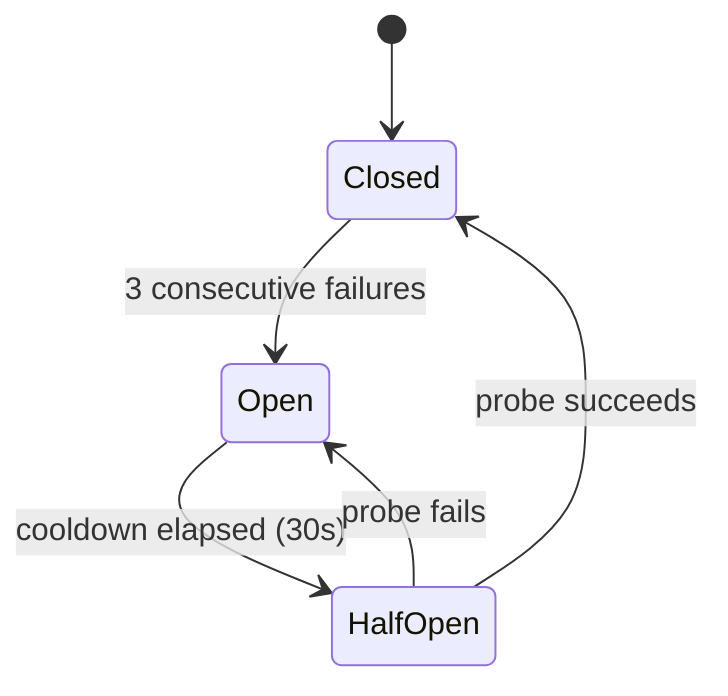

# Bridge Pattern

Simard uses a **bridge abstraction** — typed `BridgeTransport` implementations that speak a JSON-line protocol — to isolate bridge-client code from transport details.

## Transport Types

| Transport | Use Case | Notes |
|-----------|----------|-------|
| **NativeBridgeTransport** | Production (knowledge, gym) | In-process Rust handlers, zero overhead |
| **InMemoryBridgeTransport** | Unit & integration testing | In-memory handler; no I/O, no Python |

> **History**: Prior to #2181, knowledge and gym bridges used Python subprocess transports with a native Rust fallback. The native Rust transports became the only production path in #2181, and the `SubprocessBridgeTransport` (a test-only Python subprocess transport) was removed entirely in #3181 — Simard is now a pure-Rust, Python-free daemon. Cognitive memory is provided by the library-backed `LibraryCognitiveMemory` (over `amplihack-memory-lib`) as the sole on-disk backend after the de-fork (Phase 2b) — see [Cognitive Memory Architecture](cognitive-memory.md) and [Library-backed Cognitive Memory](cognitive-memory-library-adapter.md).

## Wire Protocol

Each bridge speaks newline-delimited JSON. One request per line on stdin, one response per line on stdout.

### Request Format

```json
{"id": "01970b2f-...", "method": "memory.store_fact", "params": {"concept": "cargo test", "content": "runs all workspace tests", "confidence": 0.9}}
```

| Field | Type | Required | Description |
|-------|------|----------|-------------|
| `id` | string | yes | UUIDv7 for request-response matching |
| `method` | string | yes | Dotted method name (e.g., `memory.store_fact`) |
| `params` | object | yes | Method-specific parameters |

### Response Format (success)

```json
{"id": "01970b2f-...", "result": {"fact_id": "sem_01abc..."}}
```

### Response Format (error)

```json
{"id": "01970b2f-...", "error": {"code": -32601, "message": "method 'nonexistent' is not registered"}}
```

| Error Code | Meaning |
|-----------|---------|
| `-32601` | Method not found |
| `-32603` | Internal server error |
| `-32000` | Timeout |
| `-32001` | Transport error |

## Rust-Side Architecture

### BridgeTransport Trait

```rust
pub trait BridgeTransport: Send + Sync {
    fn call(&self, request: BridgeRequest) -> SimardResult<BridgeResponse>;
    fn descriptor(&self) -> BackendDescriptor;
    fn health(&self) -> SimardResult<BridgeHealth>;  // default implementation
}
```

### Implementations

| Type | Purpose |
|------|---------|
| `NativeBridgeTransport` | In-process Rust handlers (production knowledge/gym bridges) |
| `InMemoryBridgeTransport` | Handler function for unit/integration tests, no Python needed |
| `CircuitBreakerTransport<T>` | Wraps any transport with fault tolerance |

### Circuit Breaker


```mermaid
stateDiagram-v2
    [*] --> Closed
    Closed --> Open: 3 consecutive failures
    Open --> HalfOpen: cooldown elapsed (30s)
    HalfOpen --> Closed: probe succeeds
    HalfOpen --> Open: probe fails
```

- **Closed**: Normal operation, calls pass through
- **Open**: Calls rejected immediately with `BridgeCircuitOpen`
- **Half-Open**: One probe call allowed; success closes, failure reopens

Only transport-level errors (code `-32001`) trip the circuit. Application errors (method not found, internal) do not.

## Rust-Side Handlers

Bridges are pure Rust and **in-process** — there is no separate server process
and no Python (the former `SubprocessBridgeTransport` was removed in #3181).
`NativeBridgeTransport::new(name)` always registers the built-in `bridge.health`
method; callers register one handler closure per additional method:

```rust
let mut transport = NativeBridgeTransport::new("simard-knowledge");
transport.register(
    "knowledge.list_packs",
    Arc::new(|_params| Ok(serde_json::json!({ "packs": [] }))),
);
```

Production bridges register their method sets via helpers such as
`native_knowledge::register_knowledge_handlers(&mut transport, packs_dir)`.
Tests use `InMemoryBridgeTransport::new(name, handler)` with the same closure
shape. The built-in `bridge.health` method always returns
`{"server_name": "...", "healthy": true}`.

## Error Handling

### Simard-Side Errors

| Error Type | When | Recovery |
|-----------|------|----------|
| `BridgeSpawnFailed` | A child simard/bridge process could not be spawned | Check the binary path and permissions |
| `BridgeTransportError` | Stdin/stdout broken, process exited | Circuit breaker opens, auto-respawn on next call |
| `BridgeProtocolError` | Malformed JSON, type mismatch | Log and surface to operator |
| `BridgeCallFailed` | Method returned error payload | Surface to caller with method context |
| `BridgeCircuitOpen` | Too many recent failures | Wait for cooldown, check bridge health |

### Data Loss Prevention

Cognitive-memory writes no longer flow through a `BridgeTransport`. Since the
de-fork (Phase 2b, issue #2307) they go directly through the in-process
[`LibraryCognitiveMemory`](cognitive-memory-library-adapter.md) adapter over
`amplihack-memory-lib`:

- Writes are idempotent — each fact, episode, or procedure is keyed by its
  LadybugDB `node_id`, so a replayed write reinforces the existing node rather
  than duplicating it (the *upsert-that-reinforces* contract; see
  [Procedural Idempotency](../reference/cognitive-memory-procedural-idempotency.md)).
- Concurrent writers are serialized through a single-writer IPC guard
  (`memory_ipc::launcher::launch_writer_bridge`), so parallel Simard processes
  cannot interleave writes to the same store.
- Durability and recovery are provided by verified backups in the
  `memory_backup` module (`backup_memory_verified`, `verify_backup`,
  `restore_from_backup`) rather than by transport-level transaction replay —
  see [Verified Backups](../operations/verified-backups.md) and
  [Cognitive-Memory Durability](../operations/cognitive-memory-durability.md).

## Testing

### Unit Tests (no Python needed)

```rust
let transport = InMemoryBridgeTransport::echo("test");
let response = transport.call(health_request()).unwrap();
assert!(response.result.is_some());
```

### Integration Tests (native circuit breaker)

```rust
let inner = InMemoryBridgeTransport::new("echo", |method, params| {
    if method == "bridge.health" {
        Ok(serde_json::json!({ "server_name": "echo", "healthy": true }))
    } else {
        Ok(params.clone())
    }
});
let cb = CircuitBreakerTransport::with_defaults(inner);
let health = cb.health().expect("bridge should be healthy");
assert_eq!(health.server_name, "echo");
```

### Feral Tests

- Kill bridge mid-request → `BridgeTransportError`
- Send malformed JSON → `BridgeProtocolError`
- Bridge script doesn't exist → `BridgeSpawnFailed` or `BridgeTransportError`
- Bridge exits immediately → EOF detection
- 3 consecutive transport failures → circuit opens
