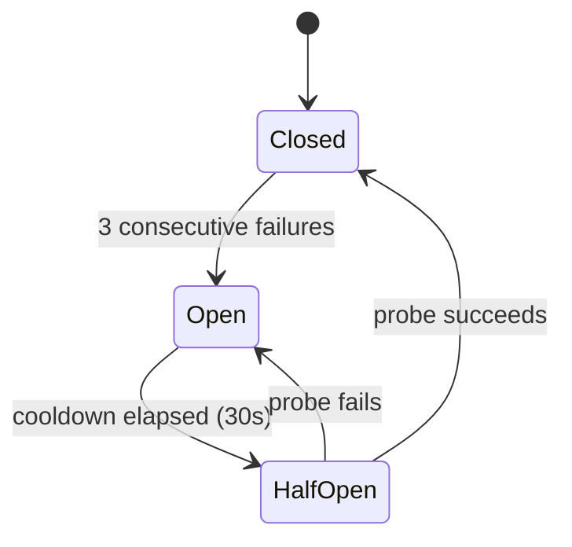

# Bridge Pattern

Simard uses a **bridge abstraction** for typed RPC to knowledge packs and gym evaluations. The bridges were originally implemented as Python subprocess processes speaking a JSON-line protocol on stdin/stdout, but have been fully replaced by native Rust transports (`NativeBridgeTransport`). The `SubprocessBridgeTransport` still exists as a generic mechanism for any future subprocess needs, but all production bridges now run in-process.

## Why Bridges?

| Approach | Pros | Cons |
|----------|------|------|
| **PyO3 FFI** | Zero-copy, native speed | Tight coupling, GIL contention, complex build |
| **HTTP/gRPC** | Standard, debuggable | Server lifecycle, port management, overhead |
| **Native in-process** | Zero serialization, no process lifecycle | All code must be Rust |

Native in-process bridges are the current implementation. All knowledge and gym operations run directly in the Simard process via `NativeBridgeTransport`.

> **History**: The memory bridge was replaced by `NativeCognitiveMemory` (issue #512). Knowledge and gym bridges were replaced by `NativeBridgeTransport` (PR #2172, issue #2181). See [Cognitive Memory Architecture](cognitive-memory.md).

## Wire Protocol

Each bridge speaks newline-delimited JSON. One request per line on stdin, one response per line on stdout.

### Request Format

```json
{"id": "01970b2f-...", "method": "memory.store_fact", "params": {"concept": "cargo test", "content": "runs all workspace tests", "confidence": 0.9}}
```

| Field | Type | Required | Description |
|-------|------|----------|-------------|
| `id` | string | yes | UUIDv7 for request-response matching |
| `method` | string | yes | Dotted method name (e.g., `memory.store_fact`) |
| `params` | object | yes | Method-specific parameters |

### Response Format (success)

```json
{"id": "01970b2f-...", "result": {"fact_id": "sem_01abc..."}}
```

### Response Format (error)

```json
{"id": "01970b2f-...", "error": {"code": -32601, "message": "method 'nonexistent' is not registered"}}
```

| Error Code | Meaning |
|-----------|---------|
| `-32601` | Method not found |
| `-32603` | Internal server error |
| `-32000` | Timeout |
| `-32001` | Transport error |

## Rust-Side Architecture

### BridgeTransport Trait

```rust
pub trait BridgeTransport: Send + Sync {
    fn call(&self, request: BridgeRequest) -> SimardResult<BridgeResponse>;
    fn descriptor(&self) -> BackendDescriptor;
    fn health(&self) -> SimardResult<BridgeHealth>;  // default implementation
}
```

### Implementations

| Type | Purpose |
|------|---------|
| `SubprocessBridgeTransport` | Spawns Python, manages stdin/stdout, kills on drop |
| `InMemoryBridgeTransport` | Handler function for unit tests, no Python needed |
| `CircuitBreakerTransport<T>` | Wraps any transport with fault tolerance |

### Circuit Breaker


```mermaid
stateDiagram-v2
    [*] --> Closed
    Closed --> Open: 3 consecutive failures
    Open --> HalfOpen: cooldown elapsed (30s)
    HalfOpen --> Closed: probe succeeds
    HalfOpen --> Open: probe fails
```

- **Closed**: Normal operation, calls pass through
- **Open**: Calls rejected immediately with `BridgeCircuitOpen`
- **Half-Open**: One probe call allowed; success closes, failure reopens

Only transport-level errors (code `-32001`) trip the circuit. Application errors (method not found, internal) do not.

## Python-Side Architecture

### BridgeServer Base Class

```python
class BridgeServer:
    def __init__(self, server_name: str) -> None
    def register(self, method: str, handler: Callable) -> None
    def run(self) -> None  # stdin/stdout loop
```

Each bridge server extends `BridgeServer` and registers method handlers:

```python
class SimardMemoryBridge(BridgeServer):
    def __init__(self, agent_name, db_path):
        super().__init__("simard-memory")
        self.adapter = CognitiveAdapter(agent_name, db_path)
        self.register("memory.store_fact", self.handle_store_fact)
        # ... register all memory methods

    def handle_store_fact(self, params):
        fact_id = self.adapter.store_fact(
            context=params["concept"],
            fact=params["content"],
            confidence=params.get("confidence", 0.9),
        )
        return {"fact_id": fact_id}
```

The built-in `bridge.health` method is always registered and returns `{"server_name": "...", "healthy": true}`.

## Error Handling

### Simard-Side Errors

| Error Type | When | Recovery |
|-----------|------|----------|
| `BridgeSpawnFailed` | Python binary not found | Check PATH, install python3 |
| `BridgeTransportError` | Stdin/stdout broken, process exited | Circuit breaker opens, auto-respawn on next call |
| `BridgeProtocolError` | Malformed JSON, type mismatch | Log and surface to operator |
| `BridgeCallFailed` | Method returned error payload | Surface to caller with method context |
| `BridgeCircuitOpen` | Too many recent failures | Wait for cooldown, check bridge health |

### Data Loss Prevention

- Memory writes are idempotent (LadybugDB `node_id` is primary key)
- Native memory wraps each write in a LadybugDB transaction
- On failure, the transaction rolls back
- Simard re-issues the last failed write on retry

## Testing

### Unit Tests (no subprocess needed)

```rust
let transport = InMemoryBridgeTransport::echo("test");
let response = transport.call(health_request()).unwrap();
assert!(response.result.is_some());
```

### Integration Tests (SubprocessBridgeTransport)

```rust
// Uses tests/fixtures/echo_bridge.py as a test fixture
let transport = SubprocessBridgeTransport::new(
    "echo-test",
    "tests/fixtures/echo_bridge.py",
    vec![],
    Duration::from_secs(5),
);
let health = transport.health().expect("bridge should be healthy");
assert_eq!(health.server_name, "echo");
```

### Feral Tests

- Kill bridge mid-request → `BridgeTransportError`
- Send malformed JSON → `BridgeProtocolError`
- Bridge script doesn't exist → `BridgeSpawnFailed` or `BridgeTransportError`
- Bridge exits immediately → EOF detection
- 3 consecutive transport failures → circuit opens
