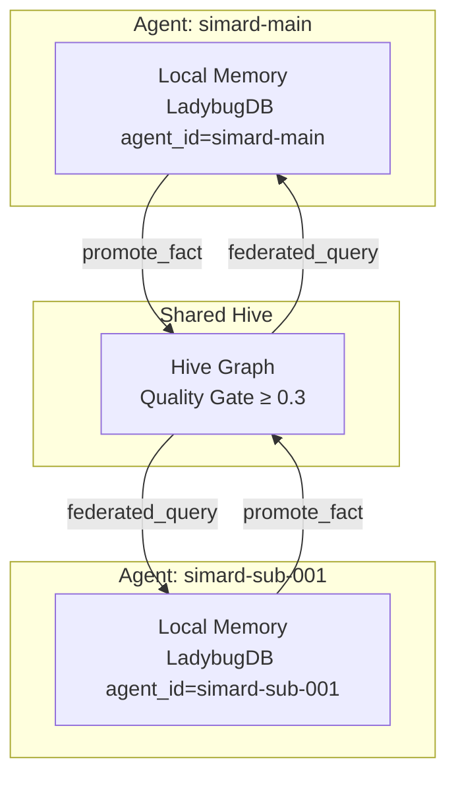

# Cognitive Memory Architecture

Simard's memory is not a flat key-value store. It uses six distinct memory types modeled after cognitive psychology, provided by `amplihack-memory-lib` and accessed through the [bridge pattern](bridge-pattern.md).

## The Six Memory Types

### Sensory Memory

Raw, short-lived observations that auto-expire.

- **Duration**: Configurable TTL (default 300 seconds)
- **Use**: Buffer incoming PTY output, objective text, error messages
- **Modalities**: `objective`, `pty_output`, `error`, `log`
- **Promotion**: Important observations can be "attended to" and promoted to episodic memory

```
Session starts → record_sensory("objective", "fix the bug in auth.rs", ttl=600)
PTY output    → record_sensory("pty_output", "cargo test ... 3 failed", ttl=300)
```

### Working Memory

Bounded active task context with a 20-slot capacity limit.

- **Duration**: Task-scoped (cleared when task completes)
- **Slot types**: `goal`, `constraint`, `context`, `plan`
- **Eviction**: When full, lowest-relevance slots are pushed out
- **Use**: Hold the current task goal, plan steps, and execution state

```
Intake     → push_working("goal", "fix the bug in auth.rs", task_id, relevance=1.0)
Planning   → push_working("plan", "1. read auth.rs 2. find the null check", task_id)
Execution  → push_working("context", "auth.rs:42 has the bad unwrap", task_id)
Complete   → clear_working(task_id)
```

### Episodic Memory

Autobiographical events — what happened during each session.

- **Duration**: Long-term (persists across restarts)
- **Content**: Session transcripts, action logs, outcomes
- **Temporal ordering**: Monotonically increasing index
- **Consolidation**: Old episodes can be summarized into `ConsolidatedEpisode` nodes

```
Reflection → store_episode("Session: fixed auth.rs null check, tests pass", "session")
Periodic   → consolidate_episodes(batch_size=10)  # summarizes oldest 10 episodes
```

### Semantic Memory

Extracted facts and knowledge with confidence scores.

- **Duration**: Long-term
- **Content**: Distilled facts about the codebase, tools, patterns
- **Confidence**: 0.0-1.0, decays over time (1% per hour)
- **Edges**: `SIMILAR_TO` edges link related facts (Jaccard similarity ≥ 0.3)
- **Search**: Keyword-based with n-gram reranking

```
Reflection → store_fact("auth.rs", "uses unwrap() on line 42 which can panic", 0.9, source_id=episode_id)
Retrieval  → search_facts("auth error handling", limit=10)
```

### Procedural Memory

Reusable step-by-step action sequences.

- **Duration**: Long-term, strengthens with use
- **Content**: Named procedures with ordered steps and prerequisites
- **Usage tracking**: `usage_count` increments on each recall
- **Use**: Encode successful patterns for reuse

```
After success → store_procedure("fix-and-verify", ["read file", "edit", "cargo test", "commit"])
Before task   → recall_procedure("how to fix a bug", limit=5)
```

### Prospective Memory

Future-oriented trigger-action pairs.

- **Duration**: Until triggered or resolved
- **Content**: Description, trigger condition, action, priority
- **Status**: `pending` → `triggered` → `resolved`
- **Use**: Schedule future actions based on conditions

```
Planning   → store_prospective("re-run gym after self-improve", "self_improve_complete", "run_gym_suite", priority=2)
After work → check_triggers("self_improve_complete: score improved 3%")  # returns triggered items
```

## Session Lifecycle Mapping

Each session phase maps to specific memory operations:

```mermaid
flowchart LR
    subgraph Intake
        S1[record_sensory<br/>objective]
        W1[push_working<br/>goal]
    end
    subgraph Preparation
        F1[search_facts]
        T1[check_triggers]
        W2[push_working<br/>context]
    end
    subgraph Planning
        P1[recall_procedure]
        W3[push_working<br/>plan]
    end
    subgraph Execution
        S2[record_sensory<br/>pty_output]
        W4[push_working<br/>state]
    end
    subgraph Reflection
        E1[store_episode]
        F2[store_fact]
        PR1[store_procedure]
        PS1[store_prospective]
    end
    subgraph Persistence
        C1[consolidate_episodes]
        CW[clear_working]
        PE[prune_expired_sensory]
    end

    Intake --> Preparation --> Planning --> Execution --> Reflection --> Persistence
```



| Phase | Memory Operations |
|-------|------------------|
| **Intake** | `record_sensory(objective)`, `push_working(goal)` |
| **Preparation** | `search_facts(objective)`, `check_triggers(objective)`, `push_working(context)` |
| **Planning** | `recall_procedure(task_domain)`, `push_working(plan)` |
| **Execution** | `record_sensory(pty_output)`, `push_working(state)` |
| **Reflection** | `store_episode(transcript)`, `store_fact(extracted)`, `store_procedure(successful_sequence)`, `store_prospective(future_intention)` |
| **Persistence** | `consolidate_episodes(10)`, `clear_working(task_id)`, `prune_expired_sensory()` |

## Hive Mind Integration

When multiple Simard processes run concurrently (parent + subordinates), they share knowledge through the hive mind:



- Each agent has its own `agent_name` → row-level isolation in LadybugDB
- Facts are auto-promoted to the shared hive when quality score ≥ 0.3
- Cross-agent queries merge local + hive results via Reciprocal Rank Fusion (RRF)
- CRDTs (ORSet, LWWRegister) ensure eventual consistency
- Gossip protocol disseminates high-confidence facts across agents

### Quality Gates

| Gate | Threshold | Purpose |
|------|-----------|---------|
| Quality score | ≥ 0.3 | Prevents low-quality facts from reaching the hive |
| Confidence gate | ≥ 0.3 | Filters out low-confidence hive results during search |
| Broadcast threshold | ≥ 0.9 | Only very high confidence facts broadcast to all children |

### Confidence Decay

Fact confidence decays exponentially over time:

```
confidence_new = confidence_original * exp(-0.01 * elapsed_hours)
```

This creates a natural recency bias without deleting old knowledge. A fact with confidence 0.8 decays to ~0.72 after 10 hours, ~0.58 after 50 hours.

## LadybugDB Graph Schema

The Python `CognitiveMemory` class manages seven node tables and five relationship tables in LadybugDB:

### Node Tables

| Table | Key Fields |
|-------|-----------|
| `SensoryMemory` | node_id, agent_id, modality, raw_data, observation_order, expires_at |
| `WorkingMemory` | node_id, agent_id, slot_type, content, relevance, task_id |
| `EpisodicMemory` | node_id, agent_id, content, source_label, temporal_index, compressed |
| `SemanticMemory` | node_id, agent_id, concept, content, confidence, source_id, tags |
| `ProceduralMemory` | node_id, agent_id, name, steps, prerequisites, usage_count |
| `ProspectiveMemory` | node_id, agent_id, desc_text, trigger_condition, action_on_trigger, status, priority |
| `ConsolidatedEpisode` | node_id, agent_id, summary, original_count |

### Relationship Tables

| Relationship | From → To | Purpose |
|-------------|-----------|---------|
| `SIMILAR_TO` | SemanticMemory → SemanticMemory | Fact similarity edges |
| `DERIVES_FROM` | SemanticMemory → EpisodicMemory | Provenance tracking |
| `PROCEDURE_DERIVES_FROM` | ProceduralMemory → EpisodicMemory | Procedure provenance |
| `CONSOLIDATES` | ConsolidatedEpisode → EpisodicMemory | Consolidation links |
| `ATTENDED_TO` | SensoryMemory → EpisodicMemory | Sensory promotion |

## Wire Protocol Summary

All memory operations go through the bridge as JSON-RPC-style calls. See [Bridge Wire Protocol](../reference/bridge-wire-protocol.md) for the complete specification.

Key methods:

| Method | Purpose |
|--------|---------|
| `memory.record_sensory` | Buffer a raw observation |
| `memory.push_working` | Add a slot to working memory |
| `memory.store_episode` | Record a session transcript |
| `memory.store_fact` | Store a semantic fact with confidence |
| `memory.search_facts` | Search by keywords with confidence filter |
| `memory.store_procedure` | Store a reusable action sequence |
| `memory.store_prospective` | Store a future trigger-action pair |
| `memory.consolidate_episodes` | Summarize old episodes |
| `memory.check_triggers` | Check if any prospective memories match |
