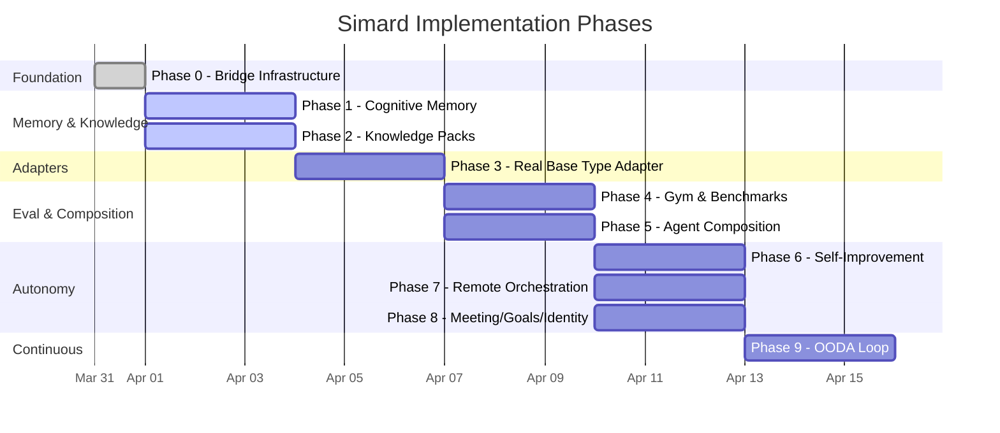

# Implementation Plan

The full technical plan lives at `Specs/IMPLEMENTATION_PLAN.md` in the repository root. This page provides a high-level overview.

## Parallelism Map

## Phase Summary

| Phase | Deliverable | Modules | LOC Budget | Status |
|-------|------------|---------|-----------|--------|
| 0 | Bridge infrastructure | 5 | ~1,400 | Merged (PR #89) |
| 1 | Cognitive memory via amplihack-memory-lib | 6 | ~2,150 | In progress |
| 2 | Knowledge packs via agent-kgpacks | 4 | ~1,300 | In progress |
| 3 | Real Copilot/harness adapter | 4 | ~1,450 | Planned (#92) |
| 4 | Gym/eval via amplihack-agent-eval | 5 | ~1,850 | Planned (#93) |
| 5 | Agent composition & subordinates | 5 | ~1,800 | Planned (#94) |
| 6 | Self-improvement & relaunch | 4 | ~1,400 | Planned (#95) |
| 7 | Remote orchestration via azlin | 4 | ~1,400 | Planned (#96) |
| 8 | Meeting mode, goals, dual identity | 5 | ~1,650 | Planned (#97) |
| 9 | OODA loop & autonomous operation | 4 | ~1,450 | Planned (#98) |
| **Total** | | **46** | **~15,850** | |

## Quality Gates (Every Phase)

1. All modules ≤400 LOC
2. `cargo test --quiet` passes (existing + new)
3. `cargo clippy --all-targets -- -D warnings` clean
4. Outside-in gadugi YAML test scenario
5. Feral usage tests (adversarial inputs, crash recovery)
6. Spec alignment check against ProductArchitecture.md
7. Project-wide quality-audit between phases
8. merge-ready skill quality gates before merge

## Self-Building Unlock

Minimum viable self-building requires Phases 0-6. At that point, Simard can:

1. **Remember** what she learned (Phase 1)
2. **Understand** her ecosystem (Phase 2)
3. **Act** on real coding tasks (Phase 3)
4. **Measure** her capability (Phase 4)
5. **Delegate** subtasks (Phase 5)
6. **Improve** herself (Phase 6)

Phases 7-9 add operational maturity: remote execution, meeting facilitation, and continuous autonomous operation.
