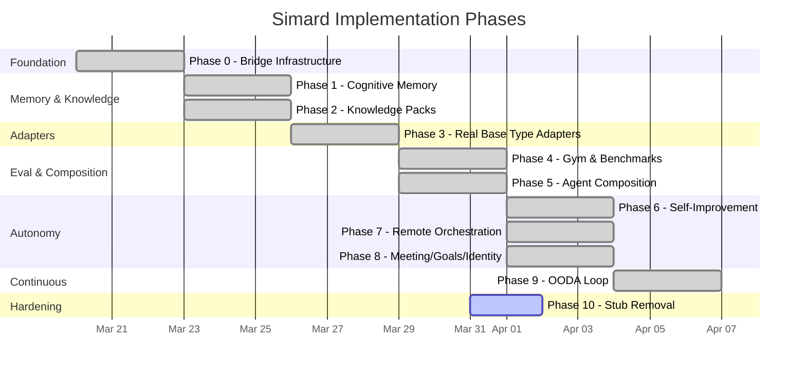

# Implementation Plan

The full technical plan lives at `Specs/IMPLEMENTATION_PLAN.md` in the repository root. This page provides a high-level overview.

## Parallelism Map

## Phase Summary

| Phase | Deliverable | Key Modules | Status |
|-------|------------|-------------|--------|
| 0 | Bridge infrastructure | `bridge`, `bridge_circuit`, `bridge_subprocess`, `bridge_launcher` | Merged |
| 1 | Cognitive memory via amplihack-memory-lib | `memory_bridge`, `memory_bridge_adapter`, `memory_cognitive`, `memory_consolidation`, `memory_hive` | Merged |
| 2 | Knowledge packs via agent-kgpacks | `knowledge_bridge`, `knowledge_context` | Merged |
| 3 | Real base type adapters (PTY-backed) | `base_type_copilot`, `base_type_harness`, `base_type_turn`, `terminal_session` | Merged |
| 4 | Gym/eval via amplihack-agent-eval | `gym`, `gym_bridge`, `gym_scoring` | Merged |
| 5 | Agent composition & subordinates | `identity_composition`, `agent_supervisor`, `agent_goal_assignment`, `agent_roles`, `agent_program` | Merged |
| 6 | Self-improvement & relaunch | `self_improve`, `self_relaunch`, `review`, `improvements` | Merged |
| 7 | Remote orchestration via azlin | `remote_azlin`, `remote_session`, `remote_transfer` | Merged |
| 8 | Meeting mode, goals, dual identity | `meeting_facilitator`, `meetings`, `goal_curation`, `goals`, `identity_auth` | Merged |
| 9 | OODA loop & autonomous operation | `ooda_loop`, `ooda_actions`, `ooda_scheduler` | Merged |
| 10 | Stub removal & hardening | All modules — real process execution, CLI, meeting REPL, OODA daemon | In Progress |

## Quality Gates (Every Phase)

1. All modules ≤400 LOC
2. `cargo test --quiet` passes (existing + new)
3. `cargo clippy --all-targets -- -D warnings` clean
4. Outside-in gadugi YAML test scenario
5. Feral usage tests (adversarial inputs, crash recovery)
6. Spec alignment check against ProductArchitecture.md
7. Project-wide quality-audit between phases
8. merge-ready skill quality gates before merge

## Self-Building Unlock

All prerequisite phases (0-6) are now merged. Simard can:

1. **Remember** what she learned (Phase 1 — cognitive memory with six types, hive mind sharing)
2. **Understand** her ecosystem (Phase 2 — knowledge graph packs, domain context enrichment)
3. **Act** on real coding tasks (Phase 3 — PTY-backed adapters driving real tools)
4. **Measure** her capability (Phase 4 — benchmark gym with regression detection)
5. **Delegate** subtasks (Phase 5 — subordinate spawning, heartbeat monitoring, goal assignment)
6. **Improve** herself (Phase 6 — controlled improvement cycles with canary verification)

Phases 7-9 add operational maturity and are also merged:

7. **Distribute** work across Azure VMs (Phase 7 — azlin integration)
8. **Facilitate** meetings and curate goals (Phase 8 — meeting records, durable top-5 goals)
9. **Operate** continuously (Phase 9 — OODA loop with scheduler and action dispatch)

Phase 10 (stub removal) is the current hardening pass: replacing all remaining placeholder implementations with real process execution, real CLI dispatch, real meeting REPL, and real OODA daemon behavior.
