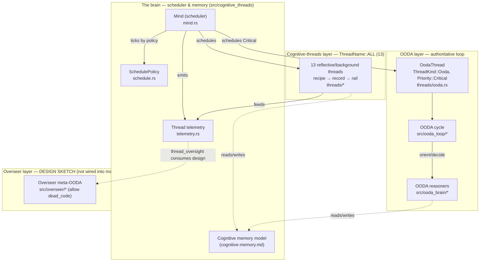
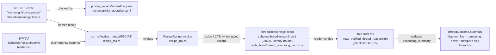

# The metacognitive atlas

!!! info "What this page is"
    This is the **code-derived graph** of Simard's metacognitive architecture —
    the visual companion to [The metacognitive model](./metacognitive-model.md).
    The model doc is the readable prose map; this atlas is the diagram set whose
    every node and edge is anchored to a concrete symbol or path in current
    source (`src/**`). Each diagram is rendered **inline as Mermaid** and also
    committed as a **Graphviz `.dot`** source in `docs/architecture/diagrams/`
    for high-fidelity offline
    rendering.

    See also: [The metacognitive model](./metacognitive-model.md) ·
    [Reflective cognitive threads act via tools](./reflective-cognitive-threads.md) ·
    [Typed-capability OODA loop](./typed-ooda-loop.md).

## How to read this atlas

The metacognitive model is a **mind of many processes** sharing one scheduler:

- **The brain** — the shared scheduler `Mind` (`src/cognitive_threads/mind.rs`)
  ticks every thread according to its `SchedulePolicy`
  (`src/cognitive_threads/schedule.rs`) and records telemetry
  (`src/cognitive_threads/telemetry.rs`).
- **Cognitive-threads layer** — the closed roster of **thirteen** threads,
  `ThreadName::ALL` in `src/ooda_brain/thread_reasoning_record.rs`
  (`pub const ALL: [ThreadName; 13]`). Each thread
  is a thin rail over an agentic recipe and hands its reasoning back through a
  typed `ThreadReasoningRecord`.
- **OODA layer** — the authoritative loop (`src/ooda_loop/`) reasoning through
  the orient/decide reasoners (`src/ooda_brain/`), driven from
  `src/operator_cli/ooda.rs`.
- **Overseer layer** — a **design sketch** (`src/overseer/`) that is
  `#![allow(dead_code)]` and **not wired into `main`**. It is drawn dashed
  everywhere and must not be read as a live loop.

Each diagram below has a short "what it shows / why" note, an inline Mermaid
render, and a link to its `.dot` counterpart.

### Rendering the Graphviz sources

The `.dot` sources are the durable, high-fidelity form. They are optional to
render (no build step depends on them), and require only Graphviz `dot`:

```bash
# From the repository root:
for f in docs/architecture/diagrams/*.dot; do
  dot -Tsvg "$f" -o "${f%.dot}.svg"
done
```

If `dot` is unavailable, the committed `.dot` source is the source of truth and
the inline Mermaid below renders the same topology in the docs site.

---

## 1. Top-level system map

**What it shows.** The three subsystems — cognitive-threads, OODA, Overseer —
and how the shared scheduler ("the brain") joins them. **Why.** It is the single
entry point: it establishes that one `Mind` schedules both the OODA loop
(as a `Critical`-priority thread) and the thirteen cognitive threads, and that
the Overseer is aspirational, not runtime.

Graphviz source: [`diagrams/system-map.dot`](./diagrams/system-map.dot).



!!! warning "Overseer is a design sketch"
    The dashed Overseer node reflects `src/overseer/mod.rs`, whose header
    declares the module `#![allow(dead_code)]` and "not wired into `main`".
    Nothing in the Overseer subsystem is constructed or scheduled at runtime.

---

## 2. Cognitive-threads drill-down

**What it shows.** All thirteen threads in `ThreadName::ALL` **declaration
order**, each labeled with its backing recipe (`RECIPE` const), the shared core
modules, and the typed `ThreadReasoningRecord` → `ThreadOutcome.summary`
handoff. **Why.** It makes the *agentic-recipes-first* pattern concrete: a
thread does not compute a boolean; its recipe **acts** by writing a typed,
identity-bound record that the thin rail reads fail-closed and surfaces as the
thread's real reasoning summary.

Graphviz source: [`diagrams/thread-drilldown.dot`](./diagrams/thread-drilldown.dot).

The roster is bound to `ThreadName::ALL`
(`src/ooda_brain/thread_reasoning_record.rs`, `pub const ALL: [ThreadName; 13]`).
Each recipe lives at
`prompt_assets/simard/recipes/<recipe>.yaml`:

| # | Thread (`ThreadName`) | `RECIPE` const | Backing recipe file |
|---|-----------------------|----------------|---------------------|
| 1 | `salience` | `salience-appraise` | `salience-appraise.yaml` |
| 2 | `metacognition` | `metacognition-appraise` | `metacognition-appraise.yaml` |
| 3 | `reflection` | `reflect-postmortem` | `reflect-postmortem.yaml` |
| 4 | `prospection` | `prospect-foresight` | `prospect-foresight.yaml` |
| 5 | `operator_model` | `operator-model` | `operator-model.yaml` |
| 6 | `analogy` | `analogy-map` | `analogy-map.yaml` |
| 7 | `narrative` | `narrative-identity` | `narrative-identity.yaml` |
| 8 | `values_deliberation` | `values-deliberate` | `values-deliberate.yaml` |
| 9 | `consolidation` | `consolidate-sleep` | `consolidate-sleep.yaml` |
| 10 | `creative_ideas` | `creative-ideate` | `creative-ideate.yaml` |
| 11 | `engineer_log_analysis` | `engineer-log-triage` | `engineer-log-triage.yaml` |
| 12 | `interoception` | `interoception-sense` † | `interoception-sense.yaml` |
| 13 | `maintenance` | `maintenance-housekeep` | `maintenance-housekeep.yaml` |

† **`interoception` is recipe-free.** It is deterministic self-sensing
(`src/cognitive_threads/threads/interoception.rs`); its `RECIPE` const is used
only for optional production narration, not for the core tick.

!!! note "OODA is a thread too, but not in this roster"
    The authoritative OODA loop runs as `OodaThread`
    (`ThreadKind::Ooda`, `Priority::Critical`) scheduled by the same `Mind`, but
    it is **not** a member of `ThreadName::ALL` — it produces its own typed OODA
    records (see [Diagram 3](#3-ooda-loop-drill-down)) rather than a
    `ThreadReasoningRecord`.

```mermaid
flowchart LR
    subgraph core["Core modules (src/cognitive_threads)"]
        mind["mind.rs<br/>Mind (scheduler)"]
        schedule["schedule.rs<br/>SchedulePolicy::Interval"]
        recipe_rail["recipe_rail.rs<br/>RecipeRunnerInvoker<br/>run_reflective_thread()"]
    end

    mind --> schedule

    salience["salience<br/>salience-appraise"]
    metacog["metacognition<br/>metacognition-appraise"]
    reflection["reflection<br/>reflect-postmortem"]
    prospection["prospection<br/>prospect-foresight"]
    operatormdl["operator_model<br/>operator-model"]
    analogy["analogy<br/>analogy-map"]
    narrative["narrative<br/>narrative-identity"]
    values["values_deliberation<br/>values-deliberate"]
    consolid["consolidation<br/>consolidate-sleep"]
    creative["creative_ideas<br/>creative-ideate"]
    engineerlog["engineer_log_analysis<br/>engineer-log-triage"]
    interocept["interoception<br/>interoception-sense (recipe-free)"]
    maintenance["maintenance<br/>maintenance-housekeep"]

    schedule -->|Interval cadence| salience
    schedule --> metacog
    schedule --> reflection
    schedule --> prospection
    schedule --> operatormdl
    schedule --> analogy
    schedule --> narrative
    schedule --> values
    schedule --> consolid
    schedule --> creative
    schedule --> engineerlog
    schedule --> interocept
    schedule --> maintenance

    record["ThreadReasoningRecord<br/>schema thread-reasoning/v1<br/>ooda_brain/thread_reasoning_record.rs"]
    outcome["ThreadOutcome.summary<br/>(daemon log = real reasoning)<br/>thread.rs"]

    metacog -->|run_reflective_thread(RECIPE)| recipe_rail
    recipe_rail -->|recipe writes| record
    record -->|rail reads fail-closed| outcome
```

---

## 3. OODA loop drill-down

**What it shows.** The authoritative `observe → orient → decide → act` cycle and
the **typed record boundaries** between phases. **Why.** It shows that
transitions are not opaque: orient/decide reasoning is captured in
`OrientDecideRecord` and judgment in `JudgmentRecord`, so every phase hop leaves
a verified, inspectable artifact.

Phases live in `src/ooda_loop/` (`cycle.rs`, `observe.rs`, `orient.rs`,
`decide.rs`, `review.rs`, `curate.rs`, `coverage.rs`, `no_progress.rs`).
Reasoners live in `src/ooda_brain/` (`orient.rs`, `decide.rs`,
`recipe_brain.rs`, `rustyclawd.rs`). The CLI entrypoint is
`src/operator_cli/ooda.rs`. Record types are
`src/ooda_brain/orient_decide_record.rs` and
`src/ooda_brain/judgment_record.rs`.

Graphviz source: [`diagrams/ooda-loop.dot`](./diagrams/ooda-loop.dot).

```mermaid
flowchart LR
    cli["operator_cli/ooda.rs<br/>(CLI entrypoint)"]
    cycle["ooda_loop/cycle.rs<br/>(per-goal cycle driver)"]
    cli -->|runs| cycle

    subgraph phases["Phases — src/ooda_loop/*"]
        observe["observe.rs"]
        orient["orient.rs"]
        decide["decide.rs"]
        review["review.rs"]
        curate["curate.rs"]
        coverage["coverage.rs"]
        no_progress["no_progress.rs"]
    end

    subgraph brain["Reasoners — src/ooda_brain/*"]
        b_orient["orient.rs"]
        b_decide["decide.rs"]
        recipe_brain["recipe_brain.rs"]
        rustyclawd["rustyclawd.rs"]
    end

    od_record["OrientDecideRecord<br/>ooda_brain/orient_decide_record.rs"]
    j_record["JudgmentRecord<br/>ooda_brain/judgment_record.rs"]

    cycle --> observe
    observe --> orient
    orient -->|reason| b_orient
    b_orient -->|writes| od_record
    od_record -->|typed boundary| decide
    decide -->|reason| b_decide
    b_decide -->|select recipe| recipe_brain
    recipe_brain -->|act via agent| rustyclawd
    rustyclawd -->|writes| j_record
    j_record -->|typed boundary| review
    review --> curate
    curate --> coverage
    coverage -->|stall check| no_progress
    no_progress -.->|loop / escalate| cycle
```



---

## 4. Overseer drill-down (design sketch)

**What it shows.** The aspirational `observe → diagnose → dispatch → verify →
merge → notify` meta-OODA and how `thread_oversight` would consume real
cognitive-thread telemetry. **Why.** It pins the vocabulary and capability seam
for a future operator/observer co-process — while making unmistakably clear that
it does not run today.

!!! danger "Not wired into runtime"
    `src/overseer/mod.rs` is a **type/trait sketch**: `#![allow(dead_code)]`,
    **not wired into `main`** or the daemon loop. Nothing here is constructed or
    scheduled. The diagram is drawn entirely dashed for this reason. The only
    solid node — `cognitive_threads/telemetry.rs` — is the real runtime telemetry
    the sketch anticipates consuming.

Modules (`src/overseer/`): `observer.rs`, `sensor.rs`, `diagnosis.rs`,
`root_cause.rs`, `ecosystem_observe.rs`, `merge_queue_observe.rs`, `launch.rs`,
`merge_ops.rs`, `pr_verify.rs`, `claim_reaper.rs`, `thread_oversight.rs`,
`signal_liaison.rs`, `notify.rs`, `deploy.rs`, `guardrails.rs`.

Graphviz source: [`diagrams/overseer-sketch.dot`](./diagrams/overseer-sketch.dot).

```mermaid
flowchart LR
    telemetry["cognitive_threads/telemetry.rs<br/>(REAL, runtime)"]
    oversight["thread_oversight.rs<br/>(consumes thread telemetry)"]

    observe["observe<br/>observer.rs / sensor.rs<br/>ecosystem_observe.rs<br/>merge_queue_observe.rs"]
    diagnose["diagnose<br/>diagnosis.rs / root_cause.rs"]
    dispatch["dispatch<br/>launch.rs"]
    verify["verify<br/>pr_verify.rs / guardrails.rs"]
    merge["merge<br/>merge_ops.rs / claim_reaper.rs"]
    notify["notify<br/>notify.rs / signal_liaison.rs"]
    deploy["deploy<br/>deploy.rs"]

    observe -.-> diagnose
    diagnose -.-> dispatch
    dispatch -.-> verify
    verify -.-> merge
    merge -.-> notify
    notify -.-> deploy
    deploy -.->|loop (design)| observe

    telemetry -->|feeds| oversight
    oversight -.->|signals problems| diagnose
```

*(Dashed edges = design-only. The solid edge from real telemetry into
`thread_oversight` marks the one concrete seam the sketch is built around.)*

---

## 5. Representative data flow — the metacognition thread

**What it shows.** The full canonical path for one thread, end to end:
`RECIPE` const → `RecipeRunnerInvoker` → `policy()` cadence →
`run_reflective_thread(...)` → `ThreadReasoningRecord` (schema
`thread-reasoning/v1`) → thin rail → `ThreadOutcome.summary`. **Why.**
`metacognition` is the exemplar: every reflective thread follows this same
recipe → record → rail shape, so understanding one explains all thirteen.

Symbols:

- `RECIPE = "metacognition-appraise"` — `src/cognitive_threads/threads/metacognition.rs`
- `policy() -> SchedulePolicy::Interval(..)` — same module (cadence)
- `RecipeRunnerInvoker`, `run_reflective_thread()` — `src/cognitive_threads/recipe_rail.rs`
- `ThreadReasoningRecord`, `THREAD_REASONING_SCHEMA = "thread-reasoning/v1"` — `src/ooda_brain/thread_reasoning_record.rs`
- `ThreadOutcome.summary` — `src/cognitive_threads/thread.rs`

Graphviz source: [`diagrams/metacognition-flow.dot`](./diagrams/metacognition-flow.dot).



---

## Keeping the atlas accurate

This atlas is a **living document**, not a point-in-time report. When the code
changes, update both the inline Mermaid and the matching `.dot` source together:

- The thirteen-thread roster is bound to `ThreadName::ALL`
  (`src/ooda_brain/thread_reasoning_record.rs`, `pub const ALL: [ThreadName; 13]`)
  — if a thread is added or
  removed there, update [Diagram 2](#2-cognitive-threads-drill-down) and the
  roster table.
- Each thread's recipe is its `RECIPE` const — if a `RECIPE` string changes,
  update the table and the flow diagram.
- The Overseer stays dashed until `src/overseer/mod.rs` drops
  `#![allow(dead_code)]` and is wired into `main`.

For the readable prose companion, see
[The metacognitive model](./metacognitive-model.md).
