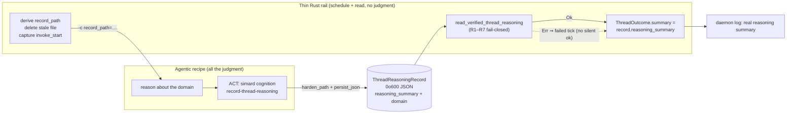
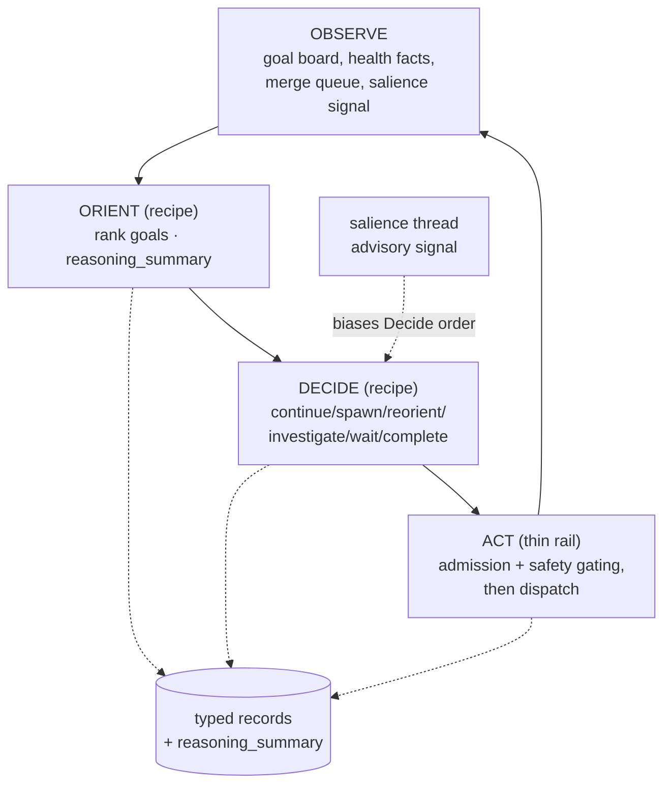
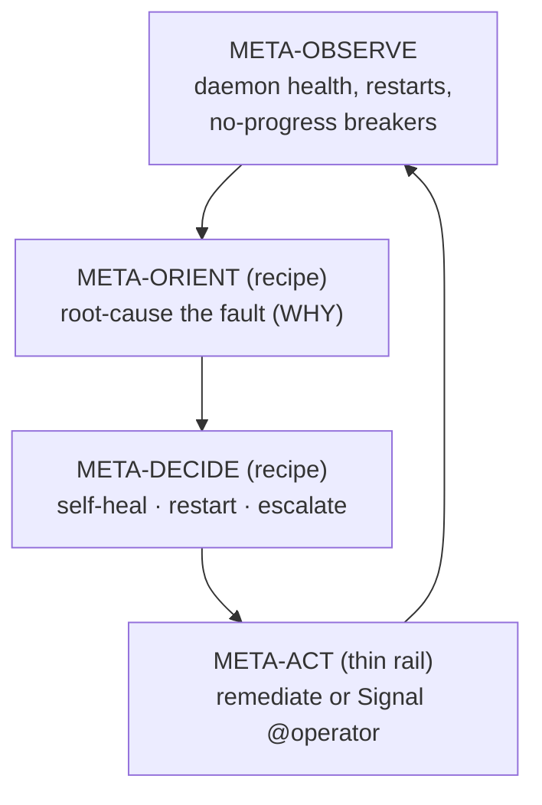
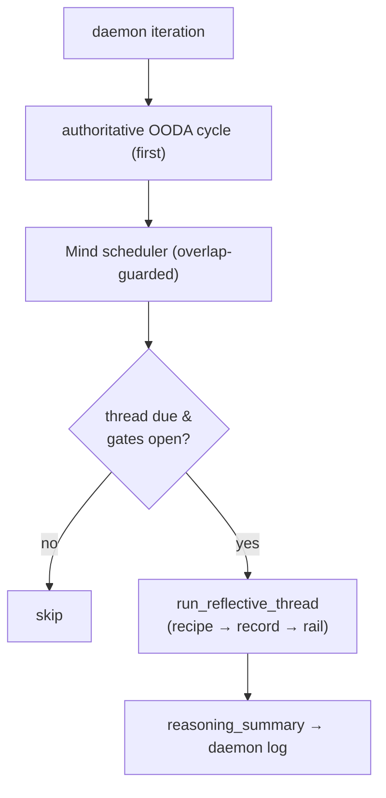

# The metacognitive model

!!! success "Status — implemented; every cognitive function is an agentic recipe that emits natural-language reasoning"
    All thirteen cognitive threads, the OODA loop, and the overseer meta-OODA are
    **agentic recipes**. Each reasons about its own domain and records a
    natural-language `reasoning_summary` through a typed
    [`ThreadReasoningRecord`](../reference/simard-cognition-record-thread-reasoning-cli.md).
    The daemon log line for a thread is now its **actual reasoning**, never the
    old boolean `"<recipe>: ok"`.

Simard runs a **mind of many processes**: one authoritative OODA loop that drives
autonomous engineering, an overseer that runs a slower *meta*-OODA over the daemon
itself, and a roster of background **cognitive threads** each on its own cadence.
This page is the single readable map of how those processes think and how their
reasoning becomes visible.

!!! tip "See also — the code-derived atlas"
    For the **graphical** companion to this prose map, see
    [The metacognitive atlas](./metacognitive-atlas.md): a code-first system map
    plus per-layer drill-downs (threads, OODA, Overseer) and the representative
    recipe → record → rail data flow, rendered inline as Mermaid with committed
    Graphviz `.dot` sources.

The organising principle is [agentic-recipes-first](../concepts/agentic-recipes-first-principle.md):
**judgment lives in recipes and prompts; Rust is a thin rail** that schedules,
invokes, reads one typed record fail-closed, and surfaces the reasoning. No cognitive
function decides anything in Rust heuristics, and no reasoning is recovered by
scraping stdout.

## The one pattern: recipe → record → rail

Every cognitive function follows the same three-stage handoff. A thin rail invokes
an agentic recipe; the recipe reasons and calls a **gated typed-record tool** as its
ACT step; the rail reads that record fail-closed and surfaces the natural-language
summary. Nothing is parsed from stdout.



Why a typed record and not stdout? A prose envelope is one trailing comma or one
launcher banner away from a silent parse failure that discards the whole result.
The typed record is owner-only `0o600`, schema-pinned, identity-bound, and
freshness-checked, so the writer and reader can never drift and a stale or spoofed
record fails closed. See the
[record-thread-reasoning reference](../reference/simard-cognition-record-thread-reasoning-cli.md)
for the schema and the full R1–R7 matrix.

## The authoritative OODA loop

The OODA loop is the daemon's primary mind: **Observe → Orient → Decide → Act**,
once per goal per cycle. Its reasoning phases (orient, decide, admission,
idea-dedup/consolidation, outcome verification) are typed-record agentic recipes;
the thin rail in `src/ooda_loop/cycle.rs` applies admission, safety, and
`mutates_refs` gating **after** the reasoning is read. Each cycle surfaces a
natural-language `reasoning_summary` alongside its typed decision.



The salience cognitive thread feeds an advisory ranking into Decide (read
fail-closed); it never overrides OODA's own ordering. See the
[Typed-capability OODA loop](./typed-ooda-loop.md) for the record contracts.

## The overseer meta-OODA

The overseer is a slower loop that runs OODA **over the daemon itself**: it
observes the daemon's health (crash loops, stalls, goal-board pathologies),
orients on root cause, and acts by self-healing or escalating. Its judgment is
recipified too, and it surfaces a natural-language `reasoning_summary` per meta-cycle.



The overseer's NL-reasoning surfacing is **additive**: it widens the existing
per-meta-cycle summary plumbing with a `reasoning_summary` only where it does not
collide with an in-flight overseer-recipification change. See
[Overseer agentic health-review](../concepts/overseer-agentic-health-review.md).

## The cognitive-thread scheduler

The [`Mind`](../reference/cognitive-thread-scheduling.md) scheduler runs the
thirteen background threads **after** the authoritative inline OODA cycle each
daemon iteration, behind an overlap guard so a thread can never delay or starve
OODA. Each thread is `Interval`-scheduled at its own cadence and double-env-gated
(default-ON, opt-out). Every thread is now recipe-backed and emits a
`ThreadReasoningRecord`.



## The thirteen threads

Each thread reasons in one domain and records a natural-language `reasoning_summary`
plus a small closed set of [domain fields](../reference/simard-cognition-record-thread-reasoning-cli.md#per-domain-fields-closed-set).
Cadence and gates come from the
[cognitive-threads catalog](../reference/cognitive-threads-catalog.md); only
`reasoning_summary` reaches the log line.

### Reflective threads (reason over Simard's own work and knowledge)

- **salience** — *"what matters most right now."* Appraises active goals by urgency,
  risk, and opportunity every 30 min and writes an advisory ranking that biases
  OODA's Decide. Domain: `top_signals`, `priority`. Example summary: *"prioritising
  the release-blocking regression over docs polish."*
- **metacognition** — appraises Simard's **own** process hourly: is it looping,
  starving a goal, over-spawning engineers? Domain: `notes`.
- **reflection** — post-mortems recently closed or blocked goals (every 90 min,
  guarded) and files lessons. Domain: `notes`.
- **prospection** — foresight: anticipates upcoming risks and may file ≤1 preventive
  goal (every 75 min). Domain: `notes`.
- **operator_model** — maintains a model of the operator's preferences and standing
  intent (every 2 h). Domain: `notes`.
- **analogy** — maps the current situation to prior episodes for transfer (every
  2.5 h). Domain: `notes`.
- **narrative** — maintains Simard's identity narrative and chapters (every 12 h).
  Domain: `notes`.
- **values_deliberation** — deliberates value trade-offs, may file ≤1 goal, never
  vetoes (every 3 h, guarded). Domain: `notes`.
- **consolidation** — sleep/dream consolidation of memory schemas (every 6 h).
  Domain: `notes`.

### Housekeeping / sensing threads (converted from pure Rust)

These four were previously pure-Rust and are now recipe-backed. Their **safety
gates are preserved inside the recipe path** — conversion is about uniform record
emission, not re-implementing sensing as LLM guesswork.

- **interoception** — deterministic self-sensing (disk, dependency drift, store
  size). It stays deterministic; the recipe's ACT step records a genuine templated
  NL sentence such as *"disk at 91% breaches the 85% guard; filed a capacity
  health-goal."* Domain: `probes`, `breach`. It **senses**; it never acts on cleanup.
- **maintenance** — housekeeping that *acts* on cleanup candidates, behind the
  existing prune safety gate; no prune runs without the gate. Domain: `candidates`,
  `freed_bytes`. Example: *"reclaimed 2.1 GiB from 3 stale worktrees; skipped 1
  under the safety gate."*
- **engineer_log_analysis** — triages engineer failure logs, dedups failure
  signatures (`crate::stewardship::dedup`) and fences untrusted excerpts. Domain:
  `signatures`, `novel`. Example: *"same flaky-CI signature as #4801, not a new
  fault."*
- **creative_ideas** — generates and dedups candidate improvement ideas. It
  **extends** the existing #4959 dedup/consolidation records — the
  `ThreadReasoningRecord` is written *in addition to* them, not in place of them.
  Domain: `ideas_considered`, `kept_after_dedup`. Example: *"considered 5 ideas,
  kept 2 after semantic dedup against the standing backlog."*

## What you see in the log

Before, every thread — even the nine that already ran recipes — logged the same
useless string:

```text
cognitive-thread: salience-appraise: ok
cognitive-thread: reflect-postmortem: ok
```

Now the log carries each thread's real reasoning:

```text
cognitive-thread: salience: prioritising goal #4970 over #4812 because a release-blocking regression outranks docs polish
cognitive-thread: interoception: disk at 91% breaches the 85% guard; filed a capacity health-goal
cognitive-thread: reflection: engineer #4801 stalled on flaky CI, not code; recommending a retry on the coverage-comment step
```

A recipe that runs but writes no valid record is a **failed** tick (fail-closed),
not a silent `ok`. The failure is logged in the canonical
`FAILED — R{n} <reason>` format
([pinned in the reference](../reference/simard-cognition-record-thread-reasoning-cli.md#canonical-failure-log-format)):

```text
cognitive-thread: prospection: FAILED — R5 reasoning_summary invalid (empty/too-short/too-long after sanitize)
```

To read a thread's reasoning live or from its record, see
[Read a thread's reasoning summary](../howto/read-cognitive-thread-reasoning.md).

## Design invariants

1. **Thin rail.** Rust schedules, invokes, reads one typed record fail-closed, and
   surfaces the summary. No new Rust heuristics or judgment.
2. **Typed-record handoff only.** No stdout/JSON scraping; agent→agent handoffs pass
   semantic results via typed records.
3. **Fail-closed everywhere.** R1–R7 with identity binding and a time-based
   freshness/anti-replay model (unique pre-truncated path + `thread_name` + mtime
   window + embedded epoch; `MAX_AGE_SECS = 300`).
4. **Closed-enum shared validation.** One `ThreadReasoningRecord` type and one
   `sanitize_reasoning_summary` chokepoint used by writer and reader — no drift.
5. **Owner-only, small.** Records `0o600` via `persist_json` + `harden_path`; large
   payloads ride files, never argv/env.
6. **Additive & coordinated.** OODA/overseer NL surfacing is additive-only and never
   re-touches files owned by an in-flight epic PR.

## See also

- [`simard cognition record-thread-reasoning` reference](../reference/simard-cognition-record-thread-reasoning-cli.md)
  — the record schema, the R1–R7 read matrix, and the CLI contract.
- [Reflective cognitive threads act via tools](./reflective-cognitive-threads.md) —
  the tools-not-JSON exemplar this model extends.
- [Cognitive-threads catalog](../reference/cognitive-threads-catalog.md) — per-thread
  cadence, gates, and effects.
- [Typed-capability OODA loop](./typed-ooda-loop.md) — the OODA record contracts.
- [Agentic recipes, first principle](../concepts/agentic-recipes-first-principle.md) —
  why judgment lives in recipes, not Rust.
