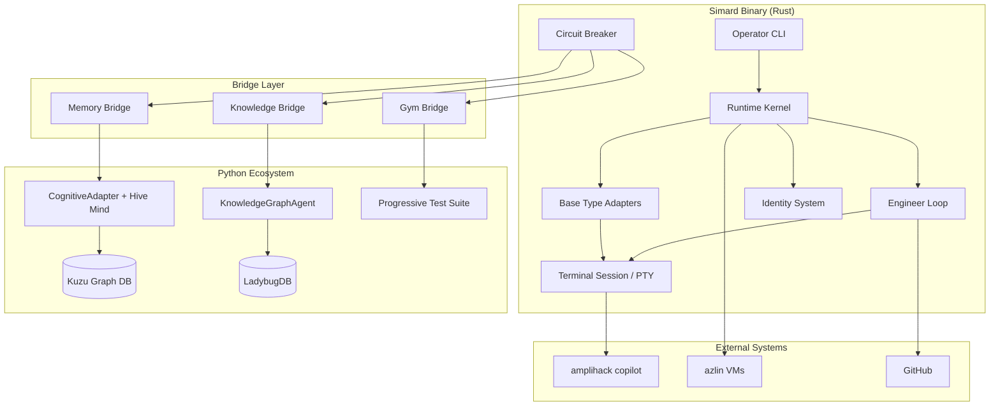

# Architecture Overview

Simard is an autonomous engineer built in Rust that drives agentic coding systems through real terminal interaction. She uses the amplihack ecosystem for memory, knowledge, evaluation, and orchestration.

## System Diagram



## Core Principles

Simard's architecture follows eleven pillars defined in the [ProductArchitecture spec](../../Specs/ProductArchitecture.md):

1. **Terminal First** — not chat first. Simard drives real tools through PTY.
2. **Explicit State** — no hidden magic. All state is file-backed and operator-visible.
3. **Roles Separated** — planner, engineer, reviewer, facilitator are distinct.
4. **Benchmarks Drive Truth** — measurable improvement, not dashboard theater.
5. **Memory Must Be Layered** — six cognitive types, not a flat key-value store.
6. **Improvement Requires Reviewable Loops** — every change is inspectable.
7. **Prompt Assets Stay Separate** — prompts are files, not embedded strings.
8. **Identity and Runtime Are Different** — what an agent is vs. how it runs.
9. **Composition Must Outlive Topology** — same identity runs local or distributed.
10. **Dependency Injection Is Structural** — all services injected via `RuntimePorts`.
11. **Honest Degradation** — errors surface explicitly, never hidden.

## Key Components

### Runtime Kernel

The `RuntimeKernel` (aliased as `LocalRuntime`) manages the agent lifecycle through explicit state transitions:

```
Initializing → Ready → Active → Reflecting → Persisting → Stopped
                                                         ↘ Failed
```

All runtime services (memory, evidence, prompts, topology) are injected via `RuntimePorts`, making the kernel topology-neutral. The same code runs single-process, multi-process, or distributed.

### Bridge Infrastructure

Simard communicates with the Python ecosystem through subprocess bridges using newline-delimited JSON on stdin/stdout:

```
Simard (Rust) ──stdin──→ Python subprocess ──→ amplihack-memory-lib (Kuzu)
              ←stdout──                    ──→ agent-kgpacks (LadybugDB)
                                           ──→ amplihack-agent-eval
```

Each bridge has:
- A Rust trait (`BridgeTransport`) with typed request/response methods
- An `InMemoryBridgeTransport` for unit testing
- A `SubprocessBridgeTransport` for production
- A `CircuitBreakerTransport` wrapper for fault tolerance

See [Bridge Pattern](bridge-pattern.md) for wire protocol details.

### Cognitive Memory

Simard's memory uses six types modeled after cognitive psychology, provided by `amplihack-memory-lib`:

| Type | Purpose | Duration | Example |
|------|---------|----------|---------|
| **Sensory** | Raw observations | Short (TTL) | PTY output, incoming objectives |
| **Working** | Active task context | Task-scoped | Current goal, plan steps, constraints |
| **Episodic** | Session transcripts | Long-term | What happened in each session |
| **Semantic** | Extracted facts | Long-term | "cargo test runs all workspace tests" |
| **Procedural** | Learned sequences | Long-term | "fix-and-verify: read → edit → test → commit" |
| **Prospective** | Future intentions | Until triggered | "re-run gym after self-improve completes" |

See [Cognitive Memory](cognitive-memory.md) for the full lifecycle.

### Identity System

An `IdentityManifest` defines what an agent is — its operating mode, memory policy, allowed base types, and prompt assets. Three built-in identities ship:

- **simard-engineer** — repo-grounded engineering work
- **simard-meeting** — alignment and decision capture
- **simard-gym** — benchmark evaluation

Identities compose: a `CompositeIdentity` can nest multiple manifests with role delegation, enabling Simard to orchestrate subordinate agents with different specializations.

### Session Orchestration

Every interaction follows a six-phase lifecycle:

1. **Intake** — normalize the request, record sensory observation
2. **Preparation** — search memory for relevant facts, check triggers
3. **Planning** — form execution plan, recall procedures
4. **Execution** — perform actions through PTY, record observations
5. **Reflection** — extract facts, store episode, evaluate outcome
6. **Persistence** — consolidate memory, clear working state, export handoff

### Terminal Driving

Simard drives real tools through PTY-backed terminal sessions using the `script` command. She can:

- Launch `amplihack copilot` and interact via typed commands
- Validate startup checkpoints against checked-in flow contracts
- Restore workflow-only files that wrappers may contaminate
- Record transcripts for audit and episodic memory

## Implementation Status

See [Implementation Plan](implementation-plan.md) for the full phased roadmap.

| Phase | Component | Status |
|-------|-----------|--------|
| 0 | Bridge Infrastructure | Merged |
| 1 | Cognitive Memory | In Progress |
| 2 | Knowledge Packs | In Progress |
| 3 | Real Base Type Adapter | Planned |
| 4 | Gym & Benchmarks | Planned |
| 5 | Agent Composition | Planned |
| 6 | Self-Improvement | Planned |
| 7 | Remote Orchestration | Planned |
| 8 | Meeting/Goals/Identity | Planned |
| 9 | OODA Loop | Planned |
