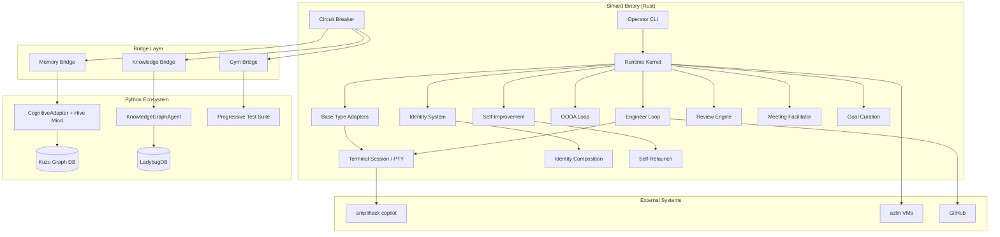

# Architecture Overview

Simard is an autonomous engineer built in Rust that drives agentic coding systems through real terminal interaction. She uses the amplihack ecosystem for memory, knowledge, evaluation, and orchestration.

## System Diagram



## Core Principles

Simard's architecture follows eleven pillars defined in the ProductArchitecture spec (`Specs/ProductArchitecture.md` in the repo root):

1. **Terminal First** — not chat first. Simard drives real tools through PTY.
2. **Explicit State** — no hidden magic. All state is file-backed and operator-visible.
3. **Roles Separated** — planner, engineer, reviewer, facilitator are distinct.
4. **Benchmarks Drive Truth** — measurable improvement, not dashboard theater.
5. **Memory Must Be Layered** — six cognitive types, not a flat key-value store.
6. **Improvement Requires Reviewable Loops** — every change is inspectable.
7. **Prompt Assets Stay Separate** — prompts are files, not embedded strings.
8. **Identity and Runtime Are Different** — what an agent is vs. how it runs.
9. **Composition Must Outlive Topology** — same identity runs local or distributed.
10. **Dependency Injection Is Structural** — all services injected via `RuntimePorts`.
11. **Honest Degradation** — errors surface explicitly, never hidden.

## Key Components

### Runtime Kernel

The `RuntimeKernel` (aliased as `LocalRuntime`) manages the agent lifecycle through explicit state transitions:

```
Initializing → Ready → Active → Reflecting → Persisting → Stopped
                                                         ↘ Failed
```

All runtime services (memory, evidence, prompts, topology) are injected via `RuntimePorts`, making the kernel topology-neutral. The same code runs single-process, multi-process, or distributed.

### Base Type Adapters

Base types are the execution substrates that Simard delegates work to. Each adapter wraps a different agent runtime behind the `BaseTypeFactory`/`BaseTypeSession` trait pair. Four manifest-advertised base types ship:

| Base Type | Adapter | Capabilities | Topologies |
|-----------|---------|-------------|------------|
| `local-harness` | `RealLocalHarnessAdapter` | PTY session, evidence | SingleProcess |
| `terminal-shell` | `TerminalShellAdapter` | Full session + terminal | SingleProcess |
| `rusty-clawd` | `RustyClawdAdapter` | Full session | Single + MultiProcess |
| `copilot-sdk` | `CopilotSdkAdapter` | Full session + terminal, memory/knowledge enrichment | SingleProcess |

The Copilot adapter drives `amplihack copilot` through PTY with memory and knowledge context injection. The harness adapter runs arbitrary local commands through the same PTY infrastructure. All adapters use real process execution — no stubs.

Two additional base types are planned per the original spec: `claude-agent-sdk` (wrapping the Claude Agent SDK) and `ms-agent-framework` (wrapping the Microsoft Agent Framework). Each will get its own module following the same `BaseTypeFactory`/`BaseTypeSession` trait pattern.

See [Base Type Adapters](../reference/base-type-adapters.md) for the full reference.

### Bridge Infrastructure

Simard communicates with the Python ecosystem through subprocess bridges using newline-delimited JSON on stdin/stdout:

```
Simard (Rust) ──stdin──→ Python subprocess ──→ amplihack-memory-lib (Kuzu)
              ←stdout──                    ──→ agent-kgpacks (LadybugDB)
                                           ──→ amplihack-agent-eval
```

Each bridge has:
- A Rust trait (`BridgeTransport`) with typed request/response methods
- An `InMemoryBridgeTransport` for unit testing
- A `SubprocessBridgeTransport` for production
- A `CircuitBreakerTransport` wrapper for fault tolerance

See [Bridge Pattern](bridge-pattern.md) for wire protocol details.

### Cognitive Memory

Simard's memory uses six types modeled after cognitive psychology, provided by `amplihack-memory-lib`:

| Type | Purpose | Duration | Example |
|------|---------|----------|---------|
| **Sensory** | Raw observations | Short (TTL) | PTY output, incoming objectives |
| **Working** | Active task context | Task-scoped | Current goal, plan steps, constraints |
| **Episodic** | Session transcripts | Long-term | What happened in each session |
| **Semantic** | Extracted facts | Long-term | "cargo test runs all workspace tests" |
| **Procedural** | Learned sequences | Long-term | "fix-and-verify: read → edit → test → commit" |
| **Prospective** | Future intentions | Until triggered | "re-run gym after self-improve completes" |

Memory is accessed through bridges (`CognitiveMemoryBridge`, `CognitiveBridgeMemoryStore`) and includes consolidation (`memory_consolidation`), hive mind sharing (`memory_hive`), and phase-mapped operations for each session lifecycle step.

See [Cognitive Memory](cognitive-memory.md) for the full lifecycle.

### Identity System

An `IdentityManifest` defines what an agent is — its operating mode, memory policy, allowed base types, and prompt assets. Three built-in identities ship:

- **simard-engineer** — repo-grounded engineering work
- **simard-meeting** — alignment and decision capture
- **simard-gym** — benchmark evaluation

Identities compose: a `CompositeIdentity` (in `identity_composition`) can nest multiple manifests with role delegation, enabling Simard to orchestrate subordinate agents with different specializations. Dual identity authentication (`identity_auth`) supports switching between identities for different operations.

### Agent Composition and Supervision

Simard can spawn subordinate agents with bounded goals:

- **Goal assignment** (`agent_goal_assignment`) — assign, poll, and report progress on subordinate goals via shared memory
- **Supervision** (`agent_supervisor`) — spawn subordinates, monitor heartbeats, kill stale processes, retry with limits
- **Role selection** (`agent_roles`) — map objectives to appropriate agent roles (engineer, reviewer, facilitator, gym)
- **Agent programs** (`agent_program`) — pluggable turn pipelines including `ObjectiveRelayProgram`, `MeetingFacilitatorProgram`, and `ImprovementCuratorProgram`

See [Agent Composition](agent-composition.md) for the full supervisor protocol.

### Session Orchestration

Every interaction follows a six-phase lifecycle:

1. **Intake** — normalize the request, record sensory observation
2. **Preparation** — search memory for relevant facts, check triggers
3. **Planning** — form execution plan, recall procedures
4. **Execution** — perform actions through PTY, record observations
5. **Reflection** — extract facts, store episode, evaluate outcome
6. **Persistence** — consolidate memory, clear working state, export handoff

The `memory_consolidation` module maps each phase to concrete memory operations (e.g., `intake_memory_operations`, `reflection_memory_operations`).

### Terminal Driving

Simard drives real tools through PTY-backed terminal sessions using the `script` command. She can:

- Launch `amplihack copilot` and interact via typed commands
- Validate startup checkpoints against checked-in flow contracts
- Restore workflow-only files that wrappers may contaminate
- Record transcripts for audit and episodic memory

### Engineer Loop

The `engineer_loop` module implements the repo-grounded engineering workflow: inspect repository state, select actions (read-only inspection or bounded structured edits), execute through terminal, and verify results. It produces `EngineerLoopRun` artifacts with selected actions, executed actions, and verification reports.

### OODA Loop

The `ooda_loop` module implements a continuous Observe-Orient-Decide-Act cycle for autonomous operation:

- **Observe** — gather current state from memory, goals, and environment
- **Orient** — assess observations against current goals and priorities
- **Decide** — select planned actions with priorities
- **Act** — dispatch actions through the `ooda_actions` module

The `ooda_scheduler` manages action slots with status tracking (scheduled, running, completed, failed) and drains finished work.

### Review and Self-Improvement

- **Review** (`review`) — generates structured review artifacts with evidence-linked improvement proposals
- **Self-Improvement** (`self_improve`) — runs controlled improvement cycles: propose changes, evaluate against benchmarks, promote only measurable improvements
- **Self-Relaunch** (`self_relaunch`) — binary handover with canary verification and gating checks before replacing the running binary
- **Improvements** (`improvements`) — tracks persisted improvement records, approvals, and promotion plans

### Meeting and Goal Stewardship

- **Meeting Facilitator** (`meeting_facilitator`) — structured meeting sessions with decisions, action items, and notes
- **Meetings** (`meetings`) — persisted meeting records with goal update carryover
- **Goal Curation** (`goal_curation`) — durable goal board with active top-5, backlog, and progress tracking
- **Goals** (`goals`) — file-backed and in-memory goal stores with status lifecycle

### Gym and Benchmarks

- **Gym** (`gym`) — benchmark scenario loading, execution, suite reports, and cross-run comparison
- **Gym Bridge** (`gym_bridge`) — bridge to Python evaluation infrastructure
- **Gym Scoring** (`gym_scoring`) — dimension trends, regression detection, and improvement tracking

### Remote Orchestration

- **Remote Azlin** (`remote_azlin`) — Azure VM provisioning and command execution
- **Remote Session** (`remote_session`) — remote session lifecycle management
- **Remote Transfer** (`remote_transfer`) — memory snapshot transfer between local and remote

### Knowledge Integration

- **Knowledge Bridge** (`knowledge_bridge`) — bridge to knowledge graph packs (LadybugDB)
- **Knowledge Context** (`knowledge_context`) — enriches planning context with domain knowledge for base type turns

### Skill Building

- **Skill Builder** (`skill_builder`) — extract skill candidates from session patterns, generate skill definitions, and install skills

## Module Map

The codebase is organized into 65+ modules across these subsystems:

| Subsystem | Key Modules |
|-----------|-------------|
| **Core runtime** | `runtime`, `bootstrap`, `session`, `error`, `metadata` |
| **Base types** | `base_types`, `base_type_copilot`, `base_type_harness`, `base_type_turn` |
| **Identity** | `identity`, `identity_auth`, `identity_composition`, `agent_roles` |
| **Agent orchestration** | `agent_program`, `agent_supervisor`, `agent_goal_assignment` |
| **Memory** | `memory`, `memory_bridge`, `memory_bridge_adapter`, `memory_cognitive`, `memory_consolidation`, `memory_hive` |
| **Bridges** | `bridge`, `bridge_circuit`, `bridge_subprocess`, `bridge_launcher` |
| **Engineer** | `engineer_loop`, `terminal_session`, `terminal_engineer_bridge` |
| **OODA** | `ooda_loop`, `ooda_actions`, `ooda_scheduler` |
| **Review/Improve** | `review`, `self_improve`, `self_relaunch`, `improvements` |
| **Meeting/Goals** | `meeting_facilitator`, `meetings`, `goal_curation`, `goals` |
| **Gym** | `gym`, `gym_bridge`, `gym_scoring` |
| **Remote** | `remote_azlin`, `remote_session`, `remote_transfer` |
| **Knowledge** | `knowledge_bridge`, `knowledge_context` |
| **Operator CLI** | `operator_cli`, `operator_commands`, `operator_commands_*` (5 submodules) |
| **Supporting** | `prompt_assets`, `evidence`, `handoff`, `reflection`, `sanitization`, `persistence` |
| **Research** | `research_tracker`, `skill_builder` |
| **Copilot surfaces** | `copilot_status_probe`, `copilot_task_submit` |

## Implementation Status

See [Implementation Plan](implementation-plan.md) for the full phased roadmap.

| Phase | Component | Status |
|-------|-----------|--------|
| 0 | Bridge Infrastructure | Merged |
| 1 | Cognitive Memory | Merged |
| 2 | Knowledge Packs | Merged |
| 3 | Real Base Type Adapters | Merged |
| 4 | Gym & Benchmarks | Merged |
| 5 | Agent Composition | Merged |
| 6 | Self-Improvement | Merged |
| 7 | Remote Orchestration | Merged |
| 8 | Meeting/Goals/Identity | Merged |
| 9 | OODA Loop | Merged |
| 10 | Stub Removal & Hardening | In Progress |
