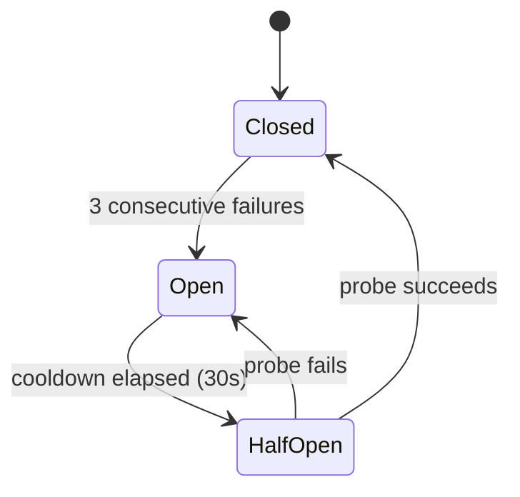

# RPC Transport Pattern

Simard uses an **RPC transport abstraction** — typed `RpcTransport` implementations that speak a JSON-line protocol — to isolate client code from transport details.

## Transport Types

| Transport | Use Case | Notes |
|-----------|----------|-------|
| **NativeRpcTransport** | Production (knowledge, gym) | In-process Rust handlers, zero overhead |
| **InMemoryRpcTransport** | Unit testing | In-memory mock; no I/O, no subprocess |

> **History**: Prior to #2181, the knowledge and gym clients used Python subprocess transports with a native Rust fallback. The native Rust transports became the only production path in #2181. As of #3181 (the pure-Rust daemon) the last subprocess transport — a test-only `SubprocessRpcTransport` that spawned `python3` — has been **removed** along with all Python: no transport spawns an external process any more, and the two remaining transports (`NativeRpcTransport`, `InMemoryRpcTransport`) are both pure Rust and in-process. Cognitive memory is provided by the library-backed `LibraryCognitiveMemory` (over `amplihack-memory-lib`) as the sole on-disk backend after the de-fork (Phase 2b) — see [Cognitive Memory Architecture](cognitive-memory.md) and [Library-backed Cognitive Memory](cognitive-memory-library-adapter.md).

## Wire Protocol

Each transport speaks newline-delimited JSON. One request per line on stdin, one response per line on stdout.

### Request Format

```json
{"id": "01970b2f-...", "method": "memory.store_fact", "params": {"concept": "cargo test", "content": "runs all workspace tests", "confidence": 0.9}}
```

| Field | Type | Required | Description |
|-------|------|----------|-------------|
| `id` | string | yes | UUIDv7 for request-response matching |
| `method` | string | yes | Dotted method name (e.g., `memory.store_fact`) |
| `params` | object | yes | Method-specific parameters |

### Response Format (success)

```json
{"id": "01970b2f-...", "result": {"fact_id": "sem_01abc..."}}
```

### Response Format (error)

```json
{"id": "01970b2f-...", "error": {"code": -32601, "message": "method 'nonexistent' is not registered"}}
```

| Error Code | Meaning |
|-----------|---------|
| `-32601` | Method not found |
| `-32603` | Internal server error |
| `-32000` | Timeout |
| `-32001` | Transport error |

> **Wire contract is frozen.** Only the Rust identifiers changed in the
> RPC-vs-Bridge rename; every JSON method name (`memory.store_fact`,
> `knowledge.query`, `gym.run_scenario`, the built-in `bridge.health` probe)
> and on-disk format is byte-for-byte unchanged. Renaming a struct or module
> never alters what goes on the wire.
>
> The wider terminology cleanup (proposed, #2951) — renaming the lowercase
> "bridge" in log strings, comments, and identifiers we control to the accurate
> RPC / client / server / handoff vocabulary, while leaving frozen wire /
> persisted / CLI values like `bridge.health` unchanged — is described in
> [Eliminating "bridge" terminology](../concepts/bridge-terminology-elimination.md)
> and enforced by the
> [No-`bridge` naming guard](../reference/no-bridge-naming-guard.md).

## Rust-Side Architecture

### RpcTransport Trait

```rust
pub trait RpcTransport: Send + Sync {
    fn call(&self, request: RpcRequest) -> SimardResult<RpcResponse>;
    fn descriptor(&self) -> BackendDescriptor;
    fn health(&self) -> SimardResult<RpcHealth>;  // default implementation
}
```

### Implementations

| Type | Purpose |
|------|---------|
| `NativeRpcTransport` | In-process Rust handlers for production (knowledge, gym); no subprocess |
| `InMemoryRpcTransport` | Handler function for unit tests, no I/O |
| `CircuitBreakerTransport<T>` | Wraps any transport with fault tolerance |

These live in `src/rpc_transport/` (`in_memory`, `native` submodules); the
shared request/response types (`RpcRequest`, `RpcResponse`, `RpcHealth`, the
`RpcTransport` trait) live in `src/rpc.rs`. There is no `subprocess` submodule —
Simard spawns no external process for RPC.

### Circuit Breaker



- **Closed**: Normal operation, calls pass through
- **Open**: Calls rejected immediately with `RpcCircuitOpen`
- **Half-Open**: One probe call allowed; success closes, failure reopens

The circuit breaker lives in `src/rpc_circuit_breaker.rs`. Only
transport-level errors (code `-32001`) trip the circuit. Application errors
(method not found, internal) do not.

## Server-Side Handlers

Production handlers run **in-process in Rust** behind `NativeRpcTransport`;
there is no external server process and no Python. A handler implements the
same newline-delimited JSON contract described above and is registered by
dotted method name.

The built-in `bridge.health` method is always available and returns
`{"server_name": "...", "healthy": true}`. The method string stays
`bridge.health` for wire compatibility — it is part of the frozen protocol,
not a Rust identifier.

## Error Handling

### Simard-Side Errors

| Error Type | When | Recovery |
|-----------|------|----------|
| `RpcSpawnFailed` | A child IPC process (e.g. the native Rust single-writer client launched by `memory_ipc`/`runtime_ipc`) could not be spawned | Check the `simard` binary path and PATH; retry |
| `RpcTransportError` | Stdin/stdout broken, process exited | Circuit breaker opens, auto-respawn on next call |
| `RpcProtocolError` | Malformed JSON, type mismatch | Log and surface to operator |
| `RpcCallFailed` | Method returned error payload | Surface to caller with method context |
| `RpcCircuitOpen` | Too many recent failures | Wait for cooldown, check transport health |

> `RpcSpawnFailed` is a transport-agnostic IPC error retained across the
> pure-Rust migration (#3181). It is shared by the native Rust IPC launchers
> (`memory_ipc`, `runtime_ipc`, `agent_supervisor`, `self_relaunch`, and
> peers) and no longer relates to spawning any Python process.

### Data Loss Prevention

Cognitive-memory writes no longer flow through an `RpcTransport`. Since the
de-fork (Phase 2b, issue #2307) they go directly through the in-process
[`LibraryCognitiveMemory`](cognitive-memory-library-adapter.md) adapter over
`amplihack-memory-lib`:

- Writes are idempotent — each fact, episode, or procedure is keyed by its
  LadybugDB `node_id`, so a replayed write reinforces the existing node rather
  than duplicating it (the *upsert-that-reinforces* contract; see
  [Procedural Idempotency](../reference/cognitive-memory-procedural-idempotency.md)).
- Concurrent writers are serialized through a single-writer IPC guard
  (`memory_ipc::launcher::launch_writer_client`), so parallel Simard processes
  cannot interleave writes to the same store.
- Durability and recovery are provided by verified backups in the
  `memory_backup` module (`backup_memory_verified`, `verify_backup`,
  `restore_from_backup`) rather than by transport-level transaction replay —
  see [Verified Backups](../operations/verified-backups.md) and
  [Cognitive-Memory Durability](../operations/cognitive-memory-durability.md).

## Testing

### Unit Tests (in-memory)

```rust
let transport = InMemoryRpcTransport::echo("test");
let response = transport.call(health_request()).unwrap();
assert!(response.result.is_some());
```

### Circuit-Breaker Tests

Fault-tolerance behaviour is covered entirely in Rust by
`src/rpc_circuit_breaker.rs` (`#[cfg(test)]`), driving an
`InMemoryRpcTransport` (or a failing handler) through the state machine — no
subprocess, no fixtures, no Python:

- Transport-level error (code `-32001`) → circuit trips toward `Open`
- 3 consecutive transport failures → circuit opens; calls return `RpcCircuitOpen`
- Cooldown elapsed → `HalfOpen`; probe success closes, probe failure reopens
- Application errors (method not found, internal) do **not** trip the circuit
- Malformed JSON from a handler → `RpcProtocolError`
