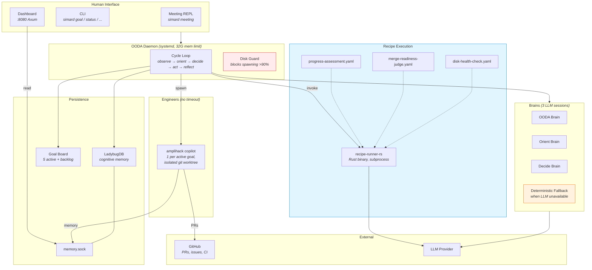
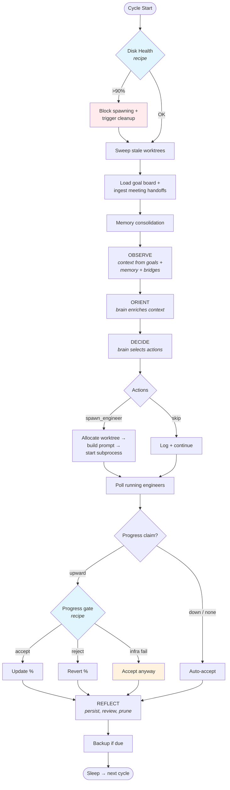
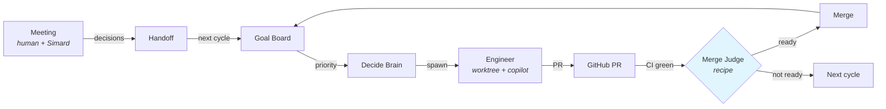

# Simard Architecture

Simard is an autonomous software engineer that runs as a systemd daemon. It uses an OODA (Observe-Orient-Decide-Act) loop to manage production goals, spawn engineer subprocesses to do the work, judge their output, and merge results.

## Design Principles

1. **Recipes over Rust** — Agentic decisions (progress assessment, merge readiness, disk cleanup) are YAML recipes executed by `recipe-runner-rs`, not hand-coded Rust. Rust code is thin shims that invoke recipes as subprocesses. To change how Simard judges progress, you edit a YAML file — not recompile.

2. **No agentic timeouts** — Engineers run until they complete or fail. No wall-clock SIGKILL. Infrastructure timeouts (cargo, git commands) are preserved.

3. **Fail-open for infra, fail-closed for safety** — Recipe/LLM failures fall back to accept (don't block goals on transport hiccups). But disk pressure blocks engineer spawning (don't fill the disk further).

4. **The daemon is a thin orchestrator** — It loads goals, asks brains what to do, dispatches work, and checks results. It does not contain domain logic for how to assess progress or judge PRs — that lives in recipes.

5. **Flat module structure** — `src/lib.rs` declares ~100 `pub mod`s. This is intentional: each module is a self-contained brick. There is no deep module nesting. The crate is large but each module has a narrow public surface.

## System Layers

## OODA Cycle (each iteration)

## Meeting → Goal → Engineer → Merge

## Failure Modes

| Failure | Behavior | Rationale |
|---------|----------|-----------|
| LLM provider down | Deterministic fallback brain (skip actions) | Don't crash the daemon |
| LLM down + recipe call | Accept with diagnostic | Don't block goals on infra |
| Disk full (>90%) | Block engineer spawning, run cleanup recipe | Don't make it worse |
| LadybugDB corrupt | Auto-restore from backup (tries 5 most recent) | Preserve memory |
| Engineer subprocess hangs | Runs forever (no timeout) | User's explicit requirement |
| Recipe runner crashes | Shim returns Noop/Accept fallback | Don't block on tooling failure |
| Memory socket dead | Daemon opens LadybugDB directly | Bypass broken IPC |
| Stale prompts on disk | Prompt store uses disk version (mtime-cached) | **Sharp edge**: wrong prompts on disk → wrong decisions silently |

## Recipe-Driven Components

| Recipe YAML | Rust Shim | Input | Output |
|------------|-----------|-------|--------|
| `progress-assessment.yaml` | `RecipeProgressChecker` | goal_id, problem, plan, prior_pct, claimed_pct, wip_summary | `{verdict: accept\|reject, rationale}` |
| `merge-readiness-judge.yaml` | `RecipeMergeJudge` | pr_number, repo, pr_body | `{verdict: ready\|not_ready, rationale}` |
| `disk-health-check.yaml` | `DiskHealthCheck` | home_path, threshold | `{disk_used_pct, freed_bytes, actions_taken}` |

Each shim: `Command::new("recipe-runner-rs").arg(recipe_path).arg("-c").arg("key=value")` — parses stdout JSON. On failure → fallback (accept/noop).

## Key Files

| Area | Path | What it does |
|------|------|-------------|
| Daemon bootstrap | `src/operator_commands_ooda/daemon/mod.rs` | Wires bridges, brains, recipes; runs cycle loop |
| OODA cycle body | `src/ooda_loop/cycle.rs` | Observe → orient → decide → act → reflect |
| Brains | `src/ooda_brain/{rustyclawd,decide,orient,fallback}.rs` | LLM-backed + deterministic fallback |
| Prompt store | `src/ooda_brain/prompt_store.rs` | Disk load (mtime-cached) with embedded fallback |
| Recipes | `prompt_assets/simard/recipes/*.yaml` | YAML recipe definitions |
| Progress gate | `src/goal_curation/recipe_progress_checker.rs` | Thin shim → recipe subprocess |
| Merge judge | `src/stewardship/recipe_merge_judge.rs` | Thin shim → recipe subprocess |
| Disk health | `src/disk_health.rs` | Thin shim → recipe subprocess |
| Engineer spawn | `src/engineer_loop/agent_spawn.rs` | Subprocess launch, no timeout |
| Worktrees | `src/engineer_worktree/mod.rs` | Per-engineer git worktree isolation |
| Goal board | `src/goal_curation/operations.rs` | Board load/save/merge/curation |
| Memory | `src/cognitive_memory/mod.rs` | LadybugDB CognitiveMemoryOps |
| Memory IPC | `src/memory_ipc/mod.rs` | Unix socket server/client |
| Dashboard | `src/operator_commands_dashboard/mod.rs` | Axum HTTP :8080 |
| Meeting | `src/operator_commands_meeting/mod.rs` | REPL + facilitation + handoff |
