# Simard Code Atlas: Agentic Flows

Layer 9 maps Simard's **agentic control plane** — how the daemon reasons and acts.
It traces six flows through the real Rust modules and shows how each one operates
and how they link across the other atlas layers (runtime topology, service
components, data flow, user journeys). Each flow has a Mermaid `flowchart` source
and a matching DOT representation; both are rendered to SVG.

> Recipes-first: wherever a decision could be an agentic reasoning step, Simard
> invokes a **recipe** (YAML in `prompt_assets/simard/recipes/`) run by
> `recipe-runner-rs`/`amplihack`, with a deterministic Rust fallback. No kuzu, no
> Python: the whole memory path uses the embedded **lbug** graph store.

## Flow inventory

| Flow | Entry point | Key modules | What it does |
|---|---|---|---|
| OODA loop | `run_ooda_cycle` (`src/ooda_loop/cycle.rs`) | `ooda_loop::{observe,orient,decide,coverage,no_progress}`, `ooda_brain`, `ooda_actions` | Observe → Orient → Decide → Act over the goal board each tick; orient/decide route through recipes with deterministic rails |
| Overseer tick | `run_overseer_tick_isolated_detailed` (`src/overseer/wiring.rs`) → `run_cycle` (`src/overseer/mod.rs:663`) | `overseer::{merge_queue_observe,ecosystem_observe,health_review,root_cause,capabilities,launch}` | Meta-OODA supervision: observes board + merge-queue + ecosystem + health-review (all agentic), root-causes problems, decides interventions, acts via capabilities |
| Recipes | `resolve_recipe_path` + `RecipeBrain` (`src/ooda_brain/recipe_brain.rs`) | `recipe_context_file`, `recipe_output`, `overseer::launch`, `stewardship::recipe_merge_judge` | Uniform recipe-runner invocation: resolve → context-file → spawn → parse envelope → typed decision |
| Prompt assets | `FilePromptAssetStore::load` (`src/prompt_assets.rs`) | `prompt_delivery`, `amplihack_freshness_gate` | Locate/validate/deliver `prompt_assets/simard/*` to agents; freshness gate keeps recipes/SDK LATEST |
| Typed-OODA | `TypedGoalSessionRoute::execute` (`src/typed_ooda/route.rs`) | `typed_ooda::{types,schema,route,executor,ledger}` | Capability/effect model: recipe emits a terminal outcome, capability-checked, dispatched as a durable, leased `EffectJob` |
| Cognitive-memory recall | `recall_pass` (`src/overseer/mod.rs:1156`) / OODA prepare (`src/ooda_loop/cycle.rs`) | `cognitive_memory`, `memory_ipc`, `LibraryCognitiveMemory` | 4-way ranked recall (facts/episodes/procedures/prospectives) from the embedded lbug store into prompt context |

## Overview: how the flows link

The OODA loop is the primary tick; the Overseer is a meta-OODA supervisor. Both
read/write cognitive memory, both drive recipes, and the OODA Act phase hands
write-capable work to typed-OODA, whose effects (e.g. `SpawnEngineer`) cross into
the Layer 8 engineer-PR journey. Recipes and typed-OODA both read prompt assets.


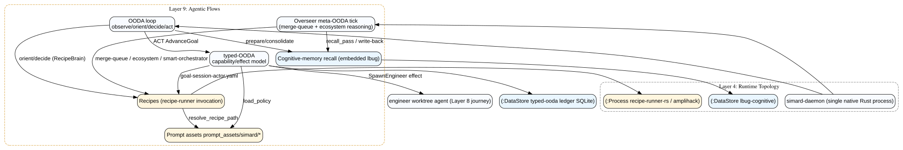

## OODA loop (observe/orient/decide/act)

One cycle observes environment + goal statuses, prepares context from cognitive
memory, orients (urgencies) and decides (actions) — each via a recipe with a
`Deterministic*Brain` fallback — ensures goal coverage, acts, then consolidates
execution/procedure/reflection memory and commits the board.


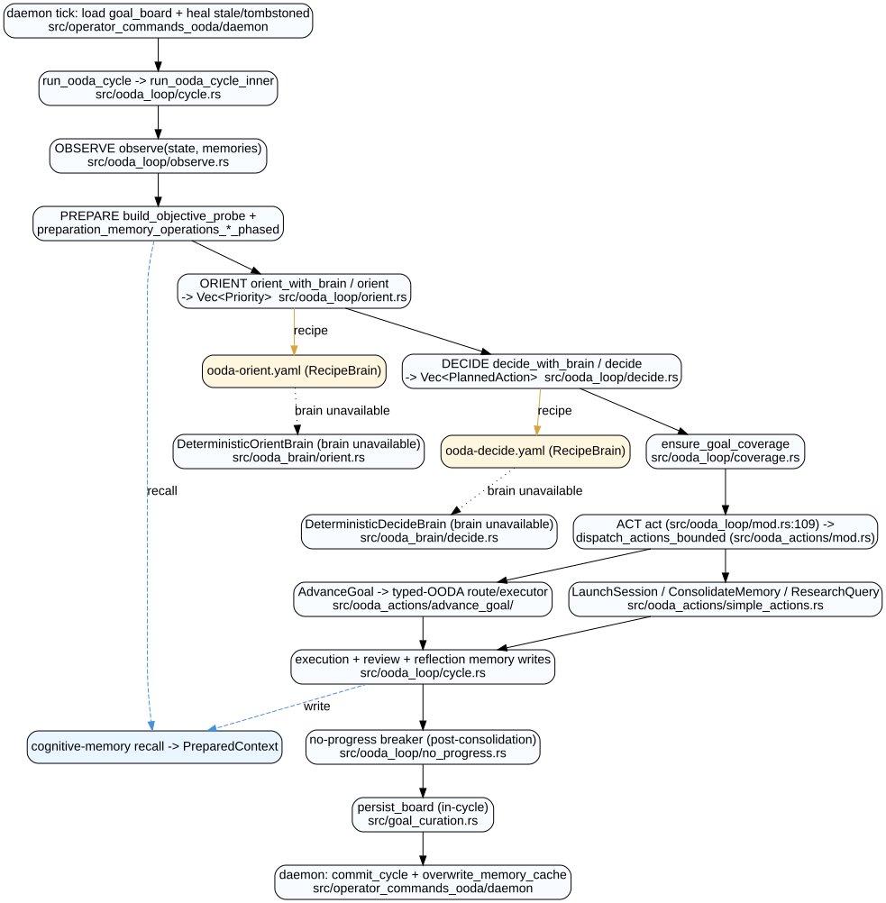

## Overseer meta-OODA tick

Panic-isolated tick: snapshot status, observe board + ready PRs + **agentic
merge-queue** (`observe-merge-queue.yaml`) + **ecosystem** (`ecosystem-observe.yaml`),
recall memory, orient to problems, root-cause with recurrence, gate, then act via
capabilities (notify, file issue, launch smart-orchestrator, merge,
unblock/escalate goals). In production the deployer is **`RefuseDeployer`**
(`src/overseer/wiring.rs`) — autonomous self-deploy is refused, not performed —
and goal transfer is delegated to `MeetingHost::transfer_goal`. It writes back an
observation episode. Note `observe_ecosystem` runs **after** the per-problem
decide/gate loop, appending gated `LaunchRecipe` interventions.

Immediately after `observe_ecosystem`, `run_cycle` runs the agentic
**health-review** rail (`health_review`, `src/overseer/mod.rs:935` →
`src/overseer/health_review.rs`, wired by `build_health_reviewer` in
`src/overseer/wiring.rs`, [standing]). When wired and due on the cadence
(`health_review_enabled` opt-out + the shared `gap_scan` throttle +
`health_review_every_n`), the thin rail invokes the `overseer-health-review`
recipe via `recipe-runner-rs`. The **agent** reads the OODA journal
(`journalctl --user -u <unit>`, default `simard-ooda.service`), `simard status`,
and `simard goal list`, detects crash-loops / shared failure signatures
(systemic-vs-per-goal root cause), and reasons to typed remediation
DECISIONS parsed from `LAUNCH_RECIPE=` / `ESCALATE_GOAL=` markers into
`Intervention::LaunchRecipe` / `Intervention::EscalateBlockedGoal`. Rust never
reads the journal, counts a failure, or encodes a threshold — it only schedules
the recipe and routes each parsed intervention through the **same** `gate`
(budget / launch-cap / sequencer / in-flight-dedup / recursion) every other
action uses. Fail-closed: an unwired reviewer, a disabled rail, an off cadence,
a `HEALTHY` verdict (empty vec), or a degraded recipe run all leave the plan
unchanged — never a fabricated launch or escalation.

The autonomous **verify+merge** path (`src/overseer/merge_ops.rs`) is a fixed
sub-pipeline. Candidate narrowing happens **earlier, in the observe stage**:
`survey_ready_prs` applies inline narrowing (engineer-branch + objective gates +
a **draft-exclusion rail** — #4339, admitting only `is_draft == Some(false)` and
excluding `Some(true)`/`None` fail-closed), and `observe_merge_queue` reasons
before `project_ready_prs` re-applies the same narrowing. The act-stage merge
pipeline itself is: `verify` (a review-free objective pre-filter) →
`poll_until_green` (waits for required checks; **never `--admin`/`--no-verify`**)
→ the agentic **MergeJudge** six-criteria gate → `gh pr merge --squash` → a
`DualChannelNotifier` (email + Signal). `build_merge_judge`
(`src/stewardship/merge_judge.rs`) resolves the judge in order: (1) a
recipe-backed `RecipeMergeJudge` (`merge-readiness-judge.yaml` via
recipe-runner-rs) when available, else (2) a direct `LlmMergeJudge`
(`merge_readiness_judge.md` prompt), else (3) the fail-closed default
`RefusingMergeJudge`. After the squash-merge both notify channels are
*attempted* and their outcomes recorded: `NotifyReport::dispatched()` means at
least one per-channel entry exists (recorded, **not** guaranteed delivered —
`all_sent()` is the true-delivery check), and `merge_ops` records it via a
`debug_assert!`, so the merge still returns `Ok` even if a channel was not
delivered.


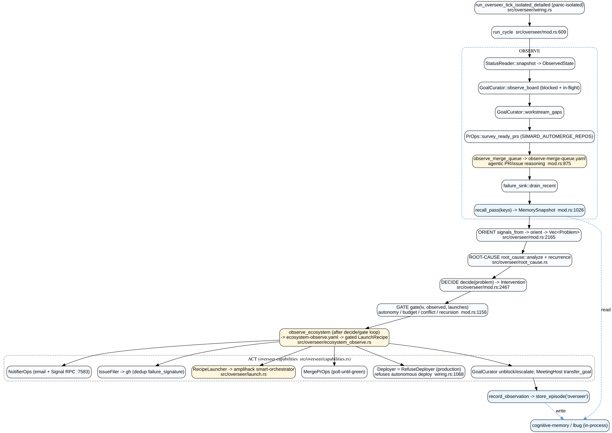

## Recipes (recipe-runner invocation model)

Every recipe caller shares the same pipeline: two-tier path resolution
(hot-reload `~/.simard/...` then in-tree), preconditions, freshness gate, a
`ContextFile` to keep large context off `argv` (avoids `execve E2BIG`), spawn of
`recipe-runner-rs` (or `amplihack recipe run` for the overseer), then noise
stripping and JSON-envelope extraction into a typed decision. The
`smart-orchestrator`/`default-workflow`/`investigation-workflow` recipes live
downstream in `amplifier-bundle`, not in this repo.


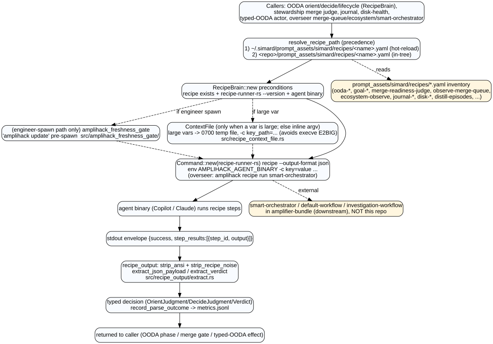

## Prompt assets (prompt_assets/simard/*)

`recipes/` (23 YAML), `overseer/` (7 MD), `policies/` (capability TOML), and
`terminal_recipes/` are version-controlled truth. They are deployed to the
runtime hot-reload copy, loaded via a path-traversal-guarded store, and delivered
to agents through a size-gated transport (inline/stdin/tempfile).


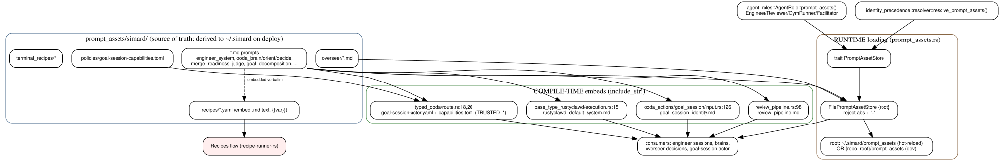

## Typed-OODA capability/effect model

The OODA Act `AdvanceGoal` routes into typed-OODA. The `goal-session-actor.yaml`
recipe returns exactly one terminal outcome (Action/NoAction/Blocked/Completed).
Actions are checked against `CapabilityPolicy` grants, then dispatched as durable,
lease-guarded `EffectJob`s recorded with typed Evidence in the SQLite ledger. The
`Action` enum has four variants (SpawnEngineer/FileIssue/RequestMerge/RequestDeploy),
but the production policy (`prompt_assets/simard/policies/goal-session-capabilities.toml`)
grants **only `record_action.spawn_engineer`** (with `deployment_environments = []`);
the other three variants are defined but ungranted.


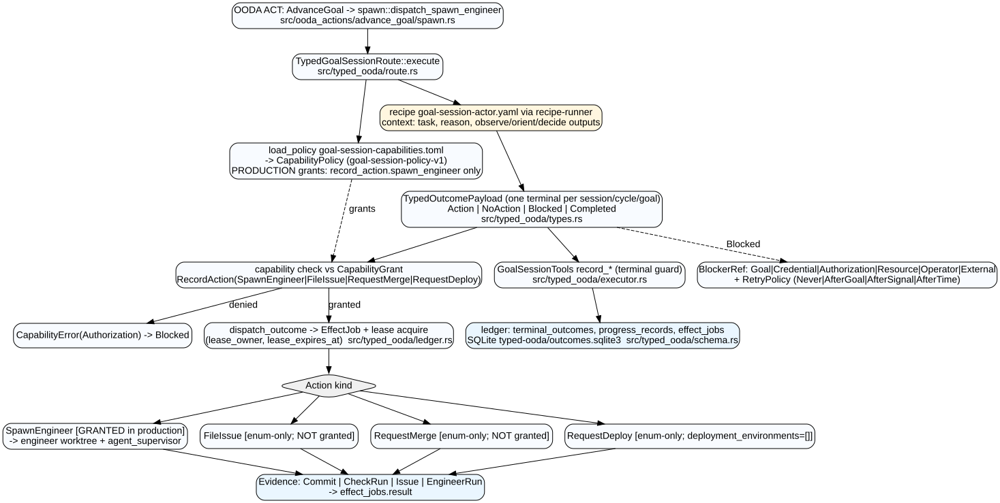

## Cognitive-memory recall path

A deterministic probe fans out to four bounded ranked recalls (semantic facts,
episodes, procedures, prospective triggers) through the memory adapter into the
embedded **lbug** graph store, assembling a `MemorySnapshot`/`PreparedContext`.
The **ranked episode recall** (`recall_episodes_ranked`,
`src/cognitive_memory/library_adapter.rs`) passes its query through a **recall
precision gate**: `tokenize_words` splits on non-alphanumeric runs, sub-threshold
single-character tokens are dropped (`MIN_CLEAN_NEEDLE_LEN = 2`) because as a
word-boundary prefix (`shares_word_prefix`) a lone character matches nearly every
content word — pure recall noise — and an empty needle set recalls **nothing**
(fail-closed). Ranked **fact** recall (`recall_facts_ranked`) is a library-ranked
pure read and is **not** word-boundary gated. The same sub-threshold cut is
applied by the separate keyword/substring **search** APIs (`search_facts` /
`search_episodes_by_keywords`) — `search_facts` via `partition_fact_query` and
`search_episodes_by_keywords` inline — which partition CLEAN vs RAW tokens (RAW
markers keep exact-substring semantics; an all-sub-threshold query recalls
nothing) — those are distinct from the daemon's
ranked-recall path above.
In the daemon this recall is **in-process**: `shared_mem` is a
`LibraryCognitiveMemory` wrapped by `memory_ipc::SharedMemory`, so the daemon
reads lbug directly — it does **not** go over the `memory_ipc` UDS server, which
serves **external** clients only. Write-back stores episodes/procedures/facts.
The entire path is native Rust + lbug — **no kuzu, no Python**.


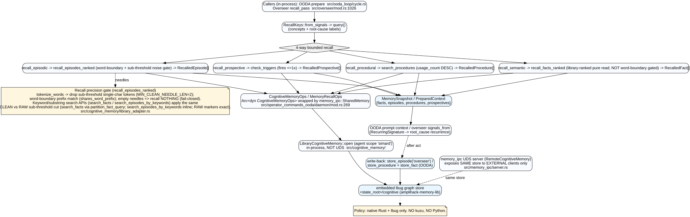

## Portable graph

These flows are also exported as portable OpenCypher in
[`../cypher/atlas-agentic.cypher`](../cypher/atlas-agentic.cypher) (`:Flow`,
`:Phase`, `:Recipe`, `:PromptAsset`, `:Capability`, `:Effect` nodes plus their
cross-layer links). See [`../cypher/queries.cypher`](../cypher/queries.cypher)
for agentic trace queries (Q11–Q14).
