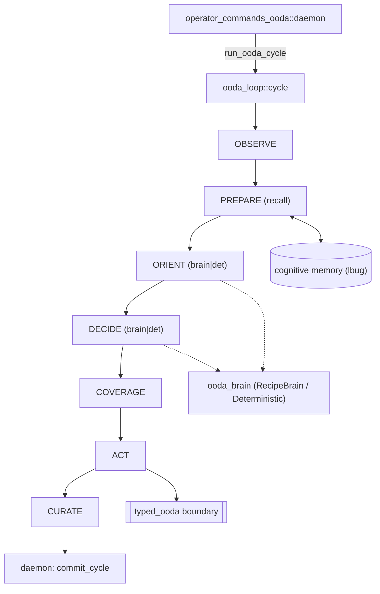
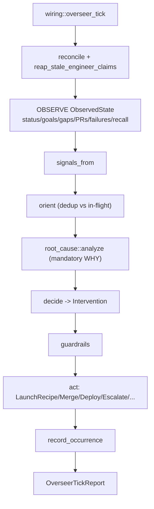
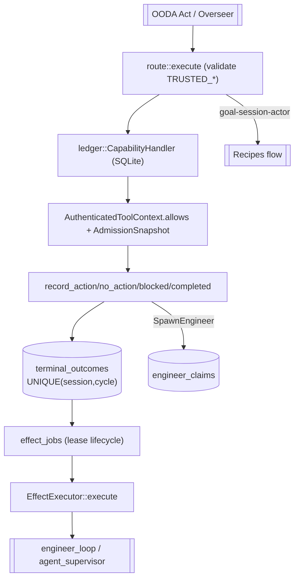
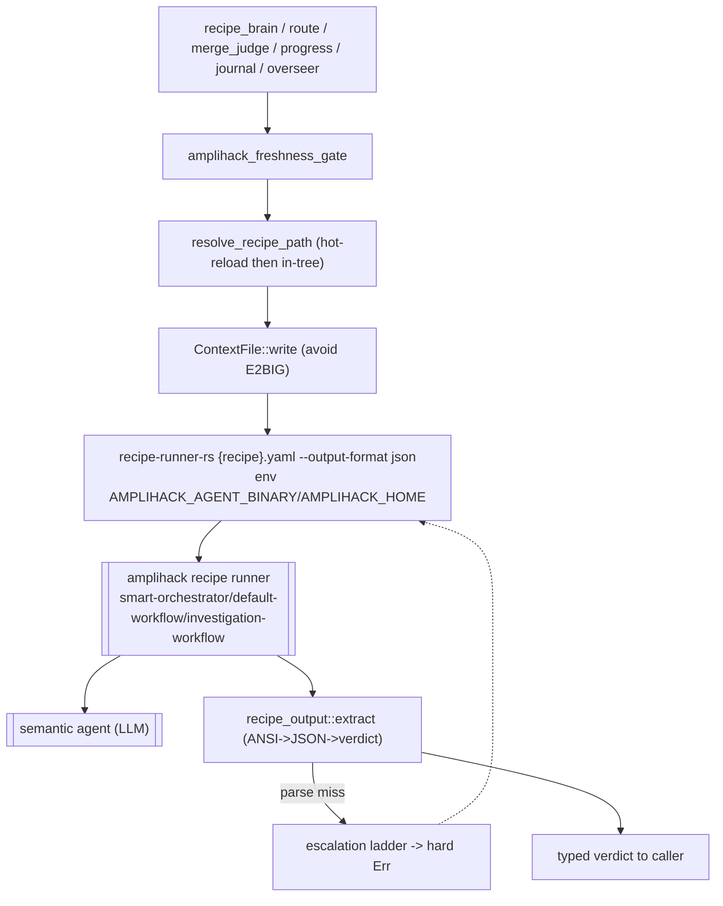
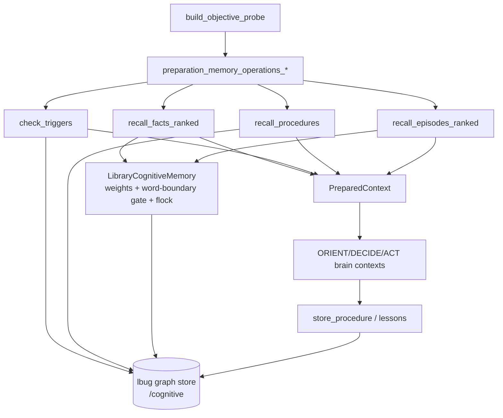
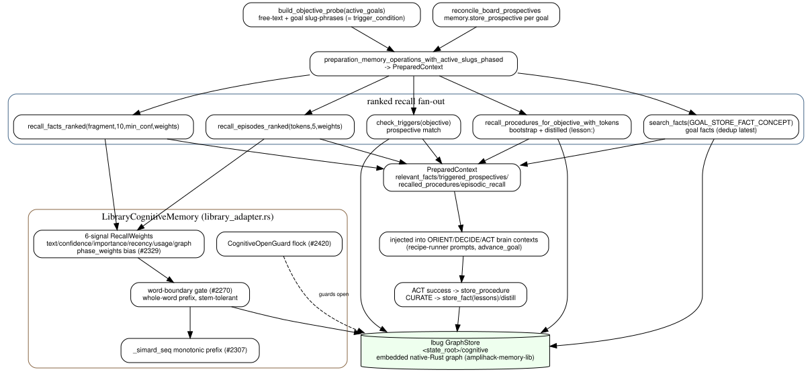
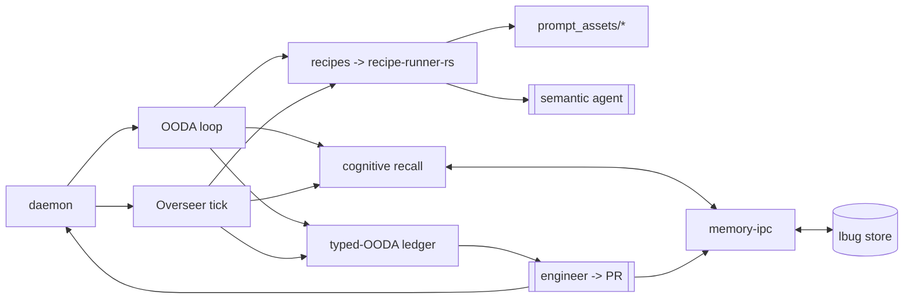
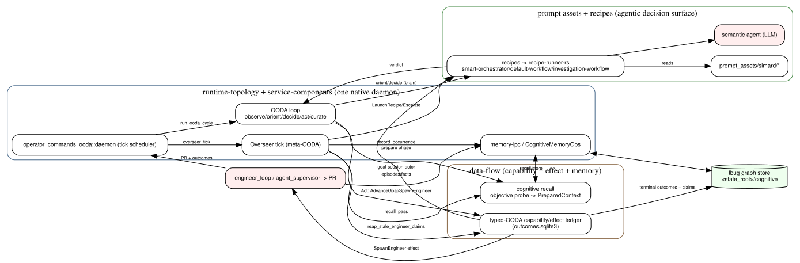

# Simard Code Atlas: Agentic Flows

This layer maps **how Simard thinks and acts** — the agentic control planes — from
code truth. It exists because the higher-level layers (runtime-topology, data-flow,
user-journeys) show *where* subsystems live, but not *how the autonomous decision
machinery interlocks*. Each flow below has a Mermaid source (`.mmd`, also inlined as a
fenced block so it renders on GitHub), a matching DOT source (`.dot`), and rendered
`*-mermaid.svg` + `*-dot.svg`.

> Diagramming is investigation. Every node cites a real Rust module, function, or
> `prompt_assets/` file. Where a mechanism is a deterministic rail vs. an LLM
> ("brain") judgment, the diagram says so — the boundary between *semantic* choice and
> *mechanical* enforcement is the most important thing this layer records.

## Flow inventory

| # | Flow | Entry point (code truth) | What it does |
|---|------|--------------------------|--------------|
| 1 | [Outer OODA loop](#1-outer-ooda-loop) | `ooda_loop::cycle::run_ooda_cycle` | Observe → Orient → Decide → Act → Curate over the goal board |
| 2 | [Overseer tick](#2-overseer-tick) | `overseer::wiring::overseer_tick` | Meta-OODA supervision: sense → signal → root-cause → decide → gate → act |
| 3 | [Typed-OODA capability/effect model](#3-typed-ooda-capabilityeffect-model) | `typed_ooda::route` + `typed_ooda::ledger` | Parser-free capability boundary; durable terminal outcomes + effect jobs |
| 4 | [Recipes (amplihack recipe-runner)](#4-recipes-amplihack-recipe-runner) | `ooda_brain::recipe_brain`, `overseer::launch` | Invoke `recipe-runner-rs` (smart-orchestrator / default-workflow / investigation-workflow) |
| 5 | [Prompt assets](#5-prompt-assets) | `prompt_assets.rs`, `agent_roles.rs` | Load `.md`/`.yaml`/policy assets at runtime + compile-time embeds |
| 6 | [Cognitive-memory recall](#6-cognitive-memory-recall) | `ooda_loop::cycle::build_objective_probe` → `preparation_memory_operations_*` | Objective probe → ranked recall → `PreparedContext` (lbug graph) |
| 7 | [Cross-layer linkage](#7-cross-layer-linkage) | — | How flows 1–6 interlock across atlas layers |

## Graph backend & analysis policy

`graph_backend: portable-cypher-only` · `analyzer: rust-native`

Consistent with the rest of this atlas ([`../index.md`](../index.md)): **NO kuzu, NO
Python.** These flows were derived from the Rust source (`cargo`-visible modules +
ripgrep) and the checked-in `prompt_assets/simard/*`, not a Python AST pass. The agentic
nodes and their cross-layer edges are also exported as portable OpenCypher —
[`../cypher/atlas-agentic.cypher`](../cypher/atlas-agentic.cypher) — which loads into
Simard's own embedded **lbug** graph store, Neo4j, or Memgraph.

---

## 1. Outer OODA loop

`operator_commands_ooda::daemon` runs one cycle per tick via
`ooda_loop::cycle::run_ooda_cycle`, wrapped in `ooda_brain::with_brain_judgment_scope`
so brain judgments are captured even when LLM calls hop Tokio worker threads. The cycle
is **Observe → Prepare(recall) → Orient → Decide → Coverage → Act → Review → Curate**.
Orient and Decide each have a deterministic path *and* a brain path
(`orient_with_brain` / `decide_with_brain`); on a brain error the loop degrades to the
deterministic floor rather than fabricating an outcome. Act crosses the typed-OODA
capability boundary (flow 3) to spawn engineers or advance goals.




**Key edges:** `run_ooda_cycle_inner` orders the phases; `build_objective_probe`
(`ooda_loop/cycle.rs`) feeds Prepare; `ensure_goal_coverage`
(`ooda_loop/coverage.rs`) guarantees each incomplete goal is covered before Act;
successful outcomes call `store_procedure`, curation writes lessons.

## 2. Overseer tick

The Overseer is a **meta-OODA loop** that supervises the primary loop without fighting
it. `overseer::wiring::overseer_tick` → `overseer_tick_detailed` (panic-isolated) runs
`Overseer::run_cycle`: it first reconciles in-flight investigations and reaps stale
engineer claims, then **Observes** a multi-source `ObservedState` (status snapshot,
goal-board health, workstream gaps, merge-ready PRs, recent step failures, and optional
cognitive-memory recall). `signals_from` projects signals; `observer::orient` dedups
them against in-flight work; **every** problem is then enriched with a mandatory
root-cause WHY (`root_cause::analyze`, issue #2635). `decide` chooses an `Intervention`,
guardrails gate it (autonomy / recursion / budget / conflict / whisper / backoff), and
`Overseer::act` dispatches — `LaunchRecipe`, `VerifyAndMergePr`, `Deploy`, `FileIssue`,
`Escalate(BlockedGoal)`, `Whisper`, `UnblockGoal`. Outcomes are recorded back to memory
via `record_occurrence` for recurrence detection.




## 3. Typed-OODA capability/effect model

`src/typed_ooda` is the **parser-free capability boundary**: semantic agents decide
*what* to do, but Rust authenticates, authorizes, applies deterministic rails, persists
a single durable terminal outcome per `(session, cycle)`, and executes admitted effects.
`route::TypedGoalSessionRoute::execute` validates that the loaded recipe/policy match the
compiled-in `TRUSTED_RECIPE` / `TRUSTED_POLICY`, then invokes the goal-session-actor
recipe (flow 4). `ledger::CapabilityHandler` (SQLite `typed-ooda/outcomes.sqlite3`) loads
the `CapabilityPolicy`, registers an `ActorSessionLease`, and enforces
`AuthenticatedToolContext.allows(grant)` against an `AdmissionSnapshot`. Terminal records
(`record_action`/`no_action`/`blocked`/`completed`/`progress`) are idempotent;
`terminal_outcomes` has `UNIQUE(session_id, cycle_id)`. Action outcomes enqueue
`effect_jobs` that move Reserved → Running → Completed|Failed under a lease
(`attempt`/`lease_generation`/`lease_owner`/`lease_expires_at`); `engineer_claims` keep a
single active claim per engineer/repo, released via `EngineerLiveness`.




## 4. Recipes (amplihack recipe-runner)

Every LLM decision Simard makes is an **agentic recipe** run through the external
`recipe-runner-rs` (which drives the amplihack recipe runner —
`smart-orchestrator` / `default-workflow` / `investigation-workflow` — over the agent
binary named by `AMPLIHACK_AGENT_BINARY`). Call sites include `ooda_brain::recipe_brain`
(orient/decide), `typed_ooda::route` (goal-session-actor), `stewardship::recipe_merge_judge`,
`goal_curation::recipe_progress_checker`, `journal::recipe`, and `overseer::launch`.
Before each spawn the `amplihack_freshness_gate` runs `amplihack update` (flock + TTL).
`resolve_recipe_path` prefers the hot-reload copy under `~/.simard/prompt_assets/` then
the in-tree `prompt_assets/simard/recipes/*.yaml`. Large/unbounded context is written to
temp files via `recipe_context_file::ContextFile` (`-c key_path=…`) to avoid `E2BIG`.
Output is parsed by `recipe_output::extract` (strip ANSI/noise → last balanced JSON →
verdict); parse misses climb an escalation ladder (schema-repair → high-effort → hard
`Err`, never a silent default — issues #2432/#2580).




## 5. Prompt assets

`prompt_assets/simard/*` is the source of truth for every system/reasoning prompt.
`prompt_assets.rs` defines `trait PromptAssetStore` with `FilePromptAssetStore` (root =
`~/.simard/prompt_assets/` deployed, or `{repo_root}/prompt_assets/` in dev; absolute
paths and `..` traversal rejected). `agent_roles::AgentRole::prompt_assets()` maps roles
to assets (Engineer→`engineer_system.md`, Reviewer→`merge_readiness_judge.md`, …) and
`identity_precedence::resolver::resolve_prompt_assets()` merges across identities.
Recipe YAMLs embed the `.md` prompt text verbatim (with `{{var}}` slots). A few
trust-critical assets are embedded at **compile time** via `include_str!`:
`goal_session_identity.md` (`src/ooda_actions/goal_session/input.rs:126`), the
`TRUSTED_RECIPE` / `TRUSTED_POLICY` for goal-session (`typed_ooda/route.rs:18,20`), `review_pipeline.md`
(`review_pipeline.rs:98`), and `rustyclawd_default_system.md`.

> **Policy note (forbidden paths):** the deployed prompts at `~/.simard/prompt_assets/`
> are *derived from `main`* and must never be edited in place. All prompt changes are PRs
> to this repository under `prompt_assets/`.

```mermaid
flowchart TD
  tree["prompt_assets/simard/*\n(.md, recipes/*.yaml, policies/*.toml, overseer/*.md)"]
  tree --> file["FilePromptAssetStore (hot-reload ~/.simard then repo)"]
  tree -->|embed verbatim| recipes[["Recipes flow"]]
  tree -->|include_str! (TRUSTED_*)| compile["compile-time embeds"]
  roles["agent_roles::prompt_assets()"] --> file
  file --> consumers[["engineer sessions / brains / overseer / goal-session actor"]]
  compile --> consumers
```


## 6. Cognitive-memory recall

The Prepare phase turns the active goals into an **objective probe**
(`build_objective_probe`: free-text descriptions + goal slug-phrases that byte-match the
written `trigger_condition`), then
`preparation_memory_operations_with_active_slugs_phased` fans out ranked recall:
`recall_facts_ranked`, goal-store facts, `check_triggers` (prospective memory),
`recall_procedures_for_objective_with_tokens` (bootstrap + distilled `lesson:`
procedures), and `recall_episodes_ranked`. The `LibraryCognitiveMemory` adapter
(`cognitive_memory/library_adapter.rs`) scores with 6-signal `RecallWeights`
(phase-biased, #2329), applies a **word-boundary relevance gate** (#2270), stamps a
monotonic `_simard_seq` prefix for time-ordered ids (#2307), and serializes cross-process
opens with a POSIX flock guard so the store is never wiped (#2420). The single backend is
the embedded **lbug** native-Rust graph at `<state_root>/cognitive` (via
amplihack-memory-lib). The resulting `PreparedContext` is injected into the Orient/Decide/
Act brain prompts; successes feed procedures/lessons back into the store.







## 7. Cross-layer linkage

The point of this layer: the flows are not independent. The **daemon** drives both the
OODA loop and the overseer tick; both **recall** from the same lbug store via memory-ipc;
both reach the **recipes** plane (which reads **prompt assets** and drives the semantic
agent); and OODA Act plus overseer interventions both cross the **typed-OODA** capability
boundary, which is what actually spawns engineers and records durable outcomes. This map
shows those seams against the runtime-topology, service-components, and data-flow layers.







## Regenerating

This layer is rebuilt when its code-truth sources change; see triggers under
`agentic-flows` in [`../staleness-map.yaml`](../staleness-map.yaml). Render commands
(same host convention as the rest of the atlas):

```bash
# Mermaid — Chrome sandbox is disabled on this host via a puppeteer config
# (executablePath -> puppeteer chrome-headless-shell; args: --no-sandbox)
mmdc -p <puppeteer-noSandbox.json> -i FLOW.mmd -o FLOW-mermaid.svg
# Graphviz
dot -Tsvg FLOW.dot -o FLOW-dot.svg
```

Structural findings (contradictions, orphaned code, stale docs) surfaced while building
this layer are filed as GitHub issues labeled
[`code-atlas-bughunt`](https://github.com/rysweet/Simard/issues?q=label%3Acode-atlas-bughunt),
never stored in the atlas.
