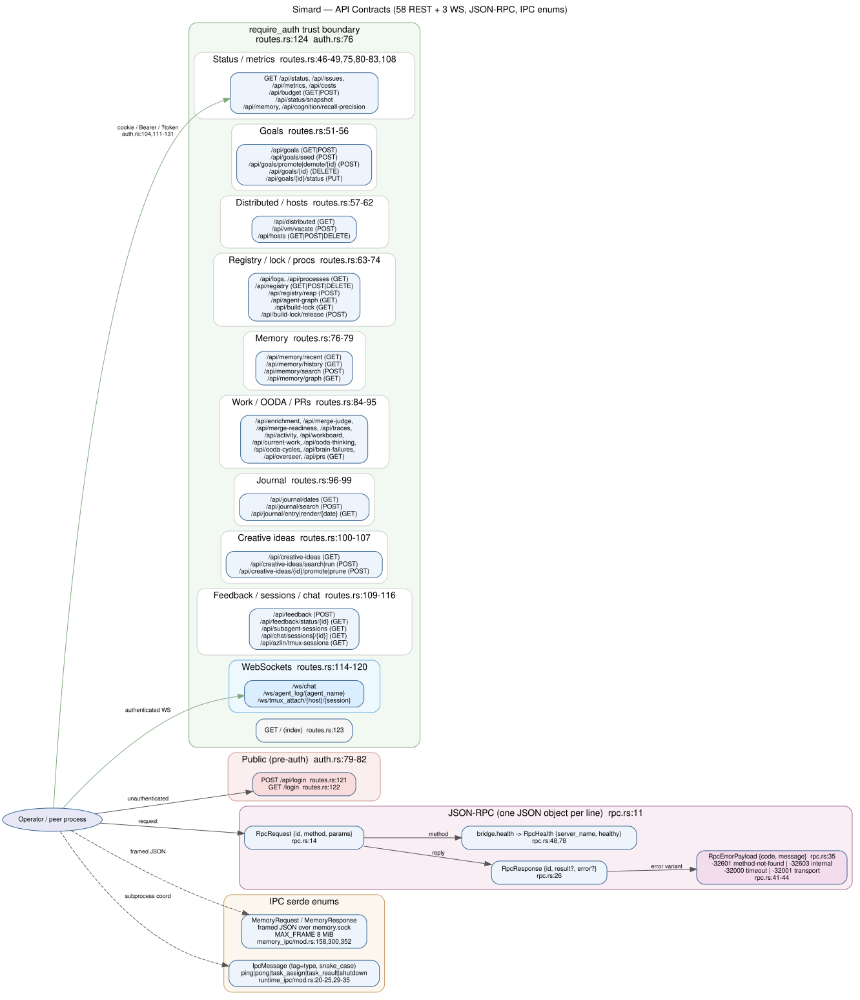

# API Contracts Atlas Layer

Simard is primarily a native Rust daemon, not a conventional HTTP API service. Its contract surface is the combination of the operator dashboard routes, operator CLI commands, Signal conversation commands, memory IPC messages, and meeting REPL slash commands.

## Surface summary

- Dashboard routes are declared in one Axum router (`src/operator_commands_dashboard/routes.rs:45`) and protected by `require_auth` (`src/operator_commands_dashboard/routes.rs:123`, `src/operator_commands_dashboard/auth.rs:68`).
- Operator CLI commands enter through `dispatch_operator_cli` (`src/operator_cli/mod.rs:240`).
- Signal command parsing lives in `parse_inbound` and `lifecycle_command` (`src/signal_conversation/gating.rs:61`, `src/signal_conversation/channel.rs:431`).
- Memory IPC is a serde-tagged JSON request/response protocol over a Unix socket (`src/memory_ipc/mod.rs:155`, `src/memory_ipc/mod.rs:297`, `src/memory_ipc/server.rs:137`).
- Meeting REPL slash commands are parsed by `parse_command` (`src/meeting_backend/command.rs:120`) and executed by `run_meeting_repl` (`src/meeting_repl/repl.rs:222`).

## Contract inventory

### Dashboard HTTP and WebSocket routes

All dashboard routes are under the same router and middleware layer. Auth guard: `/login` and `/api/login` bypass, all other `/api/*` and `/ws/*` routes require a valid session cookie, bearer token, or legacy `?token=` (`src/operator_commands_dashboard/auth.rs:68`).

| Surface | Endpoint / command | Input | Handler file:line | Auth / guard |
|---|---|---|---|---|
| Dashboard | `GET /api/status` | none | `routes.rs:46 -> status` | `require_auth` |
| Dashboard | `GET /api/issues` | none | `routes.rs:47 -> issues` | `require_auth`; shells `gh issue list` |
| Dashboard | `GET /api/metrics` | none | `routes.rs:48 -> metrics` | `require_auth` |
| Dashboard | `GET /api/costs` | none | `routes.rs:49 -> costs` | `require_auth` |
| Dashboard | `GET /api/budget`; `POST /api/budget` | JSON body for set | `routes.rs:50 -> get_budget/set_budget` | `require_auth` |
| Dashboard | `GET /api/goals`; `POST /api/goals` | JSON goal for post | `routes.rs:51 -> goals/add_goal` | `require_auth`; memory launcher |
| Dashboard | `POST /api/goals/seed` | none | `routes.rs:52 -> seed_goals` | `require_auth` |
| Dashboard | `POST /api/goals/promote/{id}` | path `id` | `routes.rs:53 -> promote_backlog_item` | `require_auth` |
| Dashboard | `POST /api/goals/demote/{id}` | path `id` | `routes.rs:54 -> demote_goal` | `require_auth` |
| Dashboard | `DELETE /api/goals/{id}` | path `id` | `routes.rs:55 -> remove_goal` | `require_auth` |
| Dashboard | `PUT /api/goals/{id}/status` | path `id`, JSON status | `routes.rs:56 -> update_goal_status` | `require_auth` |
| Dashboard | `GET /api/distributed` | none | `routes.rs:57 -> distributed` | `require_auth` |
| Dashboard | `POST /api/vm/vacate` | VM/host JSON | `routes.rs:58 -> vacate_vm` | `require_auth` |
| Dashboard | `GET/POST/DELETE /api/hosts` | JSON host for post/delete | `routes.rs:59 -> get_hosts/add_host/remove_host` | `require_auth` |
| Dashboard | `GET /api/logs` | query filters | `routes.rs:63 -> logs` | `require_auth`; shells `journalctl` |
| Dashboard | `GET /api/processes` | none | `routes.rs:64 -> processes` | `require_auth` |
| Dashboard | `GET/POST/DELETE /api/registry` | JSON registry records | `routes.rs:65 -> registry_list/register/deregister` | `require_auth` |
| Dashboard | `POST /api/registry/reap` | none | `routes.rs:71 -> registry_reap` | `require_auth` |
| Dashboard | `GET /api/agent-graph` | none | `routes.rs:72 -> agent_graph` | `require_auth` |
| Dashboard | `GET /api/build-lock` | none | `routes.rs:73 -> build_lock_status` | `require_auth` |
| Dashboard | `POST /api/build-lock/release` | none | `routes.rs:74 -> build_lock_force_release` | `require_auth` |
| Dashboard | `GET /api/memory` | none | `routes.rs:75 -> memory_metrics` | `require_auth`; memory reader |
| Dashboard | `GET /api/memory/recent` | optional time/limit query | `routes.rs:76 -> memory_recent` | `require_auth`; memory reader |
| Dashboard | `GET /api/memory/history` | optional history query | `routes.rs:77 -> memory_history` | `require_auth`; memory reader |
| Dashboard | `POST /api/memory/search` | search JSON | `routes.rs:78 -> memory_search` | `require_auth`; memory reader |
| Dashboard | `GET /api/memory/graph` | optional graph query | `routes.rs:79 -> memory_graph` | `require_auth`; memory reader |
| Dashboard | `GET /api/cognition/recall-precision` | none | `routes.rs:80 -> recall_precision_correlation` | `require_auth` |
| Dashboard | `GET /api/enrichment` | none | `routes.rs:84 -> enrichment` | `require_auth` |
| Dashboard | `GET /api/merge-judge` | none | `routes.rs:85 -> merge_judge_decisions` | `require_auth` |
| Dashboard | `GET /api/merge-readiness` | optional PR query | `routes.rs:86 -> merge_readiness` | `require_auth` |
| Dashboard | `GET /api/traces` | optional filters | `routes.rs:87 -> traces` | `require_auth` |
| Dashboard | `GET /api/activity` | none | `routes.rs:88 -> activity` | `require_auth`; may read journalctl |
| Dashboard | `GET /api/workboard` | none | `routes.rs:89 -> workboard` | `require_auth` |
| Dashboard | `GET /api/current-work` | none | `routes.rs:90 -> current_work` | `require_auth` |
| Dashboard | `GET /api/ooda-thinking` | none | `routes.rs:91 -> ooda_thinking` | `require_auth` |
| Dashboard | `GET /api/ooda-cycles` | none | `routes.rs:92 -> ooda_cycles` | `require_auth` |
| Dashboard | `GET /api/brain-failures` | none | `routes.rs:93 -> brain_failures` | `require_auth` |
| Dashboard | `GET /api/overseer` | none | `routes.rs:94 -> overseer` | `require_auth` |
| Dashboard | `GET /api/prs` | optional repo/query | `routes.rs:95 -> pr_readiness` | `require_auth`; shells `gh` |
| Dashboard | `GET /api/journal/dates` | none | `routes.rs:96 -> journal_dates` | `require_auth` |
| Dashboard | `POST /api/journal/search` | search JSON | `routes.rs:97 -> journal_search` | `require_auth` |
| Dashboard | `GET /api/journal/entry/{date}` | path `date` | `routes.rs:98 -> journal_entry` | `require_auth` |
| Dashboard | `GET /api/journal/render/{date}` | path `date` | `routes.rs:99 -> journal_render` | `require_auth` |
| Dashboard | `GET /api/creative-ideas` | none | `routes.rs:100 -> creative_ideas` | `require_auth` |
| Dashboard | `POST /api/creative-ideas/search` | search JSON | `routes.rs:101 -> creative_ideas_search` | `require_auth` |
| Dashboard | `POST /api/creative-ideas/run` | none | `routes.rs:102 -> creative_ideas_run` | `require_auth`; recipe runner availability |
| Dashboard | `POST /api/creative-ideas/{id}/promote` | path `id` | `routes.rs:103 -> creative_ideas_promote` | `require_auth` |
| Dashboard | `POST /api/creative-ideas/{id}/prune` | path `id` | `routes.rs:107 -> creative_ideas_prune` | `require_auth` |
| Dashboard | `GET /api/status/snapshot` | none | `routes.rs:108 -> status_snapshot` | `require_auth` |
| Dashboard | `POST /api/feedback` | `{report, context}` JSON | `routes.rs:109 -> feedback_submit` | `require_auth`; launches governed workstream |
| Dashboard | `GET /api/feedback/status/{id}` | path `id` | `routes.rs:110 -> feedback_status` | `require_auth` |
| Dashboard | `GET /api/subagent-sessions` | none | `routes.rs:111 -> subagent_sessions` | `require_auth`; tmux registry |
| Dashboard | `GET /api/chat/sessions` | none | `routes.rs:112 -> chat_sessions` | `require_auth` |
| Dashboard | `GET /api/chat/sessions/{id}` | path `id` | `routes.rs:113 -> chat_session_by_id` | `require_auth` |
| Dashboard | `GET /ws/chat` | WebSocket upgrade | `routes.rs:114 -> ws_chat_handler` | `require_auth` |
| Dashboard | `GET /ws/agent_log/{agent_name}` | path `agent_name` | `routes.rs:115`, `agent_log.rs:19 -> ws_agent_log_handler` | `require_auth` |
| Dashboard | `GET /api/azlin/tmux-sessions` | none | `routes.rs:116 -> azlin_tmux_sessions` | `require_auth`; shells `tmux` |
| Dashboard | `GET /ws/tmux_attach/{host}/{session}` | path `host`, `session`; WebSocket upgrade | `routes.rs:117 -> ws_tmux_attach_handler` | `require_auth` |
| Dashboard | `POST /api/login` | JSON `{code}` | `routes.rs:121`, `auth.rs:160 -> login` | auth bypass; validates `.dashkey` code |
| Dashboard | `GET /login` | none | `routes.rs:122`, `auth.rs:189 -> login_page` | auth bypass |
| Dashboard | `GET /` | none | `routes.rs:123 -> index` | `require_auth` |

### Operator CLI commands

| Surface | Endpoint / command | Input | Handler file:line | Auth / guard |
|---|---|---|---|---|
| CLI | `engineer ...` | topology, workspace, objective, recipes | `operator_cli/mod.rs:241 -> engineer::dispatch_engineer_command` | local operator process |
| CLI | `meeting run/read/repl/resume` | base-type, topology, topic/objective, state-root | `operator_cli/mod.rs:242`, `operator_cli/meeting.rs:37` | local operator process; REPL requires LLM backend |
| CLI | `goal list/add/demote/set-priority/unblock/unblock-all/remove/cleanup` | goal IDs, priority, descriptions | `operator_cli/mod.rs:243`, `operator_cli/mod.rs:73` | local process; memory client |
| CLI | `goal-curation run/read` | base-type, topology, objective, state-root | `operator_cli/mod.rs:244`, `operator_cli/mod.rs:94` | local process; memory client |
| CLI | `improvement-curation run/read` | base-type, topology, objective, state-root | `operator_cli/mod.rs:245`, `operator_cli/mod.rs:100` | local process; memory client |
| CLI | `creative-ideas consolidate [--apply]` | optional apply flag | `operator_cli/mod.rs:246`, `operator_cli/mod.rs:102` | dry-run unless `--apply` |
| CLI | `review ...` | review args | `operator_cli/mod.rs:247` | local process |
| CLI | `gym list/run/compare/run-suite/recall-precision/enrichment-ablation` | scenario/suite IDs | `operator_cli/mod.rs:248`, `operator_cli/mod.rs:103` | local process |
| CLI | `ooda run` | `--cycles`, `--no-auto-reload`, `--no-dashboard`, `--dashboard-port`, state-root | `operator_cli/mod.rs:249`, `operator_cli/ooda.rs:31` | daemon owns memory writer; optional dashboard |
| CLI | `ooda outcomes` | state-root, request-id, limit | `operator_cli/ooda.rs:21`, `operator_cli/ooda.rs:62` | typed ledger access |
| CLI | `ooda terminal` | typed terminal plus scoped paths/token | `operator_cli/ooda.rs:23`, `operator_cli/ooda.rs:66` | capability policy + actor auth token |
| CLI | `ooda approvals` | state-root, effect-id, request-id | `operator_cli/ooda.rs:25`, `operator_cli/ooda.rs:64` | server principal/signing key |
| CLI | `dashboard serve [--port=PORT]` | optional port | `operator_cli/mod.rs:250`, `operator_cli/dashboard.rs:15` | login code auth after startup |
| CLI | `signal run` | no args; `[signal]` config | `operator_cli/mod.rs:251`, `operator_cli/signal.rs:42` | Signal allowlist, feature-gated implementation |
| CLI | `memory stats/dump/import/remember` | state-root, JSON/type/limit, fact args | `operator_cli/mod.rs:252`, `operator_cli/memory.rs:152` | memory launcher; `remember` exits with precise status |
| CLI | `status [--json]` | optional JSON flag | `operator_cli/mod.rs:253` | local process |
| CLI | `spawn <agent-name> <goal> <worktree-path> [--depth=N]` | agent, goal, path, depth | `operator_cli/mod.rs:254`, `operator_cli/mod.rs:397` | local process; supervisor rails |
| CLI | `merge-pr <pr-number> [--repo owner/repo]` | PR number and optional repo | `operator_cli/mod.rs:255`, `operator_cli/mod.rs:126` | merge authority gates |
| CLI | `worktree-gc`, `disk-reclaim`, `handover`, `bootstrap`, `act-on-decisions`, `update`, `self-test`, `self-health`, `ci-health`, `self-deploy`, `safe-update`, `rollback`, `rollback-watchdog`, `ensure-deps`, `cleanup` | command-specific flags | `operator_cli/mod.rs:256-309` | local process; command-specific safety rails |

### Signal conversation commands

| Surface | Endpoint / command | Input | Handler file:line | Auth / guard |
|---|---|---|---|---|
| Signal | JSON-RPC TCP transport | newline-delimited JSON-RPC 2.0 lines from signal-cli | `signal_conversation/transport.rs:194`, `signal_conversation/transport.rs:214` | configured endpoint/account/allowlist |
| Signal | `/help` | exact slash command | `signal_conversation/channel.rs:431`, `signal_conversation/channel.rs:445` | allowlisted sender or read-only unknown behavior before response |
| Signal | `/new`, `/reset` | exact slash command | `signal_conversation/channel.rs:433` | lifecycle command; not persisted as turn |
| Signal | `/close` | exact slash command | `signal_conversation/channel.rs:437` | lifecycle command; writes handoff |
| Signal | `status` | plain text | `signal_conversation/gating.rs:63`, `signal_conversation/channel.rs:194` | low-risk auto-execute |
| Signal | `pause` | plain text | `signal_conversation/gating.rs:65`, `signal_conversation/channel.rs:194` | low-risk auto-execute |
| Signal | `approve` | plain text | `signal_conversation/gating.rs:67`, `signal_conversation/channel.rs:194` | low-risk; consumes pending high-risk command |
| Signal | `deploy` | plain text | `signal_conversation/gating.rs:69`, `signal_conversation/gating.rs:108` | high-risk; pending sign-off, never direct from text |
| Signal | `merge #NNNN` or `merge NNNN` | PR number | `signal_conversation/gating.rs:71`, `signal_conversation/gating.rs:78` | high-risk; pending sign-off |
| Signal | ordinary text | any other trimmed text | `signal_conversation/gating.rs:73` | conversation turn; allowlist/identity binding |

### Memory IPC request/response protocol

Wire format: 4-byte big-endian length prefix plus serde JSON payload. Requests use `#[serde(tag = "op", rename_all = "snake_case")]`; responses use `#[serde(tag = "ok", content = "value", rename_all = "snake_case")]`. Guard: socket permissions are best-effort `0600`; `read_frame` rejects payloads above `MAX_FRAME = 8 MiB` before allocation (`src/memory_ipc/server.rs:53`, `src/memory_ipc/mod.rs:352`).

| Surface | Endpoint / command | Input | Handler file:line | Auth / guard |
|---|---|---|---|---|
| Memory IPC | `Ping` | none | `memory_ipc/server.rs:139` | connect handshake |
| Memory IPC | `RecordSensory` | `modality`, `raw_data`, `ttl_seconds` | `memory_ipc/mod.rs:160`, `server.rs:140` | socket + frame guard |
| Memory IPC | `PruneExpiredSensory` | none | `memory_ipc/mod.rs:165`, `server.rs:146` | socket + frame guard |
| Memory IPC | `PushWorking` | `slot_type`, `content`, `task_id`, `relevance` | `memory_ipc/mod.rs:166`, `server.rs:150` | socket + frame guard |
| Memory IPC | `GetWorking` | `task_id` | `memory_ipc/mod.rs:172`, `server.rs:158` | socket + frame guard |
| Memory IPC | `ClearWorking` | `task_id` | `memory_ipc/mod.rs:175`, `server.rs:162` | socket + frame guard |
| Memory IPC | `StoreEpisode` | `content`, `source_label`, optional metadata | `memory_ipc/mod.rs:178`, `server.rs:166` | socket + frame guard |
| Memory IPC | `ConsolidateEpisodes` | `batch_size` | `memory_ipc/mod.rs:183`, `server.rs:174` | socket + frame guard |
| Memory IPC | `StoreFact` | concept/content/confidence/tags/source | `memory_ipc/mod.rs:186`, `server.rs:185` | trusted direct write; not distiller boundary |
| Memory IPC | `StoreFactGated` | concept/content/tags/source_episode_ids/pass_id | `memory_ipc/mod.rs:203`, `server.rs:199` | server recomputes confidence, grounds, dedups, quarantines |
| Memory IPC | `SearchFacts` | `query`, `limit`, `min_confidence` | `memory_ipc/mod.rs:212`, `server.rs:211` | socket + frame guard |
| Memory IPC | `StoreProcedure` | `name`, `steps`, `prerequisites` | `memory_ipc/mod.rs:217`, `server.rs:219` | socket + frame guard |
| Memory IPC | `StoreProcedureProvenance` | `name`, `steps`, `prerequisites`, `source_episode_ids`, `pass_id` | `memory_ipc/mod.rs:226`, `server.rs:227` | rejects ungrounded cited provenance |
| Memory IPC | `RecallProcedure` | `query`, `limit` | `memory_ipc/mod.rs:233`, `server.rs:259` | socket + frame guard |
| Memory IPC | `StoreProspective` | description/trigger/action/priority | `memory_ipc/mod.rs:237`, `server.rs:266` | socket + frame guard |
| Memory IPC | `CheckTriggers` | `content` | `memory_ipc/mod.rs:243`, `server.rs:281` | socket + frame guard |
| Memory IPC | `ResolveProspective` | `node_id` | `memory_ipc/mod.rs:246`, `server.rs:285` | socket + frame guard |
| Memory IPC | `ListProspectiveByTrigger` | `trigger`, `limit` | `memory_ipc/mod.rs:255`, `server.rs:291` | socket + frame guard |
| Memory IPC | `SearchEpisodesByKeywords` | keywords, limit | `memory_ipc/mod.rs:261`, `server.rs:297` | socket + frame guard |
| Memory IPC | `DrainPassLedger` | `pass_id` | `memory_ipc/mod.rs:271`, `server.rs:321` | distiller accepted-fact count |
| Memory IPC | `ListAllEpisodes` | `limit` | `memory_ipc/mod.rs:282`, `server.rs:303` | avoids socket-tier empty trait default |
| Memory IPC | `ListAllProspective` | `limit` | `memory_ipc/mod.rs:291`, `server.rs:307` | avoids socket-tier empty trait default |
| Memory IPC | `GetStatistics` | none | `memory_ipc/mod.rs:294`, `server.rs:324` | socket + frame guard |

### Meeting REPL slash commands

| Surface | Endpoint / command | Input | Handler file:line | Auth / guard |
|---|---|---|---|---|
| Meeting REPL | `/help` | none | `meeting_backend/command.rs:127`, `meeting_repl/repl.rs:263` | local stdin; LLM backend required at REPL start |
| Meeting REPL | `/close`, `/done` | none | `meeting_backend/command.rs:128` | writes/persists handoff |
| Meeting REPL | `/status` | none | `meeting_backend/command.rs:129` | read-only |
| Meeting REPL | `/export` | none | `meeting_backend/command.rs:130` | exports transcript |
| Meeting REPL | `/recap` | none | `meeting_backend/command.rs:131` | read-only recap |
| Meeting REPL | `/preview` | none | `meeting_backend/command.rs:132` | read-only preview |
| Meeting REPL | `/state` | none | `meeting_backend/command.rs:133` | read-only structured state |
| Meeting REPL | `/template [name]` | optional template name | `meeting_backend/command.rs:134`, `meeting_backend/command.rs:405` | known templates: standup, 1on1, retro, planning |
| Meeting REPL | `/theme <text>` | non-empty text | `meeting_backend/command.rs:139`, `meeting_backend/command.rs:386` | empty payload becomes conversation |
| Meeting REPL | `/decision <text> [--rationale <why>]` | decision text, optional rationale | `meeting_backend/command.rs:147`, `meeting_backend/command.rs:361` | empty payload becomes conversation |
| Meeting REPL | `/action <text>` | action text | `meeting_backend/command.rs:160`, `meeting_backend/command.rs:366` | empty payload becomes conversation |
| Meeting REPL | `/question <text>` | question text | `meeting_backend/command.rs:168`, `meeting_backend/command.rs:371` | empty payload becomes conversation |
| Meeting REPL | `/owner <name>` | owner text | `meeting_backend/command.rs:176`, `meeting_backend/command.rs:391` | empty payload becomes conversation |
| Meeting REPL | `/goal <text>` | goal text | `meeting_backend/command.rs:184`, `meeting_backend/command.rs:396` | empty payload becomes conversation |
| Meeting REPL | `/risk <text>` | risk text | `meeting_backend/command.rs:192`, `meeting_backend/command.rs:376` | empty payload becomes conversation |
| Meeting REPL | `/disagree <text>` | dissent text | `meeting_backend/command.rs:200`, `meeting_backend/command.rs:381` | empty payload becomes conversation |
| Meeting REPL | ordinary text | any non-command text | `meeting_backend/command.rs:208`, `meeting_backend/command.rs:70` | forwarded to LLM meeting backend |
