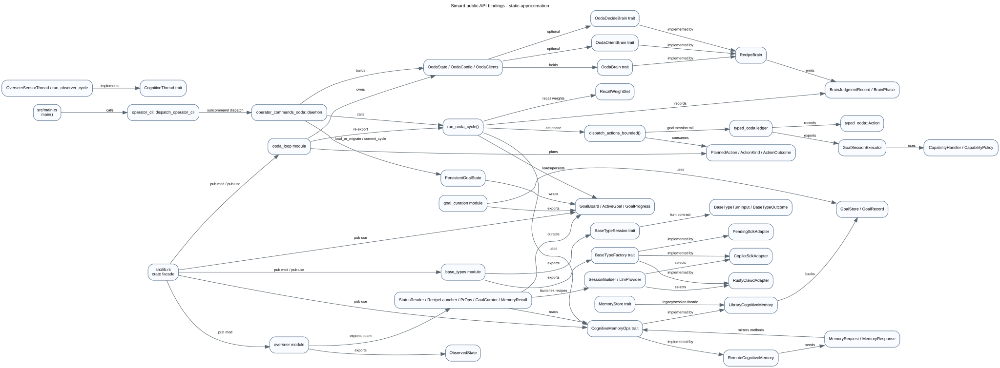

Mode: static-approximation

# AST+LSP Symbol Bindings

This layer maps Simard's public Rust API surface using static approximation: `ripgrep` for exported symbols and reference counts, plus direct source reads of the central modules. `rust-analyzer` exists on the host, but live LSP symbol wiring was intentionally not used for this layer.

## Binding summary

Simard exposes a broad single-crate facade from `src/lib.rs`, then narrows actual daemon execution through `src/main.rs` -> `operator_cli::dispatch_operator_cli` -> `operator_commands_ooda::daemon` -> `ooda_loop::run_ooda_cycle`. The important public seams are trait-shaped: `CognitiveMemoryOps`, `BaseTypeFactory`, `BaseTypeSession`, OODA brain traits, goal stores, and Overseer capability traits.

The OODA loop is the binding hub. `OodaState` holds the goal board, prepared memory context, no-progress tracker, engineer worktrees, identity cognition, and optional brain implementations (`src/ooda_loop/types.rs:85`, `src/ooda_loop/types.rs:493`, `src/ooda_loop/types.rs:573`). `run_ooda_cycle` then calls observe/orient/decide/act/curate and delegates the Act phase to `ooda_actions::dispatch_actions_bounded` (`src/ooda_loop/cycle.rs:28`, `src/ooda_loop/mod.rs:109`, `src/ooda_actions/mod.rs:73`).

## Inventory of key public symbols

| Symbol | Defining file | Referenced by / binding notes |
| --- | --- | --- |
| `dispatch_operator_cli` | `src/operator_cli/mod.rs:219` | Called by `src/main.rs:7`; re-exported by `src/lib.rs:382`. |
| `run_ooda_cycle` | `src/ooda_loop/cycle.rs:28` | Re-exported by `src/ooda_loop/mod.rs:118` and `src/lib.rs:358`; invoked by OODA daemon (`src/operator_commands_ooda/daemon/mod.rs:10`). |
| `OodaState` | `src/ooda_loop/types.rs:85` | Owns `GoalBoard`, prepared memory, engineer worktrees, no-progress tracker, and identity cognition; used across daemon/tests/actions. |
| `OodaClients` | `src/ooda_loop/types.rs:562` | Carries `Box<dyn CognitiveMemoryOps>`, brain traits, session factory, progress checker, and live signal sources; constructed by `client_factory` and daemon wiring. |
| `ActionKind`, `PlannedAction`, `ActionOutcome` | `src/ooda_loop/types.rs:240`, `src/ooda_loop/types.rs:272`, `src/ooda_loop/types.rs:280` | Planned in `decide`, consumed by `dispatch_actions_bounded`, persisted in cycle reports. |
| `dispatch_actions_bounded` | `src/ooda_actions/mod.rs:89` | Called by `ooda_loop::act` (`src/ooda_loop/mod.rs:115`); partitions concurrent vs serialized action execution. |
| `OodaBrain` | `src/ooda_brain/mod.rs:616` | Held by `OodaClients` (`src/ooda_loop/types.rs:573`); implemented by deterministic, RustyClawd, and recipe-backed brains. |
| `OodaDecideBrain` / `OodaOrientBrain` | `src/ooda_brain/decide.rs:108`, `src/ooda_brain/orient.rs:117` | Optional in `OodaClients` (`src/ooda_loop/types.rs:577`, `src/ooda_loop/types.rs:581`); recipe brains wired by daemon brain factory. |
| `RecipeBrain` | `src/ooda_brain/recipe_brain.rs:705` | Type aliases in `src/ooda_brain/mod.rs:74`; used as lifecycle/decide/orient recipe-backed brain. |
| `BrainJudgmentRecord` / `BrainPhase` | `src/ooda_brain/judgment_record.rs:82`, `src/ooda_brain/judgment_record.rs:40` | Captured per-cycle by `with_brain_judgment_scope` in `run_ooda_cycle` (`src/ooda_loop/cycle.rs:38`). |
| `CognitiveMemoryOps` | `src/cognitive_memory/mod.rs:209` | Core memory trait; implemented by `LibraryCognitiveMemory`, `RemoteCognitiveMemory`, IPC shared memory, and clients/mocks. |
| `LibraryCognitiveMemory` | `src/cognitive_memory/library_adapter.rs:154` | Only persistent lbug-backed cognitive backend; opened by daemon/bootstrap/client factory. |
| `RemoteCognitiveMemory` | `src/memory_ipc/client.rs:22` | Implements `CognitiveMemoryOps` over Unix socket; used by CLI and reader/writer launchers. |
| `MemoryRequest` / `MemoryResponse` | `src/memory_ipc/mod.rs:158`, `src/memory_ipc/mod.rs:300` | IPC wire protocol mirroring `CognitiveMemoryOps` methods. |
| `RecallWeightSet` | `src/cognitive_memory/mod.rs:35` | Used by `ooda_loop::phase_weights` (`src/ooda_loop/phase_weights.rs:30`) and ranked recall APIs. |
| `GoalBoard`, `ActiveGoal`, `GoalProgress` | `src/goal_curation/types.rs` via `src/goal_curation/mod.rs:28` | The active/backlog board read by OODA, Overseer, CLI, dashboard, and goal store migration. |
| `PersistentGoalState` | `src/goal_board_store/mod.rs:65` | Durable state wrapper loaded/committed by OODA daemon (`src/operator_commands_ooda/daemon/mod.rs:545`, `src/operator_commands_ooda/daemon/mod.rs:1422`). |
| `GoalStore`, `GoalRecord` | `src/goals/store.rs:80`, `src/goals/types.rs:107` | Goal-record abstraction backed by file and cognitive-memory stores (`src/goals/mod.rs:22`). |
| `ObservedState` | `src/overseer/capabilities.rs:77` | Overseer's observe DTO; reads status, memory recall, PRs, CI, blocked goals, and gaps. |
| `StatusReader`, `RecipeLauncher`, `PrOps`, `GoalCurator`, `MemoryRecall` | `src/overseer/capabilities.rs:304`, `src/overseer/capabilities.rs:320`, `src/overseer/capabilities.rs:334`, `src/overseer/capabilities.rs:396`, `src/overseer/capabilities.rs:689` | Overseer capability seam; adapters in `overseer/wiring.rs` and `overseer/merge_ops.rs`. |
| `OverseerSensorThread` / `run_observer_cycle` | `src/overseer/sensor.rs:537`, `src/overseer/sensor.rs:479` | Read-only cognitive-thread packaging; daemon comments say it is superseded by acting Overseer periodic task (`src/operator_commands_ooda/daemon/mod.rs:844`). |
| `BaseTypeFactory` / `BaseTypeSession` | `src/base_types.rs:245`, `src/base_types.rs:174` | Adapter factory/session abstraction used by session builder, bootstrap runtime, meeting/backend/engineer paths. |
| `BaseTypeTurnInput` / `BaseTypeOutcome` | `src/base_types.rs:146`, `src/base_types.rs:168` | Per-turn IO contract; adapters add memory/knowledge enrichment through `BaseTypeSession::enrich_input`. |
| `CopilotSdkAdapter` | `src/base_type_copilot/mod.rs:73` | Implements `BaseTypeFactory`; selected by `SessionBuilder` and exported by `src/lib.rs:236`. |
| `RustyClawdAdapter` | `src/base_type_rustyclawd/adapter.rs:15` | Implements `BaseTypeFactory`; supports single/multi-process topology and enrichment (`src/base_type_rustyclawd/adapter.rs:63`). |
| `PendingSdkAdapter` | `src/base_type_pending_sdk/adapter.rs:21` | Implements `BaseTypeFactory`; used for Claude Agent SDK and MS Agent Framework placeholders (`src/base_type_claude_agent_sdk.rs:12`, `src/base_type_ms_agent.rs:12`). |
| `SessionBuilder` / `LlmProvider` | `src/session_builder.rs:78`, `src/session_builder.rs:28` | Central runtime session factory selecting Copilot vs RustyClawd with no silent default (`src/session_builder.rs:6`). |
| `typed_ooda::Action`, `CapabilityHandler`, `GoalSessionExecutor` | `src/typed_ooda/types.rs:199`, `src/typed_ooda/ledger.rs:146`, `src/typed_ooda/executor.rs:252` | Typed action ledger/capability boundary used by `ooda_actions::advance_goal::typed_goal_session`. |

## Candidate dead or dormant public surface

These are not filed as bugs here; they are structural leads for later bug hunting.

| Candidate | Evidence | Why it matters |
| --- | --- | --- |
| `CognitiveMemoryOps::recall_facts_ranked_reinforced` | Trait default at `src/cognitive_memory/mod.rs:312`; implementation at `src/cognitive_memory/library_adapter.rs:856`; `rg` only found tests and implementation references, and the doc states "No production call site is wired to this method yet" (`src/cognitive_memory/mod.rs:300`). | Public recall+reinforce API is staged but apparently dormant; a later hunt should decide whether to wire it or demote visibility. |
| `PendingSdkAdapter` runtime sessions | `src/base_type_pending_sdk/adapter.rs:17` says it registers catalog metadata, but `run_turn` returns an explicit missing-SDK error; references are adapter/tests and placeholder aliases (`src/base_type_claude_agent_sdk.rs:12`, `src/base_type_ms_agent.rs:12`). | Public base types may be visible to identity manifests while guaranteed to fail if selected. |
| Cognitive thread docs vs daemon wiring | `src/cognitive_threads/mod.rs:5` says behavior is under TDD/todo construction, but daemon registers maintenance, engineer-log, and creative-ideas threads (`src/operator_commands_ooda/daemon/mod.rs:828`, `src/operator_commands_ooda/daemon/mod.rs:834`, `src/operator_commands_ooda/daemon/mod.rs:844`). | Possible stale module-level docs or partially implemented thread bodies; verify thread `tick()` behavior before relying on scheduler docs. |
| Overseer design-sketch header vs acting daemon integration | `src/overseer/mod.rs:10` says design/scaffolding and "not wired into main", but OODA daemon drives acting Overseer (`src/operator_commands_ooda/daemon/mod.rs:884`, `src/operator_commands_ooda/daemon/mod.rs:1676`). | Documentation drift around a high-authority component; later hunt should update docs or check whether act-path gating matches the old sketch. |
| `OverseerSensorThread` superseded but public | Re-exported in `src/overseer/mod.rs:113`; daemon comment says the read-only observer sensor is superseded by acting Overseer and not registered (`src/operator_commands_ooda/daemon/mod.rs:844`). | Dormant public packaging can confuse operators and tests if both sensor and acting loop are enabled later. |
