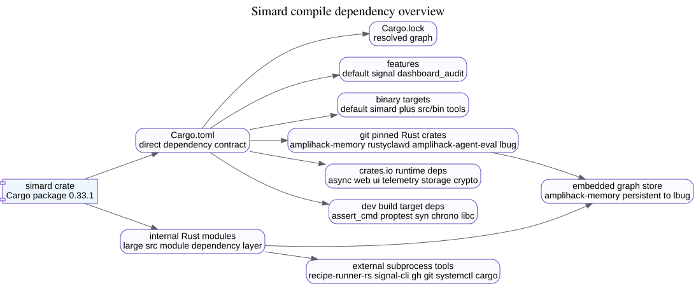
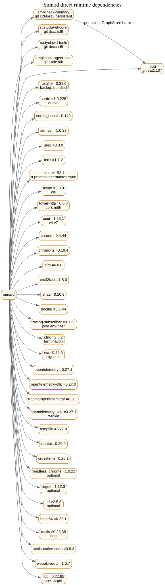
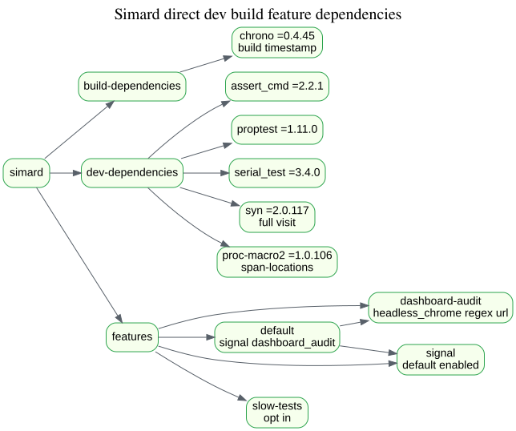
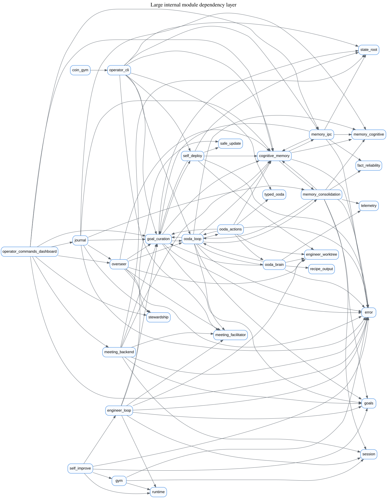

# Compile Dependencies Atlas

This layer maps Simard's direct Cargo dependencies and a one-hop view of the largest internal Rust module dependencies. The overview diagrams stay small by grouping the external crates, dev/build dependencies, and internal module graph; the split diagrams below expand those groups without exceeding the atlas density target.

## Split diagrams

## Evidence anchors

- Direct dependencies are declared in `Cargo.toml:135` through `Cargo.toml:209`; Unix target dependency is at `Cargo.toml:212`; build and dev dependencies are at `Cargo.toml:218` and `Cargo.toml:245` through `Cargo.toml:254`.
- `amplihack-memory` is pinned to `amplihack-memory-lib` with the `persistent` feature at `Cargo.toml:135`; the direct `lbug` fork pin is at `Cargo.toml:158`.
- The default feature set enables `signal` and `dashboard-audit` at `Cargo.toml:227`, and `dashboard-audit` pulls `headless_chrome`, `regex`, and `url` at `Cargo.toml:236`.
- The large internal module declarations are visible in `src/lib.rs:24`, `src/lib.rs:60`, `src/lib.rs:78`, `src/lib.rs:89`, `src/lib.rs:90`, `src/lib.rs:103`, `src/lib.rs:106`, `src/lib.rs:114`, `src/lib.rs:117`, `src/lib.rs:122`, `src/lib.rs:123`, `src/lib.rs:124`, `src/lib.rs:126`, `src/lib.rs:128`, `src/lib.rs:138`, `src/lib.rs:163`, and `src/lib.rs:164`.

## Dependency inventory

| Crate or section | Version or pin | Purpose |
| --- | --- | --- |
| `amplihack-memory` | git `c266e15d1399967c04324370e77cf281990b8be1`, feature `persistent` | Sole cognitive-memory backend adapter; persistent graph storage via upstream memory library. |
| `lbug` | git `5a2c107881879f4d1bb594b14967948870e65cdc` | Embedded LadybugDB graph store used directly by TUI and unified with `amplihack-memory`. |
| `rustyclawd-core` | git `dcccad80ed381c66a7728565be5cb84120aacbed` | RustyClawd core agent SDK integration. |
| `rustyclawd-tools` | git `dcccad80ed381c66a7728565be5cb84120aacbed` | RustyClawd tool integration. |
| `amplihack-agent-eval` | git `14dc30b10e87764120c6f2bae7f3630522c29e5d` | Native Rust gym and evaluation runner types. |
| `rusqlite` | `=0.31.0`, features `backup`, `bundled` | SQLite storage and backup support. |
| `serde` | `=1.0.228`, feature `derive` | Serialization derives for config, state, and message types. |
| `serde_json` | `=1.0.149` | JSON IO for CLI, recipes, telemetry payloads, and stored records. |
| `semver` | `=1.0.28` | Version comparison for update checks. |
| `ureq` | `=3.3.0` | In-process HTTP client for release/update checks. |
| `toml` | `=1.1.2` | TOML parsing for manifests and configuration. |
| `tokio` | `=1.52.1`, features `rt`, `rt-multi-thread`, `process`, `io-util`, `time`, `net`, `macros`, `sync` | Async runtime, subprocess, networking, and synchronization foundation. |
| `axum` | `=0.8.9`, feature `ws` | HTTP and websocket dashboard or operator services. |
| `tower-http` | `=0.6.8`, features `cors`, `auth` | HTTP middleware for CORS and auth layers. |
| `uuid` | `=1.23.4`, features `v4`, `v7` | Stable identifiers for sessions, facts, and domain records. |
| `chrono` | `=0.4.45` | Date and time handling in runtime code. |
| `chrono-tz` | `=0.10.4` | Time-zone aware dashboard timestamp formatting. |
| `dirs` | `=6.0.0` | User directory discovery for state and configuration paths. |
| `crc32fast` | `=1.5.0` | Fast checksums for persistence or integrity paths. |
| `sha2` | `=0.10.9` | SHA-2 hashing for integrity and identity calculations. |
| `tracing` | `=0.1.44` | Structured diagnostics and spans. |
| `tracing-subscriber` | `=0.3.23`, features `json`, `env-filter` | Runtime log formatting and filtering. |
| `ctrlc` | `=3.5.2`, feature `termination` | Signal handling for graceful shutdown. |
| `nix` | `=0.29.0`, features `signal`, `fs` | Unix process, signal, and filesystem primitives. |
| `opentelemetry` | `=0.27.1` | Telemetry API facade. |
| `opentelemetry-otlp` | `=0.27.0` | OTLP exporter wiring. |
| `tracing-opentelemetry` | `=0.28.0` | Bridge from tracing spans to OpenTelemetry. |
| `opentelemetry_sdk` | `=0.27.1`, feature `rt-tokio` | OpenTelemetry SDK runtime integration. |
| `tempfile` | `=3.27.0` | Test and runtime scratch file handling. |
| `ratatui` | `=0.29.0` | Terminal UI rendering for `simard-tui`. |
| `crossterm` | `=0.28.1` | Terminal input and control backend for TUI. |
| `headless_chrome` | `=1.0.21`, optional, default features disabled | Dashboard audit browser automation behind `dashboard-audit`. |
| `regex` | `=1.12.3`, optional | Pattern matching behind `dashboard-audit`. |
| `url` | `=2.5.8`, optional | URL parsing behind `dashboard-audit`. |
| `base64` | `=0.22.1` | SMTP AUTH LOGIN payload encoding. |
| `rustls` | `=0.23.38`, feature `ring` | TLS for authenticated SMTP relay and network clients. |
| `rustls-native-certs` | `=0.8.4` | Native trust roots for TLS. |
| `webpki-roots` | `=1.0.7` | WebPKI trust roots for TLS fallback. |
| `libc` | `=0.2.185`, Unix target dependency | Unix FFI bindings. |
| `chrono` build dependency | `=0.4.45` | Build-time timestamp formatting in `build.rs`. |
| `assert_cmd` dev dependency | `=2.2.1` | CLI integration assertions. |
| `proptest` dev dependency | `=1.11.0` | Property-based tests. |
| `serial_test` dev dependency | `=3.4.0` | Serialized tests for shared-state invariants. |
| `syn` dev dependency | `=2.0.117`, features `full`, `visit` | AST scanning in regression tests. |
| `proc-macro2` dev dependency | `=1.0.106`, feature `span-locations` | File and line spans for AST regression tests. |

## Internal module dependency inventory

The internal diagram is a static approximation based on direct `crate::module` references in the large source modules. It intentionally shows one hop from the largest modules, not every leaf file.

| Module | Primary one-hop dependencies shown |
| --- | --- |
| `operator_commands_dashboard` | `goal_curation`, `meeting_backend`, `memory_ipc`, `cognitive_memory`, `overseer`, `journal`, `stewardship`, `error` |
| `overseer` | `stewardship`, `error`, `goal_curation`, `cognitive_memory`, `meeting_facilitator`, `engineer_worktree`, `ooda_loop` |
| `goal_curation` | `goals`, `error`, `cognitive_memory`, `state_root`, `ooda_loop`, `self_deploy` |
| `ooda_loop` | `goal_curation`, `ooda_brain`, `error`, `memory_consolidation`, `meeting_facilitator`, `cognitive_memory`, `goals`, `ooda_actions`, `memory_cognitive` |
| `operator_cli` | `typed_ooda`, `goal_curation`, `memory_ipc`, `meeting_facilitator`, `cognitive_memory`, `ooda_loop`, `self_deploy`, `state_root` |
| `journal` | `error`, `cognitive_memory`, `stewardship`, `overseer`, `memory_cognitive`, `goal_curation`, `memory_consolidation` |
| `cognitive_memory` | `memory_cognitive`, `error`, `memory_consolidation`, `memory_ipc` |
| `ooda_actions` | `goal_curation`, `ooda_loop`, `engineer_worktree`, `ooda_brain`, `error`, `typed_ooda`, `cognitive_memory` |
| `meeting_backend` | `meeting_facilitator`, `error`, `goals`, `state_root`, `session`, `goal_curation`, `cognitive_memory` |
| `engineer_loop` | `session`, `meeting_facilitator`, `error`, `runtime`, `goals`, `goal_curation`, `engineer_worktree`, `safe_update` |
| `gym` | `runtime`, `error`, `session` |
| `memory_consolidation` | `cognitive_memory`, `session`, `fact_reliability`, `goals`, `error`, `memory_cognitive`, `telemetry`, `ooda_loop` |
| `ooda_brain` | `recipe_output`, `ooda_loop`, `goal_curation`, `error`, `telemetry`, `engineer_worktree` |
| `coin_gym` | `operator_cli` |
| `self_improve` | `gym`, `error`, `runtime`, `goals`, `engineer_loop` |
| `self_deploy` | `safe_update`, `state_root`, `cognitive_memory`, `error`, `engineer_worktree`, `goal_curation` |
| `memory_ipc` | `cognitive_memory`, `goal_curation`, `error`, `fact_reliability`, `state_root`, `memory_cognitive` |
