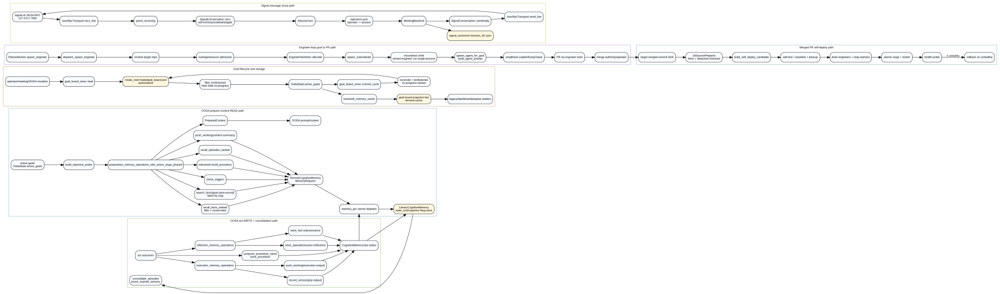
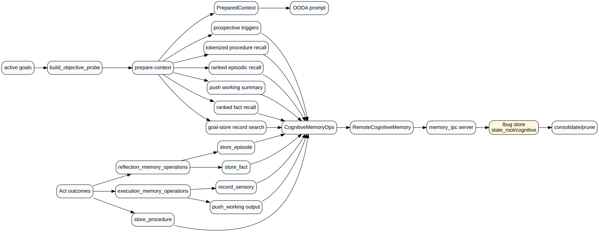
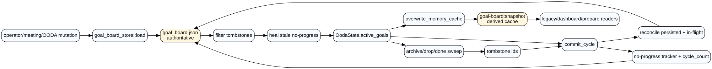
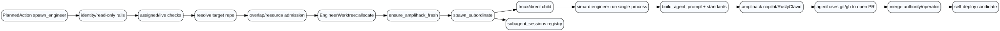
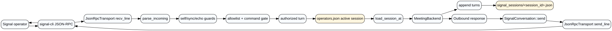
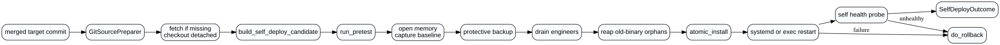

# Simard Code Atlas: Data Flow

This layer maps the primary read/write paths in Simard's Rust daemon. The atlas treats `src/goal_board_store` as the authoritative goal-board store and `amplihack-memory-lib`/lbug as the cognitive-memory graph behind `CognitiveMemoryOps`.

## Split flow diagrams

## Inventory

| Flow | Source | Transformations | Sink/store | Key files |
|---|---|---|---|---|
| OODA prepare-context read | `OodaState.active_goals` objective probe | Ranked fact recall, goal-record dedupe, prospective trigger check, tokenized procedure recall, ranked episodic recall, working-memory summary | `PreparedContext` for OODA prompt; reads `state_root/cognitive` through `CognitiveMemoryOps`/IPC | `src/ooda_loop/cycle.rs:238`, `src/memory_consolidation/mod.rs:174`, `src/memory_ipc/client.rs:161`, `src/memory_ipc/server.rs:137`, `src/cognitive_memory/library_adapter.rs:132` |
| OODA act write/consolidation | `ActionOutcome.detail` and outcome transcript | Sensory write, execution working slot, procedure upsert, reflection episode/fact write, episode consolidation/pruning | lbug-backed cognitive graph at `state_root/cognitive` | `src/ooda_loop/cycle.rs:424`, `src/ooda_loop/cycle.rs:508`, `src/memory_consolidation/mod.rs:657`, `src/memory_consolidation/mod.rs:689` |
| Goal lifecycle | Operator commands, meeting handoffs, OODA board mutations | Load authoritative file, tombstone filter, stale block heal, cycle commit, reconcile, cache refresh | `<state_root>/state/goal_board.json` authoritative; `goal-board:snapshot` cognitive-memory cache | `src/goal_board_store/mod.rs:21`, `src/goal_board_store/mod.rs:90`, `src/operator_commands_ooda/daemon/mod.rs:1248`, `src/operator_commands_ooda/daemon/mod.rs:1422`, `src/goal_curation/operations.rs:760` |
| Engineer loop | OODA `spawn_engineer` planned action | Identity/read-only rails, duplicate-live check, target repo resolution, admission gates, git worktree allocation, subordinate spawn, agent subprocess prompt | Per-engineer worktree under `<state_root>/engineer-worktrees`; PR is created by the autonomous engineer tools | `src/ooda_actions/advance_goal/spawn.rs:217`, `src/ooda_actions/advance_goal/spawn.rs:466`, `src/ooda_actions/advance_goal/spawn.rs:620`, `src/agent_supervisor/lifecycle/spawn.rs:20`, `src/engineer_loop/agent_spawn.rs:126` |
| Signal conversation | signal-cli JSON-RPC daemon (`127.0.0.1:7583`) | JSON-RPC line parse, self/sync/echo guard, allowlist/command gate, per-operator backend restore, assistant response | `<state_root>/signal_sessions/operators.json` and `<session_id>.json`; outbound JSON-RPC send | `src/signal_conversation/transport.rs:196`, `src/signal_conversation/channel.rs:240`, `src/signal_conversation/channel.rs:491`, `src/signal_conversation/session_store.rs:1` |
| Merged PR self-deploy | Target merged commit SHA | Detached checkout, warm release build, self-test, baseline/backup, drain/reap, atomic swap, restart, health probe, rollback | Installed `simard` binary plus protective backup under safe-update state | `src/self_deploy/source_prep.rs:1`, `src/self_deploy/orchestrator.rs:76`, `src/self_deploy/orchestrator.rs:260`, `src/self_deploy/restart.rs:116`, `src/self_relaunch/canary.rs:65` |
