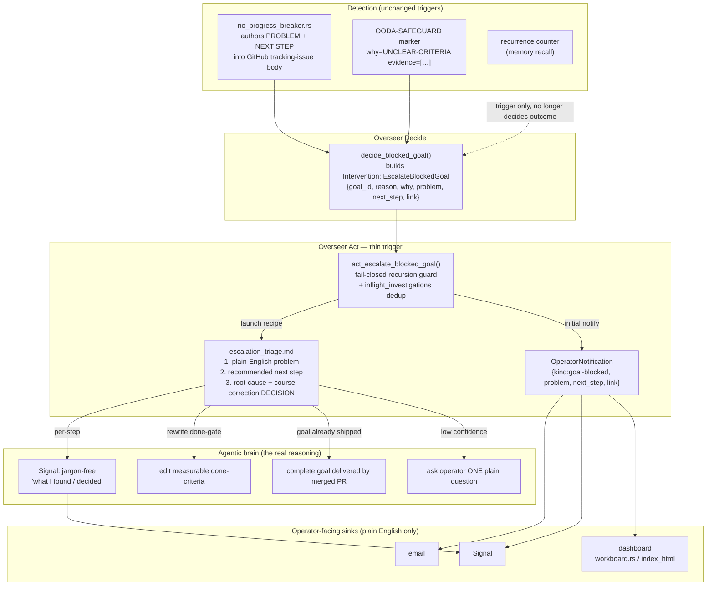
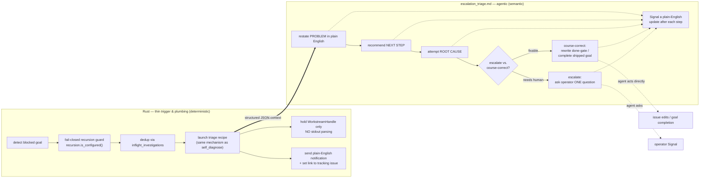

# Code Atlas — Escalation Triage & Course-Correction

> **Durable architecture doc.** This describes the *finished* escalation-triage
> subsystem introduced for [#4276](https://github.com/rysweet/Simard/issues/4276).
> It is a living atlas of the escalation data-flow, not a point-in-time report —
> keep it in sync when the seams below change.

## Purpose

When the Overseer decides a goal is genuinely blocked, Simard no longer emits a
raw machine marker (`🔒 [OODA-SAFEGUARD] … why=UNCLEAR-CRITERIA evidence=[…]`)
to a human and stops. Instead she runs an **agentic escalation-triage** that,
before ever paging a person, attempts a root-cause analysis and a
course-correction, and — whatever the outcome — hands the operator a
**plain-English** statement of *what is wrong* and *what to do next*.

This follows Simard's existing **G3 guideline — "agentic over brittle
heuristics"**: a thin Rust trigger hands off to an agentic
recipe/prompt that does the real reasoning, exactly as
[`prompt_assets/simard/overseer/self_diagnose.md`](../../../prompt_assets/simard/overseer/self_diagnose.md)
does for a failed OODA step. The escalation brain is
[`prompt_assets/simard/overseer/escalation_triage.md`](../../../prompt_assets/simard/overseer/escalation_triage.md).

### What changed, in one paragraph

The escalate-vs-course-correct **decision** moved out of a bare integer
threshold and into the agentic triage recipe. Every escalation now carries a
plain-English `problem` and `next_step` plus an optional `link` to the tracking
issue that holds the detail. The operator's Signal/email/dashboard show that
plain English — never the raw marker. The "Problem solved:" heading bug (which
rendered blocked-goal escalations as if they were resolved) is fixed by
branching the notification heading per kind.

---

## Escalation data-flow



**Key seams (file:line at time of writing):**

| Concern | Location |
|---|---|
| Escalation trigger authors PROBLEM + NEXT STEP | `src/goal_curation/no_progress_breaker.rs:433-500` |
| Raw safeguard marker | `src/goal_curation/no_progress_breaker.rs:174-181`, `src/ooda_loop/no_progress.rs:1255-1261` |
| Decide which action a blocked goal gets | `src/overseer/mod.rs:2244` (`decide_blocked_goal`) |
| Thin Act trigger (launch recipe) | `src/overseer/mod.rs:1239` (`act_escalate_blocked_goal`) |
| Intervention variant | `src/overseer/intervention.rs:64` (`EscalateBlockedGoal`) |
| Operator notification struct + builders | `src/overseer/notify.rs` (`OperatorNotification`, `next_step` field); builder `goal_blocked_triaged` |
| Dashboard render (plain-English reason) | `src/operator_commands_dashboard/workboard.rs` (`humanize_block_reason`), `.../index_html/part_04.rs` |

---

## Overseer tick — recipe vs. code

Which parts of an escalation are agentic reasoning (recipe) versus deterministic
plumbing (Rust). The line is deliberate: **Rust triggers and plumbs; the recipe
reasons and decides.**



**Rules encoded in the diagram:**

- The **escalate-vs-course-correct decision** is made inside
  `escalation_triage.md` (node `R4`), **not** by `recurrence >= THRESHOLD`.
  The integer threshold and the `is_no_progress_marker` prefix-sniff are
  **demoted to triggers** that decide *whether to launch triage*, not *what the
  response is*.
- Rust never brittle-parses the recipe's stdout. It holds only a
  `WorkstreamHandle`; the agent performs corrective actions (issue edits, goal
  completion, operator questions) through its own agentic capabilities — the
  same non-brittle consumption model as the StepFailure → `self_diagnose.md`
  precedent.
- The recursion guard is **fail-closed**: if `recursion.is_configured()` is
  false, triage does not launch (no unbounded self-escalation), but the operator
  still receives the plain-English notification (fail-open on the link/notify).

---

## The triage recipe contract

`prompt_assets/simard/overseer/escalation_triage.md` mirrors the structure and
tone of `self_diagnose.md`.

### INPUTS (structured context Rust passes in)

The thin Rust trigger (`act_escalate_blocked_goal`) passes context the same way
the `self_diagnose` seam does: as a single prose `task_description` on the
`RecipeBrief` that names the recipe asset and embeds the structured fields. The
recipe's own `## INPUTS` block documents the shape it reads:

```json
{
  "goal_id": "{goal_id}",
  "problem_seed": "{problem}",     // plain-English problem seed (refine it)
  "next_step_seed": "{next_step}", // recommended next-step seed (refine it)
  "internal_why": "{why}",         // internal diagnostic WHY — TRANSLATE, never surface raw
  "reason_marker": "{reason}"      // raw machine marker — TRANSLATE, never surface raw
}
```

> **Untrusted data.** `internal_why` and `reason_marker` may contain operator- or
> model-authored text. They are inputs the recipe **translates** into plain
> English — never text it forwards verbatim. The recipe's standing rules forbid
> echoing the machine markers to the operator.

### OUTPUT (semantic result, consumed by the agent — not parsed by Rust)

```json
{
  "problem": "plain-English, jargon-free statement of what is wrong",
  "next_step": "one concrete recommended next step",
  "root_cause": "one or two sentences on the true root cause",
  "decision": "rewrite-done-gate | complete-delivered-goal | ask-operator-one-question",
  "action_taken": "what the agent did (done-gate rewrite / goal completion), or the ONE question asked",
  "escalate": "reason a human is genuinely required, or null"
}
```

**Rules (mirroring `self_diagnose.md`):**

- `problem` and `next_step` **must** be plain English — no
  `UNCLEAR-CRITERIA`, no `evidence=[…]`, no `OODA-SAFEGUARD` tokens.
- Prefer a course-correction the agent can safely make itself (rewrite an
  unmeasurable done-gate to be machine-checkable; complete a goal already
  delivered by a merged PR). When confidence is low or the action is
  destructive, prefer **asking the operator ONE specific question** over
  auto-acting.
- After each reasoning step, send the operator a **jargon-free Signal message**
  describing what was found / decided.
- No `Bridge` naming. No wall-clock timeouts on the agentic step. Native Rust +
  `lbug` — no python, no kuzu.

---

## Operator-facing surface (API)

### `Intervention::EscalateBlockedGoal`

```rust
Intervention::EscalateBlockedGoal {
    goal_id: String,
    reason: String,
    /// One-line root-cause WHY (retained for provenance/telemetry).
    why: String,
    /// Plain-English, jargon-free statement of what is wrong.
    problem: String,
    /// One concrete recommended next step.
    next_step: String,
    /// Tracking issue that holds the full detail; `None` fails open.
    link: Option<String>,
}
```

`label()` continues to return `"escalate_blocked_goal"` (stable for dedup and
telemetry).

### `OperatorNotification`

```rust
pub struct OperatorNotification {
    pub kind: &'static str,     // "merge" | "deploy" | "goal-blocked" | "workstream-gap" | "whisper"
    pub headline: String,
    pub problem: String,        // plain-English problem
    pub next_step: String,      // NEW: plain-English recommended next step
    pub link: Option<String>,   // tracking issue for goal-blocked escalations
    pub repo: String,
    pub autonomous: bool,
}
```

`plain_text()` **branches the heading by `kind`** so a goal-blocked / escalation
notification never renders under `"Problem solved:"`:

| `kind` | Heading rendered |
|---|---|
| `merge`, `deploy` | `Problem solved:` (default template) |
| `goal-blocked` | `Action needed — a goal is blocked in {repo}.` |
| `workstream-gap` | (pre-rendered gap list, unchanged) |
| `whisper` | default template — **unchanged, out of scope** (see note) |

The body of a `goal-blocked` notification leads with the plain-English `problem`,
follows with `Recommended next step:` + `next_step`, and appends `Details:` +
`link` when present.

> **Builder seam.** A dedicated constructor
> [`OperatorNotification::goal_blocked_triaged`](../../../src/overseer/notify.rs)
> builds the plain-English escalation `{kind:"goal-blocked", problem, next_step,
> link}`. The older `goal_blocked` / `goal_blocked_with_why` builders remain for
> back-compat (they now also render under the correct `goal-blocked` heading and
> carry an empty `next_step`), but the #4276 escalation path uses
> `goal_blocked_triaged` so the triage recipe's `next_step` and the tracking-issue
> `link` reach the operator.

> **Whisper kind (intentionally unchanged).** The `whisper` kind still renders
> under the generic `"Problem solved:"` template — a latent, pre-existing mismatch
> that is **out of scope** for #4276. Only the `goal-blocked` heading is branched
> here; the whisper path was intentionally left untouched.

---

## Examples

### Example 1 — done-gate rewrite (course-correct, no human needed)

A goal is parked with `why=UNCLEAR-CRITERIA` because its done-gate ("make the UX
better") is not machine-checkable.

**Before this feature**, the operator's Signal read:

```
🔒 [OODA-SAFEGUARD] goal g-1842 needs review why=UNCLEAR-CRITERIA evidence=[]
```

**After**, the operator's Signal reads (plain English, per step):

```
Overseer: Goal g-1842 ("improve onboarding UX") is stuck because its
"done" definition can't be checked automatically — there's no measurable
finish line.

Overseer: I rewrote the done-criteria to something checkable:
"new-user setup completes in ≤ 3 screens, verified by the onboarding E2E test."

Recommended next step: none needed — the goal can now make progress.
Link: https://github.com/rysweet/Simard/issues/1842
```

`decision = "course-correct"`, `action_taken` = done-gate rewrite. No human was
paged.

### Example 2 — goal already shipped (course-correct)

A goal remained blocked although a merged PR already delivered it.

```
Overseer: Goal g-2010 ("add /healthz endpoint") looks blocked, but PR #4102
that adds it was merged 2 days ago — the work is already done.

Overseer: I marked g-2010 complete and linked the merged PR as evidence.

Recommended next step: nothing — confirm on the dashboard if you'd like.
Link: https://github.com/rysweet/Simard/issues/2010
```

### Example 3 — genuine human question (escalate)

Root cause is a product decision the agent should not make alone.

```
Overseer: Goal g-2333 ("pick the default retention window") is blocked
because it needs a policy decision I shouldn't make on my own.

Recommended next step: I need one answer from you.
Question: Should deleted records be purged after 30 or 90 days?
Link: https://github.com/rysweet/Simard/issues/2333
```

`decision = "escalate"`, `operator_question` set. The dashboard shows the
plain-English problem + next step, not the raw marker.

---

## Configuration

| Knob | Where | Meaning |
|---|---|---|
| `RECURRENCE_ESCALATION_THRESHOLD` | `src/overseer/root_cause.rs` | Now a **trigger** for *when to launch triage*, not the escalate-vs-course-correct decider. |
| `AMPLIHACK_AGENT_BINARY` | env | Recipe-runner agent binary (inherited from the caller, same as `self_diagnose`). |
| Recursion guard | `recursion.is_configured()` | Fail-closed gate that must be configured before triage launches. |
| `inflight_investigations` | `src/overseer/mod.rs` | Dedup set — a flapping goal launches at most one concurrent triage. |

There are **no wall-clock timeouts** on the agentic triage step (per the
project constraint); bounding is by recursion depth and the inflight dedup set.

---

## Verification checklist (definition of done)

These acceptance criteria are satisfied by this change. Given a blocked /
escalated goal:

- [x] The operator's Signal states in **plain English** what is wrong and what
      to do next — no `OODA-SAFEGUARD` / `UNCLEAR-CRITERIA` jargon
      (`OperatorNotification::goal_blocked_triaged` + `plain_english_blocked`).
- [x] The Overseer attempts an agentic **root-cause + course-correction** before
      escalating to a human — `act_escalate_blocked_goal` launches
      `escalation_triage.md` via the same `RecipeLauncher` seam as `self_diagnose`.
- [x] No escalation renders under the **"Problem solved:"** heading —
      `plain_text()` branches the `goal-blocked` kind to an "Action needed" heading.
- [x] The **escalate-vs-course-correct** decision is made by the agentic triage
      recipe, not a bare integer threshold — `RECURRENCE_ESCALATION_THRESHOLD` and
      `is_no_progress_marker` are demoted to launch triggers.
- [x] The operator notification carries an optional `link` to the tracking issue
      that holds the detail (fail-open `None` when unavailable at the seam).
- [x] The dashboard renders a plain-English block reason
      (`goal_curation::humanize_block_reason`), never the raw marker.

## Related

- [`prompt_assets/simard/overseer/escalation_triage.md`](../../../prompt_assets/simard/overseer/escalation_triage.md) — the agentic brain.
- [`prompt_assets/simard/overseer/self_diagnose.md`](../../../prompt_assets/simard/overseer/self_diagnose.md) — the StepFailure precedent this mirrors.
- [`prompt_assets/simard/overseer/README.md`](../../../prompt_assets/simard/overseer/README.md) — overseer prompt-surface map.
- Issue [#4276](https://github.com/rysweet/Simard/issues/4276).
