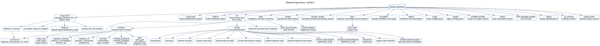

# Repository Surface Atlas

This layer maps the repository boundary, the Rust build surface, and the command entry points without enumerating every file. Simard is a single Cargo package whose default binary is `simard`; the library surface in `src/lib.rs` exposes the daemon modules, and `src/bin/` contains the auxiliary command binaries.

## Evidence anchors

- Package name, edition, and default run target: `Cargo.toml:2`, `Cargo.toml:4`, `Cargo.toml:5`.
- Explicit Cargo bin targets: `Cargo.toml:7` through `Cargo.toml:57`.
- Default daemon entry invokes `simard::dispatch_operator_cli`: `src/main.rs:1` through `src/main.rs:10`.
- Module export surface starts in `src/lib.rs:1` and declares the major daemon modules through `src/lib.rs:177`.

## Top-level inventory

| Path | Purpose |
| --- | --- |
| `.cargo/` | Cargo configuration for local builds. |
| `.claude/` | Agent and workflow configuration checked into this worktree. |
| `.github/` | GitHub Actions and repository automation. |
| `Specs/` | Design specifications and planning inputs. |
| `ai_working/` | Working context used by AI-assisted workflows. |
| `amplifier-bundle/` | Bundled amplihack recipe and agent assets. |
| `docs/` | Operator, design, reference, and generated atlas documentation. |
| `examples/` | Example identities and usage fixtures. |
| `hooks/` | Local hook scripts and hook-related assets. |
| `npm/` | JavaScript package wrapper support. |
| `prompt_assets/` | Prompt, identity, and ecosystem context assets shipped with Simard. |
| `scripts/` | Operational shell scripts for install, redeploy, diagnostics, and maintenance. |
| `src/` | Native Rust daemon, library modules, and command binaries. |
| `supply-chain/` | Supply-chain advisory policy and stewardship inputs. |
| `tests/` | Integration tests, regression tests, and QA scenario fixtures. |
| `Cargo.toml` | Build manifest, bin target list, features, dependency pins, and profiles. |
| `Cargo.lock` | Locked dependency graph. |
| `build.rs` | Build-time timestamp helper used by the daemon. |
| `package.json` | Node package wrapper and JavaScript test entry points. |
| `mkdocs.yml` | Documentation site configuration. |
