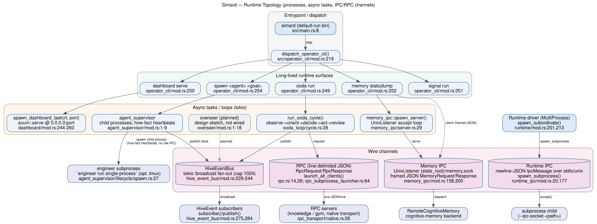

# Code Atlas — Runtime Topology

Architectural map of Simard's **runtime processes, async tasks, and IPC/RPC
channels** — not its ~150 source modules. `simard` is a single Rust package
(`edition = "2024"`, `Cargo.toml:4`) that produces **13 binaries** — the
`default-run` package binary `simard` (`src/main.rs`) plus **12 `[[bin]]`
targets** (`Cargo.toml:7-57`). This layer diagrams how those binaries dispatch, how the
long-lived daemon fans work into async tasks, and the wire channels that carry
messages between processes.

Every node and edge below is derived from Rust source truth; each is backed by a
`file:line` citation in the [Evidence anchors](#evidence-anchors) section. No
runtime state, secrets, host names, or IPs are reproduced here.

## Diagrams





> Rendering: `runtime-topology-dot.svg` is produced by `dot -Tsvg`;
> `runtime-topology-mermaid.svg` by `mmdc` (mermaid-cli 10+ takes sandbox flags
> via a puppeteer config file, e.g. `-p pp.json` where `pp.json` is
> `{"args":["--no-sandbox"]}`). If `mmdc` fails in a
> sandboxed environment (puppeteer/Chromium unavailable), the Mermaid SVG falls
> back to a `dot`-rendered copy and the failure is noted here.

## Overview

```
                        simard (default-run bin)
                                 │
                 main.rs → dispatch_operator_cli()
                                 │
        ┌────────────────────────┼─────────────────────────────┐
   `dashboard serve`        `ooda run`                    `memory` / daemon
        │                        │                              │
  axum Router               run_ooda_cycle()           memory-ipc UnixListener
  (spawn_dashboard_task)         │                     ({state_root}/memory.sock)
        │                   OODA phases                        │
  TCP 0.0.0.0:port         observe→orient→                RemoteCognitiveMemory
                           decide→act→review              clients (framed JSON)
```

Three channel families connect the processes:

1. **Memory IPC** — a Unix-domain socket (`{state_root}/memory.sock`) serving
   framed JSON `MemoryRequest`/`MemoryResponse` messages to the in-process
   cognitive-memory backend.
2. **Runtime IPC** — newline-delimited JSON `IpcMessage` frames over
   stdio/Unix-socket transports for subprocess coordination.
3. **RPC** — one-JSON-object-per-line requests/responses to RPC servers, plus
   the in-process `HiveEventBus` `tokio::broadcast` fan-out.

## Process inventory (binaries)

Source: `Cargo.toml:5-57`. The first row, `simard`, is the `default-run`
package binary (`Cargo.toml:5`, entrypoint `src/main.rs`) — **not** a `[[bin]]`
target; the remaining 12 rows are the explicit `[[bin]]` targets.

| Binary | Manifest path | Role |
|---|---|---|
| `simard` (default-run) | `src/main.rs` | Operator CLI + daemon entrypoint |
| `simard-gym` | `src/bin/simard_gym.rs` | Evaluation gym runner |
| `coin-gym` | `src/bin/coin_gym.rs` | Coin-gym scenario runner |
| `simard-rust-gym` | `src/bin/simard_rust_gym.rs` | Rust-specific gym runner |
| `simard-ooda-step` | `src/bin/simard_ooda_step.rs` | Single OODA step driver |
| `simard-improve-step` | `src/bin/simard_improve_step.rs` | Self-improve step driver |
| `simard-self-improve-recipe` | `src/bin/simard_self_improve_recipe.rs` | Self-improve recipe driver |
| `simard-engineer-step` | `src/bin/simard_engineer_step.rs` | Engineer step driver |
| `simard-engineer-loop-recipe` | `src/bin/simard_engineer_loop_recipe.rs` | Engineer loop recipe driver |
| `simard-audit-pass01` | `src/bin/simard_audit_pass01.rs` | Dashboard audit pass (feature `dashboard-audit`) |
| `simard-audit-dashboard` | `src/bin/simard_audit_dashboard.rs` | Dashboard audit (feature `dashboard-audit`) |
| `simard-tui` | `src/bin/simard_tui/main.rs` | Terminal UI |
| `supply-chain-steward` | `src/bin/supply_chain_steward.rs` | Scheduled advisory remediation driver |

> The `simard` binary multiplexes many operator sub-commands through
> `dispatch_operator_cli` (`src/operator_cli/mod.rs:219`); the long-lived
> runtime surfaces are `dashboard serve`, `ooda run`, and the memory daemon.

## Top-level command dispatch

The `simard` process routes its first argument to a sub-command handler in
`dispatch_operator_cli` (`src/operator_cli/mod.rs:219`). Runtime-significant
arms:

| Command | Dispatch arm | Runtime surface |
|---|---|---|
| `dashboard serve [--port=8080]` | `operator_cli/mod.rs:250` | axum HTTP server (see [api-contracts](../api-contracts/README.md)) |
| `ooda run [--cycles=N]` | `operator_cli/mod.rs:249` | OODA cycle loop |
| `memory stats\|dump` | `operator_cli/mod.rs:252` | memory-IPC client / daemon |
| `spawn <agent> <goal> <worktree>` | `operator_cli/mod.rs:254` | subordinate agent process |
| `gym …` | `operator_cli/mod.rs:248` | gym runner |
| `signal run` | `operator_cli/mod.rs:251` | Signal JSON-RPC channel |

## Channel inventory

### Memory IPC (Unix domain socket)

The memory daemon publishes a socket at `{state_root}/memory.sock` and
dispatches `MemoryRequest` messages to its in-process cognitive-memory backend;
clients speak framed JSON over the same socket (`src/memory_ipc/mod.rs:5-15`).

- **Socket path resolution**: `default_socket_path()`
  (`src/memory_ipc/mod.rs:65`), `socket_path_for(state_root)`
  (`src/memory_ipc/mod.rs:90`).
- **Server**: `spawn_server(socket_path, memory)` binds a `UnixListener`, sets
  the parent dir to `0700`, and accepts connections
  (`src/memory_ipc/server.rs:29`, `:53`).
- **Frame cap**: `MAX_FRAME = 8 MiB` (`src/memory_ipc/mod.rs:352`).
- **Request enum** `MemoryRequest` (`src/memory_ipc/mod.rs:158`): `Ping`,
  `RecordSensory`, `PruneExpiredSensory`, `PushWorking`, `GetWorking`,
  `ClearWorking`, `StoreEpisode`, `ConsolidateEpisodes`, `StoreFact`,
  `StoreFactGated`, `SearchFacts`, `StoreProcedure`, `StoreProcedureProvenance`,
  `RecallProcedure`, `StoreProspective`, `CheckTriggers`, `ResolveProspective`,
  `ListProspectiveByTrigger`, `SearchEpisodesByKeywords`, `DrainPassLedger`,
  `ListAllEpisodes`, `ListAllProspective`, `GetStatistics`.
- **Response enum** `MemoryResponse` (`src/memory_ipc/mod.rs:300`): `Pong`,
  `Id`, `Count`, `MaybeId`, `WorkingSlots`, `Facts`, `Procedures`,
  `Prospectives`, `Episodes`, `Statistics`, `FactWrite`, `Ack`, `Error`.

### Runtime IPC (subprocess coordination)

Transport layer for multi-process subprocess spawning
(`src/runtime_ipc/mod.rs:1`).

- **Protocol enum** `IpcMessage` (`src/runtime_ipc/mod.rs:20`, serde
  `tag = "type"`, snake_case): `Ping`, `Pong`,
  `TaskAssign { id, objective }`, `TaskResult { id, outcome }`, `Shutdown`.
- **Transports**: `StdioTransport` (newline-delimited JSON over stdin/stdout,
  `src/runtime_ipc/mod.rs:53`) and `UnixSocketTransport`
  (`src/runtime_ipc/mod.rs:98`, `connect()` at `:108`).
- **Subprocess spawn**: `spawn_subprocess(binary_path, identity_name,
  socket_path)` binds a Unix listener, launches the child with
  `--ipc-socket <path>`, then `accept()`s the connection
  (`src/runtime_ipc/mod.rs:177`). Returns an `IpcSubprocessHandle`
  (`src/runtime_ipc/mod.rs:148`, `pid()` at `:170`).

### RPC (line-delimited JSON to RPC servers)

Wire format: one JSON object per line (`src/rpc.rs:11`).

- `RpcRequest { id, method, params }` (`src/rpc.rs:14`).
- `RpcResponse { id, result?, error? }` (`src/rpc.rs:26`).
- `RpcErrorPayload { code, message }` (`src/rpc.rs:35`).
- Well-known error codes: `-32601` method-not-found, `-32603` internal,
  `-32000` timeout, `-32001` transport (`src/rpc.rs:41-44`).
- Health probe method `bridge.health` → `RpcHealth { server_name, healthy }`
  (`src/rpc.rs:48`, `:78`).
- Client transports launched by `launch_all_clients`
  (`src/rpc_subprocess_launcher.rs:64`), `launch_knowledge_client_native`
  (`:94`), `launch_gym_client_native` (`:109`), backed by `NativeRpcTransport`
  (`src/rpc_transport/native.rs:26`).

### Hive event bus (in-process broadcast fan-out)

Wraps `tokio::sync::broadcast` to fan out envelopes to all current subscribers
(`src/hive_event_bus/mod.rs:3`).

- `HiveEventBus { sender: broadcast::Sender<HiveEventEnvelope> }`
  (`src/hive_event_bus/mod.rs:229-230`), constructed with
  `broadcast::channel(capacity)` (`:244`).
- Default capacity `DEFAULT_CAPACITY = 1024` (`src/hive_event_bus/mod.rs:16`).
- `publish(kind) -> usize` (`:275`), `subscribe() -> broadcast::Receiver`
  (`:284`), `subscriber_count()` (`:289`).
- Event variants `HiveEventKind` (`src/hive_event_bus/mod.rs:37`, `#[non_exhaustive]`):
  `FactPromoted`, `FactImported`, `NodeJoined`, `NodeLeft`,
  `MemorySyncRequested`. Topics enumerated in `KNOWN_TOPICS` (`:24-30`).

## Async task / loop inventory

| Task | Spawn / entry | Notes |
|---|---|---|
| Dashboard HTTP server | `spawn_dashboard_task(rt, port)` → `rt.spawn(...)` binds `0.0.0.0:port`, `axum::serve` (`src/operator_commands_dashboard/mod.rs:244-260`) | Cancelled on runtime shutdown |
| OODA cycle | `run_ooda_cycle(...)` (`src/ooda_loop/cycle.rs:28`) | observe → orient → decide → act → review phases (`src/ooda_loop/*.rs`) |
| Memory IPC accept loop | `spawn_server(...)` (`src/memory_ipc/server.rs:29`) | Per-connection dispatch on the daemon store |
| Agent supervisor | `src/agent_supervisor/mod.rs:1-9` | Spawns subordinate agents as child processes; heartbeats via hive facts, **never raw IPC** |
| Overseer (planned) | `src/overseer/mod.rs:1-18` | **Design sketch / scaffolding only** — `#![allow(dead_code)]`, not wired into `main` or the daemon loop. Rendered dashed in the diagrams. |

## Trust / process boundaries

- **Process boundary**: each `[[bin]]` and each subprocess launched via
  `spawn_subprocess` (`src/runtime_ipc/mod.rs:177`) or the agent supervisor
  (`src/agent_supervisor/mod.rs:3`) is a distinct OS process.
- **Socket boundary**: the memory-IPC socket's parent directory is restricted to
  `0700` so no other local user can traverse to it
  (`src/memory_ipc/server.rs:29-41`).
- **Identity ≠ runtime**: subordinate agents get isolated `agent_name`s and
  communicate only through semantic facts in the hive, not raw IPC
  (`src/agent_supervisor/mod.rs:7-9`).

## Evidence anchors

All entities above trace to these source locations:

- `Cargo.toml:3-4` — `version` / `edition = "2024"` (single package, not a workspace)
- `Cargo.toml:5` — `default-run = "simard"`
- `Cargo.toml:7-57` — 12 `[[bin]]` target definitions
- `src/main.rs:1` — `use simard::dispatch_operator_cli;`
- `src/main.rs:8` — `dispatch_operator_cli(std::env::args().skip(1))`
- `src/operator_cli/mod.rs:219` — `pub fn dispatch_operator_cli(...)`
- `src/operator_cli/mod.rs:249-254` — `ooda` / `dashboard` / `memory` / `spawn` dispatch arms
- `src/memory_ipc/mod.rs:5-15` — module doc: socket path + `MemoryRequest` dispatch
- `src/memory_ipc/mod.rs:65` — `default_socket_path()`
- `src/memory_ipc/mod.rs:90` — `socket_path_for(state_root)`
- `src/memory_ipc/mod.rs:158` — `pub enum MemoryRequest`
- `src/memory_ipc/mod.rs:300` — `pub enum MemoryResponse`
- `src/memory_ipc/mod.rs:352` — `MAX_FRAME = 8 * 1024 * 1024`
- `src/memory_ipc/server.rs:29` — `pub fn spawn_server(...)`
- `src/memory_ipc/server.rs:53` — `UnixListener::bind(&socket_path)`
- `src/runtime_ipc/mod.rs:1` — module doc: IPC transport for subprocess spawning
- `src/runtime_ipc/mod.rs:20` — `pub enum IpcMessage`
- `src/runtime_ipc/mod.rs:53` — `pub struct StdioTransport`
- `src/runtime_ipc/mod.rs:98` — `pub struct UnixSocketTransport`
- `src/runtime_ipc/mod.rs:148` — `pub struct IpcSubprocessHandle`
- `src/runtime_ipc/mod.rs:177` — `pub fn spawn_subprocess(...)`
- `src/rpc.rs:11` — wire format: one JSON object per line
- `src/rpc.rs:14` — `pub struct RpcRequest`
- `src/rpc.rs:26` — `pub struct RpcResponse`
- `src/rpc.rs:35` — `pub struct RpcErrorPayload`
- `src/rpc.rs:41-44` — RPC error-code constants
- `src/rpc.rs:48` — `pub struct RpcHealth`
- `src/rpc_subprocess_launcher.rs:64` — `launch_all_clients(...)`
- `src/rpc_subprocess_launcher.rs:94` — `launch_knowledge_client_native()`
- `src/rpc_subprocess_launcher.rs:109` — `launch_gym_client_native()`
- `src/rpc_transport/native.rs:26` — `pub struct NativeRpcTransport`
- `src/hive_event_bus/mod.rs:3` — module doc: wraps `tokio::sync::broadcast`
- `src/hive_event_bus/mod.rs:16` — `DEFAULT_CAPACITY = 1024`
- `src/hive_event_bus/mod.rs:37` — `pub enum HiveEventKind`
- `src/hive_event_bus/mod.rs:229-230` — `pub struct HiveEventBus { sender }`
- `src/hive_event_bus/mod.rs:244` — `broadcast::channel(capacity)`
- `src/hive_event_bus/mod.rs:275` — `pub fn publish(...)`
- `src/hive_event_bus/mod.rs:284` — `pub fn subscribe(...)`
- `src/operator_commands_dashboard/mod.rs:244-260` — `spawn_dashboard_task(...)`
- `src/ooda_loop/cycle.rs:28` — `pub fn run_ooda_cycle(...)`
- `src/agent_supervisor/mod.rs:1-9` — supervisor module doc (child processes, hive-fact heartbeats)
- `src/agent_supervisor/lifecycle/spawn.rs:27` — `spawn_subordinate(...)` spawns an `engineer run single-process` child via `Command` (optionally tmux), not raw IPC
- `src/runtime/mod.rs:201` — `Runtime::spawn_subordinate(...)` (MultiProcess topology driver)
- `src/runtime/mod.rs:213` — `runtime_ipc::spawn_subprocess(...)` call site (the real Runtime IPC spawn driver)
- `src/overseer/mod.rs:1-18` — overseer module doc (design sketch, not wired into `main`)

## Regeneration

```bash
# From repo root. Requires graphviz (dot) and mermaid CLI (mmdc); no Python/kuzu.
dot -Tsvg docs/atlas/runtime-topology/runtime-topology.dot \
    -o docs/atlas/runtime-topology/runtime-topology-dot.svg
# mermaid-cli 10+ passes sandbox flags via a puppeteer config, not --no-sandbox:
echo '{"args":["--no-sandbox","--disable-setuid-sandbox"]}' > /tmp/mmdc-pp.json
mmdc -p /tmp/mmdc-pp.json \
    -i docs/atlas/runtime-topology/runtime-topology-mermaid.mmd \
    -o docs/atlas/runtime-topology/runtime-topology-mermaid.svg
# On mmdc failure, fall back:
# dot -Tsvg docs/atlas/runtime-topology/runtime-topology.dot \
#     -o docs/atlas/runtime-topology/runtime-topology-mermaid.svg
```
