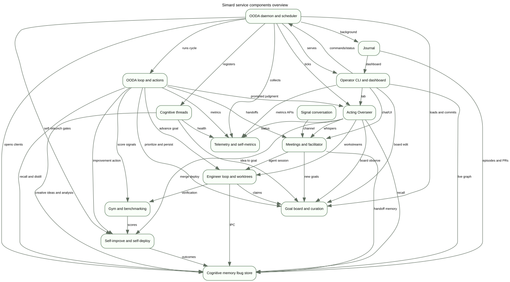
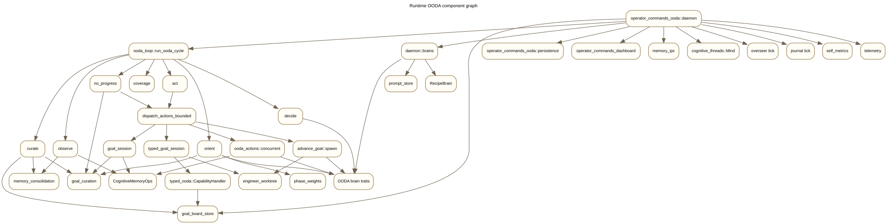
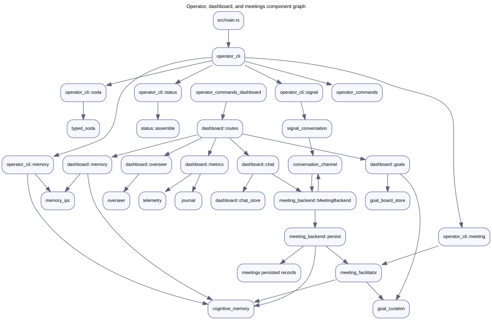
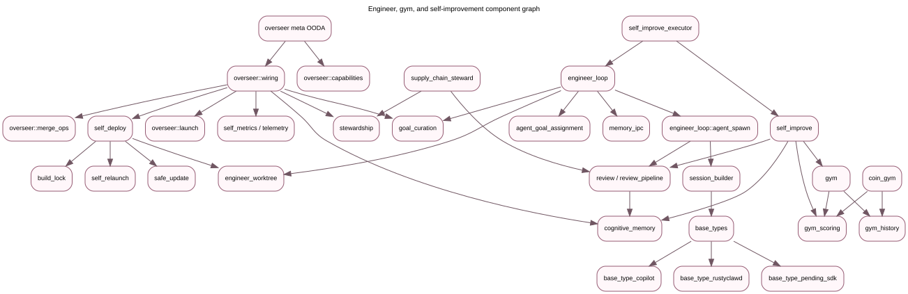

# Service Component Architecture

Simard builds as one Rust crate and one primary daemon binary, but the daemon is internally componentized. This layer treats major module families as service components and maps coupling between them from static source inspection.

## Component inventory

| Component | Key modules | Responsibilities | Main collaborators |
| --- | --- | --- | --- |
| OODA daemon and scheduler | `operator_commands_ooda::daemon`, `operator_commands_ooda::persistence`, `ooda_scheduler` | Boot memory, load durable board, run repeated OODA cycles, start dashboard, threads, Overseer, journal, telemetry, and relaunch checks. Evidence: daemon wires memory/board at `src/operator_commands_ooda/daemon/mod.rs:545`, cognitive threads at `:828`, Overseer at `:887`, journal at `:933`. | OODA loop, memory, goal board, dashboard, cognitive threads, Overseer, journal, telemetry. |
| OODA loop and actions | `ooda_loop`, `ooda_actions`, `ooda_brain`, `typed_ooda` | Observe-orient-decide-act cycle, brain-mediated ranking/decisions, action dispatch, typed goal-session ledger, no-progress breaker. Evidence: `run_ooda_cycle` at `src/ooda_loop/cycle.rs:28`; action dispatch at `src/ooda_actions/mod.rs:73`; typed goal session uses `typed_ooda` at `src/ooda_actions/advance_goal/typed_goal_session.rs:8`. | Memory, goal curation, engineer worktrees, self-improve, Overseer, telemetry. |
| Cognitive threads | `cognitive_threads`, `cognitive_threads::threads::{maintenance, engineer_log_analysis, creative_ideas, ooda}` | Periodic non-cycle tasks with `Mind` scheduler and `CognitiveThread` contract. Daemon registers maintenance and engineer-log behind the master switch and creative ideas on its own gate (`src/operator_commands_ooda/daemon/mod.rs:828`, `:834`, `:844`). | Memory, goals, telemetry, OODA daemon. |
| Cognitive memory | `cognitive_memory`, `memory_ipc`, `memory_consolidation`, `memory`, `memory_client` | Backend-neutral cognitive memory trait, lbug-backed `LibraryCognitiveMemory`, Unix-socket remote client, distillation/intake/recall preparation, legacy/session memory facade. Evidence: trait at `src/cognitive_memory/mod.rs:209`; lbug adapter at `src/cognitive_memory/library_adapter.rs:154`; IPC protocol at `src/memory_ipc/mod.rs:158`. | OODA loop, CLI, dashboard, meetings, journal, Overseer, engineer loop. |
| Overseer | `overseer::{capabilities,wiring,merge_ops,launch,sensor,signal,guardrails,activity}` | Meta-OODA operator co-process: observe status/board/PRs, orient problems, gate interventions, launch workstreams, merge/deploy/whisper/file issues. Evidence: capability traits at `src/overseer/capabilities.rs:304`; daemon tick wiring at `src/operator_commands_ooda/daemon/mod.rs:1676`. | Status/telemetry, goal curation, cognitive memory, engineer loop, self-deploy, meetings. |
| Goal board and curation | `goal_curation`, `goal_board_store`, `goals` | Active/backlog board, goal decomposition, completion evidence, no-progress classification, persistent state commits, goal-record store. Evidence: re-exported board API at `src/goal_curation/mod.rs:28`; durable state at `src/goal_board_store/mod.rs:65`; goal store at `src/goals/store.rs:80`. | OODA loop, memory, dashboard/CLI, Overseer, meetings, engineer loop. |
| Meetings and facilitator | `meeting_backend`, `meeting_facilitator`, `meeting_repl`, `meetings`, `conversation_channel` | Meeting chat backend, command parsing, transcripts, handoff bundles, persisted meeting records, goal/action extraction. Evidence: `MeetingBackend` at `src/meeting_backend/mod.rs:146`; handoff API at `src/meeting_facilitator/handoff/mod.rs:98`; persisted record types at `src/meetings/mod.rs:45`. | Operator UI, memory, goal curation, Signal, base-type sessions. |
| Engineer loop and worktrees | `engineer_loop`, `engineer_worktree`, `agent_goal_assignment`, `subagent_sessions` | Local engineer loop, objective analysis, subprocess/session spawn, worktree allocation and claim sweeping, review persistence. Evidence: `run_local_engineer_loop` at `src/engineer_loop/mod.rs:101`; agent spawn at `src/engineer_loop/agent_spawn.rs:442`; worktree type at `src/engineer_worktree/mod.rs:105`. | OODA actions, Overseer launch, memory IPC, goals, base-type adapters. |
| Gym and benchmarking | `gym`, `coin_gym`, `gym_scoring`, `gym_history`, `gym_client` | Benchmark scenarios/suites, COIN harness, score aggregation, regression and promotion signals. Evidence: benchmark runner at `src/gym/mod.rs:93`; COIN CLI at `src/coin_gym/mod.rs:112`; scoring API at `src/gym_scoring/mod.rs:206`. | Self-improve, OODA loop, engineer verification, dashboard metrics. |
| Self-improve and self-deploy | `self_improve`, `self_improve_executor`, `self_deploy`, `self_relaunch`, `safe_update`, `supply_chain_steward` | Form improvement hypotheses, run autonomous patches, safe update/deploy, health probes, source prep, relaunch, advisory stewardship. Evidence: self-improve cycle at `src/self_improve/cycle.rs:23`; deploy orchestrator at `src/self_deploy/orchestrator.rs:166`; source prep at `src/self_deploy/source_prep.rs:202`. | Gym, review pipeline, Overseer, memory, build locks, engineer worktrees. |
| Signal conversation | `signal_conversation` (feature-gated), `conversation_channel`, `operator_cli::signal`, `operator_commands_ooda::daemon::signal_embed` | Optional Signal channel that routes operator conversation into the common conversation/meeting backend. Evidence: feature-gated public module in `src/lib.rs:162`; daemon embed references `signal_conversation::run` at `src/operator_commands_ooda/daemon/signal_embed.rs:162`. | Meetings, operator CLI, conversation channel. |
| Operator dashboard and CLI | `operator_cli`, `operator_commands`, `operator_commands_dashboard`, `status` | Command dispatch, status rendering, dashboard routes, live memory graph, goal controls, chat, PR readiness, Overseer/metrics views. Evidence: main calls CLI at `src/main.rs:7`; dashboard `serve` at `src/operator_commands_dashboard/mod.rs:263`; router at `src/operator_commands_dashboard/routes.rs:44`. | Daemon, memory, goal board, meetings, Overseer, telemetry, journal. |
| Journal | `journal::{thread,generate,recipe,store,render,pr_source,reconcile}` | Periodic daily narrative report from episodes and PR activity; stores journal entries in cognitive memory and renders HTML/TUI lines. Evidence: journal gate/tick at `src/journal/thread.rs:58`, `src/journal/thread.rs:214`; store API at `src/journal/store.rs:67`. | OODA daemon, cognitive memory, dashboard/TUI, PR sources. |
| Telemetry and self-metrics | `telemetry`, `self_metrics`, `status`, `enrichment_observability` | OpenTelemetry/in-process metric registry, status snapshots, self-metric records, dashboard metric APIs, enrichment observability. Evidence: telemetry facade at `src/telemetry/mod.rs:26`; self metrics collection at `src/self_metrics/mod.rs:311`; status CLI uses `status::AssembleOptions` at `src/operator_cli/status.rs:14`. | Daemon, dashboard, Overseer, OODA loop, cognitive threads. |

## Coupling notes

- The daemon is the highest fan-out component: it directly wires memory, goal board, dashboard, cognitive threads, Overseer, journal, self metrics, telemetry, and the core OODA cycle (`src/operator_commands_ooda/daemon/mod.rs:545`, `:625`, `:828`, `:887`, `:933`, `:1486`).
- The goal board is intentionally shared but therefore highly coupled: OODA, CLI tests, dashboard, Overseer sensors, meetings, and engineer loop all read/write or project it (`src/goal_curation/mod.rs:28`, `src/goal_board_store/mod.rs:410`).
- Memory is a trait boundary rather than a concrete dependency in most components. The store is lbug-backed in-process and also exposed over IPC (`src/cognitive_memory/library_adapter.rs:154`, `src/memory_ipc/client.rs:22`).
