# Simard Code Atlas: User Journeys

This layer traces six end-to-end journeys through the real Rust modules. Each journey has a Mermaid `sequenceDiagram` source and a matching left-to-right DOT representation.

## Journey inventory

| Journey | Entry point | Key modules traversed | Outcome |
|---|---|---|---|
| Full OODA cycle | `operator_commands_ooda::daemon` calls `run_ooda_cycle` | `goal_board_store`, `goal_curation`, `ooda_loop::cycle`, `memory_consolidation`, `ooda_brain`, `ooda_actions` | One cycle observes, prepares context, orients, decides, acts, writes memory, and commits the board |
| Memory recall for OODA context | `ooda_loop::cycle` prepare step | `memory_consolidation`, `CognitiveMemoryOps`, `memory_ipc`, `LibraryCognitiveMemory` | Ranked facts/procedures/episodes become `PreparedContext` |
| Signal message and reply | signal-cli inbound JSON-RPC line | `signal_conversation::transport`, `SignalConversation`, `session_store`, `MeetingBackend` | Authorized operator receives reply and turn history is persisted |
| Overseer blocked-goal escalation | `Overseer::run_cycle` | `overseer::sensor`, `signal`, `root_cause`, `decide`, notifier/goal capability | False-parked goals are unblocked; recurring/needs-review blocks are escalated with WHY |
| Engineer goal to PR | OODA `spawn_engineer` action | `ooda_actions::advance_goal::spawn`, `engineer_worktree`, `agent_supervisor`, `engineer_loop` | Isolated worktree agent runs and opens a PR via tools/prompt contract |
| Merged PR self-deploy | self-deploy target commit | `self_deploy::source_prep`, `self_deploy::orchestrator`, `safe_update`, `self_relaunch`, `self_deploy::health` | Candidate is built, swapped, restarted, health-checked, or rolled back |

## Full OODA cycle

A daemon tick reloads the authoritative goal board, refreshes the cognitive-memory cache, runs one OODA cycle, writes execution/reflection memory, and commits the reconciled board.

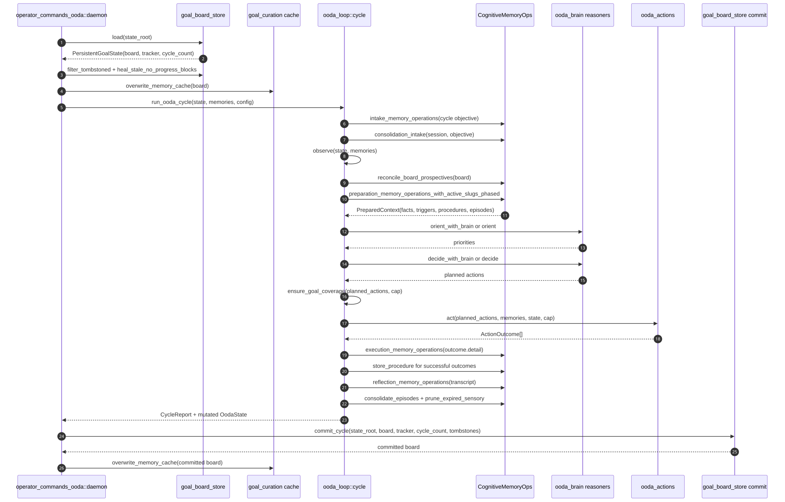

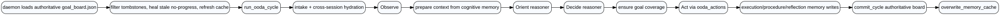

## Memory recall for OODA context

The prepare step builds a goal-derived objective probe, fans out across ranked fact recall, goal-record lookup, prospective triggers, procedure recall, and episodic recall, then returns a prompt-ready context.

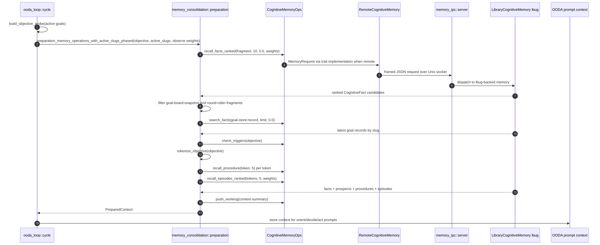

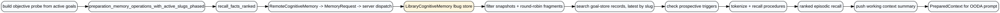

## Signal message and reply

The Signal channel owns JSON-RPC parsing, self-echo protection, allowlist enforcement, per-operator durable sessions, meeting backend replay, and outbound replies.

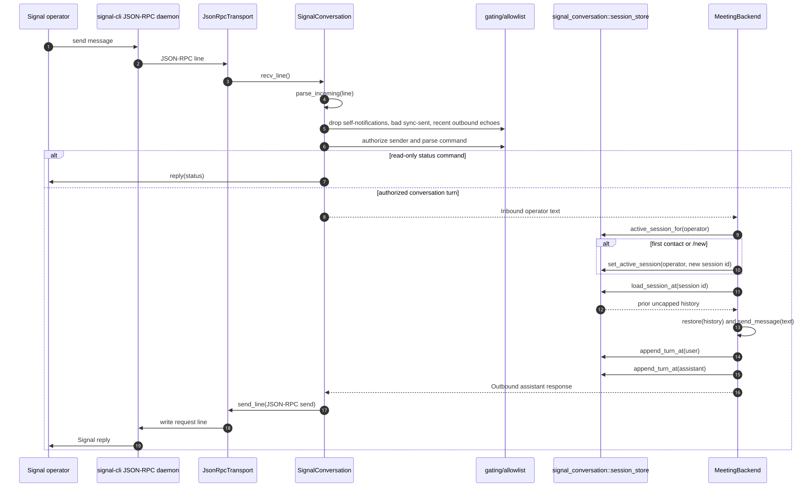

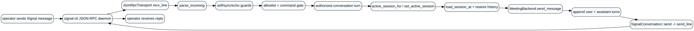

## Overseer blocked-goal escalation

The Overseer observes blocked goals from the board, emits `GoalBlocked`, enriches each problem with root-cause WHY, and chooses unblock vs escalation with recurrence-aware logic.

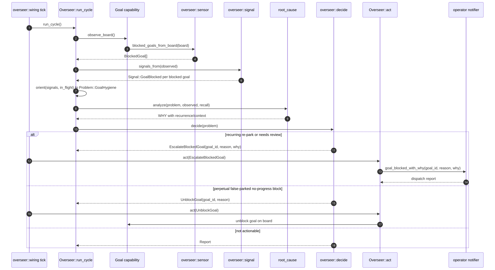

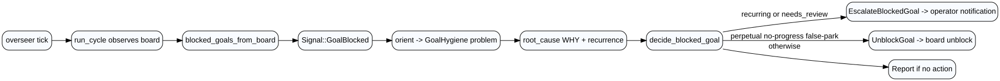

## Engineer goal to PR

OODA Act dispatches a write-capable engineer only after identity rails, target repo resolution, admission gates, worktree allocation, and freshness checks. The subordinate then runs an amplihack agent in the isolated worktree.

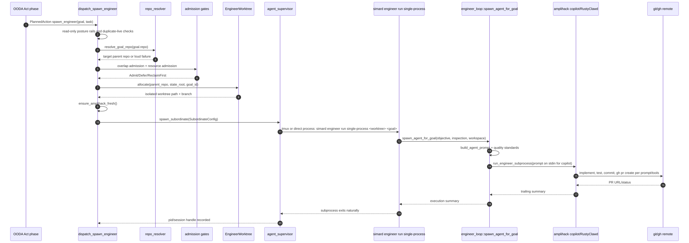

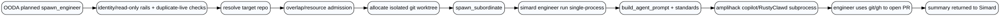

## Merged PR self-deploy

Self-deploy builds from the merged target commit, not the current working directory, then gates, backs up, drains, swaps, restarts, health-checks, and rolls back on failure.

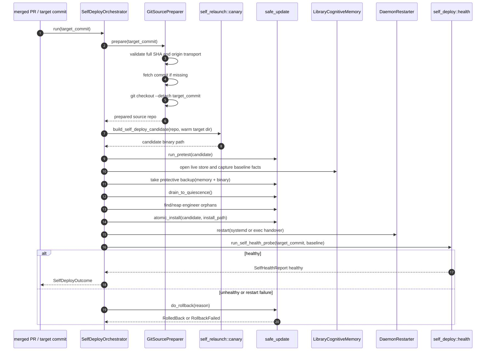

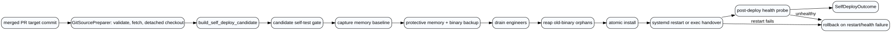
