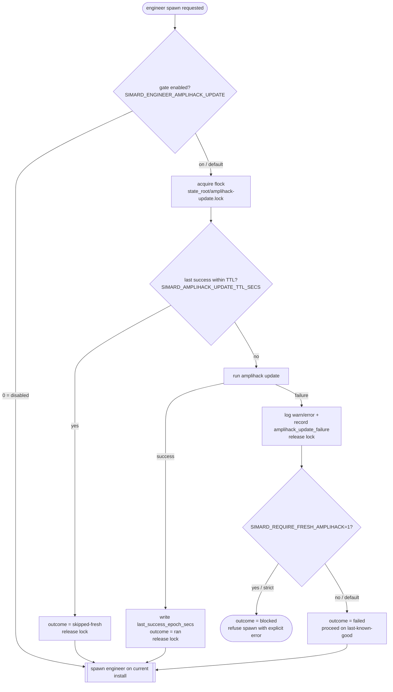

# The amplihack freshness gate

Every engineer subprocess Simard spawns runs on an **installed** `amplihack-rs`
— its recipes, its `recipe-runner`, its SDK adapters — kept current by the
operator command `amplihack update`. The freshness gate makes Simard run
`amplihack update` **immediately before it launches each engineer** (and once at
daemon startup), so an engineer never inherits a stale install. This page
explains why the gate exists, how it serializes and deduplicates that update,
and why its failures are surfaced loudly rather than swallowed.

For the authoritative contract see the
[freshness-gate reference](../reference/amplihack-freshness-gate.md); for
operator tasks see
[Configure the amplihack freshness gate](../howto/configure-amplihack-freshness-gate.md).

## Why it exists — the #439 stale-timeout incident

A **stale installed amplihack bundle** carried per-step agent timeouts that
upstream had already **removed**. Those leftover per-step timeouts fired mid-run
and **killed working agent steps** — the engineer was making progress, and the
stale bundle's own timeout aborted it. The install on disk had drifted behind
`amplihack-rs`, and nothing forced it forward before the next engineer started,
so every spawn re-inherited the same removed-upstream defect.

The operator directive that followed is explicit and durable:

> Simard must always be using the latest `amplihack-rs`, and Simard should run
> `amplihack update` before starting each engineer.

### Why "fresh before EVERY engineer", not "once a day"

A periodic refresh (cron, "once a day", "on daemon boot only") leaves a window:
upstream removes a bad timeout at 09:00, the daily refresh already ran at 03:00,
and every engineer spawned until tomorrow still runs the broken bundle. Binding
the refresh to the **spawn event** closes that window by construction — the
thing that goes stale (the install an engineer runs on) is refreshed at exactly
the moment it is about to be used. The startup gate is belt-and-suspenders: it
makes the very first cycle fresh too, before any spawn.

The obvious risk of "update before every spawn" is a burst of concurrent spawns
each rebuilding the world. The serialize+dedup design below removes that cost
without weakening the freshness guarantee.

## The design in one paragraph

Immediately before `dispatch_spawn_engineer` launches an engineer subprocess,
the gate acquires a **cross-process advisory lock** (`flock(2)` over
`<state_root>/amplihack-update.lock`) so only one `amplihack update` runs at a
time; while holding the lock it re-reads a **durable last-success timestamp**
(`<state_root>/amplihack-update-state.json`) and, if a successful update
completed within `SIMARD_AMPLIHACK_UPDATE_TTL_SECS` (default **300**), it
**skips** the update because the install is already fresh; otherwise it runs
`amplihack update`, and on success records a new timestamp before releasing the
lock. If the update **fails**, the gate never fails silently: it logs at
warn/error and records an `amplihack_update_failure` metric, then by default
**proceeds** to spawn the engineer on the last-known-good install (a transient
update failure must not hard-block all cognition) — unless
`SIMARD_REQUIRE_FRESH_AMPLIHACK=1`, which turns the failure into an explicit
**refusal to spawn**. Every one of these decisions is emitted through the
`tracing` crate with the outcome and durations.

## Gate placement

The gate runs at two points, both under the same lock and TTL:

- **Before every engineer spawn.** In
  [`dispatch_spawn_engineer`](../reference/concurrent-engineer-dispatch.md)
  (`src/ooda_actions/advance_goal/spawn.rs`), immediately before the
  `spawn_subordinate(&config)` call — after the goal is claimed and the worktree
  is allocated, but before the subprocess exists. This is the dispatcher reached
  from the OODA goal-action path
  ([how OODA spawns engineers](../howto/spawn-engineers-from-ooda-daemon.md))
  that logs `[simard] OODA goal-action: … spawning engineer with prose as task`.
- **Once at daemon startup.** In `run_ooda_daemon`
  (`src/operator_commands_ooda/daemon/mod.rs`), after the runtime-dependency
  ensure, so the first cycle is already fresh.

The gate resolves its state root through the same `SIMARD_STATE_ROOT`-then-
`$HOME/.simard` ladder the engineer worktrees use (see
[state-root resolution](../reference/state-root-resolution.md)), so the lockfile
and the timestamp file live under the one discoverable tree.

## Serialize and deduplicate — the lock and the TTL

Two mechanisms keep "update before every spawn" cheap and correct.

### Cross-process lock (serialize)

`amplihack update` is guarded by an **advisory** OS lock — `flock(2)` over a
lockfile, not a bare "does the file exist?" check. The `flock(2)`-via-`libc`
pattern is already used elsewhere in the codebase (e.g. `memory_ipc`), so the
gate introduces no new dependency. Only **one** update runs at a time. When a
[concurrent burst of engineer spawns](../reference/concurrent-engineer-dispatch.md)
arrives in the same OODA round, they serialize on this lock instead of each
kicking off its own rebuild.

### TTL dedup (skip when already fresh)

Serializing alone would still run one update per spawn, back to back. The TTL
removes the redundant runs: a **durable** last-success timestamp records when
`amplihack update` last *succeeded*, and if that was within
`SIMARD_AMPLIHACK_UPDATE_TTL_SECS` the gate **skips** re-running. The timestamp
is written to disk, so it survives across spawns *and* across daemon restarts —
a restart does not force a redundant rebuild.

The TTL check is performed **while holding the lock**, so the read is honest: the
gate re-reads the last-success timestamp under the lock and either **skips** (a
success is within the TTL) or **runs** the update and records a new timestamp
before releasing the lock — see the
[reference algorithm](../reference/amplihack-freshness-gate.md#lock-ttl-ordering-algorithm)
for the exact step order.

So the first spawner in a burst runs the update; every other spawner that
arrives while it is in flight waits on the lock, then finds a fresh timestamp
and skips. One rebuild serves the whole burst.

## Honest surfaced degradation, not silent fallback

The operator rule is blunt: **fallback == silent failure**. The gate is built so
a failed `amplihack update` is always *loud*, and the two behaviours below are
framed as **surfaced degradation**, never a silent fall-through.

- **Default — proceed on last-known-good.** A transient network/build/install
  failure must not hard-block all of Simard's cognition, so by default the gate
  still spawns the engineer on the current install. But it is *not* silent: it
  logs at warn/error **and** records an `amplihack_update_failure` metric noting
  that the engineer will run on the last-known-good install. An operator can see
  every degraded spawn.
- **Strict — refuse the spawn.** `SIMARD_REQUIRE_FRESH_AMPLIHACK=1` turns a
  failed update into an explicit **error outcome**: the spawn is refused rather
  than run on a possibly-stale install. This is for operators who require strict
  freshness.

The distinction from a silent fallback is the whole point:

| | Silent fallback (rejected) | Honest surfaced degradation (this gate) |
|---|---|---|
| On update failure | quietly use the old install, no signal | warn/error log **+** `amplihack_update_failure` metric |
| Operator visibility | none — looks like success | every failure is greppable in logs and `metrics.jsonl` |
| Strict option | impossible (failure is hidden) | `SIMARD_REQUIRE_FRESH_AMPLIHACK=1` blocks the spawn |
| Failure semantics | swallowed | recorded, attributed, and either proceeded-with-notice or blocked |

## No wall-clock kill of a producing step

The incident that started this was a *stale timeout killing working work*, so the
gate does not reintroduce that failure mode against its own subprocess. If the
`amplihack update` subprocess is bounded at all, the bound is a **generous
idle/liveness** bound — never a short mid-work abort of a build or network fetch
that is still making progress. And if that generous bound is ever hit, its
expiry is surfaced **explicitly** as a `failed` outcome (log + metric), exactly
like any other update failure — never a silent kill.

## The four decision outcomes

Every gate decision is traced (through the `tracing` crate — **not**
`println!`/`eprintln!`) with one of four outcomes plus the update-subprocess and
overall-gate durations:

| Outcome | Meaning | Spawn proceeds? |
|---|---|---|
| `ran` | update executed and succeeded; fresh timestamp recorded | yes |
| `skipped-fresh` | a successful update is within the TTL; update skipped | yes |
| `failed` | update ran but failed; logged + `amplihack_update_failure` metric; default proceeds on last-known-good | yes (default) |
| `blocked` | update failed **and** `SIMARD_REQUIRE_FRESH_AMPLIHACK=1`; spawn refused with an explicit error | no |

## See also

- [amplihack freshness gate reference](../reference/amplihack-freshness-gate.md)
  — the authoritative contract: config, on-disk files, algorithm, metric, and
  tracing fields.
- [Configure the amplihack freshness gate](../howto/configure-amplihack-freshness-gate.md)
  — enable/disable, tune the TTL, require strict freshness, and diagnose a failed
  update.
- [Update-check design](./update-check-design.md) — the informational
  version-check that tells an operator a newer *Simard* exists (distinct from
  this gate, which refreshes the *amplihack* install engineers run on).
- [Safe self-update](../safe-self-update.md) — Simard's own drain → snapshot →
  swap → validate upgrade flow.
- [Concurrent engineer dispatch](../reference/concurrent-engineer-dispatch.md)
  — the spawn-burst path the lock serializes.
