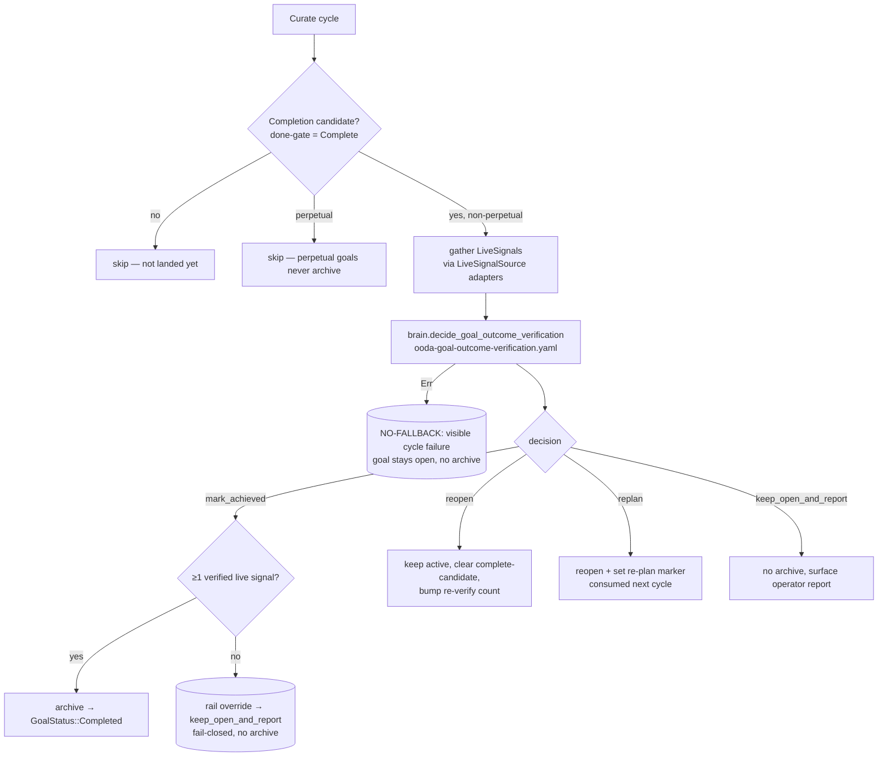

# Concept: closed-loop outcome verification

> **Status: implemented.** The outcome-verify seam (`gather → reason → apply`),
> the `LiveSignal` type and `LiveSignalSource` trait, the
> `decide_goal_outcome_verification` brain step, and the `SIMARD_OUTCOME_VERIFY`
> kill-switch live in
> [`src/goal_curation/outcome_verify.rs`](https://github.com/rysweet/Simard/blob/main/src/goal_curation/outcome_verify.rs)
> and
> [`src/goal_curation/live_signal.rs`](https://github.com/rysweet/Simard/blob/main/src/goal_curation/live_signal.rs),
> with the reasoning asset in
> [`prompt_assets/simard/recipes/ooda-goal-outcome-verification.yaml`](https://github.com/rysweet/Simard/blob/main/prompt_assets/simard/recipes/ooda-goal-outcome-verification.yaml).
> The step wraps the OODA curate seam
> ([`src/ooda_loop/cycle.rs`](https://github.com/rysweet/Simard/blob/main/src/ooda_loop/cycle.rs))
> and runs **after** the [deploy-aware done-gate](deploy-aware-done-gate.md) has
> deemed a goal a completion candidate. See the
> [outcome-verification API reference](../reference/outcome-verification-api.md)
> for the typed surface. Tracks
> [#2751](https://github.com/rysweet/Simard/issues/2751).

> A goal becomes **achieved** only when its **real success criteria are verified
> LIVE in production** — at least one authenticated live signal (a crossed
> telemetry threshold, a matched journald line, a cleared deploy-reconciliation
> drift, an observed behavior). A merged PR and a green deploy are *inputs*, not
> the decision. When the live effect is absent, the goal is **re-opened or
> re-planned**, not archived.

## The problem this solves

The [deploy-aware done-gate](deploy-aware-done-gate.md) already refuses to
archive a goal without a **merged PR**, a **closed issue**, and — for
self-affecting changes — a **verified deploy**. That closed the
"evidence-free done-claim" hole. But it certifies the wrong noun:

> **An artifact is not an outcome.** "The engineer's PR merged and the binary is
> running" proves *code shipped*. It does not prove *the goal's real-world effect
> is true*.

The concrete failure that motivated this step: the **kgpacks** goals. Their
underlying defect was an [E2BIG](e2big-elimination.md) spawn failure. An
engineer landed a fix, the PR merged, the deploy reconciled — so the done-gate
was satisfied and the goals were **unblocked and archived as complete**. Then
the daemon silently **re-blocked** them on the *next* real spawn, because the
`E2BIG` was **still present**: the artifact had landed but the live outcome had
not. Simard believed she had improved when she had not.

The guiding principle:

> **No "achieved" without a verified live effect. The merged/closed/deployed
> gate is necessary; observing the goal's real success criteria hold in
> production is what makes it sufficient.**

This is the closing half of **G1** (hybrid benchmark **+ live self-measurement**
— see [hybrid-cognition-measurement](hybrid-cognition-measurement.md)): a
capability claim is trusted only when a *live, trended* signal confirms it, not
when a benchmark or a PR asserts it.

## It's a reasoning step, not a pile of thresholds

Simard's design principle (**G3**: agentic over brittle, recipes/prompts over
code) is that intelligence lives in **repeated execution of structured thought**,
not in hardcoded heuristics. This step follows the **exact** shape already proven
by the engineer-lifecycle decision in
[`spawn.rs`](https://github.com/rysweet/Simard/blob/main/src/ooda_actions/advance_goal/spawn.rs),
where `brain.decide_engineer_lifecycle()` reasons over gathered structured
context and only a **thin deterministic rail** guards the irreversible action.

So the outcome verifier is **not** a new bank of `if metric > threshold` rules in
Rust. It is:

1. **A gather step** — thin adapters translate raw observations into
   `LiveSignal`s. Each adapter sets `verified: true` only when it corroborated
   the effect from an **authenticated source** (threshold crossed, `state ==
   reconciled`, journald line matched). This is signal *acquisition*, not
   decision *heuristics*.
2. **A reasoning step** — the brain executes
   [`ooda-goal-outcome-verification.yaml`](../reference/outcome-verification-api.md#the-reasoning-recipe)
   over the goal's real success criteria, the artifact signals, and the live
   signals, and returns one of four decisions with a rationale.
3. **A thin apply step** — three deterministic rails that guard the one
   irreversible action (archival) and nothing else.

The load-bearing safety invariant lives in the **Rust rail**, not the prompt:

```rust
// The whole "heuristic" is a trivial existence check. The intelligence
// (WHICH signals matter, whether they're sufficient) lives in the recipe.
let has_live_proof = ctx.live_signals.iter().any(|s| s.verified);
```

Keeping the invariant in Rust — not the recipe — is deliberate: the recipe
asset is hot-reloadable and user-writable, so prompt tampering or prompt
injection can never talk the daemon into archiving a goal that has zero verified
live signals.

## Where the step runs

The verifier wraps the **curate seam** in
[`cycle.rs`](https://github.com/rysweet/Simard/blob/main/src/ooda_loop/cycle.rs)
— the same place the [done-gate](deploy-aware-done-gate.md) archives completed
goals. It runs each cycle, **only for completion-candidate goals** (the artifact
done-gate already returned `Complete`: the work has landed). The done-gate's
verdict becomes an **input signal** to the verifier, never the decider.



## The four decisions

The brain returns a `GoalOutcomeDecision`
(`#[serde(tag = "choice", rename_all = "snake_case")]`, same shape as the
engineer-lifecycle decision):

| Decision | Meaning | Effect |
| --- | --- | --- |
| `mark_achieved` | Real success criteria observed live. | Archive → `GoalStatus::Completed` — **only if the rail passes** (≥1 verified live signal). |
| `reopen` | Artifact landed but the live effect is absent (the kgpacks case). | Keep the goal active, clear the complete-candidate flag, bump the re-verify counter. No archive. |
| `replan` | Live effect absent **and** the current plan won't produce it. | `reopen` **plus** set a re-plan marker consumed next cycle (with a `replan_hint`). |
| `keep_open_and_report` | Signals ambiguous, absent, or unverifiable this cycle. | No archive; emit an operator/dashboard report. The safe default. |

Every non-`mark_achieved` outcome reuses the **existing** goal-board update APIs
— there is no new archival machinery.

## The thin rails (fail-closed, never wedged)

The rails wrap the brain call and guard only the irreversible action. In order:

1. **Skip rail.** Perpetual goals and non-candidate goals are skipped entirely —
   no brain call, no metric noise. Perpetual goals never archive by definition
   (see [perpetual-goal-no-progress-exemption](perpetual-goal-no-progress-exemption.md)).
2. **NO-FALLBACK rail.** If the brain (or a signal adapter) returns `Err`, that
   is a **visible cycle failure** — `tracing::error!` + `eprintln!` + `success =
   false`. The goal stays open; nothing is archived. This mirrors the
   `spawn.rs` engineer-lifecycle precedent exactly
   ([#1711](https://github.com/rysweet/Simard/issues/1711),
   [#1748](https://github.com/rysweet/Simard/issues/1748)): a parse/transport
   failure never masquerades as a silent success.
3. **Verified-signal rail.** If the brain says `mark_achieved` but **zero**
   `LiveSignal`s are `verified`, the rail **overrides** the decision to
   `keep_open_and_report`. The daemon **never** archives a goal on an
   LLM's word alone — there must be at least one adapter-set, authenticated
   live signal. On ambiguity it keeps the goal open and reports (no silent
   success, no fallback).

The three rails together mean: **a goal is archived only when the brain reasons
it achieved AND an authenticated adapter observed the live effect.** Either one
missing keeps the goal open.

## Backward compatibility (optional bridge, NO-FALLBACK when present)

The outcome-verify brain and the `LiveSignalSource` are an **optional bridge
pair** on `OodaClients`, exactly like `decide_brain`/`completion_evidence`:

- **`None`** (existing tests, non-daemon callers) → the legacy curate path is
  unchanged. No behavior change, no new invocation.
- **`Some`** (production daemon wiring) → the layer is authoritative and
  **NO-FALLBACK applies to every invocation**. Production boot always wires the
  pair unless [`SIMARD_OUTCOME_VERIFY=off`](../operations/outcome-verification-kill-switch.md).

"No silent success" governs the **invoked** brain, not an unconfigured
deployment. Production wiring is always `Some`; hermetic tests always inject the
stub pair.

## What a "verified live signal" is

A `LiveSignal { source, kind, verified, detail, observed_at }` is set `verified:
true` **at gather time** by a thin adapter that corroborated the effect from an
authenticated source — the same way
[`EvidenceSource::any_pr_merged() -> bool`](../reference/completion-evidence-gate-api.md#evidence-sources)
resolves a fact. Examples:

| Signal kind | Adapter | `verified` set when |
| --- | --- | --- |
| Telemetry threshold | `self_metrics` reader | The goal's target metric crossed its threshold in the live `metrics.jsonl` stream. |
| Journald match | `journalctl` reader (argv-only, read-only) | The expected success line appears (or the failing line is **absent**) since the deploy. |
| Deploy reconciliation | `ReconcileDetector` | `DeployDrift::needs_deploy == false` for the change — the merged effect is running. |
| Observed behavior | domain adapter | A re-probe of the failing operation now succeeds (e.g. the spawn that raised `E2BIG` completes). |

Crucially, `verified` is **never** set from LLM output or from unsanitized text.
The flag comes only from an adapter that authenticated the observation. This
adapter/rail/prompt boundary is enforced in review and is the reason prompt
injection and recipe tampering cannot forge a "live" proof.

## How this composes

- **Deploy-aware done-gate** ([concept](deploy-aware-done-gate.md)) — verifies
  *merged + closed + deployed*. The outcome verifier runs **after** it and asks
  the next question: *is the real effect true?* The done-gate's verdict is one of
  the artifact signals fed into the verifier.
- **Progress-evidence gating** ([concept](progress-evidence-gating.md)) — guards
  *percent increases* mid-flight (fail-open). The outcome verifier guards the
  *final "achieved"* transition (fail-closed). Sibling gates on different
  moments.
- **Hybrid cognition measurement** ([concept](hybrid-cognition-measurement.md))
  — G1's live-self-measurement half. The verifier is the mechanism that makes
  "achieved" mean "measured live," not "asserted."
- **The E2BIG class** ([concept](e2big-elimination.md)) — the kgpacks
  re-block is the canonical repro: artifact present, outcome absent. A regression
  test drives exactly this shape to `reopen` / `keep_open_and_report`, never
  `mark_achieved`.

## Observability

Every invocation emits its reasoning for inspection:

- A `BrainJudgmentRecord` (phase `OutcomeVerify`) is pushed via
  `push_brain_judgment`, carrying the decision label, the verified-signal count,
  and the **scrubbed** rationale.
- A `goal_live_outcome_verification` metric is appended to `metrics.jsonl` via
  [`self_metrics::record_metric`](../reference/telemetry-metrics.md), whose
  context carries the reasoning string, the outcome, and the verified-signal
  count.

The reasoning is emitted so an operator can always see **why** a goal did or did
not achieve — never a bare boolean. See
[How to diagnose a re-opened goal](../howto/diagnose-a-reopened-goal.md).

## See also

- [Outcome-verification API reference](../reference/outcome-verification-api.md)
- [How to diagnose a re-opened goal](../howto/diagnose-a-reopened-goal.md)
- [Outcome-verification kill-switch (`SIMARD_OUTCOME_VERIFY`)](../operations/outcome-verification-kill-switch.md)
- [Deploy-aware done-gate](deploy-aware-done-gate.md) — the artifact gate this step runs after.
- [Hybrid cognition measurement](hybrid-cognition-measurement.md) — G1's live-measurement half.
- [Comprehensive E2BIG elimination](e2big-elimination.md) — the kgpacks re-block that motivated this step.
