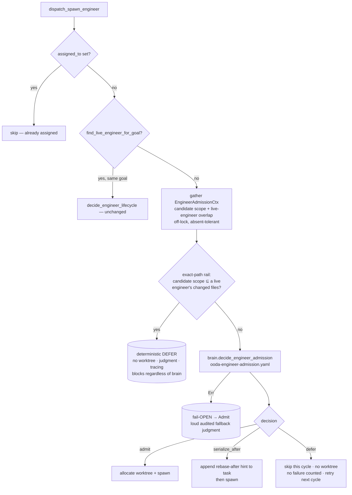

# Concept: dependency/overlap-aware engineer scheduling

> **Status: implemented.** This page describes the shipped design in present
> tense — the admission gate
> (`gather → reason → apply`), the `EngineerAdmissionCtx` / `LiveEngineerSignal`
> context, the `decide_engineer_admission` brain step, the overlap module, and
> the `SIMARD_ENGINEER_ADMISSION` kill-switch live in
> [`src/ooda_actions/advance_goal/admission.rs`](https://github.com/rysweet/Simard/blob/main/src/ooda_actions/advance_goal/admission.rs),
> [`src/ooda_actions/advance_goal/overlap.rs`](https://github.com/rysweet/Simard/blob/main/src/ooda_actions/advance_goal/overlap.rs),
> and
> [`src/ooda_brain/mod.rs`](https://github.com/rysweet/Simard/blob/main/src/ooda_brain/mod.rs),
> wired into `dispatch_spawn_engineer` in
> [`src/ooda_actions/advance_goal/spawn.rs`](https://github.com/rysweet/Simard/blob/main/src/ooda_actions/advance_goal/spawn.rs),
> with the reasoning asset at
> [`prompt_assets/simard/recipes/ooda-engineer-admission.yaml`](https://github.com/rysweet/Simard/blob/main/prompt_assets/simard/recipes/ooda-engineer-admission.yaml).
> See the [engineer-admission API reference](../reference/engineer-admission-api.md)
> for the typed surface. This is Simard self-improvement (p5 remit).

> Before a new engineer is admitted for a candidate goal, Simard **reasons about
> the file-footprint overlap** between that goal and every in-flight engineer. If
> the candidate's likely work overlaps a live engineer's, she **defers** (retries
> next cycle) or **serializes** (spawns with a rebase-after hint) instead of
> starting a second engineer that will collide at merge. A **certain** collision
> is blocked by a thin deterministic rail regardless of what the brain says.

## The problem this solves

The engineer-spawn path (`dispatch_spawn_engineer` in
[`spawn.rs`](https://github.com/rysweet/Simard/blob/main/src/ooda_actions/advance_goal/spawn.rs))
already guarantees **per-goal single-flight**: two engineers never work the
**same** goal at once. Two guards enforce it — the `assigned_to` re-check under
lock, and the on-disk `find_live_engineer_for_goal` scan (issues
#1213/#1227/#1238). That closed the *same-goal* double-spawn hole.

But single-flight certifies the wrong noun:

> **Different goals routinely touch the same files.** "Goal A and Goal B are
> distinct board entries" proves they are *different objectives*. It does **not**
> prove they edit *disjoint code*.

The concrete failures that motivated this step:

- **Shared hot files.** Multiple goals independently edit
  [`src/operator_commands_ooda/goals_status.rs`](https://github.com/rysweet/Simard/blob/main/src/operator_commands_ooda/goals_status.rs)
  (and other high-traffic modules). Two engineers admitted in the same window
  both rewrite it and the second PR eats a rebase — or worse, lands a silent
  logical conflict.
- **The duplicate multi-line-chat PRs (#2698 / #2696).** Two engineers on
  overlapping goals produced two PRs for the *same* dashboard chat change —
  duplicated work, and a merge race between them.
- **The broken-main Bridge-rename incident.** One engineer renamed a `Bridge`
  symbol while another edited the same call sites on a different goal; both PRs
  were individually green, but their union broke `main`.

There was **no cross-goal file-footprint awareness** anywhere in the admission
path. Coverage plans a parallel set of goals and
[concurrent dispatch](../reference/concurrent-engineer-dispatch.md) starts them
concurrently, bounded only by the AIMD cap — a cap on *how many* engineers, never
on *whether two of them will collide*.

The guiding principle:

> **Parallelize independent work; serialize overlapping work.** The AIMD cap
> bounds concurrency by resource pressure. The admission gate bounds it by
> *collision risk*, so parallelism never manufactures rebase churn or a broken
> `main`.

## It's a reasoning step, not a pile of thresholds

Simard's design principle (**G3**: agentic over brittle, recipes/prompts over
code) is that intelligence lives in **repeated execution of structured thought**,
not in hardcoded heuristics. This step follows the **exact** shape already proven
by the engineer-lifecycle decision in
[`spawn.rs`](https://github.com/rysweet/Simard/blob/main/src/ooda_actions/advance_goal/spawn.rs),
where `brain.decide_engineer_lifecycle()` reasons over gathered structured
context and only a **thin deterministic rail** guards the irreversible action.

So the admission gate is **not** a new bank of `if overlap_score > 0.4` rules in
Rust. It is:

1. **A gather step** — a pure, best-effort `gather_engineer_admission_ctx`
   translates on-disk facts into an
   [`EngineerAdmissionCtx`](../reference/engineer-admission-api.md#engineeradmissionctx):
   the candidate goal's **predicted file footprint** (from its `wip_refs` and
   prior PRs) and, per live engineer, the **changed-file set**
   (`git diff --name-only <merge-base>`) and its **intersection** with the
   candidate scope. This is fact *acquisition*, not decision *heuristics*. Every
   `gh`/`git` call is off-lock, absent-tolerant, and degrades to empty.
2. **A reasoning step** — the brain executes
   [`ooda-engineer-admission.yaml`](../reference/ooda-engineer-admission-recipe.md)
   over the candidate scope and the live-engineer overlap signals, and returns
   one of three decisions with a rationale.
3. **A thin apply step** — a single deterministic rail that guards the one
   *certain* collision, and nothing else.

The load-bearing safety guarantee lives in the **Rust rail**, not the prompt:

```rust
// The whole "heuristic" is a subset test. The intelligence (whether a PARTIAL
// overlap is worth serializing, and after whom) lives in the recipe.
let certain_collision = !candidate_scope.is_empty()
    && live_engineers.iter().any(|e| candidate_scope.is_subset(&e.changed_files));
```

Keeping the invariant in Rust — not the recipe — is deliberate: the recipe asset
is hot-reloadable and user-writable, so prompt tampering or prompt injection can
never talk the daemon into starting a second engineer **on top of** a live
engineer that already holds the exact target paths.

## Where the step runs

The gate runs **inside `dispatch_spawn_engineer`**, positioned:

- **after** the same-goal guards (the `assigned_to` re-check, the
  `find_live_engineer_for_goal` scan and its engineer-lifecycle branch) and the
  cheap depth guard + repo-resolve, and
- **before** the slow lock-free section that allocates the git worktree and
  spawns the subprocess.

Rationale: the same-goal case is *already* resolved before the gate is reached,
so admission only ever concerns the "**different** goals, overlapping work" case.
Running after the cheap deterministic checks avoids wasted brain calls and lets
candidate scope gathering use the already-resolved repo.



## The three decisions

The brain returns an
[`EngineerAdmissionDecision`](../reference/engineer-admission-api.md#engineeradmissiondecision)
(`#[serde(tag = "choice", rename_all = "snake_case")]`, the same shape as the
engineer-lifecycle decision):

| Decision | Meaning | Effect |
| --- | --- | --- |
| `admit` | No blocking overlap — the candidate's work is independent (or the overlap is trivial/acceptable). | Proceed to worktree allocation + `spawn_subordinate` — the existing path, unchanged. |
| `defer` | A live engineer is touching files this goal needs; starting now would collide. | **Skip this cycle** — no worktree, no failure counted. Re-evaluated next OODA round as natural retry. Carries `blocked_by` (the goal ids in the way). |
| `serialize_after` | Overlap exists but the candidate can proceed if it **rebases onto** the named engineer's work first. | Spawn as normal, but append a serialization hint to the engineer's `task` (e.g. "rebase onto goal `<after_goal_id>` before editing: `<overlap_files>`"). Reuses the task-string channel — no new machinery. |

`defer` and `serialize_after` reuse the **existing** spawn-skip and task-string
mechanisms — there is no new persistent serialization queue or global lock (both
explicitly out of scope). A `defer` is retried next cycle; a `serialize_after`
threads a rebase hint into the work order.

> `defer` must **never** increment `goal_failure_counts`. It is intentional
> backpressure, not a failure — it reuses the existing benign spawn-skip outcome
> (`make_outcome(action, true, …)`) so the AIMD cap and the engineer-lifecycle
> failure/safeguard logic are untouched.

## The thin rails (one hard, one soft)

Two rails wrap the brain call. Only the first can override the brain:

1. **Exact-path rail (hard, deterministic).** If the candidate's target paths are
   **non-empty** and are a **subset of** some *single* live engineer's changed-file
   set (`candidate ⊆ Eᵢ`, both normalized to repo-relative POSIX paths), the gate
   **defers regardless of the brain's output**. This is a *certain* collision: the
   engineer already holds exactly the files this goal needs. The rail emits a
   `BrainJudgmentRecord` (marked `fallback = true`) and a `tracing` line so the
   deterministic block is as observable as a brain decision. When candidate target
   paths are unknown/empty the rail is **inert** and the brain decides.
2. **Fail-OPEN rail (soft).** If the brain returns `Err` (recipe transport error,
   unparseable output, un-migrated brain), the gate **admits** via
   `engineer_admission_fallback` — but **loudly**: a `tracing::warn` + a
   `BrainJudgmentRecord` with `fallback = true`. Scheduling is an
   *optimization*, so a broken scheduler must **never stall the fleet**; it
   degrades to today's collision-blind behaviour, audibly, not silently.

> **Contrast with the [outcome verifier](closed-loop-outcome-verification.md).**
> That sibling gate is **fail-closed** — on error it keeps a goal open, because
> wrongly archiving is unrecoverable. This gate is **fail-open** — on error it
> admits, because wrongly stalling a spawn is worse than an occasional rebase.
> Same seam shape, opposite safety polarity, because they guard opposite risks.
> The one thing that survives a broken brain here is the exact-path rail: a
> *certain* collision is still blocked.

## Overlap facts vs. policy

The overlap module supplies **facts**; the brain decides **policy**.

- **Live engineers with paths.**
  [`engineer_worktree::discovery::live_claimed_engineers`](https://github.com/rysweet/Simard/blob/main/src/engineer_worktree/discovery.rs)
  already enumerates every live-claimed engineer (`goal_id`, `pid`) using the exact
  claim-liveness contract the daemon trusts. `LiveEngineerWorktree` gains a
  `worktree_path: PathBuf` field (populated from the path it already scans) so the
  changed-file set is computable. The addition is field-only — the dashboard
  gauge and existing tests compile unchanged.
- **Changed-file set per engineer.**
  [`overlap.rs`](https://github.com/rysweet/Simard/blob/main/src/ooda_actions/advance_goal/overlap.rs)
  runs `git -C <worktree> diff --name-only <merge-base(HEAD, base)>...HEAD` plus
  the working-tree diff, unioned. Git errors → empty set → no overlap → admit
  (fail-open). It never panics or blocks.
- **Candidate predicted scope.** Derived best-effort, in order: the goal's
  `wip_refs`, then prior-PR file lists via `gh pr` for the goal. When neither
  yields paths, scope is empty ⇒ no overlap ⇒ admit, and the exact-path rail is
  inert.
- **Overlap = set intersection** of each engineer's changed files with the
  candidate's predicted scope. Non-empty ⇒ an overlap signal the brain weighs.

## Fail-open by construction

The gate is fail-open at every seam so a scheduling regression cannot wedge
progress:

- Un-migrated brain → defaulted `Admit` (see the
  [API reference](../reference/engineer-admission-api.md#oodabraindecide_engineer_admission)).
- Brain / recipe error → `engineer_admission_fallback` → `Admit`, audited.
- Empty or unknown candidate scope → no overlap → `Admit`.
- Empty live-engineer set → nothing to collide with → `Admit`.
- Kill-switch [`SIMARD_ENGINEER_ADMISSION=off`](../operations/engineer-admission-kill-switch.md)
  → the gate is skipped entirely and every candidate is admitted (today's
  behaviour).

The **only** path that does not admit is the exact-path rail firing on a certain
collision, and even that merely **defers** (retries next cycle) — it never marks
a goal failed or blocked.

## Observability

Every admission emits its reasoning for inspection — never a bare boolean:

- A `BrainJudgmentRecord` (phase `BrainPhase::EngineerAdmission`) is pushed via
  `push_brain_judgment`, carrying the decision label, the overlapping goal ids,
  and the **scrubbed** rationale. Deterministic (exact-path rail) and fail-open
  (brain-error) blocks are recorded with `fallback = true`.
- An `engineer_admission_decision` metric is appended to `metrics.jsonl` via
  [`self_metrics::record_metric`](../reference/telemetry-metrics.md), whose
  context carries the decision, the `blocked_by` / `after_goal_id`, and the
  overlap reasoning.

See
[How to diagnose a deferred engineer spawn](../howto/diagnose-a-deferred-engineer-spawn.md).

## How this composes

- **[Concurrent engineer dispatch](../reference/concurrent-engineer-dispatch.md)**
  starts up to the AIMD cap of engineers per round. The admission gate is the
  per-spawn conscience that keeps two of those concurrent starts from colliding.
  The cap bounds *count*; the gate bounds *collision*.
- **[Maximum safe parallelism](../reference/maximum-safe-parallelism.md)** and
  goal decomposition produce the parallel plan; this gate serializes the subset of
  that plan whose footprints overlap.
- **[Closed-loop outcome verification](closed-loop-outcome-verification.md)** is
  the sibling brain seam at the *completion* moment; this one is at the *admission*
  moment. Both are `Ctx → OodaBrain method → recipe → typed Decision → apply`.

## See also

- [Engineer-admission API reference](../reference/engineer-admission-api.md)
- [OODA engineer-admission recipe & prompt schema](../reference/ooda-engineer-admission-recipe.md)
- [How to diagnose a deferred engineer spawn](../howto/diagnose-a-deferred-engineer-spawn.md)
- [Engineer-admission kill-switch (`SIMARD_ENGINEER_ADMISSION`)](../operations/engineer-admission-kill-switch.md)
- [Concurrent engineer dispatch](../reference/concurrent-engineer-dispatch.md) — the per-round dispatcher this gate guards.
- [Prompt-driven OODA brain](prompt-driven-ooda-brain.md) — the reasoning-over-heuristics principle this step follows.
