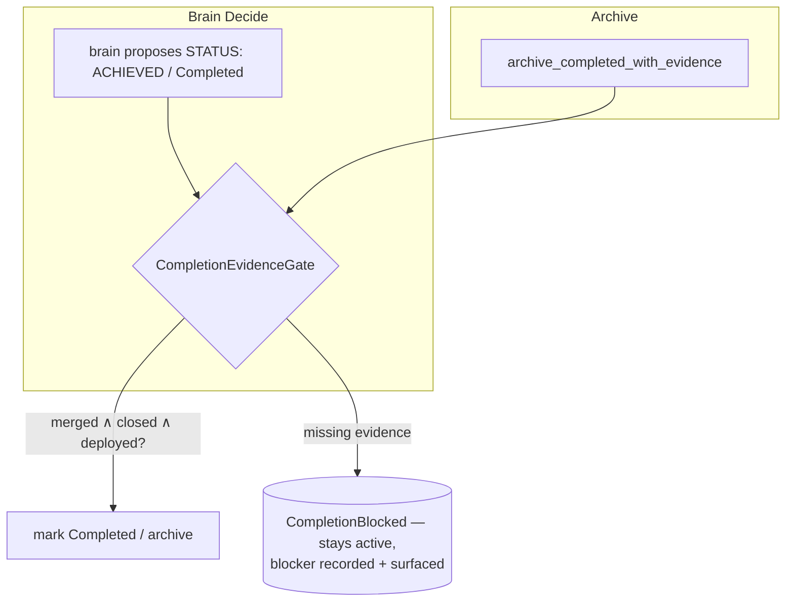

# Concept: deploy-aware done-gate

> **Status: implemented.** The `CompletionEvidenceGate`,
> `archive_completed_with_evidence` / `archive_completed_evidence_aware`, the
> `GhCliEvidenceSource`, and the `SIMARD_COMPLETION_EVIDENCE` kill-switch live in
> [`src/goal_curation/completion_gate.rs`](https://github.com/rysweet/Simard/blob/main/src/goal_curation/completion_gate.rs),
> alongside the legacy
> [`archive_completed`](https://github.com/rysweet/Simard/blob/main/src/goal_curation/operations.rs)
> and [progress-evidence gating](progress-evidence-gating.md). The production
> daemon installs the gate on the OODA curate phase unless the kill-switch is
> `off`. See the
> [completion-evidence gate API reference](../reference/completion-evidence-gate-api.md)
> for the typed surface.

> A goal becomes **complete** only with hard evidence: a **merged PR**, a
> **closed linked issue**, and — when the change affects Simard's own running
> code — a **verified deploy**. Anything short of that keeps the goal active with
> a recorded blocker, instead of silently archiving it.

## The problem this solves

[Progress-evidence gating](progress-evidence-gating.md) guards *percent
increases*: it asks an LLM reviewer whether a claimed jump from `old_percent` to
`new_percent` is coherent with the plan. That gate is deliberately **fail-open** —
on an LLM failure it accepts, because its job is to catch hallucinated jumps, not
to block goals on infrastructure.

But the **completion / archive** path had no such reviewer at all. The goal-board
archive step removes a goal whenever its status is `Completed` or its percent is
`>= 100` — with **no** check that any artifact shipped:

```rust
// src/goal_curation/operations.rs — the unguarded archive path
pub fn archive_completed(board: &mut GoalBoard) -> Vec<ActiveGoal> {
    board.active.retain(|goal| {
        let dominated = matches!(goal.status, GoalProgress::Completed)
            || matches!(goal.status, GoalProgress::InProgress { percent } if percent >= 100);
        // … archived with zero evidence …
    });
}
```

The concrete failure: the **cognitive-memory backup goal** was archived as
"complete" with **no merged PR** and its linked issue still **open** — while
backups were, in fact, broken. An evidence-free done-gate let Simard believe she
had improved when she had not. This is coupled to the brain Decide-phase
parse-failure ([#2419](https://github.com/rysweet/Simard/issues/2419)): when the
engineer-lifecycle brain falls back to a default instead of a parsed decision, it
can stamp a completion that no reviewer ever scrutinised.

The guiding principle:

> **No completion without a verifiable, deployed artifact. A merged PR and a
> closed issue are necessary; for self-affecting changes, running is too.**

## The three-part evidence rule

A goal may transition to `Completed` — or be archived as complete — only when
**all applicable** clauses hold:

1. **Merged PR.** The goal's `wip_refs` include a pull request that is actually
   **merged** (verified, not merely referenced), or a merged PR references the
   goal's linked issue. The merge check is **repo-relative** — it resolves against
   the goal's own target repository and reads the persisted PR linkage (numeric
   `ref_id` **or** `url`), so a PR merged in a non-Simard ecosystem repo satisfies
   this clause instead of re-blocking every cycle. See
   [cross-repo completion reconciliation](cross-repo-completion-reconciliation.md)
   ([#4375](https://github.com/rysweet/Simard/issues/4375)).
2. **Closed issue.** The goal's linked issue is **closed**.
3. **Deployed-and-running** *(self-affecting changes only)*. For a change to
   Simard's own running code — a goal whose `repo` is the Simard repo (the
   default `None` routing) or that bumps a pinned dependency rev — the merged
   commit or dep-rev is reflected in the **running** binary, i.e.
   `DeployDrift::needs_deploy == false` for that change (see
   [reconcile-and-self-deploy](reconcile-and-self-deploy.md)).

Clause 3 is **skipped** for goals that cannot affect the running daemon — a
docs-only change, or a goal that targets another repo and ships there. The gate
classifies "self-affecting" from the goal's `repo` and `wip_refs`; see
[completion-evidence-gate API](../reference/completion-evidence-gate-api.md#self-affecting-classification).

## Where the gate runs

A single `CompletionEvidenceGate` is consulted at **both** sites that can declare
a goal done — there is no path to completion that bypasses it:



- **Goal-curation archive path.** `archive_completed` becomes
  `archive_completed_with_evidence`: a goal is archived only after the gate
  returns `Complete`. A goal that fails the gate is **retained** on the active
  board with its blocker recorded, not removed.
- **Brain Decide / progress-assessment path.** Before a brain decision may set
  `GoalProgress::Completed` (or emit `STATUS: ACHIEVED`), the gate must pass.
  This closes the [#2419](https://github.com/rysweet/Simard/issues/2419)
  fallback hole: a defaulted decision cannot stamp a completion that has no
  evidence.

On rejection the gate returns the **missing** evidence as a structured blocker so
the operator and the next cycle can see exactly what is outstanding:

```text
CompletionBlocked {
    goal_id: "...",
    missing: [PrNotMerged, IssueOpen, NotDeployed],
}
```

## Fail-closed, but never wedged

Unlike the percent-increase reviewer, the completion gate is **fail-closed on the
dimensions it can verify**: "merged" and "closed" are deterministic git/`gh`
queries, and a goal is never archived on unverifiable evidence. But a transient
query error must not crash the cycle or wedge the board:

- On a **query error**, the gate rejects completion with a `CouldNotVerify`
  blocker — the goal stays active, the cycle continues, and the next cycle
  re-checks. A goal is therefore never archived **because** verification failed.
- An operator escape hatch, `SIMARD_COMPLETION_EVIDENCE=off`, disables the gate
  (mirroring the [progress-evidence kill-switch](../operations/progress-evidence-kill-switch.md)).
  With the gate off, the legacy unguarded archive behaviour returns — use it only
  to recover from a gate defect, never as normal operation.

## How this composes

- **Workstream A.** Clause 3 reuses the
  [reconciliation detector](reconcile-and-self-deploy.md); the
  [self-deploy](reconcile-and-self-deploy.md) is what *clears* a `NotDeployed`
  blocker. Together they make "done" mean "merged, closed, and running."
- **Dependency pins ([#2403](https://github.com/rysweet/Simard/issues/2403)).** A
  goal that lands an upstream fix is not done until Simard's own pin is bumped
  *and* the rebuilt binary runs — clauses 1–3 enforce exactly that. See
  [self-maintain-dependency-pins](../howto/self-maintain-dependency-pins.md).
- **Loop-awareness ([#2404](https://github.com/rysweet/Simard/issues/2404)) and
  decompose ([#2405](https://github.com/rysweet/Simard/issues/2405)).** The
  blocker surfaced by a rejected completion feeds the loop-aware prompts so the
  brain re-plans toward the missing evidence rather than re-asserting "done."

## Prompt pins

The done-gate is stated in `goal_curator_system.md` and the brain decide prompt
so the brain proposes completion only when it can point to merged + closed +
deployed evidence. That wording is **content-pinned** — a test asserts the exact
done-gate sentences survive prompt edits, the same way
[self-maintain-dependency-pins](../howto/self-maintain-dependency-pins.md) pins
its done-when wording.

## See also

- [Completion-evidence gate API reference](../reference/completion-evidence-gate-api.md)
- [Cross-repo completion reconciliation](cross-repo-completion-reconciliation.md) — repo-relative merged-PR evidence.
- [Cross-repo merged-PR evidence API reference](../reference/cross-repo-merged-pr-evidence.md)
- [How to diagnose a rejected goal completion](../howto/diagnose-a-rejected-goal-completion.md)
- [Progress-evidence gating](progress-evidence-gating.md) — the sibling percent-increase gate.
- [reconcile-and-self-deploy](reconcile-and-self-deploy.md) — the deploy evidence source.
