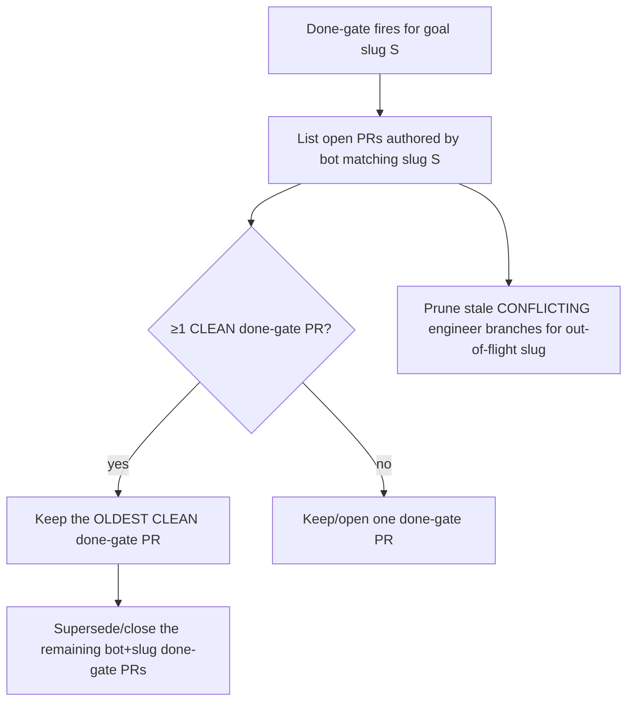

# Concept: done-gate slug convergence

> **Status: partially implemented.** The slug-keyed convergence **logic**
> (`converge_done_gate_prs()`, `sanitize_goal_slug()`, and the ownership-scoped
> supersede decision) is implemented and unit-tested — over an injected
> PR-lister — in
> [`src/goal_curation/completion_gate.rs`](https://github.com/rysweet/Simard/blob/main/src/goal_curation/completion_gate.rs).
> Wiring this decision into the advance-goal spawn/session path
> ([`advance_goal/spawn.rs`](https://github.com/rysweet/Simard/blob/main/src/goal_curation/advance_goal/spawn.rs),
> [`advance_goal/goal_session.rs`](https://github.com/rysweet/Simard/blob/main/src/goal_curation/advance_goal/goal_session.rs))
> so the done-gate actually converges at runtime is a tracked follow-up and is
> **not yet integrated**. See the
> [done-gate slug dedup API reference](../reference/done-gate-slug-dedup-api.md)
> for the typed surface.

> Once wired, a completed goal converges on a **single** done-gate PR. The
> convergence **logic dedups by goal slug**: it keeps the oldest `CLEAN`
> done-gate PR and
> supersedes/closes the rest — scoped to PRs authored by Simard's bot **and**
> matching the exact goal slug — while stale `CONFLICTING` engineer branches for
> an out-of-flight goal are pruned by logic instead of accumulating.

## The problem this solves

The coin-benchmark-harness goal
(`build-a-local-coin-benchmark-harness-…-09e65e35`) — absent from
`inflight_refs` — accumulated ~8 open PRs with **none merged**:

- 5 stale `CONFLICTING`/`DIRTY` engineer branches (`#4161`, `#4149`, `#4134`,
  `#4101`, `#3190`), and
- 3 competing `CLEAN` done-gate PRs (`#4332`, `#4329`, `#4326`).

That is **retry churn without delivery**: the done-gate opened a *new*
done-gate PR for the same goal slug each time it fired, and no single PR ever
converged to merged. The fix repairs the dedup/convergence **logic** so the
churn stops — it does **not** hand-close PRs.

## How convergence works

When the done-gate fires for a completed goal, it enumerates the open PRs for
that goal via an injected PR-lister and converges them:

- **Keep the oldest CLEAN.** Among competing done-gate PRs for one slug, the
  **oldest `CLEAN`** PR wins (deterministic, minimizes wasted CI). The rest are
  superseded/closed with a note pointing at the kept PR.
- **Ownership-scoped supersede.** A PR is only superseded/closed when it is
  **both** authored by Simard's bot identity **and** matches the exact goal
  slug prefix. Human PRs and unrelated PRs are never touched.
- **Prune stale out-of-flight branches.** `CONFLICTING`/`DIRTY` engineer
  branches for a goal no longer in `inflight_refs` are pruned by the same
  scoped logic, rather than accumulating.

## Why this is safe

- **Slug sanitization.** The goal slug is sanitized to `[a-z0-9-]` before it is
  used in any branch name, `gh` argv, or path — no `..`, path separators, or
  shell metacharacters. Convergence for one slug can never reach another goal's
  PRs.
- **Bot-author scoping.** Supersede/close is restricted to PRs authored by
  Simard's bot **and** the exact slug — a double predicate that keeps the fix
  from ever closing a human or unrelated PR.
- **Logic, not hand-closing.** The gate repairs the *dedup/convergence logic*
  so duplicates stop being created; it does not one-off-close PRs as a
  workaround.
- **Idempotent.** Re-running the gate on an already-converged goal is a no-op:
  the single kept PR matches, nothing else to supersede.

## Related

- [Deploy-aware done-gate](./deploy-aware-done-gate.md) — the completion
  evidence gate this convergence sits alongside.
- [Gap-scan dedup & backoff](./gap-scan-backoff-dedup.md) — the sibling dedup
  posture on the Observe side.
- [Done-gate slug dedup API reference](../reference/done-gate-slug-dedup-api.md)
  — the typed surface, sanitization rules, and edge-case matrix.
- [Triage stale open pull requests](../howto/triage-stale-pull-requests.md) —
  the operator runbook for the manual counterpart.
