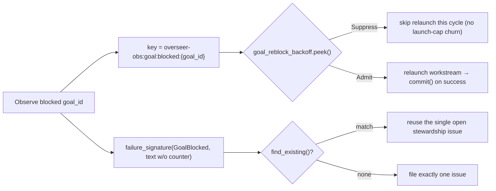

# Goal-reblock backoff & stewardship dedup

> **Status: implemented (issues
> [#4817](https://github.com/rysweet/Simard/issues/4817),
> [#4828](https://github.com/rysweet/Simard/issues/4828)).** The Overseer's
> goal-hygiene path now runs through a dedicated `goal_reblock_backoff`
> `BackoffGate` and files exactly one stewardship issue per still-blocked goal.
> Primary sources:
> [`src/overseer/mod.rs`](https://github.com/rysweet/Simard/blob/main/src/overseer/mod.rs)
> (`goal_reblock_backoff` field + `gate()`/`act()` wiring, and the `GoalBlocked`
> signature text),
> [`src/overseer/guardrails.rs`](https://github.com/rysweet/Simard/blob/main/src/overseer/guardrails.rs)
> (the shared `BackoffGate`), and
> [`src/stewardship/dedup.rs`](https://github.com/rysweet/Simard/blob/main/src/stewardship/dedup.rs)
> (`normalize_for_signature` counter redaction). API surface:
> [goal-reblock backoff reference](../reference/goal-reblock-backoff-api.md).

## The defect this fixes

The Overseer's goal-hygiene step observes blocked goals and, for each, decides
whether to relaunch a covering recipe workstream and/or file a stewardship
issue. Its `dedup_key` and human-facing text are built here:

```rust
// ProblemKind::GoalHygiene
format!("goal:blocked:{goal_id}"),                                    // dedup_key
format!("goal {goal_id} blocked ({consecutive_no_action} no-action cycle(s))"), // signature text
```

Two things went wrong at once:

1. **No relaunch suppression for GoalHygiene.** The
   [gap-scan backoff](./gap-scan-backoff-dedup.md) and the in-flight guard were
   scoped to `WORKSTREAM_COVERAGE_GROUP`; `GoalHygiene` briefs have
   `sequence_group = None` and slipped straight past them. So every ~15-minute
   cycle the overseer **re-observed the same two already-in-flight/blocked
   goals and relaunched their Simard recipe workstreams**, repeatedly hitting
   `held: per-cycle launch cap reached` without ever clearing the block. This ran
   for **8h+** — identical `GoalHygiene … blocked (0 no-action cycle(s))` lines
   from `2026-07-26T18:54Z` through `2026-07-27T02:19Z`.

2. **The signature fluctuated, so dedup never matched.** The
   `({consecutive_no_action} no-action cycle(s))` counter is part of the
   **signature-bearing error text**, and `failure_signature()` hashes that text
   (via `normalize_for_signature`). Each time the counter ticked (`0`, then `1`,
   …) the signature changed, so `find_existing()` never matched the prior issue
   and the overseer **self-filed duplicate stewardship issues** — the
   `recurring_goal_reblock` clusters reported as #4817 and #4828.

The net effect: a goal that was *already blocked and already being worked* got
re-observed, re-enqueued, and re-issued forever, hammering the launch cap and
spamming duplicate stewardship issues.

## The fix, part 1: relaunch backoff keyed per goal

A dedicated gate suppresses per-cycle relaunch of a still-blocked goal:

```rust
goal_reblock_backoff: BackoffGate,   // in the Overseer struct
```

keyed on a stable per-goal key:

```rust
let key = format!("overseer-obs:goal:blocked:{goal_id}");
```

It reuses the same bounded-exponential-backoff semantics as the
[gap-scan `BackoffGate`](../reference/overseer-backoff-gate-api.md):

- The **first** observation of a blocked goal admits (arms the base window).
- A re-observation **inside** the window is **suppressed** — the goal is not
  relaunched — honoring the in-flight/held state and the
  `consecutive_no_action` counter.
- The window grows `× multiplier` per re-hit, capped, so a persistently blocked
  goal is retried on a *slowing* cadence rather than every cycle.
- The gate **re-admits immediately when the block clears** (a long silence, ≥ 2×
  the window, resets to the base window), so a goal that becomes actionable again
  resurfaces promptly.

`gate()` **peeks** (decide without recording) and `act()` **commits** only after
a successful relaunch, so a launch that is itself held (cap reached) does not
consume the dedup slot.

> **Suppression is relaunch-only.** A blocked goal that genuinely needs human
> attention still surfaces **exactly one** stewardship issue for visibility — the
> gate only silences the wasteful *relaunch churn*, never the human signal.

## The fix, part 2: a stable signature folds duplicate issues into one

The fluctuating counter is moved **out of the signature-bearing error text** and
kept only in the issue **body/title annotation** (where the human still sees the
full context). The hashed signature input therefore no longer changes as the
counter ticks, so `find_existing()` matches the prior issue and dedup fires
across cycles → **one** stewardship issue per blocked goal.

As defense-in-depth, `normalize_for_signature` (`src/stewardship/dedup.rs`)
additionally **redacts** residual counter patterns — `(<N> no-action cycle(s))`
and `no progress for <N> cycles` — so any counter that leaks into a signature
input still folds to a single signature. This mirrors the existing UUID-redaction
contract that already scrubs volatile session/run ids.



## Safety & scope

- **Additive / non-breaking.** New gate field + signature-text change +
  redaction rule; no API or PRD change, no `print!`/`println!` — structured
  `tracing` + OTel only.
- **Untrusted `goal_id`.** The goal id is normalized (bounded length,
  `[A-Za-z0-9._:-]`) before it is embedded in a dedup key or an issue
  title/body, preventing signature collisions and issue-body injection.
- **Bounded state.** Backoff state is saturating and evicts on block-clear/TTL,
  so per-goal keys cannot grow unbounded on a long-running daemon.
- **Exactly-once escalation.** Relaunch suppression never suppresses the single
  stewardship issue — information availability is preserved for the human.

## See also

- [Gap-scan dedup & backoff](./gap-scan-backoff-dedup.md) — the sibling rail for coverage gaps.
- [Blocked-goal escalation backoff](./blocked-goal-escalation-backoff.md) — the WhisperGate backoff for escalations.
- [Goal-reblock backoff reference](../reference/goal-reblock-backoff-api.md) — the typed API.
- [Diagnose recurring goal-reblock churn](../howto/diagnose-recurring-goal-reblock-churn.md) — the operator runbook.
