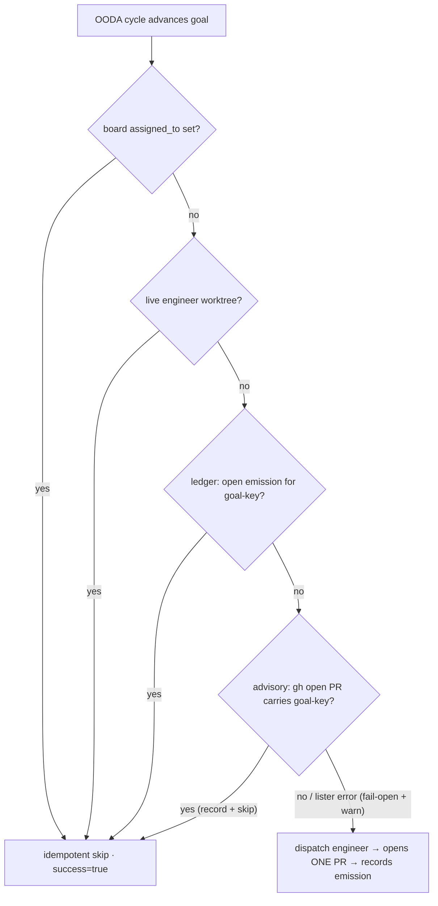

# Concept: idempotent done-gate PR emission

> **Status: implemented.** The `goal_pr_emissions` ledger table lives in the
> typed-OODA store
> ([`src/typed_ooda/schema.rs`](https://github.com/rysweet/Simard/blob/main/src/typed_ooda/schema.rs),
> [`ledger.rs`](https://github.com/rysweet/Simard/blob/main/src/typed_ooda/ledger.rs)),
> the goal-identity key + open-PR detection live in
> [`src/ooda_actions/advance_goal/goal_dedup.rs`](https://github.com/rysweet/Simard/blob/main/src/ooda_actions/advance_goal/goal_dedup.rs),
> and the third dispatch guard lives in
> [`dispatch_spawn_engineer`](https://github.com/rysweet/Simard/blob/main/src/ooda_actions/advance_goal/spawn.rs).
> See the
> [goal-PR emission ledger API reference](../reference/goal-pr-emission-ledger-api.md)
> for the typed surface and the
> [diagnose-duplicate-done-gate-PRs runbook](../howto/diagnose-duplicate-done-gate-prs.md).

> A goal produces **at most one open done-gate pull request**. Before dispatching
> an engineer that would open a PR, Simard checks a durable per-goal emission
> ledger (and, advisorily, live open PRs on the target repo). If an open PR for
> that goal already exists, dispatch is an **idempotent no-op** — no second PR,
> no second worktree, no second LLM session.

## The problem this solves

The "done-gate" (the [deploy-aware completion gate](deploy-aware-done-gate.md))
does **not** itself open PRs — it only decides when a goal may be marked
`Completed`. The pull request is opened downstream, when the OODA loop dispatches
an engineer for a goal in
[`dispatch_spawn_engineer`](https://github.com/rysweet/Simard/blob/main/src/ooda_actions/advance_goal/spawn.rs)
and that engineer runs `gh pr create`.

`dispatch_spawn_engineer` already carried **two** idempotency guards, both keyed
on *in-flight engineer state*:

1. **Board-assignment guard** — skip if the goal's `assigned_to` is already set
   (`spawn.rs` ~L265).
2. **Live-worktree guard** — skip if an on-disk engineer worktree is still
   pursuing the goal (`spawn.rs` ~L291, issue #1227).

Neither guard is keyed on an **already-open pull request**. When an engineer
finishes and exits — its board assignment cleared and its worktree reaped (its
`engineer_claims` row is `DELETE`d on termination, see
[engineer-claim-liveness-lease](engineer-claim-liveness-lease.md)) — but its PR
remains **open and unmerged** (awaiting review or blocked on CI), the next OODA
cycle sees a goal with no live engineer and dispatches a **fresh** one. That
engineer opens a **second** PR for the same goal. Repeat every cycle.

The concrete failure, observed **2026-07-18** on `rysweet/Simard`:

- **3×** duplicate done-gate PRs for the `coin-benchmark` goal —
  [#4326](https://github.com/rysweet/Simard/pull/4326),
  [#4329](https://github.com/rysweet/Simard/pull/4329),
  [#4332](https://github.com/rysweet/Simard/pull/4332).
- **4×** duplicate done-gate PRs for the `kgpacks-parity` goal —
  [#4324](https://github.com/rysweet/Simard/pull/4324),
  [#4328](https://github.com/rysweet/Simard/pull/4328),
  [#4330](https://github.com/rysweet/Simard/pull/4330),
  [#4333](https://github.com/rysweet/Simard/pull/4333).

Together they inflated the repo to ~31 open PRs (~18 `CONFLICTING`/stale) — a
self-inflicted signal flood that drowns real work and wastes reviewer and CI
budget. Tracked as [#4166](https://github.com/rysweet/Simard/issues/4166) and
[#4189](https://github.com/rysweet/Simard/issues/4189).

The guiding principle:

> **One goal, one open PR. PR emission is idempotent on stable goal identity —
> not on the engineer's transient liveness, and never on the PR's title.**

## The goal-identity key

Emission is deduplicated on a one-way key derived **only** from durable goal
identity — mirroring the [stewardship signature](stewardship-mode.md)
precedent (`stewardship-signature: <sig>`):

```
goal_dedup_key(id, repo) = first 16 hex chars of sha256(id + "\n" + repo)
```

| Property | Reason |
| --- | --- |
| Derived from `goal.id` **+** `goal.repo` only | Durable identity. Survives daemon restarts, engineer churn, and re-planning. |
| **Never** derived from the goal title | Title text drifts between cycles; keying on it would either split a renamed goal into two PRs or merge two distinct goals into one. |
| One-way `sha256`, 16-hex truncation | Fixed-length, URL/branch-safe, and reveals no goal content in the PR body/branch or logs. |
| Stored as `goal_key`, a column deliberately **not** named `claim_key` | `engineer_claims.claim_key` is `DELETE`d on engineer termination (that's the bug's root); the emission key must **outlive** the engineer, so it lives in a separate, never-deleted table under a distinctly named column to prevent the two keys from being conflated. |

The 16-hex key is stamped into the PR as a body trailer and echoed via the head
branch, so a later cycle can recognise "this PR belongs to that goal":

```
Simard-Goal-Key: 4f2a9c1e7b3d0a58
```

## The two-layer guard

A third guard is inserted into `dispatch_spawn_engineer`, **after** the
live-worktree guard (`spawn.rs` ~L291) and **before** any worktree allocation or
engineer dispatch:



1. **Primary — durable ledger (authoritative).** Consult the
   `goal_pr_emissions` row for this goal-key. If an **open** emission exists,
   dispatch is a no-op returning `success = true` (declining to act is the
   correct outcome, matching the sibling guards). The ledger is the
   self-written SQLite source of truth; it is **never** wrong about a PR Simard
   itself emitted, because the emitting engineer records the row after
   `gh pr create`.

2. **Secondary — advisory `gh` reconciliation (fail-open).** If the ledger has
   no open emission (e.g. a PR that predates the feature, or a lost writeback),
   Simard lists open PRs on the target repo once per cycle and matches on the
   `Simard-Goal-Key:` body trailer (or the `engineer/{goal-key}-` head-branch
   convention). A match **records** the emission into the ledger (self-healing)
   and skips. This layer is best-effort: a lister error does **not** block
   dispatch — it fails **open** with a `tracing::warn!` on `ooda::done_gate`,
   because the durable ledger already holds the primary guarantee and a
   network hiccup must never wedge the loop.

The open-PR list is **cached per OODA cycle** (keyed on the cycle counter), so
reconciliation costs at most one `gh pr list` per repo per cycle even when many
goals advance.

## Why the ledger, not the existing claim table

`engineer_claims` is `DELETE`d when an engineer terminates
([`subordinate.rs`](https://github.com/rysweet/Simard/blob/main/src/ooda_actions/advance_goal/subordinate.rs)) —
that deletion is *load-bearing* for claim-liveness counting and must not change.
Reusing it to track PR liveness would either break liveness counting or resurrect
the very bug. The emission ledger is therefore a **separate, forward-only** table
whose rows persist by `state` (`open` → `merged`/`closed`/`superseded`), never by
row deletion, so a PR outlives the engineer that opened it.

## Fail-open, but never duplicate

The design deliberately splits authority so the worst case is bounded:

- The **ledger** is fail-*closed* for the guarantee that matters: if it says a
  PR is open, no duplicate is emitted.
- The **`gh` reconciliation** is fail-*open*: on a lister error it logs and
  proceeds, because it is only a self-healing backstop. A theoretical duplicate
  can slip through **only** if the ledger *also* lacks the row (a PR Simard never
  recorded), which is surfaced via the `WARN` rather than silently swallowed.
- The guard is **suppress-only** — it can decline to dispatch, but it cannot
  merge or close anything. The worst outcome of a spoofed `Simard-Goal-Key:`
  trailer on an attacker-controlled PR body is *emission suppression* (goal
  starvation), not an unwanted merge — and even that is contained because the
  self-written ledger, not the remote PR, is authoritative. The trailer parser
  is total/no-panic with strict `^[0-9a-f]{16}$` validation, a body-size cap,
  and multiple-match → ignore-all.

## What did NOT change

- **Distinct-goal PRs are unaffected.** Two different goals yield two different
  keys and two PRs — the guard only ever collapses *the same goal's* re-emission.
- **The completion gate.** Marking a goal `Completed` still requires the
  [deploy-aware done-gate](deploy-aware-done-gate.md) evidence (merged PR, closed
  issue, verified deploy). This feature is upstream of that and only prevents
  *duplicate* open PRs; it never marks a goal done.
- **The engineer's PR content and CI.** The engineer still opens a normal PR; it
  merely stamps the `Simard-Goal-Key:` trailer and records the emission
  afterward.

## Cleanup of the pre-existing duplicates (best-effort)

Preventing *future* duplication is the core deliverable. Closing/superseding the
already-filed duplicates (#4324–#4333) and consolidating the tracking issues
(#4166, #4189) is **best-effort/secondary** — attempted only when the fix cleanly
resolves them, and never a merge blocker. See the
[triage-stale-pull-requests runbook](../howto/triage-stale-pull-requests.md) for
the manual sweep.

## See also

- [Goal-PR emission ledger API reference](../reference/goal-pr-emission-ledger-api.md)
- [How to diagnose duplicate done-gate PRs](../howto/diagnose-duplicate-done-gate-prs.md)
- [Concept: engineer-claim liveness lease](engineer-claim-liveness-lease.md) — why the claim row is deleted on termination (the bug's root cause).
- [Concept: deploy-aware done-gate](deploy-aware-done-gate.md) — the completion gate this sits upstream of.
- [Overseer recipe-launch idempotency reference](../reference/overseer-recipe-launch-idempotency.md) — the sibling per-signature launcher rail.
- [Concept: stewardship mode](stewardship-mode.md) — the `stewardship-signature:` marker precedent this key mirrors.
