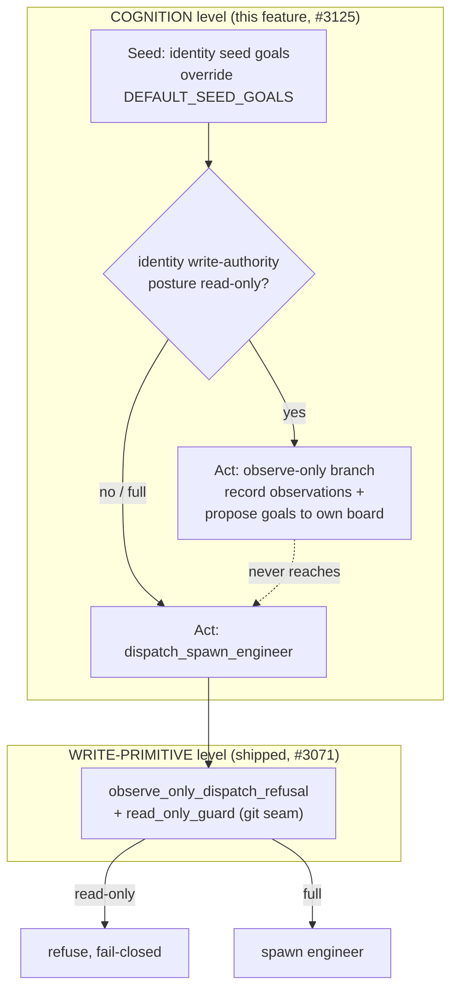

# Identity-scoped cognition — seed goals, observe-only Act, and target scope

!!! warning "Implementation status — the write chokepoint ships today; identity-scoped cognition is the target design (tracking #3125)"
    **Shipped today (issue #1, PR [#3071](https://github.com/rysweet/Simard/pull/3071)):**
    the read-only *write* floor. `SIMARD_OBSERVE_ONLY=1` activates the fail-closed
    `read_only_guard` classifier, wired into `git_guardrails::check_git_safety` and
    into `ooda_actions::advance_goal::spawn::dispatch_spawn_engineer` (via
    `observe_only_dispatch_refusal`), so a read-only identity dispatches **0** write
    actions. **Planned (this page, NOT yet implemented, tracking
    [#3125](https://github.com/rysweet/Simard/issues/3125)):** the *cognition-level*
    identity fields — identity-declared **seed goals** that override
    `DEFAULT_SEED_GOALS`, a **target-repo scope**, and the **observe-only Act phase**
    that proposes goals without ever *entering* engineer dispatch. Treat the field
    and function names below as the target design; they are grounded in the real
    seeding and dispatch code they extend. The runnable read-only proof lives in the
    `rysweet/Crocutus` repo (`scripts/prove-guardrail.sh`).

## The problem: the guardrail held, but the cognition was still Simard's

The [write-authority posture](./write-authority-posture.md) and the shipped
`SIMARD_OBSERVE_ONLY` floor make a second identity *structurally unable to
write*. That is necessary but **not sufficient** for a real observer.

Running the `crocutus` read-only identity live on host `dev` — its own
`SIMARD_STATE_ROOT`, `SIMARD_IDENTITY=crocutus`, `SIMARD_OBSERVE_ONLY=1`, working
directory a read-only clone of an external Azure DevOps repo — exposed the gap
([#3125](https://github.com/rysweet/Simard/issues/3125)). A full OODA cycle ran,
and **the identity did not shape cognition**:

- It **seeded Simard's five `DEFAULT_SEED_GOALS`**
  (`self-serve-dashboard-improvement`, `improve-amplihack-test-coverage`,
  `fix-broken-features`, `improve-cognitive-memory-persistence`,
  `enhance-simard-meeting-experience`) — *not* hyenas-observation goals.
- In the Act phase it **decided to spawn write-bearing engineers** against
  `rysweet/Simard` — i.e. it tried to *change software*, not *observe* its target.

The `read_only_guard` did its job: the target clone had 0 local changes, 0
unpushed commits, 0 engineer worktrees. Fail-closed worked. **But the reasoning
was wasted** — the DECIDE/ACT cognition ran on Simard's goals and chose engineer
dispatch that the guardrail was always going to block, spending AI credits on
doomed work. A read-only observer should not merely be *blocked from writing*;
its **cognition** should be scoped to observing its target and articulating
goals, and its Act phase should be **observe-only** in the first place.

## The abstraction gap

Before this feature, an identity parameterized state root, prompts, the
write guardrail, port, and systemd unit — but **not** the three things that make
an observer an observer:

| Parameterized before #3125 | **Not** parameterized (the gap) |
|---|---|
| State root / isolation ([host isolation](./multi-identity-host-isolation.md)) | **Seed goals** — the observer inherited Simard's baked-in defaults |
| Prompt assets / persona ([pluggable identity](./pluggable-identity.md)) | **Act-phase posture** — read-only still *entered* engineer dispatch |
| Write guardrail ([`SIMARD_OBSERVE_ONLY`](./write-authority-posture.md)) | **Target scope** — goals pointed at `rysweet/Simard`, not the target |

Identity-scoped cognition adds exactly those three, and nothing more. It is
**config plus one agentic Act branch behind a thin deterministic rail**, not a
new subsystem.

## Two enforcement levels: write chokepoint vs. cognition

The read-only mandate now stacks at two distinct levels. The lower level already
ships; this feature adds the upper one.



- **Write-primitive chokepoint (shipped).** `observe_only_dispatch_refusal`
  short-circuits `dispatch_spawn_engineer` *if* it is ever reached under a
  read-only posture, and `read_only_guard` blocks the git write seam. This is the
  last-line, defense-in-depth floor and it stays.
- **Cognition level (this feature).** A read-only identity should never *reach*
  the chokepoint for a write-bearing action, because its Act phase takes the
  observe-only branch. That saves the credits the chokepoint would otherwise let
  the brain burn deciding to spawn.

The two are **defense in depth**: the cognition branch prevents the doomed
decision; the write chokepoint remains as the structural guarantee if anything
slips past.

## The solution — three first-class identity fields

### 1. Seed goals from the identity (override, not append)

An identity may declare its own initial goals. When present, they **replace**
Simard's baked-in `DEFAULT_SEED_GOALS` at the OODA cold-start seeding site in
`ooda_loop::cycle`; when absent, `DEFAULT_SEED_GOALS` is used unchanged. Each
seed goal carries a target-repo slug, exactly like the existing
`DEFAULT_SEED_GOALS` tuple `(priority, title, description, Option<repo>)` and
`ActiveGoal.repo`, so seeding stays a single shape.

```toml
[[identities]]
name = "crocutus"
default_mode = "engineer"

# Identity seed goals OVERRIDE Simard's DEFAULT_SEED_GOALS when present.
[[identities.seed_goals]]
priority = 1
title = "Observe hyenas repo health"
description = "Read the hyenas Azure DevOps repos and assess branch hygiene, CODEOWNERS, LICENSE, dependabot coverage, and large blobs. OBSERVE ONLY — record findings and propose repo-hygiene goals; do not change anything."
repo = "hyenas"

[[identities.seed_goals]]
priority = 2
title = "Articulate repo-hygiene backlog"
description = "Turn the observations into prioritized, target-scoped repo-hygiene goals on this identity's own board."
repo = "hyenas"
```

Simard herself sets **no** `identity.toml` (or a `full` identity with no
`seed_goals`), so she keeps her exact five defaults — **no behavior change**.

### 2. Observe-only Act phase when the posture is read-only

The [write-authority posture](./write-authority-posture.md) `read-only` value is
the switch. When the resolved identity is read-only, the Act phase runs an
**observe-only branch** instead of the engineer-dispatching branch:

- **Agentic where it belongs.** A reasoner/prompt decides *what to observe* and
  *what goals to propose* — this is cognition, not a hard-coded checklist. There
  are **no wall-clock timeouts** on that agentic step.
- **Thin deterministic rail.** A pure predicate (`posture_permits_spawn`) hard
  blocks the dispatch branch when the posture is read-only, so the observe-only
  path can never call `dispatch_spawn_engineer`. This mirrors the existing
  pattern in `dispatch_spawn_engineer`, which already pairs an **agentic brain
  decision** (`decide_engineer_lifecycle`) with a **deterministic 3-strikes
  safeguard**.
- **Fail-closed.** If the posture cannot be determined, the rail denies spawn —
  it does **not** fall back to dispatching. "No identity" resolves deterministically
  to `full` (Simard's default), which *is* a determinable state, so Simard is
  unaffected; an *unresolved* posture under an identity denies. There is **no
  silent degradation**.

The observe-only branch records its observations and proposes goals **to the
identity's own board** — the positive behavior the issue asks for, replacing the
"decide to spawn, then get refused" waste.

### 3. Target scope

Goals and observations are scoped to the identity's **target repo set**, not
`rysweet/Simard`. The target set is the identity's `target_repos` (or, when
omitted, the union of the `repo` slugs on its `seed_goals`). Resolution reuses
the existing goal-to-repo mapping, so a `crocutus` observation about branch
hygiene is filed against `hyenas`, never against the daemon's own repo.

```toml
[[identities]]
name = "crocutus"
default_mode = "engineer"
target_repos = ["hyenas"]     # observations/goals scoped here, not rysweet/Simard

[identities.authority]
posture = "read-only"          # the switch for the observe-only Act phase
```

## Why this is depend-not-fork

`crocutus` gains all of this **through configuration**, not a code fork. The
seed goals, target scope, and read-only posture live in the Crocutus identity's
`identity.toml` and prompt assets in the `rysweet/Crocutus` repo, which
*depends on* Simard. Simard owns the mechanism; the identity owns the values.
Duplicating any of this logic into Crocutus would be the exact abstraction
failure the [Crocutus tutorial](../tutorials/deploy-crocutus-read-only-observer.md#abstraction-gap-note)
warns against.

## Simard is unchanged by default

The feature is strictly additive and gated on an identity being present *and*
read-only:

- **No identity**, or a **`full` / read-write identity with no `seed_goals`**:
  the five `DEFAULT_SEED_GOALS` seed exactly as before, and the Act phase
  dispatches engineers exactly as before. This invariant is an acceptance test,
  not a hope.
- The observe-only branch and the seed-goal override activate **only** when the
  resolved identity declares them.

Operator visibility follows the repo's `[simard]` eprintln convention — the
seeding site logs whether it seeded identity goals or the defaults, and the Act
phase logs when it takes the observe-only branch and how many goals it proposed.

## What this is not

- **Not a second guardrail system.** It reuses the existing
  [write-authority posture](./write-authority-posture.md) as the read-only
  switch and keeps `observe_only_dispatch_refusal` / `read_only_guard` as the
  write-primitive floor. Cognition scoping is *above* those, not a replacement.
- **Not a per-cycle toggle.** Seed goals, target scope, and posture are
  identity-level, resolved once at load time. A running session cannot grant
  itself Simard's default goals or raise its own posture.
- **Not a sandbox.** It governs Simard's own seeding and Act cognition. A
  read-only identity must still hold no write credential (see the
  [four-layer defense in depth](./write-authority-posture.md#defense-in-depth-for-a-read-only-identity)).
- **Not a fork.** Crocutus consumes it via `identity.toml` + prompts only.

## See also

- [Write-authority posture](./write-authority-posture.md) — the read-only *write*
  posture this cognition layer sits on top of, and its four-layer defense in depth.
- [Identity-scoped cognition API reference](../reference/identity-scoped-cognition-api.md)
  — the `[[identities.seed_goals]]` / `target_repos` TOML surface and the seeding
  and Act-phase function contracts.
- [Pluggable identity](./pluggable-identity.md) — the `identity.toml` loader that
  carries these fields.
- [Multi-identity host isolation](./multi-identity-host-isolation.md) — the
  per-instance isolation that keeps a read-only identity's board and credentials
  separate.
- [Deploy Crocutus as a read-only observer](../tutorials/deploy-crocutus-read-only-observer.md)
  — the worked example this feature makes "mostly configuration".
