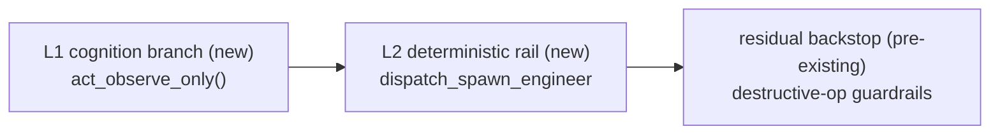

# Identity write-authority — cognition-level observer posture

## The problem: a read-only guard that fires too late

Simard is an autonomous OODA daemon. [Pluggable identity](./pluggable-identity.md)
lets a different persona drive the daemon — for example, a **Crocutus** identity
whose job is to *observe* a set of Azure DevOps repositories (the "hyenas") and
articulate repo-hygiene goals, **without changing any software**.

Before issue [#3125](https://github.com/rysweet/Simard/issues/3125), write
authority was **not a property of identity at all**. Whatever persona drove the
daemon, cognition was always Simard's: it seeded Simard's goals and its Act
phase dispatched write-bearing engineers.

The only pre-existing guards on this branch are *destructive-operation*
guardrails — `git_guardrails::check_git_safety` (gated by
`SIMARD_GIT_GUARDRAILS`) and `ado_acl_guard::check_ado_acl_safety`. They block
force-push, `reset --hard`, branch deletion, and ADO ACL escalation, but they
**still permit ordinary commits, branches, and PRs**. They are a
destructive-command backstop, **not** a read-only floor.

!!! note "Relationship to #3071"
    A separate effort, PR [#3071](https://github.com/rysweet/Simard/pull/3071),
    added an *env-driven* observe-only floor (`read_only_guard` /
    `SIMARD_OBSERVE_ONLY`), tracked toward this typed design in
    [#3067](https://github.com/rysweet/Simard/issues/3067). **#3071 is not in
    this branch's base**, so that floor is absent here — which is exactly why
    cognition-level enforcement must carry the guarantee. The typed
    `write_authority` posture is #3071's successor: if the branch is later
    rebased onto #3071, the typed rail **supersedes** its env-keyed
    `dispatch_spawn_engineer` short-circuit (posture is the source of truth; the
    env var may remain only as an operator override). See the
    [reference design-status note](../reference/identity-posture-observer.md).

Consider the **Crocutus** read-only identity running on this base. With
cognition still Simard's, the daemon would:

1. Seed **Simard's** baked-in `DEFAULT_SEED_GOALS`
   (`self-serve-dashboard-improvement`, `improve-amplihack-test-coverage`,
   `fix-broken-features`, `improve-cognitive-memory-persistence`,
   `enhance-simard-meeting-experience`) — not repo-hygiene goals for the hyenas.
2. In the Act phase, dispatch **write-bearing engineers** against
   `rysweet/Simard` — trying to **change software** rather than **observe
   hyenas**.
3. Actually **make those changes**: the destructive-op guardrails would let the
   ordinary commits and PRs through, because nothing on this base enforces
   read-only.

So the identity is read-only in name only: read-write in the head, and — absent
a read-only floor — read-write at the hands too. Even a credits-only view is
bad: the daemon burns AI credits planning and dispatching engineers that never
belonged to this persona.

## The insight: posture belongs in cognition, not just at the chokepoint

A read-only OBSERVER should never *decide* to dispatch a write-bearing engineer
in the first place. The fix makes **write authority a first-class property of
identity** and enforces it where the decisions are made:

- **Which goals get seeded** — an identity declares its *own* seed goals, scoped
  to its *own* target repos, replacing Simard's defaults.
- **Whether the Act phase may dispatch engineers at all** — a read-only posture
  runs an *observe-only* Act branch that records observations and proposes
  goals, and is structurally incapable of dispatching an engineer.

This is **cognition-level enforcement** — and on this branch it is what makes
read-only *real*. The destructive-op guardrails stay where they are as a
residual backstop; they were never a read-only boundary.

## Write authority as identity posture

An identity now carries a `write_authority` posture:

| Posture | Meaning | Act phase |
|---------|---------|-----------|
| `read-write` (**default**) | Full authority — Simard's historical behavior | Engineer-dispatching `act()` |
| `read-only` | Observe-only | `act_observe_only()` — records observations, proposes goals, **never** dispatches |

The default is `read-write`, so **Simard herself is unchanged**: no identity, or
a `read-write` identity, keeps the same five seed goals and the same
engineer-dispatching Act phase. This invariant is proven by test (see
[acceptance criteria](../reference/identity-posture-observer.md#acceptance-criteria)).

## Three principles

### 1. Keep the decision agentic, keep the guarantee deterministic

*What to observe* and *what goals to propose* are genuinely open questions — they
belong to a reasoner behind the `ObserveOnlyBrain` trait (the current wired
baseline is a deterministic floor, `DeterministicObserveBrain`; a prompt-backed
brain can replace it without touching the rail). But *"a read-only identity must
never spawn an engineer"* is a hard invariant, so it sits behind a **thin
deterministic rail** in `dispatch_spawn_engineer` that hard-blocks the spawn
when posture is read-only. This mirrors the existing pattern in `spawn.rs`,
where an agentic brain decision is backed by a deterministic 3-strikes
safeguard.

### 2. Defense in depth — two new layers over a residual backstop

- **L1** stops Simard from even *considering* a write-bearing engineer (saves
  credits and, on this base, prevents any write at all).
- **L2** is a deterministic backstop if any decision path reaches spawn.
- The **residual backstop** is the pre-existing destructive-op guardrails
  (`git_guardrails::check_git_safety`, `ado_acl_guard::check_ado_acl_safety`),
  untouched — a last-ditch guard against *destructive* commands, not a read-only
  floor.

L1 and L2 are independent, and each is independent of the residual backstop. A
regression in one does not defeat the others.

### 3. Fail closed, never silently degrade

Write authority is resolved **once at daemon boot** (`resolve_boot_posture`) and
threaded into the OODA state (`OodaState.write_authority` / `observer_targets` /
`identity_seed_goals`) — never re-derived per cycle, so it can't drift. The
resolution is deterministic:

| Situation | Posture | Reasoning |
|-----------|---------|-----------|
| No identity (`SIMARD_IDENTITY_PATH` unset) | `read-write` | A *determined* state — this is Simard herself (preserves the no-behavior-change invariant). |
| Read-write / read-only identity resolved | as declared | Honor the manifest. |
| Identity present but posture **unresolvable** | `read-only`, no-spawn | *Undetermined* ⇒ fail closed. If we cannot prove authority, we do not act. |

Note the asymmetry: **absence** of an identity is safe-by-design (Simard), but a
**present-yet-unreadable** posture is treated as read-only. There are no
wall-clock timeouts on agentic steps, and no fallback to read-write — consistent
with Simard's honest-degradation pillar.

## Target scope, not Simard scope

A read-only identity's goals and observations are scoped to its **target repo
set** (`targets` in `identity.toml`), reusing the same per-goal target-repo slug
mechanism documented in
[Goal target-repo routing](../reference/goal-target-repo-routing.md). A
read-only seed goal that names a repo outside `targets` — or names no repo at
all — is a **fail-closed config error**; it is *never* silently re-scoped to
`rysweet/Simard`. So Crocutus observes the hyenas, and only the hyenas.

## Depend, don't fork

The whole feature lands in **Simard** (the framework). The Crocutus identity
consumes it purely through **configuration and prompts** — its `identity.toml`
sets `write_authority = "read-only"`, lists the hyenas repos in `targets`, and
declares repo-hygiene seed goals. No Crocutus-side logic duplicates Simard's
cognition. This keeps the surface small: the change is mostly identity config
plus one agentic Act-phase branch behind a thin deterministic rail, not a new
imperative subsystem.

## What this is not

- **Not a destructive-op guardrail.** `git_guardrails::check_git_safety` and
  `ado_acl_guard::check_ado_acl_safety` only block destructive/escalation
  commands; they remain as a residual backstop. This feature adds the *earlier*,
  cognition-level read-only enforcement those guardrails never provided.
- **Not a behavior change for Simard.** Default posture is `read-write`; the
  five default seed goals and the engineer-dispatching Act phase are preserved.
- **Not a Crocutus-specific mechanism.** Any identity can declare a read-only
  posture, targets, and seed goals. Crocutus is just the first consumer.
- **Not a new "Bridge".** The feature reuses the existing `OodaBridges` bundle
  and introduces **no new** `Bridge` orchestration symbol. (`BridgeRequest`,
  `BridgeResponse`, `BridgeId`, and friends already exist in `src/bridge.rs`;
  this feature adds none.)

## Related

- Reference: [Identity write-authority & observer posture API](../reference/identity-posture-observer.md)
- How-to: [Configure a read-only observer identity](../howto/configure-observer-identity.md)
- [Pluggable identity — TOML-driven agent personas](./pluggable-identity.md)
- [Operational autonomy model](./operational-autonomy-model.md)
