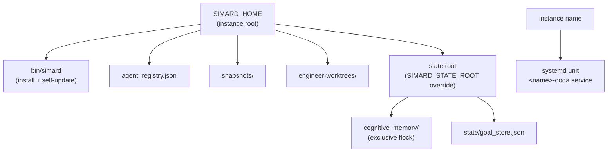

# Multi-identity host isolation — running a second agent identity side-by-side

!!! warning "Implementation status — shipped v1 isolates the state tree only (tracking #3067)"
    **Shipped today:** two identities are kept apart by **`SIMARD_STATE_ROOT`**, which
    relocates the durable state tree — cognitive-memory store (exclusive `flock`) and
    goal board — so `crocutus` uses `~/.crocutus` and cannot collide with `simard`'s
    `~/.simard` state. This is the load-bearing constraint (the flock refuses a second
    daemon on a shared root).
    **Planned (NOT yet implemented):** the **`SIMARD_HOME`** instance root,
    `instance_home()`, and systemd unit-name templating that also relocate the ambient
    singletons which still default to `$HOME/.simard` (install dir, agent registry,
    snapshots, engineer-worktrees) — tracked in
    [#3067](https://github.com/rysweet/Simard/issues/3067). Until then, set a distinct
    `SIMARD_STATE_ROOT` (and distinct port/socket/unit name) per instance; a read-only
    observer never spawns engineer-worktrees, so that singleton is moot for `crocutus`.

## The problem

[Pluggable identity](./pluggable-identity.md) lets one Simard process load a
different **persona** (prompts, operating mode, memory policy) from an
`identity.toml`. That is enough when only one autonomous daemon runs on a host.

It is **not** enough to run two autonomous daemons at once. Simard's second
identity — `crocutus`, a read-only observer of an external Azure DevOps
project (issue #1) — must run on the same host as the primary `simard`
daemon, continuously, without interfering with it. Two independent OODA
daemons collide on a set of **ambient, host-level singletons** that were
written when only one identity existed:

| Singleton | Default location | Collision if shared |
|-----------|------------------|---------------------|
| Cognitive-memory store | `$HOME/.simard` state root | **Exclusive `flock` per state root** — the second process is refused |
| Binary install dir | `$HOME/.simard/bin/simard` | Self-update of one identity overwrites the other |
| Agent registry | `$HOME/.simard/agent_registry.json` | Registrations interleave and corrupt |
| Memory snapshots | `$HOME/.simard/snapshots/` | Snapshot restore crosses identities |
| Self-update state / backups | `$HOME/.simard/{bin,state}` | Rollback of one reverts the other |
| Engineer worktrees | `$HOME/.simard/engineer-worktrees/` | Worktree sweep deletes the peer's trees |
| systemd unit | `simard-ooda.service` | Only one unit name; second cannot install |
| Dashboard port | `SIMARD_DASHBOARD_PORT` default | Bind conflict |
| Memory IPC socket | `SIMARD_MEMORY_SOCKET` default | Bridge cross-talk |

The cognitive-memory exclusive lock is the load-bearing constraint: two
daemons pointed at the same state root **cannot** both run. That is by
design (see [Cognitive-memory durability](../operations/cognitive-memory-durability.md)),
and the isolation layer leans on it rather than fighting it.

## The solution: an instance root (`SIMARD_HOME`)

Multi-identity host isolation introduces a single **instance root** concept.
Every ambient host-level singleton derives from one directory:

- **`SIMARD_HOME`** — the instance root. Defaults to `$HOME/.simard` for the
  primary instance. The `crocutus` instance sets `SIMARD_HOME=$HOME/.crocutus`.
- A single helper, **`instance_home()`**, resolves `SIMARD_HOME` (falling back
  to `$HOME/.simard`). Every previously-hardcoded `$HOME/.simard` call site —
  install dir, agent registry, snapshots, self-update state, engineer
  worktrees — routes through it. See the
  [agent instance-isolation reference](../reference/agent-instance-isolation.md).
- The **systemd unit name is derived from the instance name** rather than the
  literal `simard-ooda.service`. The primary keeps `simard-ooda.service`; the
  second installs as `crocutus-ooda.service` (and `crocutus-signal.service`).
- The narrow per-subsystem overrides already shipped —
  [`SIMARD_STATE_ROOT`](../reference/state-root-resolution.md),
  `SIMARD_DASHBOARD_PORT`, `SIMARD_MEMORY_SOCKET`, `SIMARD_AGENT_NAME`,
  and the [pluggable-identity](./pluggable-identity.md) selectors
  (`SIMARD_IDENTITY`, `SIMARD_IDENTITY_PATH`, `SIMARD_PROMPT_ROOT`) — continue
  to work and layer **on top of** `SIMARD_HOME`.

This closes the pre-existing inconsistency where some paths honored
`SIMARD_STATE_ROOT` and others hardcoded `$HOME/.simard`.



## Two instances, two disjoint trees

With `SIMARD_HOME` set per instance, the two daemons own disjoint trees:

```
$HOME/.simard/                 $HOME/.crocutus/
├── bin/simard                 ├── bin/simard        (same binary, own copy)
├── agent_registry.json        ├── agent_registry.json
├── snapshots/                 ├── snapshots/
├── engineer-worktrees/        ├── engineer-worktrees/   (unused: read-only)
└── state/                     └── state/
    ├── cognitive_memory/          ├── cognitive_memory/  (own flock)
    └── goal_store.json            └── goal_store.json

simard-ooda.service            crocutus-ooda.service
:8080 (dashboard)              :8090 (dashboard)
memory.sock                    crocutus-memory.sock
```

They share **only** the Rust binary artifact (both instances are the same
`simard` build; `crocutus` is a *configuration* of it, not a fork — see
[Depend on Simard, do not copy it](#what-this-is-not)). Everything stateful is
per-instance.

## Fail loud, never silently degrade

Two instances that accidentally share a state root **must fail loudly**. The
cognitive-memory exclusive `flock` already does this: the second daemon to
start on a shared root is refused at startup with a visible error.

The isolation layer must **not** add a fallback that silently opens a
file-backed or in-memory store when the lock is held. That would be exactly
the kind of hidden degradation that
[honest degradation (Pillar 11)](../fail-open-audit.md) forbids: the operator
would believe two isolated identities are running when in fact one is writing
to a degraded, unlocked store. Startup surfaces the collision; the operator
fixes the configuration.

## The isolation invariant

An instance is correctly isolated when **all** of the following differ from
every other instance on the host:

1. `SIMARD_HOME` (⇒ install dir, agent registry, snapshots, worktrees).
2. `SIMARD_STATE_ROOT` (⇒ cognitive-memory `flock`, goal store, handoffs).
3. `SIMARD_DASHBOARD_PORT`.
4. `SIMARD_MEMORY_SOCKET`.
5. systemd unit name (`<instance>-ooda.service`).
6. GitHub / Azure DevOps credentials (see
   [pluggable-identity auth](./pluggable-identity.md) and the
   [Crocutus tutorial](../tutorials/deploy-crocutus-read-only-observer.md)).

The [`simard debug instance`](../reference/agent-instance-isolation.md#simard-debug-instance)
command prints all six for the current environment so an operator can verify
isolation before starting the second daemon.

## What this is not

- **Not a fork.** `crocutus` reuses the primary `simard` binary, runtime,
  session model, memory model, identity loader, precedence, and composition
  unchanged. It is expressed as an `identity.toml` persona plus an environment
  profile plus a per-instance `SIMARD_HOME`. If a second identity required
  large amounts of duplicated Rust, that would signal an abstraction gap to be
  fixed in Simard, not copied downstream.
- **Not a container/VM boundary.** Instance isolation is process- and
  filesystem-level namespacing on a shared host, not a security sandbox. The
  read-only guarantee for `crocutus` comes from the
  [write-authority posture](./write-authority-posture.md) and credential
  scoping, not from `SIMARD_HOME`.
- **Not a scheduler.** Each instance runs its own OODA daemon under its own
  systemd unit. There is no cross-instance orchestration; they are independent.

## See also

- [Write-authority posture](./write-authority-posture.md) — the read-only /
  scoped-write / full contract that makes a second identity a *bounded*
  observer rather than a second full-write actor.
- [Identity-scoped cognition](./identity-scoped-cognition.md) — the cognition
  layer above isolation: identity seed goals, target scope, and the observe-only
  Act phase that keep a read-only identity's *reasoning* on its own target, not
  just its writes.
- [Agent instance-isolation reference](../reference/agent-instance-isolation.md)
  — `SIMARD_HOME`, `instance_home()`, the env matrix, and unit templating.
- [How to run a second agent identity](../howto/run-a-second-agent-identity.md)
  — the operator procedure.
- [Deploy Crocutus as a read-only observer](../tutorials/deploy-crocutus-read-only-observer.md)
  — the end-to-end worked example.
- [State-root resolution](../reference/state-root-resolution.md) — the
  pre-existing per-subsystem resolution ladder that `SIMARD_HOME` sits above.
