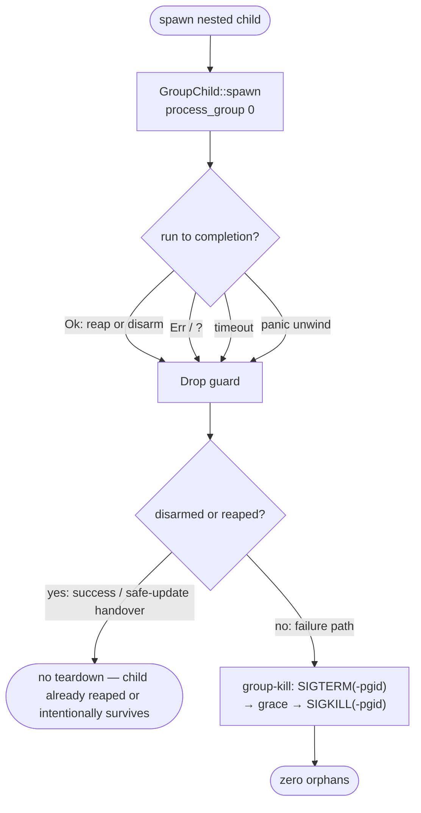

# Nested-Subprocess Orphan Guard (GroupChild)

> **Status: implemented.** Present-tense description of shipped behaviour.
> Primary source:
> [`src/process_group_guard/`](https://github.com/rysweet/Simard/blob/main/src/process_group_guard/mod.rs).
> API contract: [Process-Group Guard API](../reference/process-group-guard-api.md).
> Upstream companion fix: [`rysweet/amplihack-rs#964`](https://github.com/rysweet/amplihack-rs/issues/964).

## The bug class

Simard's OODA daemon is a *tree* of processes. The daemon spawns
`recipe-runner-rs` (via `amplihack recipe run`), which spawns nested agent
sessions (`copilot` / `claude`), which are Node processes that in turn spawn
their own descendants. Every layer inherits the stdout/stderr pipe write-ends of
its parent.

When a nested run **fails, is aborted, times out, or panics**, the naive
teardown — `child.kill()` on the immediate `std::process::Child` — signals only
the *direct* child. Its descendants keep running, orphaned, still holding the
inherited pipes open. The symptoms:

- **Leaked processes** — orphaned `copilot`/`node`/`recipe-runner-rs` trees
  accumulate across ticks, exhausting memory and PIDs.
- **Leaked reader threads / FDs** — because a descendant keeps a pipe's
  write-end open, the parent's reader thread never sees EOF and blocks on
  `read()` forever.
- **"Text file busy" on self-deploy** — an orphaned engineer holding the old
  binary's inode blocks the atomic swap (see
  [self-deploy engineer-orphan reaper](../reference/self-deploy-api.md)).

This is exactly the failure reported upstream in
[`amplihack-rs#964`](https://github.com/rysweet/amplihack-rs/issues/964): a
failed `smart-orchestrator` run leaks recursively-spawned subprocesses. The
`recipe-runner-rs` source lives in a *separate* repository; Simard only
*invokes* it. The **same bug class**, however, is present and editable here in
Simard's own nested-spawn sites, so Simard hardens its analogous supervision and
cross-links #964 as the upstream companion fix.

## The fix: spawn in a group, kill the group on Drop

`GroupChild` is a small RAII brick that makes correct teardown the *default*,
not something each call site must remember to do:

1. **Spawn as a process-group leader.** On Unix the child is launched with
   [`process_group(0)`](https://doc.rust-lang.org/std/os/unix/process/trait.CommandExt.html#tymethod.process_group),
   which sets the child's PGID equal to its own PID. Every descendant it spawns
   inherits that PGID — the whole subtree shares one group id.
2. **Group-kill on `Drop`.** When an *armed* `GroupChild` handle leaves scope —
   through `Err`, `?` early-return, a timeout branch, or a panic unwind — its
   `Drop` impl signals the *negated* PGID (`libc::kill(-pgid, …)`), which
   reaches **every** member of the group, not just the direct child. (On the
   success path the caller `reap()`s or `disarm()`s, suppressing teardown.)
3. **Graceful escalation.** Teardown sends `SIGTERM` to the group first, waits a
   bounded grace window, then escalates to `SIGKILL`. It never leads with
   `SIGKILL`.
4. **`disarm()` for the one intentional survivor.** A deliberately detached
   child — such as the [safe-self-update](../safe-self-update.md) handover
   process, which *must* outlive its parent — is the canonical `disarm()` case:
   the caller relinquishes the guard's ownership so `Drop` does nothing. (This
   handover is a documented adoption candidate rather than a currently-wired
   site; see the [API reference](../reference/process-group-guard-api.md#adoption-candidates-not-yet-wired).)

Because the guarantee rides on `Drop`, it holds on code paths the author never
explicitly wrote a cleanup for. That is the whole point: an orphan leak is a
*forgotten* cleanup, and `Drop` cannot be forgotten.

## Why a process group, not a PID list

Tracking and killing individual descendant PIDs is racy and incomplete: a child
can `fork()` a new grandchild between the moment you enumerate PIDs and the
moment you signal them. A process **group** is a kernel-maintained membership set
— a single `kill(-pgid, …)` atomically reaches every current member, including
descendants spawned microseconds ago. This mirrors the proven pattern already
shipping in the meeting agent proxy
([`src/meeting_backend/agent_proxy.rs`](https://github.com/rysweet/Simard/blob/main/src/meeting_backend/agent_proxy.rs),
issue #2549) and the self-deploy orphan reaper
([`src/self_deploy/orphan.rs`](https://github.com/rysweet/Simard/blob/main/src/self_deploy/orphan.rs)).

## Safety invariants (fail-closed)

Group-killing is destructive, so `GroupChild` is fail-closed:

- **`pgid > 1` before any negative-target kill.** `-0` targets the caller's own
  group and `-1` broadcasts to *every* process on the host. A child PID is always
  `> 1`; the guard asserts this and, if the pgid is unverifiable, **skips the
  negative kill and emits a `warn!`** rather than guessing a target.
- **Kill only before reap.** The group signal fires only while the child handle
  is still un-`reap()`ed. Once reaped, the PID/PGID may be recycled by the kernel
  for an unrelated process, so the guard never re-signals a reaped child.
- **Never panic in `Drop`.** Kill errors (`ESRCH` — already gone, `EPERM`) are
  dropped with `let _ = …`; `Drop` never `unwrap()`s and never re-panics during
  an unwind.
- **Unix teardown.** `process_group(0)` is applied under `#[cfg(unix)]`; the
  `libc::kill(-pgid, …)` teardown matches the crate's existing Unix-only signal
  paths (`meeting_backend::agent_proxy`, `self_deploy::orphan`).

## What is deliberately *not* changed

- **No public recipe API / step-semantics / PRD change.** `GroupChild` is an
  internal supervision brick; call sites adopt it without changing their
  signatures or observable contract. It is additive and non-breaking by default.
- **No `recipe-runner-rs` internals.** Those live in
  [`rysweet/amplihack-rs`](https://github.com/rysweet/amplihack-rs) and are fixed
  there under #964. Simard hardens only the sites it owns.
- **No shell-based process killing.** Numeric-PID `libc::kill(-pgid, …)` only —
  never `pkill`/`killall`/name-based kills (repo shell policy).
- **No `print!`/`println!`.** All instrumentation is structured `tracing` (one
  `warn!` on SIGKILL escalation).

## Adoption status

`GroupChild` is first wired at the **engineer-loop command-timeout path**
([`src/engineer_loop/execution/mod.rs`](https://github.com/rysweet/Simard/blob/main/src/engineer_loop/execution/mod.rs)):
a timed-out `git`/`cargo` command now group-kills its whole subtree instead of
only the immediate child. Other nested-spawn sites — the `recipe-runner-rs` runs
in `ooda_brain::recipe_brain`, the agent-supervisor direct-exec arm, and the
safe-update `disarm()` handover — are documented adoption candidates; see the
[Wired call site](../reference/process-group-guard-api.md#wired-call-site)
section of the API reference for why each is or is not a fit.

## Related

- [Process-Group Guard API](../reference/process-group-guard-api.md) — the full
  `GroupChild` contract.
- [How to add a process-group-guarded spawn](../howto/add-a-process-group-guarded-spawn.md)
  — adopt the guard at a new nested-spawn site.
- [Safe Self-Update](../safe-self-update.md) — the one intentional `disarm()`
  survivor.
- [Self-Deploy API — engineer-orphan reaper](../reference/self-deploy-api.md) —
  the host-level backstop that clears anything that still escapes.
