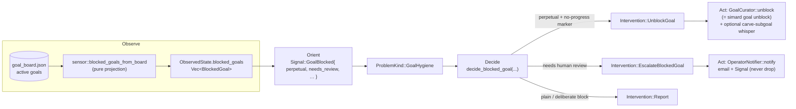

# Overseer goal-board health

> **Status: implemented** (issue
> [#2609](https://github.com/rysweet/Simard/issues/2609), merged in
> [#2616](https://github.com/rysweet/Simard/pull/2616)). The `BlockedGoal`
> observation, the `sensor::blocked_goals_from_board` projection, the
> `Signal::GoalBlocked` signal, the `Intervention::UnblockGoal` /
> `EscalateBlockedGoal` actions, the `SIMARD_OVERSEER_GOAL_HEALTH` flag, and the
> `overseer::goal_health` traces all ship in `src/overseer/`. See the
> [goal-board health API reference](../reference/overseer-goal-board-health-api.md)
> for the exact symbols and the
> [configure-and-observe how-to](../howto/configure-overseer-goal-board-health.md)
> for the operator surface.

**Goal-board health** is the [Overseer](../design/overseer.md)'s reading of one
more part of Simard's live state: the goals that are currently **`Blocked`** on
her authoritative goal board. Until this shipped, the Overseer's `ObservedState`
had **no goal-board field** — the steward was blind to a blocked goal, and a
goal parked "needs human review" reached **no human**. Goal-board health gives
the Overseer's meta-OODA loop a goal-board view and a pair of stewardship
actions:

- **Self-heal a false park.** A standing/**perpetual** goal wrongly hard-blocked
  by the OODA no-progress safeguard is **auto-unblocked and reactivated** — the
  exact operation `simard goal unblock` performs — so it re-enters the OODA spawn
  path on its own, with no operator action.
- **Escalate a genuine block.** Any goal carrying a **"needs human review"**
  safeguard marker is **escalated to the operator** on both channels (email +
  Signal) with the goal id and reason — closing the silent-failure gap.

!!! note "Defense-in-depth for #2609"
    [#2609](./perpetual-goal-no-progress-exemption.md) taught the OODA loop
    itself to **exempt** standing goals from the no-progress hard-block (runtime
    exemption + load-time self-heal). Goal-board health is the **steward-side
    complement**: even if a goal is parked anyway — by an older build, a
    non-perpetual goal that genuinely stalled, or any path the in-loop exemption
    does not cover — the Overseer now **sees** it and either self-heals it or
    makes sure a human is told. Two independent layers, one shared notion of
    "standing/perpetual".

## The defect this closes

In production the OODA no-progress safeguard hard-blocked the standing research
goal (`continuously-research-and-improve-your-own-cogn-*`) with the sentinel
reason

```
🔒 [OODA-SAFEGUARD] OODA goal made no shippable progress for 3 consecutive no-action cycles; needs human review
```

and **nothing surfaced it**. The block sat on the board, the "needs human
review" phrase was addressed to a human who never saw it, and the standing goal
— which the operator requires to be continuous and self-sustaining — silently
stopped shipping. The Overseer, whose whole job is to steward exactly this kind
of condition, could not act because its observation had no goal-board reading at
all.

Goal-board health removes that blind spot.

## Observe → Signal → Decide → Act

Goal-board health is a normal path through the Overseer's meta-OODA cycle. It is
**additive** and **reuses** existing notions rather than inventing new ones.



### Observe — a pure projection of the board

The acting Overseer's Observe pass reads the live board through the read-only
`GoalCurator::blocked_goals()` capability, which delegates to the pure projection
`sensor::blocked_goals_from_board`. For every active goal in a
`GoalProgress::Blocked(reason)` state it emits one
[`BlockedGoal`](../reference/overseer-goal-board-health-api.md), derived entirely
from **existing** notions:

| Field | Source | Reuse |
|---|---|---|
| `perpetual` | `ActiveGoal::is_perpetual()` | The standing/perpetual marker (#2580/#2589/#2609) — no second notion. |
| `needs_review` | `is_no_progress_marker(reason) \|\| is_brain_failure_marker(reason)` | The two existing "needs human review" safeguard-marker predicates. |
| `consecutive_no_action` | parsed from the safeguard marker's `{prefix}{n}{suffix}` shape | `0` for a non-safeguard block (e.g. an operator-set hold). |

The read is **read-only and degrade-to-empty**: a board-read failure yields "no
blocked goals", never a panic and never an aborted tick.

### Signal — one signal per blocked goal

Orient turns each `BlockedGoal` into a `Signal::GoalBlocked{ goal_id, reason,
perpetual, needs_review, consecutive_no_action }`, which classifies to the
**existing** `ProblemKind::GoalHygiene`. A `needs_review` block is `Priority::High`;
a plain block is `Priority::Normal`.

### Decide — route by shape

`decide_blocked_goal` chooses the stewardship action from the block's shape, and
invents no new notion of "false park" or "genuine block":

- **Perpetual _and_ carrying the no-progress marker** ⇒ `Intervention::UnblockGoal`.
  This is a **false park**, not a genuine block: a standing goal is inherently
  bursty and must never require a human to unblock it. It is **self-healed, never
  escalated**.
- **Otherwise, `needs_review`** ⇒ `Intervention::EscalateBlockedGoal`. A normal
  goal that genuinely stalled, or any brain-failure block, carries a "needs human
  review" marker — so a human is told.
- **Anything else** (a deliberate operator-set / dependency block) ⇒
  `Intervention::Report`: surfaced in the periodic report and **left untouched**.
  The Overseer respects an intentional hold.

### Act — the two stewardship actions

**Self-heal (`act_unblock_goal`).** Restores the blocked goal to `NotStarted` —
the exact `simard goal unblock` board mutation, under the same `flock`
write-lock — so the next OODA cycle re-enters the spawn path. It then
**optionally** whispers Simard (reusing the
[Simard Whisperer](./simard-whisperer.md)) a best-effort steering note to *carve
one bounded, shippable sub-goal* rather than re-attempting the whole standing
goal at once. The whisper is best-effort: a whisper failure never fails the
unblock.

**Escalate (`act_escalate_blocked_goal`).** Sends an
`OperatorNotification::goal_blocked(goal_id, reason)` through the **same**
mandatory `DualChannelNotifier` the merge path uses — email **and** Signal, with
the never-drop guarantee — so the "needs human review" marker actually reaches a
person. The Overseer adds no second notification path; it reuses the one behind
the `OperatorNotifier` seam.

## Guardrails

Goal-board health reuses the Overseer's existing guardrail patterns rather than
inventing new ones.

### Dedup + rate-limit

A persistent blocked goal must not be re-unblocked or re-escalated every tick. A
`WhisperGate` (the same dedup/rate-limit primitive the Whisperer uses),
configured with a **15-minute window** and a **generous per-hour cap (20)**,
deduplicates by a stable signature (`unblock:{goal_id}` / `escalate:{goal_id}`)
and suppresses a duplicate within the window or once the cap is reached. The
dedup slot is consumed **only after** a successful unblock / a dispatch attempt,
so a transient failure does not burn the goal's one slot. A suppressed action is
counted (`goals_health_suppressed`) and traced, never silently dropped.

### Distinct identity, fail-closed

Both actions require the Overseer's **distinct steward identity**
(`RecursionGuard::is_configured`). If the identity is unconfigured the action is
**refused** — no unblock, no escalation, no self-whisper — exactly as the
Overseer fails closed for PR/commit/goal subjects today. A steward that cannot
prove a distinct identity does not get to mutate the board or speak to the
operator, which also prevents a self-heal feedback loop.

### Opt-out flag

Goal-board health is **on by default whenever the acting Overseer runs** and is
disabled by an explicit falsey `SIMARD_OVERSEER_GOAL_HEALTH`
(`0`/`false`/`no`/`off`). Because it only makes sense while the Overseer runs, a
disabled Overseer forces it off. When disabled, both actions are **held** (no
action taken) even though the blocked goal is still observed and reported. See
[Configure and observe Overseer goal-board health](../howto/configure-overseer-goal-board-health.md).

### Routine risk, panic-isolated

Self-heal and escalation are classified `RiskClass::Routine` — unblocking a
false-parked goal restores a shipped state and escalation is a notification;
neither spends LLM budget — so they are admitted by the default autonomy gate.
Both run **inside** the existing panic-isolated Overseer tick: a failing unblock
or a notifier error is caught, reflected in the report (`errors`), and the daemon
and OODA loop continue unaffected.

## Visibility

Goal-board health is **never a hidden side-channel**. It surfaces through the
existing [operator-activity feed](../reference/overseer-activity-feed.md), so the
dashboard, the TUI, and `simard status` all show it:

- Each action emits a structured `tracing` event on target
  `overseer::goal_health` with `goal_id`, `reason`, `action`
  (`unblock`/`escalate`), and — for escalation — `dispatched` / `all_sent`.
- The per-tick `OverseerTickReport` gains `goals_unblocked`, `goals_escalated`,
  and `goals_health_suppressed`; the rolling `OverseerTotals` accumulate
  `goals_unblocked` and `goals_escalated` and count them as **interventions**.
- `humanize_tick` renders the honest one-liner: *"self-healed 1 blocked goal"*,
  *"escalated 2 blocked goals for human review"*.
- Each escalation is additionally an `OperatorNotification` of kind
  `"goal-blocked"` on the operator's channels.

## Invariants

- **One notion of "standing/perpetual".** `perpetual` keys off
  `ActiveGoal::is_perpetual()` — the same flag #2580/#2589/#2609 use. No second
  "is-standing" notion exists to drift.
- **One notion of "needs human review".** `needs_review` keys off the existing
  `is_no_progress_marker` / `is_brain_failure_marker` predicates only.
- **Self-heal is unblock, nothing more.** The self-heal path performs exactly the
  `simard goal unblock` mutation (`Blocked → NotStarted`) under the board
  write-lock; it never rewrites the goal or fabricates progress.
- **A false park is never escalated; a genuine block is never silent.** The
  routing is mutually exclusive by shape.
- **At most one action per goal per window.** Dedup suppresses duplicates; the
  per-hour cap bounds the total.
- **Fail-closed.** Unconfigured steward identity ⇒ refused, nothing mutated or
  sent.
- **Reused notifier.** Escalation rides the one mandatory dual-channel
  (email + Signal, never-drop) notifier; there is no second path.
- **Visible.** Every action is traced and every escalation notifies the operator.
- **Isolated.** A failure or panic is caught by the isolated tick; the daemon
  continues.

## Out of scope

- **Deliberate blocks.** An operator-set or dependency block (no safeguard
  marker) is reported and left untouched — the Overseer respects an intentional
  hold.
- **Replacing the in-loop exemption.** Goal-board health complements #2609's
  runtime exemption + load-time self-heal; it does not replace them.
- **A second notification or steering channel.** Escalation reuses the mandatory
  `DualChannelNotifier`; the optional carve-sub-goal whisper reuses the Whisperer.
- **Touching `~/.simard` outside the board mutation.** The only write is the
  `Blocked → NotStarted` unblock via the shipped `save_goal_board` write-lock.

## See also

- Design: [Overseer — operator/observer co-process](../design/overseer.md)
- API reference: [Overseer goal-board health API](../reference/overseer-goal-board-health-api.md)
- How-to: [Configure and observe Overseer goal-board health](../howto/configure-overseer-goal-board-health.md)
- Sibling concept: [Standing/perpetual goals are exempt from the no-progress hard-block](./perpetual-goal-no-progress-exemption.md) (#2609)
- Related: [The Simard Whisperer](./simard-whisperer.md),
  [Overseer activity feed](../reference/overseer-activity-feed.md),
  [No-progress breaker API](../reference/no-progress-breaker-api.md)
