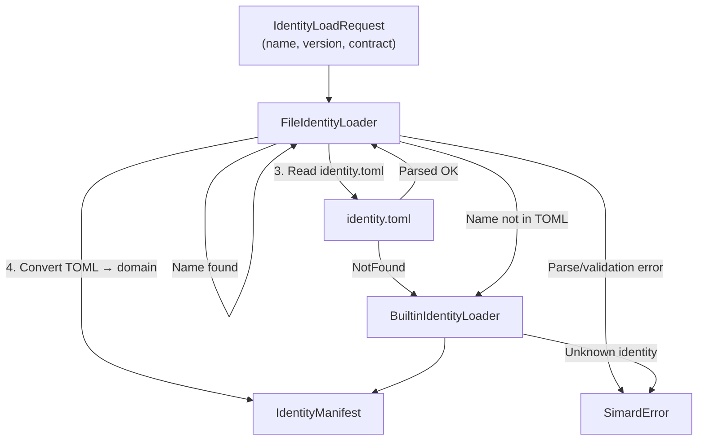

# Pluggable identity — TOML-driven agent personas

## The problem

Simard ships with several built-in identities (`simard-engineer`,
`simard-meeting`, `simard-gym`, `simard-goal-curator`,
`simard-improvement-curator`, `simard-concierge`, `simard-atelier`) plus one
composite (`simard-composite-engineer`). These are compiled into the binary via
`BuiltinIdentityLoader`.

This works for Simard's own repository, but breaks down when Simard operates
across multiple repositories with different needs:

- **A documentation-heavy repo** might want an identity with a specialized
  system prompt that emphasizes writing style, API reference formatting, and
  doc testing — none of which the built-in engineer prompt covers.
- **A security-sensitive repo** might want an identity that restricts memory
  writes and adds security-review-focused prompt assets.
- **A monorepo with multiple teams** might define per-directory identities
  so each team's engineer sessions load the right prompt context without
  cross-contamination.
- **An experimental workflow** might define a custom operating mode
  composition that blends engineer and meeting capabilities for pair
  programming sessions.

Before pluggable identity, all of these required forking Simard or
maintaining out-of-tree patches against `loader.rs`. Identity was a
compile-time decision.

## The solution: identity.toml

Pluggable identity makes identity a **deploy-time, per-repo decision**.
Repository maintainers drop an `identity.toml` file in a designated
identity directory (typically `.simard/` or a subdirectory under the
prompt root). Simard's `FileIdentityLoader` reads this file at startup
and resolves the requested identity name against the `[[identities]]`
array in the TOML file.

The design follows three principles:

### 1. File-not-found is a soft fallback

If no `identity.toml` exists in the configured identity path, Simard
falls back to `BuiltinIdentityLoader` and behaves exactly as before.
Existing repositories that do not define custom identities are unaffected.
Similarly, if the TOML file exists but does not contain an entry matching
the requested identity name, the fallback activates.

### 2. Parse errors are hard failures

If `identity.toml` exists but contains invalid TOML, unknown fields,
missing required fields, or validation errors (path traversal, oversized
files, invalid identity names), Simard returns a hard
`IdentityTomlParseError`. This is deliberate: a broken identity
configuration should not silently fall through to built-in defaults,
because the operator explicitly intended a custom identity. Silent
degradation here would violate Pillar 11 (honest degradation).

### 3. Composition is bounded and cycle-safe

Custom identities may reference other identities defined in the same
TOML file via the `components` field. This supports building composite
identities (e.g., an identity that merges prompt assets from two
specialists). Composition is bounded to `MAX_COMPOSITION_DEPTH = 8`
recursive levels, and circular references are detected before recursion
via a visited set. Both checks produce hard errors.

## How the loader chain works



The `FileIdentityLoader` wraps `BuiltinIdentityLoader` in a decorator
pattern. It owns the identity path and prompt root, and performs all
validation before delegating to the fallback or constructing the manifest
directly from TOML data.

## Security model

Custom identities are **operator-controlled configuration**, not
user-controlled input. However, the loader applies defense-in-depth:

| Check | What it prevents | Error |
|-------|-----------------|-------|
| Identity name: non-empty, ≤128 chars, ASCII alphanumeric + hyphens | Injection via crafted identity names | `IdentityTomlParseError` |
| Prompt asset path: no absolute paths, no `../` traversal | Reading files outside the identity directory | `IdentityTomlParseError` |
| Identity path under prompt root: `canonicalize` + `starts_with` | Directory escape via symlinks or relative paths | `IdentityPathNotUnderPromptRoot` |
| File size: ≤1 MB before parsing | Memory exhaustion from crafted TOML files | `IdentityTomlParseError` |
| `deny_unknown_fields` on identity TOML structs | Field injection via unexpected TOML keys | `IdentityTomlParseError` |
| Composition depth ≤ 8, cycle detection via visited set | Stack overflow from recursive composition | `IdentityTomlParseError` |
| `allow_project_writes` validated by `MemoryPolicy::validate()` | v1 does not support project-scoped writes | `UnsupportedMemoryPolicy` |

## Watches: the same pattern for developer watch lists

The same TOML-from-file pattern applies to developer watch lists.
`load_watches_from_file()` reads a `watches.toml` file that defines
which GitHub users to track and their focus areas. The same
soft-fallback / hard-error split applies:

- File not found → compile-time default watches
  (`DEFAULT_DEVELOPER_WATCHES`)
- Malformed TOML → `IdentityTomlParseError`

This keeps the research tracker's watch configuration externally
manageable without requiring code changes.

## Relationship to identity precedence

When multiple identity sources exist (TOML file, builtins, future
registry-based loaders), `compose_with_precedence()` in
`identity_precedence` resolves conflicts. The file-based loader
produces an `IdentityManifest` — the same type that builtins produce —
so precedence resolution is orthogonal to the loading mechanism.

## The boundary: Simard's own identities vs. example identities

Pluggable identity draws a hard line between two kinds of identity, and it
matters where each one lives.

### Simard's own operating identities → compiled in

The identities Simard uses to operate *herself* —
`simard-engineer`, `simard-meeting`, `simard-gym`, `simard-goal-curator`,
`simard-improvement-curator`, `simard-concierge`, `simard-atelier`, and the
composite — are **compiled into `BuiltinIdentityLoader`** in
`src/identity/loader.rs`. They are part of the daemon's own behavior and
legitimately live in `src/`. This does not change.

> **Naming note:** `simard-atelier` and `simard-concierge` are Simard's *own*
> operating identities and stay compiled in. Do not confuse them with
> hypothetical `atelier`/`concierge`-style **example** packages — the boundary
> is defined by where an identity lives (compiled `BuiltinIdentityLoader` arm
> vs. data under `examples/identities/`), not by its theme.

### Example non-engineering identities → data-only packages

Identities that merely *demonstrate* what the framework can produce —
cartographer, gastronome, bursar, and the like — are **not** part of Simard's
daemon. They are authored as **data-only packages**
under [`examples/identities/<name>/`](../../examples/identities/README.md):

```
examples/identities/<name>/
├── identity.toml     # manifest (same schema FileIdentityLoader consumes)
├── prompts/*.md      # system + phase prompts
└── recipes/*.yaml    # agentic goal-session recipes (all domain tooling lives here)
```

They are loaded at runtime by the data-driven file loader, not compiled in:

```rust
use simard::identity::{load_example_identity, DEFAULT_EXAMPLE_IDENTITIES_DIR};

let manifest = load_example_identity(
    DEFAULT_EXAMPLE_IDENTITIES_DIR.as_ref(), // repo-root examples/identities (overridable)
    "cartographer",
    &request,
)?;
```

`load_example_identity` is a thin rail: it validates `<name>` as a single path
segment, resolves `<base>/<name>/identity.toml`, guards that the file exists
(so a missing package cannot silently fall through to a built-in), and delegates
to the existing `FileIdentityLoader`. A missing package or invalid TOML returns
a fail-visible `IdentityTomlParseError` — never a panic, never a silent
fallback. There is **no** `BuiltinIdentityLoader` arm for an example identity.

### Why the split

- **Keep the daemon pure.** Simard's `src/` stays pure Rust — no Python, no
  `kuzu`, no domain modules. An example identity that needs Python, pandas,
  Blender, or a web server drives that tooling from its **recipes**, in agent
  sessions, never from `src/`.
- **Zero-friction identities.** Adding, changing, or removing an example
  identity is a data change under `examples/identities/`. It requires no edit to
  `src/identity/loader.rs`, no new binary, and no `operator_cli` subcommand.
- **A guardrail against tree bloat.** Historically, example identities crept
  into `src/` as whole domain modules and hardcoded loader arms. The data-driven
  home removes that incentive: the *only* `src/` code supporting example
  identities is the thin `load_example_identity` rail.

Engineers building an identity must follow
[`prompt_assets/simard/identity_authoring.md`](../../prompt_assets/simard/identity_authoring.md),
which spells out the prohibitions (no domain Rust, no `BuiltinIdentityLoader`
arm, no `operator_cli` subcommand, no `src/bin/*`). The reference package is
[`examples/identities/cartographer/`](../../examples/identities/cartographer/).

## What this is not

- **Not a plugin system.** Identity TOML files declare configuration,
  not code. There is no dynamic loading of Rust modules or scripts.
- **Not a user-facing feature.** Operators and repository maintainers
  control identity files. End users of Simard sessions do not interact
  with `identity.toml` directly.
- **Not a replacement for builtins.** Built-in identities remain the
  default and the fallback. Custom identities extend or override them
  on a per-repo basis.
