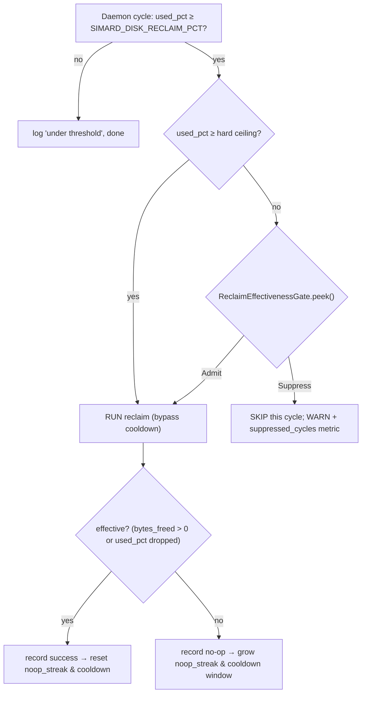

# Reclaim effectiveness backoff

> **Status: implemented (issues
> [#4809](https://github.com/rysweet/Simard/issues/4809),
> [#4825](https://github.com/rysweet/Simard/issues/4825),
> [#4810](https://github.com/rysweet/Simard/issues/4810)).** The OODA daemon's
> disk-reclaim trigger now consults a `ReclaimEffectivenessGate` before firing,
> so a reclamation run that keeps freeing nothing is not re-attempted on every
> cycle. Primary sources:
> [`src/disk_reclaim/effectiveness.rs`](https://github.com/rysweet/Simard/blob/main/src/disk_reclaim/effectiveness.rs)
> (the gate),
> [`src/operator_commands_ooda/daemon/mod.rs`](https://github.com/rysweet/Simard/blob/main/src/operator_commands_ooda/daemon/mod.rs)
> (the daemon trigger wiring), and
> [`src/disk_reclaim/mod.rs`](https://github.com/rysweet/Simard/blob/main/src/disk_reclaim/mod.rs)
> (`emit_reclaim_telemetry`). API surface:
> [reclaim effectiveness gate reference](../reference/reclaim-effectiveness-gate-api.md).

## The defect this fixes

The daemon's Tier-3 self-heal step (issue #2704, see
[agentic disk reclamation](./agentic-disk-reclamation.md)) fires whenever a
cheap `df` probe reports `%-used ≥ SIMARD_DISK_RECLAIM_PCT`. On the production
OODA host the working partition sat at **~94–99% used with ~12 GiB free of
196 GiB**, permanently above the trigger threshold, while every reclamation run
freed **0 bytes** — the candidates the analysis agent proposed were all
undeletable (protected paths, live processes, uncommitted/unpushed worktrees)
and every rail correctly refused them.

The trigger had **no memory that the previous run accomplished nothing**. So
each ~15-minute daemon cycle:

1. observed `used ≥ threshold`,
2. re-invoked the full agentic reclaim capability (a brain call + a
   recipe-runner scratch dir + per-cycle run artifacts),
3. freed 0 bytes,
4. and — because the run itself consumed scratch space — sometimes left the
   partition *fuller* than before.

The result is the churn reported in #4809 (*"routine disk-reclaim is
ineffective"*), #4825 (*"systemic disk-reclaim churn in the OODA daemon"*), and
#4810 (*"OODA daemon rides disk at 94–99%"*): reclamation re-scanned the same
undeletable paths forever without ever reclaiming space, and the churn itself
added disk pressure.

## The fix: effectiveness-aware exponential cooldown

Reclamation is now gated on **whether it recently worked**, not only on
**how full the disk is**. The daemon records the outcome of each run and, after
a streak of ineffective runs, backs off exponentially before trying again.

The gate reuses the same bounded-exponential-backoff semantics as the
Overseer's [`BackoffGate`](../reference/overseer-backoff-gate-api.md):

- **First no-op** arms a base cooldown window (default 15 min).
- **Each further no-op** grows the window `× multiplier` (default ×2), hard-capped
  (default 4 h). While inside the window, the daemon **skips** the reclaim run
  entirely — no brain call, no scratch dir, no artifacts.
- **A run that frees space** (positive `bytes_freed`, or a measured drop in
  `used_pct`) is *effective*: it resets the streak and the cooldown so genuine
  reclamation stays responsive.
- **A long silence** since the last attempt (≥ 2× the current window) also resets
  to the base window, so a disk that fills again after a quiet period resurfaces
  promptly.

### Genuine fill-ups are never masked

Suppression is bypassed whenever locally-observed `%-used` crosses a **hard
ceiling** (`SIMARD_DISK_RECLAIM_HARD_CEILING_PCT`, default `97`). The bypass
authority is derived from a *fresh local `df` sample* — never from re-ingested
telemetry — so a real, accelerating fill-up always triggers reclamation
regardless of the cooldown. The cooldown only silences the pathological case:
*already above the trigger, but reclamation demonstrably cannot help.*

Every suppressed cycle is visible: it emits a `WARN` daemon log line and
increments a `simard.disk.reclaim.suppressed_cycles` counter, and the
per-run telemetry gains `noop_streak` / `suppressed_cycles` / `effective`
attributes (see [disk-reclaim telemetry](../reference/disk-reclaim-telemetry.md)).
Operators can therefore see *"reclaim is being deliberately held back because it
keeps freeing nothing"* rather than silence.

## Cross-cycle skip memory (don't re-propose the same undeletable path)

Independently of the cooldown, the executor now remembers the **canonicalized**
paths a rail rejected and refuses to re-propose them on the next cycle, so a
single undeletable worktree is not re-vetted every run. Paths are
canonicalized *before* both the guard check and the skip-memory lookup, which
prevents a symlink or `..` alias from smuggling a protected path past the guard.
See the [reclaim effectiveness gate reference](../reference/reclaim-effectiveness-gate-api.md#cross-cycle-skip-memory).

## Safety posture

- **Suppress-only.** The gate can only *skip* a run. It never changes the
  destructive posture: the daemon stays **dry-run by default** and
  `SIMARD_DISK_RECLAIM_DAEMON_APPLY=1` remains the sole apply opt-in. A unit
  test asserts the gate can never transition dry-run → apply.
- **Fail safe, not open.** Any parse/validation/canonicalization error treats a
  candidate as *not authorized to delete* and does **not** suppress a cycle
  where suppression could hide real pressure.
- **Bounded arithmetic.** The no-op streak, cooldown exponent, and window are
  saturating so a long-running daemon cannot overflow into an absurd cooldown.
- **Additive.** No existing metric, env var, or behavior changes; the PRD is
  preserved and there is no `print!`/`println!` — the gate emits structured
  `tracing` + OTel only.

## Turning it off

The whole effectiveness gate is a single kill switch,
`SIMARD_DISK_RECLAIM_EFFECTIVENESS_GATE=off`, which reverts to the previous
"fire on every over-threshold cycle" behavior. See the
[reclaim-effectiveness kill switch](../operations/reclaim-effectiveness-kill-switch.md).

## See also

- [Configure reclaim effectiveness](../howto/configure-reclaim-effectiveness.md) — the operator knobs.
- [Agentic disk reclamation](./agentic-disk-reclamation.md) — the propose/dispose design this gates.
- [Automated disk health](./automated-disk-health.md) — the daemon step the gate lives in.
- [Reclaim effectiveness gate reference](../reference/reclaim-effectiveness-gate-api.md) — the typed API.
