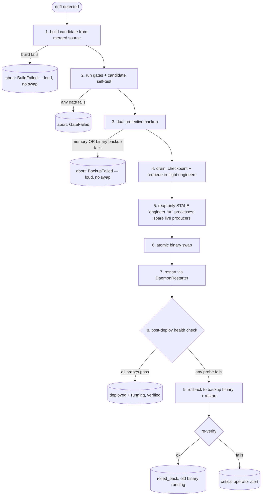
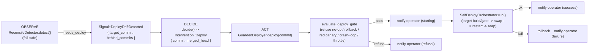

# Concept: reconcile-and-self-deploy

> **Status: implemented.** `ReconcileDetector`, `DeployDrift`,
> `SelfDeployOrchestrator`, `DaemonRestarter`, the engineer-orphan reaper, and
> the `simard self-health` probe live in
> [`src/self_deploy/`](https://github.com/rysweet/Simard/blob/main/src/self_deploy/mod.rs)
> and extend [`src/safe_update/`](https://github.com/rysweet/Simard/blob/main/src/safe_update/mod.rs),
> [`src/self_relaunch/`](https://github.com/rysweet/Simard/blob/main/src/self_relaunch/mod.rs),
> and [`src/memory_backup/`](https://github.com/rysweet/Simard/blob/main/src/memory_backup/mod.rs).
> The orchestrator sequence and rollback tail are covered by hermetic
> fake-effects tests; the effectful end-to-end paths run under operator-invoked
> `#[ignore]`d tests. See the
> [self-deploy API reference](../reference/self-deploy-api.md) for the typed
> surface.

> **The trigger is now autonomous.** As of the Overseer deploy wiring, the daemon
> **detects its own drift behind merged `origin/main` and redeploys itself
> without an operator command** — canary-verified, gate-checked,
> operator-notified, and rolled back on failure. The operator CLI
> (`simard self-deploy`) remains available, but a merged self-change no longer
> waits for a human to run it. Because the daemon now mutates its own binary
> without a human in the loop, the whole rail rests on a trust model — read the
> [Security prerequisites (the trust model)](#security-prerequisites-the-trust-model)
> **before** enabling it. See also
> [Autonomous drift-triggered deploy (now live)](#autonomous-drift-triggered-deploy-now-live)
> and the [opt-out](#opt-out-and-anti-thrash-configuration).

> Simard merges code to her own repository, then **build-from-source deploys it
> into her own running daemon and verifies it is live** — or rolls back. A merged
> self-change that is not running is treated as an open loop, not a finished one.

## The problem this solves

Simard's self-improvement loop closes a pull request but does not close the
*deploy*. Two mechanisms predate this design and neither makes a merged
self-change run:

1. **`simard safe-update`** ([Safe Self-Update](../safe-self-update.md)) downloads
   the latest **released** binary. A commit that is merged to `main` but not yet
   tagged-and-released is never fetched, so it never runs. "merged != running."
2. The brain can route to `ConsiderSelfUpdate`, but the four-part triggering
   doctrine rarely holds, and the Decide call site that produced that choice
   used to fall back silently when its output failed to parse
   ([#2419](https://github.com/rysweet/Simard/issues/2419)). The improvement was
   merged; the daemon kept running the old binary; an operator had to rebuild by
   hand.

This violates Simard's own **"not done until it's running"** principle. The
companion gap for *dependency pins* — a fix merged upstream but not pulled into
Simard's own `Cargo.toml` rev — is closed by
[self-maintain-dependency-pins](../howto/self-maintain-dependency-pins.md). This
document closes the gap for Simard's **own binary**.

The single guiding principle:

> **A merged change to Simard's own running code is not complete until the new
> code is built, deployed, health-verified, and running — or rolled back.**

## How drift is detected

A **reconciliation detector** runs once per OODA cycle and computes *deploy
drift* between what is **merged** and what is **running**:

- **Binary drift** — the running binary's embedded build commit versus the latest
  merged commit on `origin/main` of the Simard repo.
- **Pin drift** — the pinned dependency revs in the **merged** `main` tree
  (`amplihack-memory`, `rustyclawd-core`, `rustyclawd-tools`, and the other
  ecosystem pins) versus the revs compiled into the **running** binary.

The detector returns a single value, `DeployDrift`, on the Orient context:

```text
DeployDrift {
    behind_commits: usize,      // 0 when the running binary is at HEAD of main
    drifted_pins:   Vec<String>,// pin names whose merged rev != running rev
    needs_deploy:   bool,       // true when behind_commits > 0 || !drifted_pins.is_empty()
}
```

`needs_deploy` is the authoritative "is the running daemon stale?" signal. It is
**reused by the [deploy-aware done-gate](deploy-aware-done-gate.md)** as the
"deployed-and-running" evidence for self-affecting goals — the two workstreams
share one source of truth on purpose.

See [self-deploy API reference](../reference/self-deploy-api.md#deploydrift) for
the exact comparison rules and the `git`/`Cargo.lock` inputs.

## The self-deploy sequence (load-bearing order)

When the brain routes to self-deploy and no engineer is holding a live claim
(`count_live_engineer_claims == 0`), the daemon spawns the **self-deploy
orchestrator**. The orchestrator extends — it does not replace — the existing
[safe-update phases](../safe-self-update.md). The order is load-bearing:
cheap-to-fail steps run first, and the protective backups are taken in the last
possible moment before the daemon is mutated.



1. **Build the candidate from merged source.** The operator self-deploy first
   *prepares* a **cwd-independent** source checkout — `git fetch origin` then
   `git checkout --detach <target commit>` in a persistent clone under
   `~/.simard/self-deploy-src/` — and builds **that merged commit** (never the
   cwd's `HEAD`) into a persistent **warm** target dir
   (`~/.simard/self-deploy-target/`) so repeat builds are incremental
   (~2–3 min instead of ~10+). A failed source resolution, fetch, checkout, or
   build **aborts loudly** — before any backup or swap — and never touches the
   install path. This is what makes `simard self-deploy` work from *any*
   directory; see the
   [self-deploy source-prep reference](../reference/self-deploy-source-prep.md)
   and [how to run self-deploy from any directory](../howto/run-self-deploy-from-any-directory.md).
2. **Gate the candidate.** The existing relaunch gates run in order — Smoke →
   UnitTest → GymBaseline → RpcHealth — followed by the candidate's own
   `simard self-test`. Any failure aborts.
3. **Dual protective backup** (taken only *after* build + gates pass, immediately
   before any daemon mutation):
   - a **live cognitive-memory backup** of the running store, via
     `memory_backup` through `CognitiveMemoryOps`;
   - a **binary backup** to `~/.simard/bin/simard.bak.<utc-iso8601>`.

   If **either** backup fails, the deploy **aborts loudly** and the daemon is left
   untouched. Repairing a broken backup is its own goal — the self-deploy never
   mutates the daemon without a verified protective copy of both state and code.
4. **Drain — never kill, never abort on a timeout.** The drain sets
   `draining.flag` so the engineer-dispatch site refuses *new* dispatches (the
   brain treats that refusal as expected, not a failure). It **leaves each
   still-live** engineer's worktree claim sentinel (`.simard-engineer-claim`)
   **intact** — the liveness-based dedup keeps the goal leased to that producing
   engineer so the restarted binary does not duplicate it — and releases only a
   dead/missing claim. Their `SessionCheckpoint` and goal record persist. The
   drain **never** waits on a wall-clock timeout, **never** fails the deploy
   because engineers remain, and **never** kills a producing engineer. This is
   the fix for "deploys never succeed while busy": Simard can deploy her latest
   merged code even while running engineers. The `draining.flag` is always
   reopened afterward: the incoming binary clears a stale flag at boot (unless an
   `ExecHandover` upgrade is in flight), and any post-drain abort calls
   `undrain()` on the still-serving old binary.
5. **Reap only stale orphans; spare live producers.** Because the swap is
   `rename(2)`-based, it is safe against a still-running executable — a producing
   engineer keeps the old binary's inode and can finish its PR on the old code
   with no "Text file busy". The reaper therefore **spares every live engineer**
   and cleans up only genuinely stale entries (executable path equal to the
   target install path **and** argv containing `engineer run`, whose process is
   already gone), excluding the daemon and the incoming PID. It is idempotent: no
   matches is success.
6. **Atomic swap.** `rename(2)` first, copy-then-rename fallback for cross-device
   installs.
7. **Restart** through an injectable `DaemonRestarter`. The production default
   prefers `systemctl --user restart simard-ooda` when the unit is detected and
   otherwise falls back to the existing coordinated `exec()` handover. The unit
   sets `KillMode=process`, so the restart signals only the daemon — the spared
   engineer children survive it and finish on the old inode. Tests and
   the recipe inject a fake restarter — **the recipe never live-restarts the
   operator's daemon**.
8. **Post-deploy health check** (`simard self-health`). All probes must pass; see
   the next section.
9. **Rollback on failure.** A failed health check restores the binary backup,
   restarts, and re-verifies. If rollback itself cannot reach a healthy state, the
   orchestrator raises a **critical operator alert** rather than leaving the host
   in an unknown state.

The whole sequence is **idempotent and loud**: re-running it when there is no
drift is a no-op, and every abort surfaces a specific, named error.

## What "healthy" means

The post-deploy health check is the gate between "swapped" and "done." It is a
single structured probe, `simard self-health --json`, that passes only when **all**
of the following hold:

| Probe | Healthy condition |
| --- | --- |
| **Version advanced** | running build commit/version ≥ the target commit/version |
| **Memory intact** | cognitive-memory fact count ≥ the pre-deploy count (within tolerance), via the `CognitiveMemoryOps` count API |
| **Goal board intact** | the goal board loads and the active-goal count is preserved |
| **Brains LLM-backed** | zero `BrainJudgmentRecord.fallback == true` records over a probe cycle (see [parse-failure record](../reference/ooda-brain-parse-failure-record.md)) |
| **No quarantine** | the cognitive-memory store quarantine flag is clear |

Any single failing probe fails the health check and triggers rollback. The probe
output is the same structured JSON whether it is run by the orchestrator or by an
operator at a console — see
[self-health output](../reference/self-deploy-api.md#self-health-output).

## Why build-from-source, not release-download

A merged-but-unreleased commit *cannot* be fetched as a published binary — that
is precisely the "merged != running" case this design exists to close. Release
download remains the right mechanism for **tagged releases**
([Safe Self-Update](../safe-self-update.md)); build-from-source is the mechanism
for **self-changes that have landed on `main` but not yet shipped**. The
reconciliation detector chooses build-from-source whenever drift is against
`main` rather than against a release tag.

## Autonomous drift-triggered deploy (now live)

The machinery above — the `ReconcileDetector`, the `SelfDeployOrchestrator`, the
canary gates, the dual backup, the orphan reaper, and the rollback tail — was
fully built and unit-tested but, for a long time, was driven **only** by the
operator CLI (`simard self-deploy`). Nothing invoked it autonomously, so merged
PRs accumulated undeployed until an operator ran a manual redeploy. That gap is
now closed: the **Overseer** runs the reconcile→deploy loop itself, once per
tick, as a **thin deterministic rail** around the already-tested guarded/agentic
machinery. No new deploy engine was written — this is wiring.

The trigger lives entirely inside the Overseer's existing OODA tick (the same
tick that already runs the gap scan, health review, and merge-queue reasoning);
there is **no new systemd timer**. It threads through the three Overseer stages:



### Security prerequisites (the trust model)

Autonomous deploy means the daemon builds code from `origin/main` and swaps its
own binary **with no human in the loop**. The entire rail is only as trustworthy
as the commit it deploys, so these prerequisites are load-bearing — not optional
hardening. Enabling autonomous deploy on a repo that does not meet them is a
supply-chain foot-gun.

- **`origin/main` is the sole root of trust.** The only thing the rail ever
  deploys is the validated `origin/main` HEAD (see OBSERVE, below). That branch
  **must** be protected: required pull-request reviews, required status checks,
  and **signed-commit / verified-merge enforcement**, so that "landed on `main`"
  genuinely means "reviewed and authorized." The daemon fetches over an
  authenticated remote; a poisoned or spoofable `main` compromises everything
  downstream, because the rail treats a merged commit as intrinsically
  trustworthy. Simard adds no second authorization on top of branch protection —
  branch protection *is* the authorization.
- **No unverified-`HEAD` deploys (fail-safe over fall-forward).** The underlying
  `GitDeploySource::merged_head()` prefers the tracked `origin/main` ref and only
  falls back to a local `rev-parse HEAD` for the operator/CLI path (shallow or
  detached checkouts). On the **autonomous** path that fallback is **disabled**:
  if the validated `origin/<default-branch>` ref cannot be resolved, OBSERVE
  yields *no drift and no signal* rather than deploying an unverified local
  `HEAD`. Autonomous deploy never swaps to a commit it could not confirm is the
  protected remote branch head. `target_commit` is additionally validated as a
  40/64-char lowercase hex SHA before it is ever used.
- **Least-privilege, non-root daemon user.** The binary swap targets the daemon's
  own install under `~/.simard/bin/` via an atomic `rename(2)`; it requires **no
  root and no privilege escalation**, and the daemon runs as an **unprivileged,
  non-root service user**. A compromised or buggy deploy can therefore only
  affect Simard's own user-owned install tree — it cannot write system paths,
  install system services, or touch other users. `~/.simard/` is `0700` and the
  anti-thrash timestamp file is `0600` (see the
  [reference](../reference/self-deploy-api.md#min-interval-anti-thrash-guard)).

If any of these cannot be guaranteed, run pinned
(`SIMARD_OVERSEER_AUTONOMOUS_DEPLOY=0`) and deploy only via the operator CLI.

### OBSERVE — drift becomes a first-class signal

At the Overseer's observe/sensor stage the daemon runs
`ReconcileDetector::detect()` against a production `GitDeploySource` rooted at the
daemon's own repo. When `DeployDrift::needs_deploy` is true, the observed state
carries a `deploy_drift` observation and the Overseer emits a first-class
[`Signal::DeployDriftDetected { target_commit, behind_commits }`](../reference/self-deploy-api.md#signaldeploydriftdetected--problemkinddeploydrift).
The `target_commit` is the validated `origin/main` HEAD resolved **at observe
time** from the `DeploySource`, so the Decide stage stays pure — no git call
happens inside `decide()`.

This step is **fail-safe by construction**: a git error, an unreadable repo, or a
transient fetch failure yields *no drift*, therefore *no signal*, therefore *no
action* — never a panic and never a blind swap. This is the same
`detect()`-returns-`needs_deploy: false`-on-error contract the
[done-gate](deploy-aware-done-gate.md) already relies on.

### DECIDE — the deterministic deploy rail

The Overseer's deterministic `decide()` mapping classifies a
`DeployDriftDetected` signal as `ProblemKind::DeployDrift` and maps that problem
to `Intervention::Deploy { commit: merged_head }`, reading `merged_head`
straight from the signal. No drift ⇒ no `Deploy` intervention. This is the
**only** thing the rail decides: *"the running binary is behind merged main, so a
deploy is warranted."* The **go/no-go safety judgment** is deliberately **not**
here — it stays in the guarded executor and the AutonomyGate (below), matching
the existing agentic
[deploy-gate design](../design/overseer.md).

### ACT — the guarded production deployer

The Act stage dispatches `Intervention::Deploy` to the injected `Deployer`. In
production assembly that is a **`GuardedDeployer`** when autonomous deploy is
enabled (the default), no longer the historical `RefuseDeployer` stub — a pinned
daemon (`SIMARD_OVERSEER_AUTONOMOUS_DEPLOY=0`) instead keeps the `RefuseDeployer`.
The guarded deployer is a **composition of already-tested
parts**, in this fixed order — no branch reaches a binary swap without passing
**all** of them:

1. **`evaluate_deploy_gate` refusals.** The deploy is refused (never attempted)
   when it would be a **no-op** (target equals the running commit), a
   **rollback** (target is an ancestor of the running commit), fired against a
   **red canary**, or amid **crash-loop churn** (`recent_restart_churn`).
   Separately, the **min-interval throttle** (anti-thrash, below) is applied
   *upstream at the observe rail*, so a throttled tick never even raises the
   deploy signal that would reach this gate.
2. **AutonomyGate (HIGH-RISK).** Deploy is Simard's single self-mutating
   HIGH-RISK action. The gate is already opened for the daemon by
   `build_overseer().with_high_risk_autonomy(true)`; when high-risk autonomy is
   off, the intervention surfaces to the operator instead of executing.
3. **The tested target path.** On pass, the guarded deployer first emits a
   mandatory pre-swap "self-deploy starting" operator notice, then delegates the
   actual build+swap to the **same `SelfDeployOrchestrator::run()` path the
   operator CLI uses** — target build/gate → atomic binary swap → restart →
   orphan reap, with rollback to the preserved prior binary
   (`~/.simard/bin/simard.bak.<utc-iso8601>`) on any canary/verify/restart
   failure. There is
   **one** deploy path, not a divergent second engine.
4. **Mandatory operator notification on every outcome.** The
   [`DualChannelNotifier`](../reference/overseer-operator-notifications.md) fires
   a pre-swap **starting** notice before the process-replacing restart, plus
   refusal/failure notices and a post-swap success notice when that path returns.
   Signal (primary) + email are both attempted. Simard never mutates (or declines
   to mutate) her own binary silently.

### Safety rails (all must hold)

The autonomous rail deploys only when every one of these holds — otherwise it
refuses, skips, or rolls back, and always fail-closed:

| Rail | Guarantee |
| --- | --- |
| **Gate every deploy** | `evaluate_deploy_gate` refuses no-op, rollback-to-ancestor, red-canary, and crash-loop churn before any swap. |
| **Canary before swap** | Canary build+verify runs against the resolved target commit (not the daemon cwd) and must pass; on canary/verify/restart failure the orchestrator **rolls back** to the preserved prior binary — no half-swapped install is ever left in place. |
| **Anti-thrash** | A **process-global** minimum-interval guard (applied at the observe rail so the per-tick-rebuilt Overseer cannot reset it) plus `recent_restart_churn` ensure a single new commit cannot make the daemon redeploy every tick. Two ticks inside the interval deploy **once**. |
| **Notify always** | Operator is notified on every attempt — a mandatory pre-swap starting notice, plus success and refusal/failure notices where reachable. |
| **Anti-recursion** | Deploy runs at a safe point in the cycle and reuses the existing drain → checkpoint/requeue → orphan-reap flow, so it never kills the Overseer's own in-flight critical act mid-write. |
| **Fail-closed** | Any uncertainty (git error, unresolved head, unknown churn) ⇒ escalate or skip. Never a blind swap. |

### Opt-out and anti-thrash configuration

Autonomous drift-triggered deploy is **enabled by default**, consistent with the
daemon already running `with_high_risk_autonomy(true)`. Two environment variables
govern it (both read once per tick; see the
[reference](../reference/self-deploy-api.md#autonomous-deploy-configuration)):

| Variable | Default | Effect |
| --- | --- | --- |
| `SIMARD_OVERSEER_AUTONOMOUS_DEPLOY` | **on** (opt-out) | Set to a falsey value (`0`, `false`, `no`) to **pin the daemon**: the Overseer's deploy rail goes inert — the observe stage does not raise the deploy-drift signal, so `decide()` never emits a `Deploy` and no autonomous swap occurs. The read-only drift signal consumed elsewhere (the completion gate's `is_deployed`, the deploy probe) is unaffected. Operators use this to hold a binary during an incident. |
| `SIMARD_OVERSEER_DEPLOY_MIN_INTERVAL_SECS` | `900` | Minimum wall-clock seconds between autonomous deploy **attempts**. A **process-global** last-attempt clock (an in-memory atomic, shared across the Overseer that the daemon rebuilds every tick) enforces it; a successful deploy restarts the daemon at the new head anyway, so it need not persist across restarts. Parse failures fall back to the safe default and a non-zero floor. |

The kill-switch is AND'd with the master Overseer acting gate
(`SIMARD_OVERSEER_ENABLED`) — a disabled Overseer never deploys regardless of
this flag. When pinned, the operator can still deploy on demand with
`simard self-deploy`.

### Why the Overseer, and why a thin rail

Routing the trigger through the Overseer (rather than a bespoke timer or the
brain's `ConsiderSelfUpdate`) reuses the daemon's existing observe→decide→act
cadence, its HIGH-RISK AutonomyGate, and its operator-notification contract. The
[operational autonomy model](operational-autonomy-model.md) names **deploy** as a
HIGH-RISK action; keeping the deploy decision inside the Overseer keeps that
boundary — and its enforced safety floors — discoverable in one place. The rail
adds only the deterministic OBSERVE→DECIDE plumbing; every safety-bearing
step (canary, gate, backup, swap, reap, rollback, notify) is the **same tested
code** the operator path already runs.

## How this composes with the rest of the loop

- **Done-gate (Workstream B).** The [deploy-aware done-gate](deploy-aware-done-gate.md)
  refuses to mark a self-affecting goal complete while `DeployDrift::needs_deploy`
  is true. The detector here is its evidence source; the deploy here is what clears
  the blocker.
- **Dependency pins.** [self-maintain-dependency-pins](../howto/self-maintain-dependency-pins.md)
  keeps Simard's own `Cargo.toml` revs current; this design then rebuilds and
  redeploys so the bumped pin actually runs.
- **Loop-awareness ([#2404](https://github.com/rysweet/Simard/issues/2404))** and
  **decompose ([#2405](https://github.com/rysweet/Simard/issues/2405))** keep the
  brain from re-deciding the same deploy while one is in flight; an observed
  in-flight phase suppresses a second trigger.
- **Operational autonomy ([operational-autonomy-model](operational-autonomy-model.md)).**
  Deploy is the Overseer's single self-mutating HIGH-RISK action. The autonomous
  rail runs it under the daemon's `with_high_risk_autonomy(true)` gate and the
  mandatory operator notification, so autonomy never means "unobserved."

## See also

- [Self-deploy API reference](../reference/self-deploy-api.md) — types, config, CLI, JSON schemas, and the Overseer deploy wiring.
- [Self-deploy source-prep reference](../reference/self-deploy-source-prep.md) — cwd-independent fetch/checkout + warm target dir.
- [Overseer operator-notification reliability](../reference/overseer-operator-notifications.md) — the Signal+email contract that fires on every deploy outcome.
- [Operational autonomy model](operational-autonomy-model.md) — the HIGH-RISK boundary that governs autonomous deploy.
- [How to run self-deploy from any directory](../howto/run-self-deploy-from-any-directory.md) — operator runbook for the manual path.
- [How to verify and roll back a self-deploy](../howto/verify-and-roll-back-a-self-deploy.md) — operator runbook.
- [Safe Self-Update](../safe-self-update.md) — the underlying drain/snapshot/swap orchestrator this extends.
- [Deploy-aware done-gate](deploy-aware-done-gate.md) — the completion gate that consumes `DeployDrift`.
