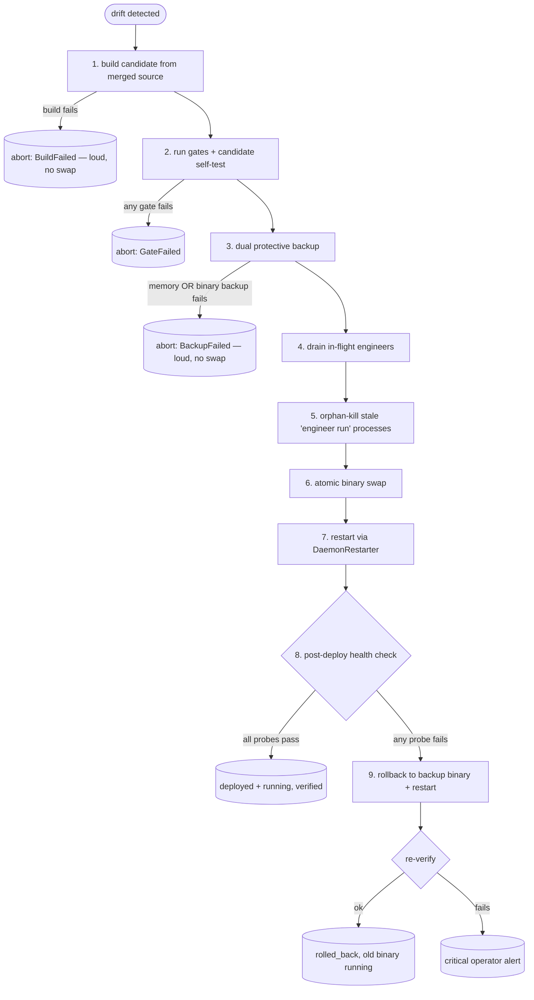

# Concept: reconcile-and-self-deploy

> **Status: implemented.** `ReconcileDetector`, `DeployDrift`,
> `SelfDeployOrchestrator`, `DaemonRestarter`, the engineer-orphan reaper, and
> the `simard self-health` probe live in
> [`src/self_deploy/`](https://github.com/rysweet/Simard/blob/main/src/self_deploy/mod.rs)
> and extend [`src/safe_update/`](https://github.com/rysweet/Simard/blob/main/src/safe_update/mod.rs),
> [`src/self_relaunch/`](https://github.com/rysweet/Simard/blob/main/src/self_relaunch/mod.rs),
> and [`src/memory_backup/`](https://github.com/rysweet/Simard/blob/main/src/memory_backup/mod.rs).
> The orchestrator sequence and rollback tail are covered by hermetic
> fake-effects tests; the effectful end-to-end paths run under operator-invoked
> `#[ignore]`d tests. See the
> [self-deploy API reference](../reference/self-deploy-api.md) for the typed
> surface.

> Simard merges code to her own repository, then **build-from-source deploys it
> into her own running daemon and verifies it is live** — or rolls back. A merged
> self-change that is not running is treated as an open loop, not a finished one.

## The problem this solves

Simard's self-improvement loop closes a pull request but does not close the
*deploy*. Two mechanisms predate this design and neither makes a merged
self-change run:

1. **`simard safe-update`** ([Safe Self-Update](../safe-self-update.md)) downloads
   the latest **released** binary. A commit that is merged to `main` but not yet
   tagged-and-released is never fetched, so it never runs. "merged != running."
2. The brain can route to `ConsiderSelfUpdate`, but the four-part triggering
   doctrine rarely holds, and the Decide call site that produced that choice
   used to fall back silently when its output failed to parse
   ([#2419](https://github.com/rysweet/Simard/issues/2419)). The improvement was
   merged; the daemon kept running the old binary; an operator had to rebuild by
   hand.

This violates Simard's own **"not done until it's running"** principle. The
companion gap for *dependency pins* — a fix merged upstream but not pulled into
Simard's own `Cargo.toml` rev — is closed by
[self-maintain-dependency-pins](../howto/self-maintain-dependency-pins.md). This
document closes the gap for Simard's **own binary**.

The single guiding principle:

> **A merged change to Simard's own running code is not complete until the new
> code is built, deployed, health-verified, and running — or rolled back.**

## How drift is detected

A **reconciliation detector** runs once per OODA cycle and computes *deploy
drift* between what is **merged** and what is **running**:

- **Binary drift** — the running binary's embedded build commit versus the latest
  merged commit on `origin/main` of the Simard repo.
- **Pin drift** — the pinned dependency revs in the **merged** `main` tree
  (`amplihack-memory`, `rustyclawd-core`, `rustyclawd-tools`, and the other
  ecosystem pins) versus the revs compiled into the **running** binary.

The detector returns a single value, `DeployDrift`, on the Orient context:

```text
DeployDrift {
    behind_commits: usize,      // 0 when the running binary is at HEAD of main
    drifted_pins:   Vec<String>,// pin names whose merged rev != running rev
    needs_deploy:   bool,       // true when behind_commits > 0 || !drifted_pins.is_empty()
}
```

`needs_deploy` is the authoritative "is the running daemon stale?" signal. It is
**reused by the [deploy-aware done-gate](deploy-aware-done-gate.md)** as the
"deployed-and-running" evidence for self-affecting goals — the two workstreams
share one source of truth on purpose.

See [self-deploy API reference](../reference/self-deploy-api.md#deploydrift) for
the exact comparison rules and the `git`/`Cargo.lock` inputs.

## The self-deploy sequence (load-bearing order)

When the brain routes to self-deploy and no engineer is holding a live claim
(`count_live_engineer_claims == 0`), the daemon spawns the **self-deploy
orchestrator**. The orchestrator extends — it does not replace — the existing
[safe-update phases](../safe-self-update.md). The order is load-bearing:
cheap-to-fail steps run first, and the protective backups are taken in the last
possible moment before the daemon is mutated.



1. **Build the candidate from merged source.** `self_relaunch::build_canary`
   runs `cargo build --release` at the target commit in an isolated worktree. A
   failed build **aborts loudly** and never touches the install path — no
   half-deploy.
2. **Gate the candidate.** The existing relaunch gates run in order — Smoke →
   UnitTest → GymBaseline → BridgeHealth — followed by the candidate's own
   `simard self-test`. Any failure aborts.
3. **Dual protective backup** (taken only *after* build + gates pass, immediately
   before any daemon mutation):
   - a **live cognitive-memory backup** of the running store, via
     `memory_backup` through `CognitiveMemoryOps`;
   - a **binary backup** to `~/.simard/bin/simard.bak.<utc-iso8601>`.

   If **either** backup fails, the deploy **aborts loudly** and the daemon is left
   untouched. Repairing a broken backup is its own goal — the self-deploy never
   mutates the daemon without a verified protective copy of both state and code.
4. **Drain** in-flight engineer dispatch within `drain_timeout_seconds`. While the
   `draining.flag` is present, the engineer-dispatch site refuses new dispatches
   (the brain treats that refusal as expected, not a failure).
5. **Orphan-kill** stale engineer subprocesses. Drain stops *new* dispatch, but a
   subprocess already executing `bin/simard engineer run …` keeps the old binary's
   inode open. Swapping under it causes **"Text file busy"** and a silent restart
   of the **old** binary. The orphan-kill step terminates exactly those
   processes — executable path equal to the target install path **and** argv
   containing `engineer run`, excluding the daemon itself and the incoming
   PID — by numeric SIGTERM, a bounded wait, then SIGKILL. It is idempotent: no
   matches is success.
6. **Atomic swap.** `rename(2)` first, copy-then-rename fallback for cross-device
   installs.
7. **Restart** through an injectable `DaemonRestarter`. The production default
   prefers `systemctl --user restart simard-ooda` when the unit is detected and
   otherwise falls back to the existing coordinated `exec()` handover. Tests and
   the recipe inject a fake restarter — **the recipe never live-restarts the
   operator's daemon**.
8. **Post-deploy health check** (`simard self-health`). All probes must pass; see
   the next section.
9. **Rollback on failure.** A failed health check restores the binary backup,
   restarts, and re-verifies. If rollback itself cannot reach a healthy state, the
   orchestrator raises a **critical operator alert** rather than leaving the host
   in an unknown state.

The whole sequence is **idempotent and loud**: re-running it when there is no
drift is a no-op, and every abort surfaces a specific, named error.

## What "healthy" means

The post-deploy health check is the gate between "swapped" and "done." It is a
single structured probe, `simard self-health --json`, that passes only when **all**
of the following hold:

| Probe | Healthy condition |
| --- | --- |
| **Version advanced** | running build commit/version ≥ the target commit/version |
| **Memory intact** | cognitive-memory fact count ≥ the pre-deploy count (within tolerance), via the `CognitiveMemoryOps` count API |
| **Goal board intact** | the goal board loads and the active-goal count is preserved |
| **Brains LLM-backed** | zero `BrainJudgmentRecord.fallback == true` records over a probe cycle (see [parse-failure record](../reference/ooda-brain-parse-failure-record.md)) |
| **No quarantine** | the cognitive-memory store quarantine flag is clear |

Any single failing probe fails the health check and triggers rollback. The probe
output is the same structured JSON whether it is run by the orchestrator or by an
operator at a console — see
[self-health output](../reference/self-deploy-api.md#self-health-output).

## Why build-from-source, not release-download

A merged-but-unreleased commit *cannot* be fetched as a published binary — that
is precisely the "merged != running" case this design exists to close. Release
download remains the right mechanism for **tagged releases**
([Safe Self-Update](../safe-self-update.md)); build-from-source is the mechanism
for **self-changes that have landed on `main` but not yet shipped**. The
reconciliation detector chooses build-from-source whenever drift is against
`main` rather than against a release tag.

## How this composes with the rest of the loop

- **Done-gate (Workstream B).** The [deploy-aware done-gate](deploy-aware-done-gate.md)
  refuses to mark a self-affecting goal complete while `DeployDrift::needs_deploy`
  is true. The detector here is its evidence source; the deploy here is what clears
  the blocker.
- **Dependency pins.** [self-maintain-dependency-pins](../howto/self-maintain-dependency-pins.md)
  keeps Simard's own `Cargo.toml` revs current; this design then rebuilds and
  redeploys so the bumped pin actually runs.
- **Loop-awareness ([#2404](https://github.com/rysweet/Simard/issues/2404))** and
  **decompose ([#2405](https://github.com/rysweet/Simard/issues/2405))** keep the
  brain from re-deciding the same deploy while one is in flight; an observed
  in-flight phase suppresses a second trigger.

## See also

- [Self-deploy API reference](../reference/self-deploy-api.md) — types, config, CLI, JSON schemas.
- [How to verify and roll back a self-deploy](../howto/verify-and-roll-back-a-self-deploy.md) — operator runbook.
- [Safe Self-Update](../safe-self-update.md) — the underlying drain/snapshot/swap orchestrator this extends.
- [Deploy-aware done-gate](deploy-aware-done-gate.md) — the completion gate that consumes `DeployDrift`.
