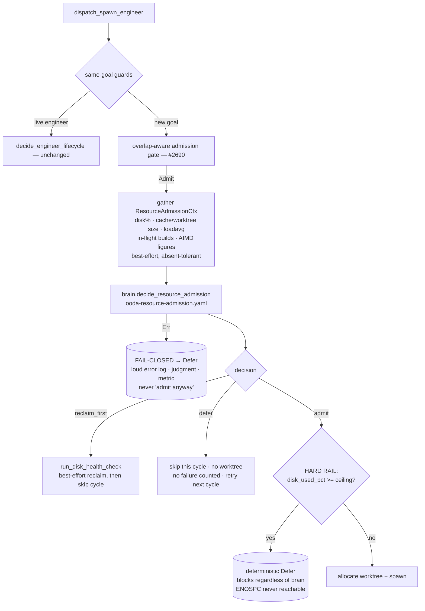

# Concept: resource-aware engineer admission

> **Status: implemented.** This page describes the shipped design in present
> tense — the resource-admission gate (`gather → reason → apply`), the
> `ResourceAdmissionCtx` / `ResourceAdmissionDecision` context, the
> `decide_resource_admission` brain step, the deterministic disk-ceiling rail,
> and the `SIMARD_RESOURCE_ADMISSION` kill-switch live in
> [`src/ooda_actions/advance_goal/resource_admission.rs`](https://github.com/rysweet/Simard/blob/main/src/ooda_actions/advance_goal/resource_admission.rs),
> [`src/disk_pressure/check.rs`](https://github.com/rysweet/Simard/blob/main/src/disk_pressure/check.rs),
> and
> [`src/ooda_brain/mod.rs`](https://github.com/rysweet/Simard/blob/main/src/ooda_brain/mod.rs),
> wired into `dispatch_spawn_engineer` in
> [`src/ooda_actions/advance_goal/spawn.rs`](https://github.com/rysweet/Simard/blob/main/src/ooda_actions/advance_goal/spawn.rs),
> with the reasoning asset at
> [`prompt_assets/simard/recipes/ooda-resource-admission.yaml`](https://github.com/rysweet/Simard/blob/main/prompt_assets/simard/recipes/ooda-resource-admission.yaml).
> See the [resource-admission API reference](../reference/resource-admission-api.md)
> for the typed surface. This is Simard self-improvement (p5 remit).

> Before a new engineer is admitted, Simard **reasons about the host resource
> picture** — disk usage, build-cache and worktree footprint, load average, and
> the number of in-flight builds — and decides whether to **admit** the engineer,
> **defer** it a cycle to let pressure drain, or **reclaim disk first** and retry.
> A **thin deterministic rail** — a configurable disk ceiling — **blocks
> admission regardless of what the brain says**, so the irreversible `ENOSPC`
> that kills recipes mid-cycle is never reachable.

## The problem this solves

Simard's engineer fleet is bounded by [adaptive scaling](adaptive-scaling.md):
the AIMD scaler raises and lowers `max_concurrent_actions` in response to CPU,
memory, and API-rate-limit pressure. [Concurrent engineer
dispatch](../reference/concurrent-engineer-dispatch.md) then starts up to that
many engineers per OODA round, and the [overlap-aware admission
gate](dependency-overlap-aware-scheduling.md) serializes the ones whose file
footprints collide.

Every one of those controls bounds **how many** engineers run, or **whether two
of them collide**. None of them bounds **what those engineers do to the disk**:

> **Count-control is not resource-admission.** "The AIMD cap says we may run five
> engineers" proves the host has *CPU/memory/quota* headroom for five
> subprocesses. It does **not** prove there is *disk* headroom for five more
> parallel `cargo build` target trees, five more git worktrees, and their
> incremental-compilation state.

The concrete incident that motivated this step:

- Each admitted engineer allocates a git worktree under
  `~/.simard/engineer-worktrees/` and runs `cargo build` inside it. Even with a
  shared `CARGO_TARGET_DIR`, incremental build state, debug symbols, and
  per-worktree checkouts accumulate monotonically.
- The AIMD cap kept admitting engineers because CPU and memory looked fine.
  Worktrees piled up — **40+** of them — and parallel builds drove the disk to
  **91%** used.
- At 91%, the host is one large build away from `ENOSPC` (No space left on
  device), which kills `recipe-runner-rs` mid-cycle, corrupts in-flight engineer
  subprocesses, and can wedge cognitive-memory WAL writes. This is the exact
  failure class the [automated disk health check](automated-disk-health.md) and
  the [`disk_pressure` precheck](../reference/disk-health-api.md) exist to
  prevent — but both are **reactive**: they clean up *after* accumulation, or
  refuse a worktree allocation only once free space is already critical.

There was **no resource-aware admission** anywhere in the spawn path. The
guiding principle:

> **Admit against resources, not just against count.** The AIMD cap bounds
> concurrency by CPU/memory/quota pressure. The resource-admission gate bounds it
> by *disk/build-cache/load* pressure, so parallelism can never accumulate its
> way into `ENOSPC`.

## It's a reasoning step, not a pile of thresholds

Simard's design principle (**G3**: agentic over brittle, recipes/prompts over
code) is that intelligence lives in **repeated execution of structured thought**,
not in hardcoded heuristics. This step follows the **exact** shape already proven
by the [engineer-lifecycle](../reference/ooda-engineer-lifecycle-recipe.md) and
[overlap-admission](dependency-overlap-aware-scheduling.md) decisions, where a
brain method reasons over gathered structured context and only a **thin
deterministic rail** guards the irreversible action.

So the gate is **not** a new bank of `if disk_pct > 85 && load > 8.0 { defer }`
rules in Rust. It is:

1. **A gather step** — a pure, best-effort `gather_resource_admission_ctx`
   translates the live resource picture into a
   [`ResourceAdmissionCtx`](../reference/resource-admission-api.md#resourceadmissionctx):
   disk used-percent / free / total on the worktree filesystem, engineer-worktree
   count and aggregate build-cache size, the 1/5/15-minute load average, CPU
   count, the number of in-flight engineers, and the current AIMD figures. This
   is fact *acquisition*, not decision *heuristics*. Every probe is best-effort
   and degrades to `None`/"unknown" rather than failing.
2. **A reasoning step** — the brain executes
   [`ooda-resource-admission.yaml`](../reference/ooda-resource-admission-recipe.md)
   over that context and returns one of three decisions with a rationale.
3. **A thin apply step** — a single deterministic rail that guards the one
   *irreversible* outcome (`ENOSPC`), and nothing else.

The load-bearing safety guarantee lives in the **Rust rail**, not the prompt:

```rust
// The whole deterministic "heuristic" is one comparison against the ceiling.
// The intelligence (whether to defer at 80% because a build cache is bloating,
// or reclaim first, or admit because the goal is tiny) lives in the recipe.
let hard_block = disk_used_pct >= ceiling_pct; // e.g. ceiling_pct = 90.0
```

Keeping the invariant in Rust — not the recipe — is deliberate: the recipe asset
is hot-reloadable and user-writable, so prompt tampering or prompt injection can
**never** talk the daemon into admitting an engineer that pushes the disk over
the ceiling. Editing the prompt changes admission **quality** (how conservatively
Simard defers or reclaims below the ceiling); it can never change the
**certain-ENOSPC** safety control.

## Where the step runs

The gate runs **inside `dispatch_spawn_engineer`**, positioned:

- **after** the same-goal single-flight guards, the subordinate-depth guard, the
  repo-resolve, and the [overlap-aware admission
  gate](dependency-overlap-aware-scheduling.md), and
- **before** the slow section that allocates the git worktree and spawns the
  subprocess.

Rationale: the cheap deterministic checks and the collision check are *already*
resolved before the gate is reached, so resource admission is the **last**
conscience consulted before disk-consuming work begins. It governs the
**engineer-worktree state-root filesystem** — the filesystem under
`engineer_worktree_state_root()` where worktrees, checkouts, and build caches
actually accumulate. The re-attach path for a still-live engineer on the same
goal is exempt: re-attaching consumes no new disk.



## The three decisions

The brain returns a
[`ResourceAdmissionDecision`](../reference/resource-admission-api.md#resourceadmissiondecision)
(`#[serde(tag = "choice", rename_all = "snake_case")]`, the same shape as the
engineer-lifecycle and overlap-admission decisions):

| Decision | Meaning | Effect |
| --- | --- | --- |
| `admit` | The host has resource headroom — disk is comfortably below the ceiling, the build cache and worktree count are healthy, load is not saturated. | Proceed to the **hard rail**, then (if the disk is below the ceiling) to worktree allocation + `spawn_subordinate` — the existing path, unchanged. |
| `defer` | Resources are tight but not yet at the hard ceiling — e.g. disk is climbing, several builds are already in flight, or load is saturated. Admitting now would push toward the ceiling. | **Skip this cycle** — no worktree, no failure counted. Re-evaluated next OODA round as a natural retry, once in-flight builds finish and pressure drains. |
| `reclaim_first` | There is reclaimable space (stale worktrees, orphaned build caches, old backups) that should be freed **before** another engineer is admitted. | Invoke the [disk-reclaim capability](automated-disk-health.md) (`run_disk_health_check`) **best-effort**, then skip this cycle. Next cycle re-evaluates against the freed space. |

`defer` and `reclaim_first` reuse the **existing** benign spawn-skip outcome —
there is no new persistent admission queue or global lock. A `defer` is retried
next cycle; a `reclaim_first` triggers cleanup and then retries.

> `defer` and `reclaim_first` must **never** increment `goal_failure_counts`.
> They are intentional resource backpressure, not failures — they reuse the
> benign spawn-skip outcome (`make_outcome(action, true, …)`) so the AIMD scaler
> and the engineer-lifecycle failure/safeguard logic are untouched. See
> [Benign backpressure, not failure](#benign-backpressure-not-failure).

## The hard rail (thin, deterministic, irreversible-only)

Exactly one rail can override the brain, and it guards exactly one thing: the
irreversible `ENOSPC`.

> **Disk-ceiling rail.** If the worktree filesystem's used-percent is **at or
> above** the configured ceiling (`disk_used_pct >= SIMARD_DISK_ADMISSION_CEILING_PCT`,
> default **90.0**, clamped to `1..=99`), admission is **refused regardless of
> the brain's output** — even an explicit `admit` is downgraded to a benign
> defer. This is the load-bearing guarantee: no reasoning, no prompt edit, and no
> prompt-injection can admit an engineer that would climb over the ceiling toward
> `ENOSPC`.

The ceiling default of **90.0** is set one point below the **91%** the incident
reached — the daemon refuses new disk-consuming work *before* it re-enters the
danger band, not after. The rail reuses the existing
[`disk_pressure`](../reference/disk-health-api.md) `DiskStatProvider` /
`DiskStat` plumbing, so it is exercised hermetically with a fake `(free, total)`
provider; the existing byte-based `MIN_FREE_GB` refuse-line is **untouched** and
remains the second, lower belt.

> **Design decision — the rail blocks but does not itself reclaim.** The rail
> deliberately does exactly one thing: block the irreversible action. It does
> **not** free space — reclaim happens either on an explicit `reclaim_first` brain
> decision, or independently via the periodic disk-health backstop below. Keeping
> the rail a single deterministic comparison (never a reclaim trigger) is what
> makes it trivially auditable and impossible to mis-fire. The gap this leaves — a
> disk pinned at/above the ceiling by usage Simard did not create, with a brain
> that keeps returning `admit`, would hard-block (benign defer) every cycle with no
> cleanup *from this gate* — is closed by two mechanisms that already exist, so the
> feature does **not** add reclaim logic to the rail:
>
> 1. **The periodic [disk-health check](automated-disk-health.md) is the
>    over-ceiling backstop.** It runs on its own daemon interval
>    (`SIMARD_DISK_HEALTH_INTERVAL_SECS`), independent of admission, and fires a
>    *deterministic emergency-cleanup* tier under high pressure plus a recipe-based
>    cleanup tier — so space is reclaimed even when the admission gate is only ever
>    hard-blocking. "Defers forever with no cleanup" cannot persist.
> 2. **The recipe leans toward `reclaim_first`/`defer` as the disk approaches the
>    ceiling** (see the
>    [prompt](../reference/ooda-resource-admission-recipe.md#the-prompt)). The rail
>    is framed as a last-resort backstop the brain should rarely hit — not a
>    license to `admit` into a wall — so an `admit`-into-a-hard-block is the
>    exceptional case, not the steady state.
>
> This is a conscious choice consistent with *ruthless simplicity*: the rail stays
> thin and deterministic, and reclaim stays the job of the (already agentic,
> already periodic) disk-health capability. A future refinement *could* have an
> over-ceiling block kick the disk-health check directly for faster convergence,
> but it is unnecessary for correctness given the periodic backstop.

## Fail-closed by construction

This gate is **fail-closed** — the opposite polarity from the [overlap-aware
gate](dependency-overlap-aware-scheduling.md), and for a deliberate reason:

- The overlap gate guards a **recoverable** risk (a merge collision costs a
  rebase), so it **fails open** — a broken scheduler admits, because wrongly
  stalling a spawn is worse than an occasional rebase.
- This gate guards an **irreversible** risk (`ENOSPC` kills recipes and corrupts
  subprocesses; the disk cannot be un-filled mid-crash), so it **fails closed** —
  when the reasoning is unavailable, Simard **does not add disk load**.

Concretely:

- **Brain / recipe error** (transport failure, unparseable output) → a **loud**
  `error!` + `eprintln!` and a benign **defer**. Never "admit anyway."
- **Un-migrated brain / test double** → the defaulted
  `decide_resource_admission` returns `admit`, but the **hard rail still
  applies** — so even a brain that does no resource reasoning cannot cross the
  ceiling. The default is safe *because* the load-bearing guarantee is the
  deterministic rail, not the brain.
- **Unknown disk** (the filesystem stat itself fails) → the gate **admits**
  (there is nothing to gate against and the lower `MIN_FREE_GB` precheck at
  worktree allocation is still in front of the actual write). The one thing that
  is never bypassed is a *known* over-ceiling reading.

> **Contrast with the sibling gates.** Same seam shape
> (`Ctx → OodaBrain method → recipe → typed Decision → apply`), three different
> safety polarities: the [outcome verifier](closed-loop-outcome-verification.md)
> fails **closed** (keep a goal open) because wrongly archiving is unrecoverable;
> the [overlap gate](dependency-overlap-aware-scheduling.md) fails **open**
> (admit) because a rebase is recoverable; this gate fails **closed** (defer)
> because `ENOSPC` is unrecoverable. The polarity always follows the
> reversibility of the risk being guarded.

### Benign backpressure, not failure

A resource `defer` / `reclaim_first` is **not** a goal failure. The gate reuses
the benign spawn-skip outcome (`make_outcome(action, true, detail)`) — the same
shape the overlap gate uses — so that a deferral:

- does **not** increment `goal_failure_counts` (a `success=false` outcome would,
  and after three consecutive it would false-lock an otherwise-healthy goal into
  "needs human review" purely because the disk was busy),
- does **not** feed the [AIMD scaler](adaptive-scaling.md) a spurious error
  signal (`success=false` outcomes are reported to the scaler as pressure; a
  disk-deferral is not a rate-limit and must not shrink the concurrency window),
- is recorded **honestly** — the outcome `detail` string names the deferral and
  its reason, and the decision is emitted as a judgment record and a metric
(see [Observability](../reference/resource-admission-api.md#observability)). The benign `success=true` here is the
  codebase's established encoding for *"a deliberate, non-failing skip"*, not a
  claim that the goal advanced. No engineer is spawned and no PR is claimed.

## Layered defense

Resource admission does not replace the existing disk mechanisms — it adds a
**pre-emptive, per-admission** layer on top of them:

```
Layer 0: .cargo/config.toml shared target dir
         ↓ Prevents per-worktree target-dir creation
Layer 1: resource-admission gate (per new-engineer spawn)   ← THIS FEATURE
         ↓ Reasons over disk/cache/load; defers or reclaims BEFORE adding load
Layer 1a: disk-ceiling hard rail (deterministic)
         ↓ Blocks admission at the ceiling regardless of reasoning
Layer 2: disk_health check (periodic — own daemon interval)
         ↓ Deterministic emergency cleanup + recipe cleanup; the over-ceiling backstop
Layer 3: disk_pressure MIN_FREE_GB precheck (per worktree allocation)
         ↓ Byte-level refuse-line at the actual allocation site
Layer 4: sweep_orphaned_worktrees (boot-time) + EngineerWorktree RAII cleanup
         ↓ Catches orphans and cleans up on normal exit
```

Each layer catches what the layer above missed. Resource admission is the
**earliest** and **cheapest** intervention — it prevents the load from being
added at all, so the reactive cleanup layers have less to reclaim and the
byte-level refuse-line is rarely reached.

## How this composes

- **[Adaptive scaling](adaptive-scaling.md)** decides *how many* engineers may
  run (CPU/memory/quota). Resource admission is the per-spawn conscience that
  refuses one of those admissions when the *disk* cannot take it. The AIMD figures
  (`current_max`, in-flight count) are passed into the context so the brain can
  reason about count and resources together.
- **[Overlap-aware scheduling](dependency-overlap-aware-scheduling.md)** runs
  first at the same seam and decides *whether two engineers will collide*.
  Resource admission runs immediately after and decides *whether the host can
  afford the second engineer at all*. Collision-control then resource-control,
  both before any worktree is allocated.
- **[Automated disk health](automated-disk-health.md)** is the reactive cleanup
  Simard already runs **periodically** (its own daemon interval,
  `SIMARD_DISK_HEALTH_INTERVAL_SECS`, with a deterministic emergency-cleanup tier
  under high pressure). It is the **backstop** that reclaims a disk pinned over the
  ceiling, independent of admission. Resource admission also **invokes the same
  capability** on `reclaim_first`, turning the periodic janitor into an additional
  on-demand, admission-driven one.

## See also

- [Resource-admission API reference](../reference/resource-admission-api.md)
- [OODA resource-admission recipe & prompt schema](../reference/ooda-resource-admission-recipe.md)
- [How to configure resource-aware admission](../howto/configure-resource-aware-admission.md)
- [Resource-admission kill-switch (`SIMARD_RESOURCE_ADMISSION`)](../operations/resource-admission-kill-switch.md)
- [Dependency/overlap-aware engineer scheduling](dependency-overlap-aware-scheduling.md) — the sibling gate at the same seam (fail-open, collision-guarding).
- [Adaptive scaling — AIMD concurrency](adaptive-scaling.md) — the count control this augments.
- [Automated disk health management](automated-disk-health.md) — the reactive cleanup this invokes on `reclaim_first`.
