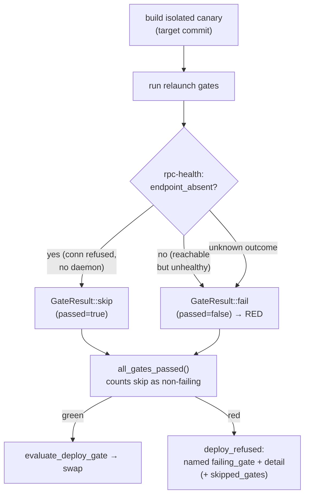

# Concept: self-deploy canary gate skip-on-absent-endpoint and per-gate diagnosability

> **Status: implemented.** The `Skipped` gate outcome (`GateResult::skip`),
> the fail-closed `endpoint_absent` predicate, and the per-gate evidence
> threaded from the canary verifier through the deploy refusal live in
> [`src/self_relaunch/types.rs`](https://github.com/rysweet/Simard/blob/main/src/self_relaunch/types.rs),
> [`src/self_relaunch/gates.rs`](https://github.com/rysweet/Simard/blob/main/src/self_relaunch/gates.rs),
> and [`src/overseer/deploy.rs`](https://github.com/rysweet/Simard/blob/main/src/overseer/deploy.rs).
> They **extend** the existing canary gates described in
> [reconcile-and-self-deploy](reconcile-and-self-deploy.md); no gate was removed
> or weakened. See the
> [canary gate outcomes API reference](../reference/self-deploy-canary-gate-outcomes-api.md)
> for the typed surface.

This concept explains why an autonomous self-deploy canary could turn **red on
every OODA tick** while the default branch's own CI stayed **green**, and how the
canary now distinguishes a gate that *genuinely failed* from a probe gate whose
*live endpoint is legitimately absent* in an isolated fresh-build sandbox. For
the end-to-end self-deploy flow this fits into, see
[reconcile-and-self-deploy](reconcile-and-self-deploy.md).

## The problem this solves

The Overseer self-deploy builds the target commit into an **isolated canary
binary** in a throwaway target dir and runs it through the relaunch gates
(`smoke`, `unit-test`, `gym-baseline`, `rpc-health`) before any swap. One of
those gates — `rpc-health` — probes a **live daemon** by shelling
out:

```text
<canary-binary> probe rpc --timeout 30
```

In the isolated canary context there is no running daemon to answer that probe.
The freshly built binary has no server bound, so `probe rpc` returns a
connection-refused / no-daemon error and the gate reports `passed: false`.
`all_gates_passed()` then sees one failing gate and the canary is **red**.

The daemon's deploy driver consumed that red verdict every tick:

```text
OVERSEER did: deploy 56b10bef5057 failed - deploy_gate: red canary
  (one or more gates failed) (isolated)
```

This produced two compounding failures:

1. **A false red every tick for hours.** The running binary stayed one commit
   behind merged `main`, so merged improvements were never adopted via
   self-deploy — even though `main`'s own CI was green. CI is green precisely
   because it never runs the live `probe rpc`; the canary did, in a context
   where no endpoint can exist.
2. **No evidence of *which* gate failed.** The canary verifier collapsed the
   full `Vec<GateResult>` into a bare count — `"3/4 gates"` — and the operator
   notification said only `red canary (one or more gates failed)`. The root
   cause could not be evidenced from the log; an operator had to reproduce the
   canary by hand to learn which gate was red.

The failure was therefore **specific to the canary/deploy-gate evaluation path
during self-deploy, not a general build or test regression.**

## The two guiding principles

> **Never blind the canary.** A gate may only be treated as non-failing when its
> live endpoint is *positively detected* to be absent from the isolated canary.
> A reachable-but-unhealthy endpoint is a real regression and must stay **red**.

> **Always name the failing gate.** A red canary must carry the offending gate's
> identity and a bounded detail all the way to the operator refusal — never a
> bare aggregate count.

## What changed

### 1. An explicit `Skipped` gate outcome (fail-closed)

`GateResult` gains an additive `skipped` flag with a hard invariant:

> **`skipped == true` ⇒ `passed == true`.**

A skipped gate is *not* a failing gate. Because every existing read-site already
checks `.passed`, and a skipped result is always `passed: true`, the existing
aggregation (`all_gates_passed`) and every downstream consumer keep working
unchanged — a skip is counted as non-failing without touching those call sites.

Three constructors express intent at each gate's return site:

| Constructor | Meaning | `passed` | `skipped` |
| --- | --- | --- | --- |
| `GateResult::pass(gate, detail)` | Gate ran and passed | `true` | `false` |
| `GateResult::fail(gate, detail)` | Gate ran and failed — canary goes **red** | `false` | `false` |
| `GateResult::skip(gate, detail)` | Gate's live endpoint is absent in this canary — non-failing | `true` | `true` |

### 2. A centralized, fail-closed `endpoint_absent` predicate

A single predicate decides whether a probe gate may skip. Because the probe gates
shell out and observe only a process result (exit status + stderr, or a spawn
error), the predicate operates on that real surface rather than a structured
outcome type:

```text
endpoint_absent(probe_result) -> bool
```

It returns `true` **only** for a positively-recognized connection-refused /
no-daemon signal (the probe proved nothing is listening). Every other result —
including a reachable endpoint that answered *unhealthy*, and a spawn error where
the binary could not run at all — falls through to `false` (fail). This is the
safety core:

- **Absent endpoint** (connection refused, no daemon listening) → `skip()` →
  non-failing.
- **Reachable but unhealthy** (endpoint answered, health check failed) →
  `fail()` → **red canary**. A genuine RPC regression is never skipped.
- **Unknown / indeterminate outcome, or spawn error** → `false` → `fail()`. The
  canary fails closed; it is never blinded by a result the predicate does not
  positively recognize as absence.

The positive signals are: the dedicated `EX_UNAVAILABLE` (69) exit code, an
unambiguous connection phrase (`connection refused`, `no daemon`,
`could not connect`, `connection reset`), or a bare `ENOENT`
("no such file or directory") **only when it co-occurs with a socket-path
marker** (`.sock` / `socket`). ENOENT alone is deliberately *not* an absence
signal: it also fires for an unrelated missing config/dependency file, which is a
genuine failure, so requiring a socket marker keeps a missing *socket* skippable
while a missing *file* still reds the canary.

Only `rpc-health` consults `endpoint_absent` today: its `probe rpc` subcommand is
the one gate that requires a live daemon. `gym-baseline` currently runs
`<binary> gym list` — a **local** listing that does not contact a daemon — so it
must **not** skip unless its subcommand is later verified to need one. The
`smoke`, `unit-test`, and any build/regression gates **never skip** — they cannot
produce a `Skipped` result. (See the reference's
[Detection signal](../reference/self-deploy-canary-gate-outcomes-api.md#detection-signal-implementation-gap--must-be-resolved-in-the-build-step)
note: `probe rpc` must expose a distinct absence signal before `rpc-health` can
skip reliably and fail-closed.)

### 3. Per-gate evidence threaded to the operator refusal

The canary verifier stops discarding gate identity. The build-and-verify report
now carries, in addition to the pass/fail aggregate:

- **`failing_gate`** — the name of the first genuinely failing gate (e.g.
  `rpc-health`), or `None` when the canary is green.
- **`failing_detail`** — a bounded, sanitized detail for that gate.
- **`skipped_gates`** — the names of gates that skipped on absent endpoints.

That evidence flows through `CanaryResult` into the deploy path, so the operator
refusal names the gate instead of a bare count:

```text
# Before — bare aggregate, root cause invisible
OVERSEER did: deploy 56b10bef5057 failed - deploy_gate: red canary
  (one or more gates failed) (isolated)

# After — named gate + bounded detail; skips surfaced separately
OVERSEER did: deploy a1b2c3d4 refused - red canary:
  gate unit-test failed — tests failed (exit 101): 2 failed
  [skipped: rpc-health]
```

When the *only* previously-red gate was the absent-endpoint probe, that gate now
**skips** rather than fails, the aggregate is **green**, and the deploy proceeds
— closing the false-red loop while preserving every real safety gate.

## How it fits the self-deploy flow

Nothing about the deploy sequence, ordering, or safety rails changes. The canary
still builds the target from source, runs the gates, and feeds a pass/fail
verdict into [`evaluate_deploy_gate`](../reference/self-deploy-api.md). The only
differences are:

1. A probe gate whose endpoint is provably absent contributes a `Skipped`
   outcome instead of a false failure.
2. When the canary *is* red, the refusal names the failing gate.



## Safety: why this does not weaken the deploy gate

This is a **diagnosability fix plus a narrow, fail-closed correction**, not a
relaxation of deploy safety:

- **Narrow skip surface.** Only `rpc-health` can skip; `gym-baseline`,
  `unit-test`, `smoke`, and any build/regression gate never do. This is grep-able
  (`GateResult::skip` appears only in `run_rpc_health_gate`) and reviewer-checked.
- **Fail-closed default.** Any result that does not *positively prove* endpoint
  absence — including unknown, indeterminate, reachable-but-unhealthy, or a spawn
  error where the binary could not execute — returns `fail()`. The canary can
  never be blinded by an unrecognized result.
- **Real regressions still red.** A reachable RPC that answers unhealthy, a
  failed build, or a failing unit test still produces a red canary and refuses
  the deploy, exactly as before.
- **The PRD and `evaluate_deploy_gate` semantics are preserved.** No gate was
  removed; the deploy gate still refuses no-op, rollback, red-canary, and
  crash-loop.

The two behaviors that a reviewer must treat as load-bearing security controls:
*reachable-but-unhealthy stays red*, and *unknown outcome fails closed*. Both
are covered by dedicated tests (see the
[API reference](../reference/self-deploy-canary-gate-outcomes-api.md#tests-that-are-security-controls)).

## Related

- [Concept: reconcile-and-self-deploy](reconcile-and-self-deploy.md) — the
  end-to-end self-deploy flow this canary feeds.
- [Canary gate outcomes API reference](../reference/self-deploy-canary-gate-outcomes-api.md)
  — the typed surface (`GateResult`, `endpoint_absent`, threaded evidence).
- [Self-deploy API reference](../reference/self-deploy-api.md) — the deploy gate,
  `CanaryRunner`, and operator notifications this evidence flows into.
- [How to verify and roll back a self-deploy](../howto/verify-and-roll-back-a-self-deploy.md)
  — reading the canary verdict and refusal detail as an operator.
