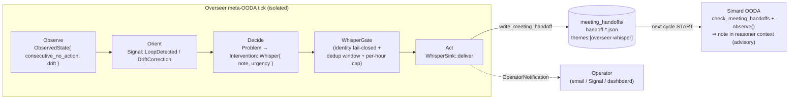

# The Simard Whisperer

> **Status: design specification — not yet implemented (issue
> [#2605](https://github.com/rysweet/Simard/issues/2605), open).**
>
> This document describes the **intended** design and the *why* behind it.
> Nothing here ships yet: the `Intervention::Whisper` variant, the
> `WhisperSink` capability and `src/overseer/whisper_ops.rs`, the
> `ProblemKind::LoopDetected` / `ProblemKind::DriftCorrection` signals, the
> `WhisperGate`, and the `SIMARD_OVERSEER_WHISPER` flag are all **planned, not
> live**. The channel it rides on *does* exist today — the meeting-handoff
> inbox ([`write_meeting_handoff`](../reference/meeting-handoff-schema.md),
> `check_meeting_handoffs` at OODA cycle start) and the acting Overseer
> co-process ([Overseer design](../design/overseer.md)) are already shipped —
> so the Whisperer is a purely additive layer on proven mechanics. See the
> [API reference](../reference/simard-whisperer-api.md) for the exact change map.

The **Simard Whisperer** is a pattern in the [Overseer](../design/overseer.md) that
lets the Overseer **steer** Simard — the authoritative OODA loop — without ever
taking the action for her. When the Overseer observes Simard **looping**,
**drifting from a goal's intent**, missing context the Overseer can see, or heading
toward a known pitfall, it delivers a short, **advisory** *whisper*: a steering note
injected onto the **same meeting-handoff inbox** Simard already scans at the start of
every cycle. The note is folded into the reasoners' Observe context on Simard's next
turn as *additional input* — the reasoners still decide.

Whispering is the **lightweight default**. When a whisper is insufficient (the same
condition recurs, or the Overseer flags it urgent), the Overseer **escalates** to a
full meeting via the existing [`MeetingHost`](../design/overseer.md) capability — the
pre-existing, heavier steering path — rather than whispering forever.

!!! note "One brain, one steward"
    Simard is **one brain**. The Overseer is her **steward**, not a second decision
    maker. A whisper is *context*, never a command: it can add information or suggest
    a correction, but it can never overwrite, fabricate, or fake one of Simard's
    decisions or actions. See [Advisory, not command](#advisory-not-command).

## Why a whisper (and not a meeting)

The Overseer already had one way to steer Simard: **transfer a goal through a
meeting** (`Intervention::TransferGoal` → `MeetingHost`). That path is deliberately
heavy — it opens a meeting, produces a decision-bearing handoff, and can create or
re-prioritise goals. It is the right tool for a *hand-off*, but far too heavy for a
*nudge*.

Most of the time the Overseer just needs to say a sentence into Simard's ear:

- "You've taken no action for two cycles on goal `g-42` — reconsider or pick a
  different sub-task."
- "Your recent work looks unrelated to the stated goal intent — re-read the goal."
- "There's a known pitfall here: the last three attempts at this failed on CI OOM."

The whisper is that sentence. It is a **single lightweight handoff record** carrying
only the note, delivered onto the channel Simard already reads, and consumed as
advisory Observe context. No meeting, no new goal, no action taken on Simard's
behalf.

## Where a whisper rides — the reused channel

The whisper does **not** invent a new channel. It rides the **existing**
meeting-handoff inbox that Simard's OODA loop already scans at the **start** of every
cycle:

| Concern | Mechanism | Source |
|---|---|---|
| Inbox directory | `meeting_facilitator::default_handoff_dir()` → `<state_root>/meeting_handoffs/` | `src/meeting_facilitator/handoff/mod.rs` |
| Writer | `write_meeting_handoff(dir, &MeetingHandoff)` → `handoff-<rfc3339>.json` | `src/meeting_facilitator/handoff/persistence.rs` |
| Cycle-start ingest | `check_meeting_handoffs(...)` runs **before** Observe→Orient→Decide→Act | `src/ooda_loop/cycle.rs` |
| Observe surfacing | `observe()` scans unprocessed handoffs and folds a handoff signal into the reasoner-facing `Observation` | `src/ooda_loop/observe.rs` |

Because the whisper is written **during the Overseer's tick** and picked up at the
**start of Simard's next cycle**, delivery is asynchronous by design: a whisper
written at Overseer tick *T* appears in Simard's Observe context at cycle *T+1*.

!!! warning "Not the `.txt` goal-sink"
    The Overseer's pre-existing `FileHandoffSink` writes `overseer-goal-*.txt`, which
    the OODA ingest path **never parses**. A whisper written that way would silently
    never reach Simard. The whisper therefore delivers a real
    `handoff-<rfc3339>.json` through `write_meeting_handoff` — the exact artifact
    Simard's inbox understands.

## What triggers a whisper

The Overseer's Observe step gains two additive readings of Simard's live state, and
its Orient step turns them into two additive
[`Signal`](../reference/simard-whisperer-api.md#signal)s that Decide routes to a
whisper:

### Looping — repeated no-action / no progress

Simard's no-progress breaker counts a goal's **consecutive no-action** cycles and
fires a hard breaker at `NO_PROGRESS_BREAKER_THRESHOLD` (**3**;
`src/goal_curation/no_progress_breaker.rs`). The Whisperer nudges **before** the hard
breaker: at **2** consecutive no-action cycles the Overseer emits
`Signal::LoopDetected` → `ProblemKind::LoopDetected` → a whisper that names the loop
and suggests reconsidering or switching sub-task. The whisper threshold is **strictly
less than** the breaker threshold so the gentle nudge always precedes the blocking
intervention.

### Drift — work diverging from goal intent

When Simard's recent activity looks unrelated to the stated intent of the active
goal, the Overseer emits `Signal::DriftCorrection` → `ProblemKind::DriftCorrection` →
a whisper that points back at the goal intent. Drift detection is a comparison the
steward can make from outside the loop (active work vs. stated goal), so it is a
natural whisper trigger.

Both conditions compose a **concise corrective/additional instruction** — one or two
sentences — never a rewritten plan.

## Advisory, not command

A whisper is **context**, not a decision. This is enforced structurally, not by
convention:

- The note is carried on the whisper handoff in a **non-promoting field**
  (`open_questions` / `themes`), with **`decisions` empty** and **`action_items`
  empty**. Simard's `check_meeting_handoffs` promotes `decisions` into goals and
  `action_items` into backlog items — so an empty-decisions, empty-action-items
  handoff **cannot fabricate a goal, backlog item, or planned action**.
- The whisper handoff is tagged `themes: ["overseer-whisper"]` so the OODA Observe
  path recognises it and folds its note into the **reasoner-facing Observe context**
  as advisory input, then marks it processed.
- Simard's reasoners run exactly as before. They read the whisper alongside every
  other observation and **produce their own decision**. The whisper never overwrites
  or forges a planned action or an outcome.

The result: after a whisper, Simard's next decision is still *hers*. The whisper is
present as one more input she may or may not act on.

## Guardrails

The Whisperer reuses the Overseer's existing guardrail patterns
(`src/overseer/guardrails.rs`) rather than inventing new ones.

### Dedup + rate-limit

The Overseer must not re-inject the same whisper every cycle. A `WhisperGate`:

- **Deduplicates** by a stable signature `(ProblemKind + goal_id + normalized_note)`
  and **suppresses** an identical whisper within a **time window** (default **900 s**,
  measured with an injected clock — the same pattern as `OverseerCadence::due`).
- **Caps** whispers to a **per-period budget** (default **5 per hour** across all
  signatures), in the spirit of `BudgetGate` / `ConflictSequencer`.

A suppressed whisper is counted (`whispers_suppressed`) and traced, never silently
dropped.

### Distinct identity + anti-recursion

The whisper is authored under the Overseer's **distinct steward identity**
(`overseer_author_login()`, default `simard-overseer[bot]`) — never the human
operator's login and never Simard's own. Two protections follow:

- **No self-whisper.** Simard's Observe / the Overseer's `signals_from` **ignore
  overseer-authored handoffs**, so the Overseer can never observe its own whisper and
  whisper about it — no feedback loop.
- **Fail-closed.** If the Overseer identity is unconfigured, `RecursionGuard` refuses
  the whisper (nothing is delivered), exactly as it fails closed for PR/commit/goal
  subjects today. A steward that cannot prove its own identity does not get to speak.

### Transparent + traceable

A whisper is **never a hidden side-channel**:

- Every whisper emits a structured `tracing` event (`target: "overseer::whisper"`)
  with `trigger`, `note`, `urgency`, `delivered`, `path`, `signature`, and
  `suppressed` fields.
- Each **delivered** whisper is surfaced to the operator as an `OperatorNotification`
  (kind `"whisper"`) through the mandatory `DualChannelNotifier`, so it shows up on
  the operator's channels and the dashboard.
- The per-tick `OverseerTickReport` gains `whispers` and `whispers_suppressed`
  counters.

### Isolated + panic-safe

The whisper capability runs **inside** the existing panic-isolated Overseer tick
(`run_overseer_tick_isolated`'s `catch_unwind`). A whisper-sink error or panic is
caught, reflected in the report (`errors` / `panicked`), and the daemon and OODA loop
continue unaffected.

## Escalation — keep the meeting path

Whispering is the default, not the only tool. When a whisper is **insufficient**, the
Overseer escalates to the pre-existing meeting path:

- **Repeated:** the same-signature whisper has fired ≥ N times within the window
  (default **N = 3**) without the condition clearing, **or**
- **Urgent:** the whisper's `urgency` is `High`.

On escalation the Overseer takes `Intervention::TransferGoal` through `MeetingHost` —
a full meeting/handoff with Simard, exactly as before. The lightweight whisper remains
the default path; escalation is the exception.

## Configuration

The Whisperer is gated by `SIMARD_OVERSEER_WHISPER`, following the Overseer's
**opt-out** convention:

| Value | Effect |
|---|---|
| unset / empty / truthy (`1`,`true`,`yes`,`on`) / unrecognised | **enabled** (default, when the Overseer is enabled) |
| explicit falsey (`0`,`false`,`no`,`off`) | **disabled** — Decide emits no whisper |

Because whispering only makes sense when the Overseer runs, the flag defaults to
**enabled when the Overseer is enabled** and is disabled by an explicit falsey value —
the same shape as `overseer_acting_enabled`. See
[Configure the Simard Whisperer](../howto/configure-the-simard-whisperer.md).

## Invariants

- **Reused channel only.** A whisper is delivered *exclusively* by writing a
  `handoff-<rfc3339>.json` into `meeting_handoffs/` via `write_meeting_handoff`. No
  parallel channel exists.
- **Advisory.** A whisper handoff carries empty `decisions` and empty `action_items`;
  it can never create a goal, backlog item, planned action, or outcome.
- **At most one identical whisper per window.** Dedup suppresses duplicates; the
  per-hour cap bounds total whispers.
- **Distinct authorship.** Every whisper is authored under the Overseer's steward
  identity; overseer-authored handoffs are ignored by observation (no self-whisper).
- **Fail-closed.** Unconfigured identity ⇒ refused, nothing delivered.
- **Visible.** Every whisper is traced and every delivered whisper notifies the
  operator.
- **Default lightweight.** The whisper is the default; the meeting path is the
  escalation.
- **Isolated.** A whisper failure or panic is caught by the isolated tick; the daemon
  continues.

## Out of scope

- **Renaming or replacing** any existing Overseer, meeting, or OODA concept. The
  Whisperer is purely additive and contains no "Bridge" naming.
- **Taking Simard's action for her.** The Overseer never executes Simard's decision;
  it only adds context.
- **A second decision channel.** There is exactly one steering inbox
  (`meeting_handoffs/`); the whisper is a lightweight record on it.
- **Synchronous, same-cycle delivery.** Whispers are picked up at the *next* cycle
  start.

## See also

- Design: [Overseer — operator/observer co-process](../design/overseer.md)
- API reference: [Simard Whisperer API](../reference/simard-whisperer-api.md)
- How-to: [Configure the Simard Whisperer](../howto/configure-the-simard-whisperer.md)
- Related: [Keeping the OODA Daemon Steerable](../concepts/steerable-ooda-daemon.md),
  [Meeting Handoff Schema](../reference/meeting-handoff-schema.md),
  [OODA Meeting-Handoff Integration](../architecture/ooda-meeting-handoff-integration.md)
