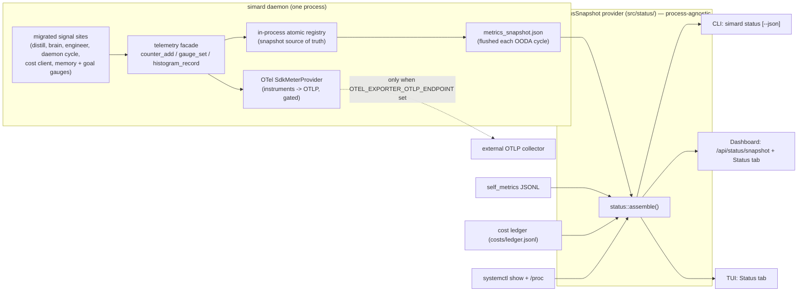

# Unified telemetry and one `simard status`

Simard's operational truth used to be scattered. The signals an operator most
cares about — did the last distillation parse? is the brain falling back to
empty decisions? how many engineers are live? is the daemon restart-churning? —
were emitted as **ad-hoc text** through **hundreds of** `println!` / `eprintln!`
and bare `tracing` macros, then **re-parsed by grepping journald**. Meanwhile the
numeric metrics lived in **four disconnected bespoke stores** that never agreed
on a schema or a home:

- `src/self_metrics/` — JSONL counters/gauges (`record_metric`, `query_metrics`,
  `daily_report`, `collect_and_record_all`).
- `src/cost_tracking.rs` — the cost ledger at `~/.simard/costs/ledger.jsonl`.
- `src/cognitive_memory/metrics.rs` — memory-graph counts.
- `src/gym/executor_metrics.rs` and
  `src/operator_commands_dashboard/metrics.rs` — surface-local tallies.

There was **no OpenTelemetry metrics pipeline at all** — a `TracerProvider` was
installed (gated on `OTEL_EXPORTER_OTLP_ENDPOINT`), but no `MeterProvider`.

This feature **rationalizes** that landscape without ripping anything out. It
adds one telemetry foundation and reads it back through **one** status report,
surfaced **three ways**.

## The shape of the change

Two ideas carry the whole design.

### 1. A dual-write telemetry facade

Every migrated call site writes through one small typed facade
(`src/telemetry/`) with three verbs — `counter_add`, `gauge_set`,
`histogram_record` — and named metric constants (`simard.<area>.<name>`). The
facade **dual-writes**:

- into a **lightweight in-process atomic registry** that is the *source of
  truth for the status snapshot*, and
- into **OpenTelemetry instruments** on an `SdkMeterProvider`, which export via
  OTLP **only when `OTEL_EXPORTER_OTLP_ENDPOINT` is set** — identical gating to
  traces.

The production default (no endpoint) therefore stays **fully local and
in-process**: no external collector is required to read current values, because
the in-process registry is always the aggregator behind the status snapshot.

Migration is **additive**. Each operational site now emits **two** outputs
instead of one:

1. the original human-readable log line (operators and journald still rely on
   it — readability is preserved, never removed), and
2. a **metric update** through the facade (which also carries the OTel
   instrument for OTLP export when enabled).

We add structure; we do not subtract readability.

### 2. One snapshot, assembled from durable sources

The unified registry lives in the **daemon** process. But `simard status` (CLI)
and the TUI run as **separate processes**, and only the dashboard is
daemon-hosted. So the snapshot is deliberately **not** read from daemon RAM.
Instead the `StatusSnapshot` provider assembles from **durable, on-disk and
system sources** so it yields identical results from any process:

| Signal | Durable source |
|---|---|
| Counters / gauges / histograms | `~/.simard/telemetry/metrics_snapshot.json` (flushed by the daemon each OODA cycle) + `self_metrics` JSONL |
| Cost / tokens | `cost_tracking` ledger (`costs/ledger.jsonl`) |
| Memory graph | daemon-sampled `simard.memory.*` gauges in `metrics_snapshot.json` |
| Daemon uptime / version / PID / NRestarts | `systemctl show simard.service` + `/proc` |
| Resource snapshot | `/proc/loadavg`, `/proc/meminfo`, `/proc/<pid>/status`, `statvfs`, `pgrep` |
| Goal board / workstreams / completed / self-improvement PRs | *deferred* — rendered `unavailable` on the process-agnostic path; the goal board is surfaced live in the daemon-hosted dashboard / TUI goal tabs |

None of this is `journalctl | grep`. Reading `systemctl show` for structured
service properties and `/proc` for process stats satisfies the "no log
scraping" constraint while remaining process-agnostic.

The in-process `SdkMeterProvider` remains the **export** path (OTLP when an
endpoint is set) and powers the dashboard's live in-daemon view; it is **not**
the cross-process source of truth.

## Reconcile, don't replace

The four bespoke stores keep working. Other code and the existing dashboard
depend on them, and the running daemon must not regress. So they are either fed
**into** the unified facade or read **through** the one snapshot API:

- `cost_tracking::record_cost` additionally emits `simard.llm.*` metrics; the
  ledger file format is unchanged.
- `self_metrics` remains the durable JSONL mirror the snapshot reads.
- `cognitive_memory/metrics.rs` is read through the snapshot's memory section.

No data loss. No writer-path rewrites. Additive facade calls only.

## Two books of cost, told honestly

Cost is tracked by **two independent accounting systems**: the dollar
**ledger** and Copilot **AI-credits**. They are not the same thing and will not
always agree. The status report **surfaces both side by side**, computes the
delta, and **flags `under/over-count`** when they diverge beyond a small
tolerance. It never silently picks one number and hides the other.

## Freshness is a first-class value

Because the snapshot is assembled cross-process from many sources, each section
carries its own **availability** (`ok` / `unavailable` / `error`) and
**freshness** (`live` / `stale` / `absent`). One dead source degrades **one**
section — loudly — and never zeros out or fails the whole report. There are no
silent zeros: a missing number renders as `absent`/`stale`/`unavailable`, not
as `0`.

## Why one report, three surfaces

The CLI, the dashboard, and the TUI all render the **same serialized
`StatusSnapshot`**. The CLI layout is canonical; the dashboard and TUI reuse its
section model. This guarantees the three surfaces show the *same numbers* and
that adding a metric or section updates all three at once — instead of three
drifting reimplementations of "how's Simard doing?".

## What stays the same

- **Additive and non-breaking.** The running daemon keeps working; existing
  journald/text logging, the existing dashboard tabs, and the existing TUI tabs
  are untouched.
- **OTLP export is off by default.** Both metrics and traces export only when
  `OTEL_EXPORTER_OTLP_ENDPOINT` is set. The default deployment needs no
  external collector.
- **No new writes to disturb state.** The only new file the daemon writes is
  `~/.simard/telemetry/metrics_snapshot.json`, written atomically
  (temp `0600` + fsync + rename) under a `0700` parent. The snapshot readers
  never mutate anything.

## See also

- [Telemetry metrics reference](../reference/telemetry-metrics.md) — the metric
  catalog, the facade API, OTel init, and configuration.
- [StatusSnapshot API reference](../reference/status-snapshot-api.md) — the
  snapshot types, the provider, the JSON schema, and the dashboard endpoint.
- [How to read `simard status`](../howto/simard-status.md) — the operator
  walkthrough.
- [Dashboard](../dashboard.md) and [simard-tui](../reference/simard-tui.md) —
  the other two surfaces.
