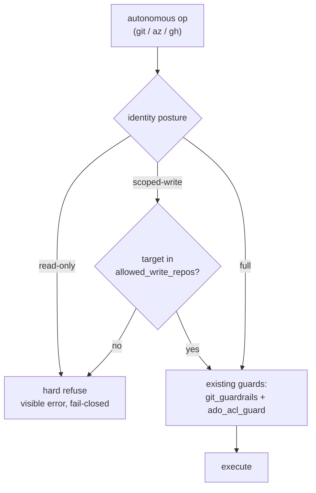

# Write-authority posture — read-only, scoped-write, and full identities

!!! warning "Implementation status — shipped v1 is env-driven (issue #1, tracking #3067)"
    **Shipped today:** the read-only mandate is enforced by **`SIMARD_OBSERVE_ONLY=1`**,
    a fail-closed, default-DENY command classifier (`read_only_guard`) wired into
    `git_guardrails::check_git_safety` (the git write seam) and the OODA
    engineer-dispatch (`dispatch_spawn_engineer`, which then dispatches **0** write
    actions). Identity isolation uses the pre-existing **`SIMARD_STATE_ROOT`**.
    **Planned (NOT yet implemented):** the typed `IdentityAuthority` manifest posture,
    the `[identities.authority]` TOML block, and the `check_git_safety_with_authority` /
    `check_ado_write_safety` / `simard debug authority` surfaces described below —
    tracked in [#3067](https://github.com/rysweet/Simard/issues/3067). Treat those as
    the target design; the runnable, shipped guardrail proof lives in the
    `rysweet/Crocutus` repo (`scripts/prove-guardrail.sh`).

## The problem

A *second* autonomous identity should not be a second uncontrolled writer.
The `crocutus` identity (issue #1) observes an external Azure DevOps project
**read-only** and only proposes repo-hygiene goals — it must be
*structurally* unable to commit, push, open a PR, edit a work item, or change
an ACL anywhere in that project. "It won't, because the prompt says so" is not
sufficient; the guarantee has to hold even if the prompt is wrong.

Before write-authority posture, Simard's write authority was scattered and was
**not read-only-clean**:

- [`git_guardrails`](../reference/ado-acl-self-escalation-guard.md#cross-references)
  blocks *destructive* git operations (force-push, `reset --hard`, `branch -D`
  on protected branches) but still **allows** ordinary `push` and `commit`.
- [`ado_acl_guard`](../reference/ado-acl-self-escalation-guard.md) blocks only
  ACL **self-escalation**; other Azure DevOps writes (branch push, PR create,
  work-item edit) pass through.
- The [memory policy](./pluggable-identity.md) already blocks *project-scoped
  memory writes*, but nothing governed the git / ADO / GitHub write paths at
  the identity level.

There was no single, typed field on the identity contract that said "this
identity may not write." An operator could scope credentials, but the code
paths themselves had no notion of a read-only identity.

## The solution: a posture on the identity contract

Write-authority posture adds one typed field to the identity contract
(`IdentityManifest`) and its `identity.toml` surface:

```toml
[[identities]]
name = "crocutus"
default_mode = "engineer"

[identities.authority]
posture = "read-only"          # read-only | scoped-write | full
allowed_write_repos = []       # allowlist, only meaningful when scoped-write
allow_git_push = false
allow_ado_writes = false
allow_github_writes = false
```

The three postures:

| Posture | Meaning | git push/commit | ADO writes | GitHub writes |
|---------|---------|-----------------|------------|---------------|
| `read-only` | Bounded observer. Reads and reasons; never writes anywhere. | ❌ refused | ❌ refused | ❌ refused |
| `scoped-write` | Writes only to repos on `allowed_write_repos`; refuses all others. | ✅ allowlist only | ✅ allowlist only | ✅ allowlist only |
| `full` | Historical behavior — no posture restriction beyond the existing destructive-op and ACL guards. | ✅ (guarded) | ✅ (guarded) | ✅ |

**`full` is the default** for built-in identities and for TOML identities that
omit `[identities.authority]`, so existing behavior is unchanged. `crocutus`
ships as `read-only` explicitly.

## Enforcement: posture-aware guardrails, not a parallel system

Posture is enforced by making the **existing** guardrail seams
posture-aware, not by bolting on a second enforcement layer:



Posture-aware entry points live at the **same seam** as today's guards — the
existing `check_git_safety` / `check_ado_acl_safety` functions keep their
signatures and behavior, and posture is layered by adjacent
`*_with_authority` entry points that call them:

- **`check_git_safety_with_authority`** (git guardrails) wraps
  `check_git_safety`; under `read-only` it refuses `push`, `commit`, and every
  other mutating verb, in addition to the destructive patterns the base
  function already blocks.
- **`check_ado_write_safety`** (ADO guard) wraps `check_ado_acl_safety`; under
  `read-only` it refuses *all* Azure DevOps write verbs, not just ACL
  self-escalation.
- The **GitHub write path** refuses PR creation, issue edits, and comments
  under `read-only`.

Every refusal is a **hard, visible error** (fail-closed), never a silent
no-op. A read-only identity that attempts a write stops and surfaces exactly
what it refused and why — consistent with the
[ADO ACL guard's fail-closed detection](../reference/ado-acl-self-escalation-guard.md#what-is-detected-as-an-acl-mutation).

See the [write-authority posture API reference](../reference/write-authority-posture-api.md)
for the exact `*_with_authority` function signatures and error variants.

### Enforcement must reach the dispatch layer, not just three functions

Posture-aware guardrails are necessary but **not sufficient** on their own.
Simard's OODA **ACT** phase (`dispatch_spawn_engineer` and the other
`ooda_actions` dispatchers) can spawn engineer worktrees and sub-agents that
themselves invoke `git` / `az` / `gh`. If posture were threaded only into the
three guardrail functions, a dispatched sub-agent could still attempt writes.

The invariant is therefore stronger: **every write path routes through a
posture-aware seam**, and under `read-only` the ACT/dispatch phase
**short-circuits** — the identity proposes goals but dispatches zero
write-bearing actions. This is why a correctly configured read-only identity
reports `dispatched 0 actions (read-only), 0 writes` (see the
[tutorial end state](../tutorials/deploy-crocutus-read-only-observer.md#step-8-verify-the-end-state)).
Delivering that guarantee is an implementation acceptance criterion, not an
emergent property of the guardrail functions alone.

Posture is the *write-primitive* half of a read-only identity. The *cognition*
half — seeding the identity's own goals and taking an observe-only Act branch so
the loop never even *decides* to dispatch a write-bearing engineer — is
[identity-scoped cognition](./identity-scoped-cognition.md). The two compose as
defense in depth: cognition prevents the doomed decision, this posture guarantees
no write if anything slips past.

## Why a contract, not just an env var

Posture must be enforced *inside the code* at the guardrail layer, so it has
to be a typed field the guardrails read from the resolved identity — not
merely an environment variable an operator remembers to set. That is the one
genuinely new element of the contract. It composes like the existing
`memory_policy`: when a
[composite identity](./pluggable-identity.md#3-composition-is-bounded-and-cycle-safe)
merges components, **all components must agree on `posture`**, or composition
fails with `InvalidIdentityComposition`. You cannot dilute a read-only
component by composing it with a full one.

## Defense in depth for a read-only identity

Posture is *one* layer. A correctly read-only identity such as `crocutus`
stacks four independent layers, any one of which alone denies writes
(fail-closed):

1. **Credential scope.** The identity holds **no write-capable credential** to
   the target — a read-only Azure DevOps PAT or an anonymous read-only clone,
   never a write token. Absence of a write credential is itself a guardrail.
2. **Capability / posture.** `posture = "read-only"` makes the git, ADO, and
   GitHub write paths hard-refuse in code.
3. **Identity mandate.** The persona prompt states it is a read-only observer
   and must never act on the target repos.
4. **Isolation.** It runs as its own
   [host instance](./multi-identity-host-isolation.md) with its own state, so
   it cannot reach the primary identity's write credentials either.

If any layer is uncertain, the identity **fails closed** — it does nothing
rather than risk a write. Proving the guarantee (no write credential + posture
refuses + a dry-run check) is a required acceptance step, documented in the
[Crocutus tutorial](../tutorials/deploy-crocutus-read-only-observer.md#step-6-prove-the-read-only-guardrail).

## What this is not

- **Not a replacement for credential scoping.** Posture is the in-process
  belt; the read-only credential is the suspenders. A read-only identity must
  have both. Never rely on posture alone with a write-capable token present.
- **Not a sandbox.** Posture governs Simard's own git/ADO/GitHub code paths.
  It does not sandbox arbitrary subprocesses; a read-only identity must also be
  denied write credentials so that even an out-of-band tool cannot write.
- **Not a per-command toggle.** Posture is an identity-level property, resolved
  once at load time from the manifest. It is not something a running session
  can raise for itself (that would be self-escalation, which the
  [ADO ACL guard](../reference/ado-acl-self-escalation-guard.md) already
  forbids by the same principle).

## See also

- [Write-authority posture API reference](../reference/write-authority-posture-api.md)
  — the `IdentityAuthority` type, `identity.toml` block, and guardrail
  signatures.
- [Multi-identity host isolation](./multi-identity-host-isolation.md) — the
  per-instance isolation that keeps a read-only identity away from the
  primary's credentials and state.
- [Identity-scoped cognition](./identity-scoped-cognition.md) — the cognition
  half: identity seed goals, target scope, and the observe-only Act phase that
  sits on top of this posture.
- [Azure DevOps ACL self-escalation guard](../reference/ado-acl-self-escalation-guard.md)
  — the pre-existing fail-closed guard that posture extends.
- [Deploy Crocutus as a read-only observer](../tutorials/deploy-crocutus-read-only-observer.md)
  — the worked example, including the guardrail proof.
